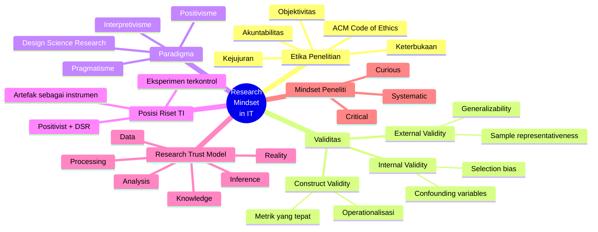

# Gambar 1.3 — Mindmap: Research Mindset in IT

```mermaid
mindmap
  root((Research<br/>Mindset<br/>in IT))
    Etika Penelitian
      Kejujuran
      Objektivitas
      Keterbukaan
      Akuntabilitas
      ACM Code of Ethics
    Validitas
      Internal Validity
        Confounding variables
        Selection bias
      External Validity
        Generalizability
        Sample representativeness
      Construct Validity
        Operationalisasi
        Metrik yang tepat
    Paradigma
      Positivisme
      Interpretivisme
      Pragmatisme
      Design Science Research
    Posisi Riset TI
      Positivist + DSR
      Eksperimen terkontrol
      Artefak sebagai instrumen
    Research Trust Model
      Reality
      Data
      Processing
      Analysis
      Inference
      Knowledge
    Mindset Peneliti
      Curious
      Critical
      Systematic
```
