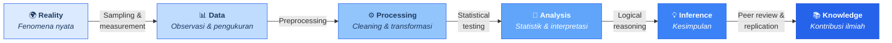

# Gambar 1.1 — Research Trust Model

```mermaid
graph LR
    A["🌍 <b>Reality</b><br/><i>Fenomena nyata</i>"]
    B["📊 <b>Data</b><br/><i>Observasi & pengukuran</i>"]
    C["⚙️ <b>Processing</b><br/><i>Cleaning & transformasi</i>"]
    D["🔬 <b>Analysis</b><br/><i>Statistik & interpretasi</i>"]
    E["💡 <b>Inference</b><br/><i>Kesimpulan</i>"]
    F["📚 <b>Knowledge</b><br/><i>Kontribusi ilmiah</i>"]

    A -->|"Sampling &<br/>measurement"| B
    B -->|"Preprocessing"| C
    C -->|"Statistical<br/>testing"| D
    D -->|"Logical<br/>reasoning"| E
    E -->|"Peer review &<br/>replication"| F

    style A fill:#DBEAFE,stroke:#2563EB,color:#1E3A5F
    style B fill:#BFDBFE,stroke:#2563EB,color:#1E3A5F
    style C fill:#93C5FD,stroke:#2563EB,color:#1E3A5F
    style D fill:#60A5FA,stroke:#2563EB,color:#FFFFFF
    style E fill:#3B82F6,stroke:#2563EB,color:#FFFFFF
    style F fill:#2563EB,stroke:#1D4ED8,color:#FFFFFF
```
