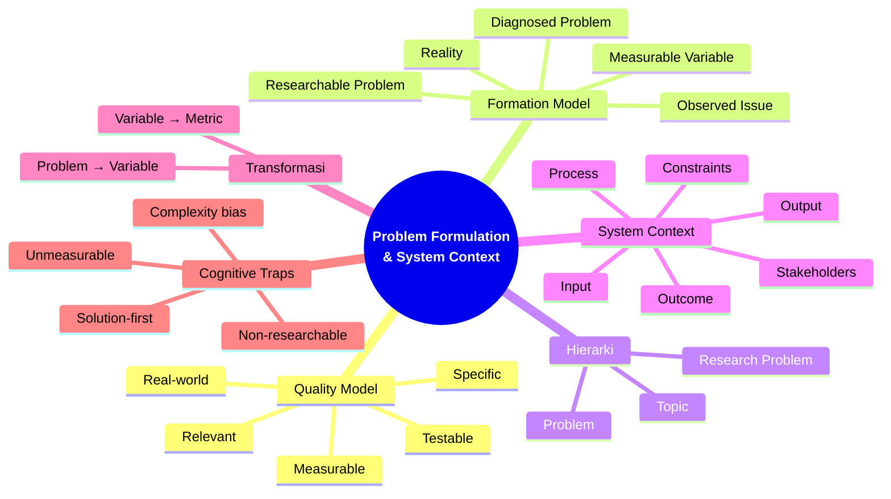

# Diagram: Mindmap Bab 2 — Problem Formulation & System Context

> **Gambar 2.3** — Mindmap Bab 2: Problem Formulation & System Context
> **Color Scheme:** Bagian 1 — Biru (#2563EB gradient)

---

*Render: Mermaid CLI, VS Code Mermaid Preview, atau mermaid.live*
*Output final: PNG/SVG untuk layout buku B5*
