# Diagram: Problem Formation Model (Bab 2)

> **Gambar 2.1** — Problem Formation Model: Dari Realitas ke Variabel Terukur
> **Color Scheme:** Bagian 1 — Biru (#2563EB gradient)

```mermaid
graph LR
    A["🌍 <b>Reality</b><br/><i>Fenomena dunia nyata</i>"]
    B["👁️ <b>Observed Issue</b><br/><i>Symptom</i>"]
    C["🔍 <b>Diagnosed Problem</b><br/><i>Root Cause</i>"]
    D["📐 <b>Researchable Problem</b><br/><i>Scoped & Bounded</i>"]
    E["📏 <b>Measurable Variable</b><br/><i>Operationalized</i>"]

    A -->|"Pengamatan"| B
    B -->|"Analisis"| C
    C -->|"Literature check"| D
    D -->|"Operasionalisasi"| E

    style A fill:#DBEAFE,stroke:#2563EB,color:#1E3A5F
    style B fill:#93C5FD,stroke:#2563EB,color:#1E3A5F
    style C fill:#60A5FA,stroke:#2563EB,color:#1E3A5F
    style D fill:#3B82F6,stroke:#2563EB,color:#FFFFFF
    style E fill:#2563EB,stroke:#1D4ED8,color:#FFFFFF
```

---

*Render: Mermaid CLI, VS Code Mermaid Preview, atau mermaid.live*
*Output final: PNG/SVG untuk layout buku B5*
