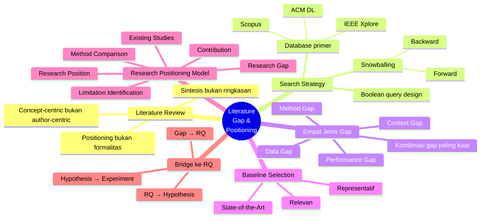

# Gambar 3.3 — Mindmap: Literature Review, Research Gap & Baseline

```mermaid
mindmap
  root((Literature<br/>Gap &<br/>Positioning))
    Literature Review
      Concept-centric bukan author-centric
      Sintesis bukan ringkasan
      Positioning bukan formalitas
    Search Strategy
      Database primer
        IEEE Xplore
        ACM DL
        Scopus
      Boolean query design
      Snowballing
        Backward
        Forward
    Empat Jenis Gap
      Performance Gap
      Method Gap
      Data Gap
      Context Gap
      Kombinasi gap paling kuat
    Baseline Selection
      Relevan
      Representatif
      State-of-the-Art
    Research Positioning Model
      Existing Studies
      Method Comparison
      Limitation Identification
      Research Gap
      Research Position
      Contribution
    Bridge ke RQ
      Gap → RQ
      RQ → Hypothesis
      Hypothesis → Experiment
```
