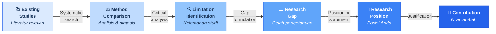

# Gambar 3.1 — Research Positioning Model

```mermaid
graph LR
    A["📚 <b>Existing<br/>Studies</b><br/><i>Literatur relevan</i>"]
    B["⚖️ <b>Method<br/>Comparison</b><br/><i>Analisis & sintesis</i>"]
    C["🔍 <b>Limitation<br/>Identification</b><br/><i>Kelemahan studi</i>"]
    D["🕳️ <b>Research<br/>Gap</b><br/><i>Celah pengetahuan</i>"]
    E["📍 <b>Research<br/>Position</b><br/><i>Posisi Anda</i>"]
    F["🎯 <b>Contribution</b><br/><i>Nilai tambah</i>"]

    A -->|"Systematic<br/>search"| B
    B -->|"Critical<br/>analysis"| C
    C -->|"Gap<br/>formulation"| D
    D -->|"Positioning<br/>statement"| E
    E -->|"Justification"| F

    style A fill:#DBEAFE,stroke:#2563EB,color:#1E3A5F
    style B fill:#BFDBFE,stroke:#2563EB,color:#1E3A5F
    style C fill:#93C5FD,stroke:#2563EB,color:#1E3A5F
    style D fill:#60A5FA,stroke:#2563EB,color:#FFFFFF
    style E fill:#3B82F6,stroke:#2563EB,color:#FFFFFF
    style F fill:#2563EB,stroke:#1D4ED8,color:#FFFFFF
```
