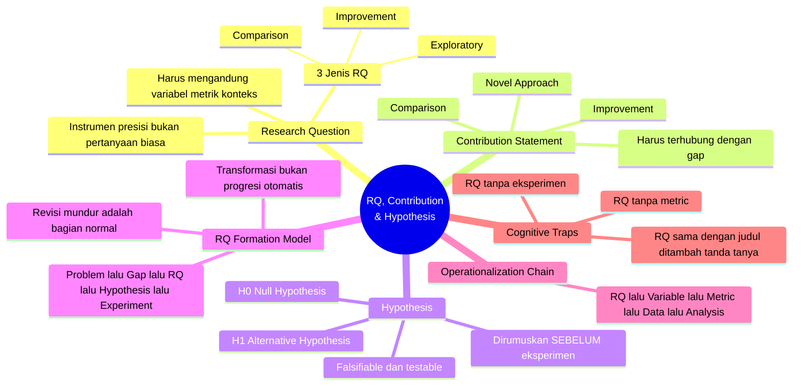

# Bab 4 — Mindmap: RQ, Contribution & Hypothesis (Gambar 4.3)

```mermaid
mindmap
  root((RQ, Contribution<br/>& Hypothesis))
    Research Question
      Instrumen presisi bukan pertanyaan biasa
      3 Jenis RQ
        Comparison
        Improvement
        Exploratory
      Harus mengandung variabel metrik konteks
    Contribution Statement
      Improvement
      Comparison
      Novel Approach
      Harus terhubung dengan gap
    Hypothesis
      H0 Null Hypothesis
      H1 Alternative Hypothesis
      Falsifiable dan testable
      Dirumuskan SEBELUM eksperimen
    RQ Formation Model
      Problem lalu Gap lalu RQ lalu Hypothesis lalu Experiment
      Transformasi bukan progresi otomatis
      Revisi mundur adalah bagian normal
    Operationalization Chain
      RQ lalu Variable lalu Metric lalu Data lalu Analysis
    Cognitive Traps
      RQ sama dengan judul ditambah tanda tanya
      RQ tanpa metric
      RQ tanpa eksperimen
```
