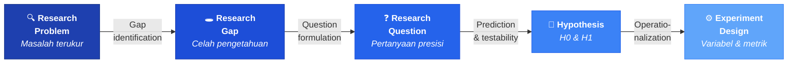

# Bab 4 — RQ Formation Model (Gambar 4.1)

```mermaid
graph LR
    A["🔍 <b>Research<br/>Problem</b><br/><i>Masalah terukur</i>"]
    B["🕳️ <b>Research<br/>Gap</b><br/><i>Celah pengetahuan</i>"]
    C["❓ <b>Research<br/>Question</b><br/><i>Pertanyaan presisi</i>"]
    D["🎯 <b>Hypothesis</b><br/><i>H0 & H1</i>"]
    E["⚙️ <b>Experiment<br/>Design</b><br/><i>Variabel & metrik</i>"]

    A -->|"Gap<br/>identification"| B
    B -->|"Question<br/>formulation"| C
    C -->|"Prediction<br/>& testability"| D
    D -->|"Operatio-<br/>nalization"| E

    style A fill:#1e40af,stroke:#1e3a8a,color:#ffffff
    style B fill:#1d4ed8,stroke:#1e40af,color:#ffffff
    style C fill:#2563eb,stroke:#1d4ed8,color:#ffffff
    style D fill:#3b82f6,stroke:#2563eb,color:#ffffff
    style E fill:#60a5fa,stroke:#3b82f6,color:#ffffff
```
