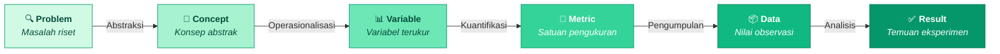

# Bab 5 — Measurement Alignment Model (Gambar 5.1)

```mermaid
graph LR
    A["🔍 <b>Problem</b><br/><i>Masalah riset</i>"]
    B["💭 <b>Concept</b><br/><i>Konsep abstrak</i>"]
    C["📊 <b>Variable</b><br/><i>Variabel terukur</i>"]
    D["📏 <b>Metric</b><br/><i>Satuan pengukuran</i>"]
    E["📦 <b>Data</b><br/><i>Nilai observasi</i>"]
    F["✅ <b>Result</b><br/><i>Temuan eksperimen</i>"]

    A -->|"Abstraksi"| B
    B -->|"Operasionalisasi"| C
    C -->|"Kuantifikasi"| D
    D -->|"Pengumpulan"| E
    E -->|"Analisis"| F

    style A fill:#D1FAE5,stroke:#059669,color:#064E3B
    style B fill:#A7F3D0,stroke:#059669,color:#064E3B
    style C fill:#6EE7B7,stroke:#059669,color:#064E3B
    style D fill:#34D399,stroke:#059669,color:#FFFFFF
    style E fill:#10B981,stroke:#047857,color:#FFFFFF
    style F fill:#059669,stroke:#047857,color:#FFFFFF
```
