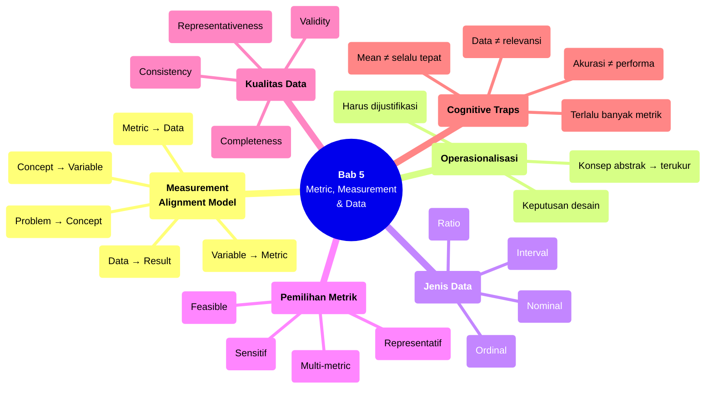

# Bab 5 — Mindmap (Gambar 5.2)

```mermaid
mindmap
  root(("**Bab 5**<br/>Metric, Measurement<br/>& Data"))
    ("**Measurement<br/>Alignment Model**")
      ("Problem → Concept")
      ("Concept → Variable")
      ("Variable → Metric")
      ("Metric → Data")
      ("Data → Result")
    ("**Operasionalisasi**")
      ("Konsep abstrak → terukur")
      ("Keputusan desain")
      ("Harus dijustifikasi")
    ("**Jenis Data**")
      ("Nominal")
      ("Ordinal")
      ("Interval")
      ("Ratio")
    ("**Pemilihan Metrik**")
      ("Representatif")
      ("Sensitif")
      ("Feasible")
      ("Multi-metric")
    ("**Kualitas Data**")
      ("Completeness")
      ("Consistency")
      ("Validity")
      ("Representativeness")
    ("**Cognitive Traps**")
      ("Akurasi ≠ performa")
      ("Terlalu banyak metrik")
      ("Data ≠ relevansi")
      ("Mean ≠ selalu tepat")
```
