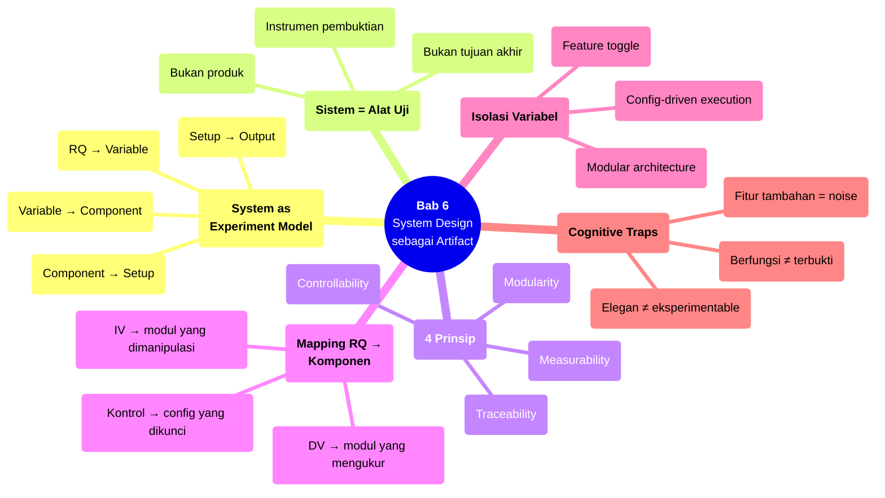

# Bab 6 — Mindmap (Gambar 6.2)

```mermaid
mindmap
  root(("**Bab 6**<br/>System Design<br/>sebagai Artifact"))
    ("**System as<br/>Experiment Model**")
      ("RQ → Variable")
      ("Variable → Component")
      ("Component → Setup")
      ("Setup → Output")
    ("**Sistem = Alat Uji**")
      ("Bukan produk")
      ("Bukan tujuan akhir")
      ("Instrumen pembuktian")
    ("**4 Prinsip**")
      ("Traceability")
      ("Modularity")
      ("Controllability")
      ("Measurability")
    ("**Mapping RQ →<br/>Komponen**")
      ("IV → modul yang dimanipulasi")
      ("DV → modul yang mengukur")
      ("Kontrol → config yang dikunci")
    ("**Isolasi Variabel**")
      ("Modular architecture")
      ("Config-driven execution")
      ("Feature toggle")
    ("**Cognitive Traps**")
      ("Berfungsi ≠ terbukti")
      ("Elegan ≠ eksperimentable")
      ("Fitur tambahan = noise")
```
