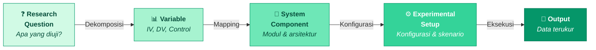

# Bab 6 — System as Experiment Model (Gambar 6.1)

```mermaid
graph LR
    A["❓ <b>Research<br/>Question</b><br/><i>Apa yang diuji?</i>"]
    B["📊 <b>Variable</b><br/><i>IV, DV, Control</i>"]
    C["🔧 <b>System<br/>Component</b><br/><i>Modul & arsitektur</i>"]
    D["⚙️ <b>Experimental<br/>Setup</b><br/><i>Konfigurasi & skenario</i>"]
    E["📏 <b>Output</b><br/><i>Data terukur</i>"]

    A -->|"Dekomposisi"| B
    B -->|"Mapping"| C
    C -->|"Konfigurasi"| D
    D -->|"Eksekusi"| E

    style A fill:#D1FAE5,stroke:#059669,color:#064E3B
    style B fill:#A7F3D0,stroke:#059669,color:#064E3B
    style C fill:#6EE7B7,stroke:#059669,color:#064E3B
    style D fill:#34D399,stroke:#059669,color:#FFFFFF
    style E fill:#059669,stroke:#047857,color:#FFFFFF
```
