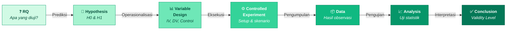

# Bab 7 — Experimental Validity Model (Gambar 7.1)

```mermaid
graph LR
    A["❓ <b>RQ</b><br/><i>Apa yang diuji?</i>"]
    B["🎯 <b>Hypothesis</b><br/><i>H0 & H1</i>"]
    C["📊 <b>Variable<br/>Design</b><br/><i>IV, DV, Control</i>"]
    D["⚙️ <b>Controlled<br/>Experiment</b><br/><i>Setup & skenario</i>"]
    E["📦 <b>Data</b><br/><i>Hasil observasi</i>"]
    F["📈 <b>Analysis</b><br/><i>Uji statistik</i>"]
    G["✅ <b>Conclusion</b><br/><i>Validity Level</i>"]

    A -->|"Prediksi"| B
    B -->|"Operasionalisasi"| C
    C -->|"Eksekusi"| D
    D -->|"Pengumpulan"| E
    E -->|"Pengujian"| F
    F -->|"Interpretasi"| G

    style A fill:#D1FAE5,stroke:#059669,color:#064E3B
    style B fill:#A7F3D0,stroke:#059669,color:#064E3B
    style C fill:#6EE7B7,stroke:#059669,color:#064E3B
    style D fill:#34D399,stroke:#059669,color:#FFFFFF
    style E fill:#10B981,stroke:#047857,color:#FFFFFF
    style F fill:#059669,stroke:#047857,color:#FFFFFF
    style G fill:#047857,stroke:#065F46,color:#FFFFFF
```
