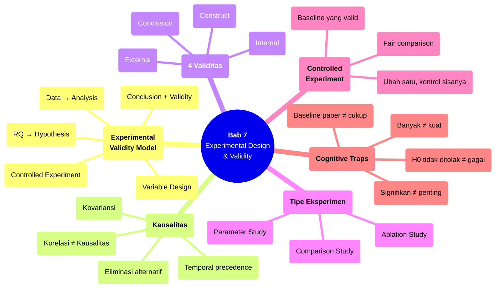

# Bab 7 — Mindmap (Gambar 7.2)

```mermaid
mindmap
  root(("**Bab 7**<br/>Experimental Design<br/>& Validity"))
    ("**Experimental<br/>Validity Model**")
      ("RQ → Hypothesis")
      ("Variable Design")
      ("Controlled Experiment")
      ("Data → Analysis")
      ("Conclusion + Validity")
    ("**Kausalitas**")
      ("Korelasi ≠ Kausalitas")
      ("Kovariansi")
      ("Temporal precedence")
      ("Eliminasi alternatif")
    ("**4 Validitas**")
      ("Internal")
      ("External")
      ("Construct")
      ("Conclusion")
    ("**Tipe Eksperimen**")
      ("Comparison Study")
      ("Ablation Study")
      ("Parameter Study")
    ("**Controlled<br/>Experiment**")
      ("Ubah satu, kontrol sisanya")
      ("Fair comparison")
      ("Baseline yang valid")
    ("**Cognitive Traps**")
      ("Signifikan ≠ penting")
      ("Banyak ≠ kuat")
      ("H0 tidak ditolak ≠ gagal")
      ("Baseline paper ≠ cukup")
```
