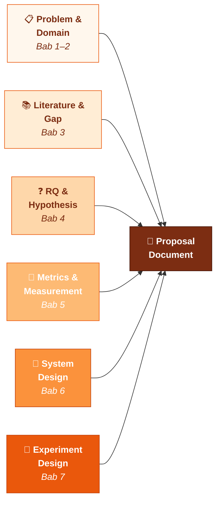

# Bab 8 — Integration Map (Gambar 8.1)

```mermaid
graph LR
    A["📋 <b>Problem &<br/>Domain</b><br/><i>Bab 1–2</i>"]
    B["📚 <b>Literature &<br/>Gap</b><br/><i>Bab 3</i>"]
    C["❓ <b>RQ &<br/>Hypothesis</b><br/><i>Bab 4</i>"]
    D["📏 <b>Metrics &<br/>Measurement</b><br/><i>Bab 5</i>"]
    E["🔧 <b>System<br/>Design</b><br/><i>Bab 6</i>"]
    F["🧪 <b>Experiment<br/>Design</b><br/><i>Bab 7</i>"]
    G["📄 <b>Proposal<br/>Document</b>"]

    A --> G
    B --> G
    C --> G
    D --> G
    E --> G
    F --> G

    style A fill:#FFF7ED,stroke:#EA580C,color:#7C2D12
    style B fill:#FFEDD5,stroke:#EA580C,color:#7C2D12
    style C fill:#FED7AA,stroke:#EA580C,color:#7C2D12
    style D fill:#FDBA74,stroke:#EA580C,color:#FFFFFF
    style E fill:#FB923C,stroke:#C2410C,color:#FFFFFF
    style F fill:#EA580C,stroke:#C2410C,color:#FFFFFF
    style G fill:#7C2D12,stroke:#431407,color:#FFFFFF
```
