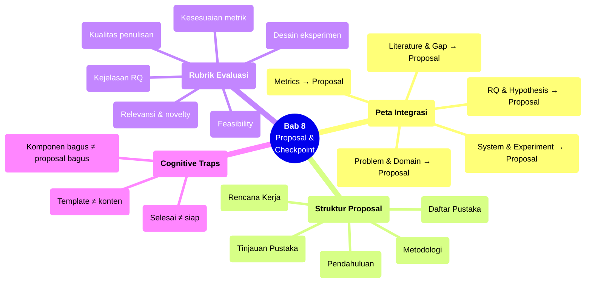

# Bab 8 — Mindmap (Gambar 8.2)

```mermaid
mindmap
  root(("**Bab 8**<br/>Proposal &<br/>Checkpoint"))
    ("**Peta Integrasi**")
      ("Problem & Domain → Proposal")
      ("Literature & Gap → Proposal")
      ("RQ & Hypothesis → Proposal")
      ("Metrics → Proposal")
      ("System & Experiment → Proposal")
    ("**Struktur Proposal**")
      ("Pendahuluan")
      ("Tinjauan Pustaka")
      ("Metodologi")
      ("Rencana Kerja")
      ("Daftar Pustaka")
    ("**Rubrik Evaluasi**")
      ("Relevansi & novelty")
      ("Kejelasan RQ")
      ("Kesesuaian metrik")
      ("Desain eksperimen")
      ("Feasibility")
      ("Kualitas penulisan")
    ("**Cognitive Traps**")
      ("Komponen bagus ≠ proposal bagus")
      ("Template ≠ konten")
      ("Selesai ≠ siap")
```
