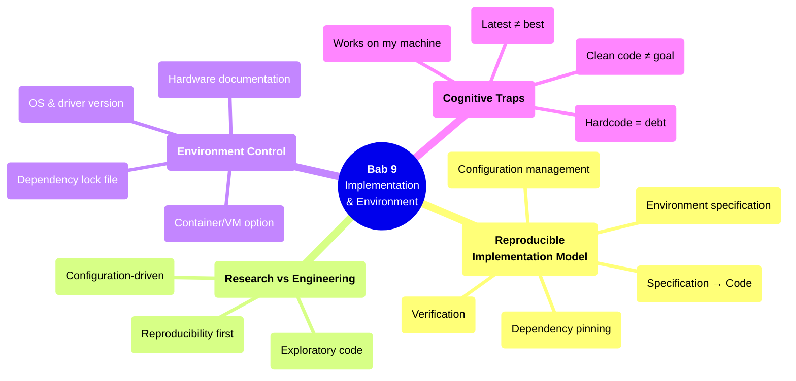

# Bab 9 — Mindmap (Gambar 9.2)

```mermaid
mindmap
  root(("**Bab 9**<br/>Implementation<br/>& Environment"))
    ("**Reproducible<br/>Implementation Model**")
      ("Specification → Code")
      ("Dependency pinning")
      ("Environment specification")
      ("Configuration management")
      ("Verification")
    ("**Research vs Engineering**")
      ("Exploratory code")
      ("Configuration-driven")
      ("Reproducibility first")
    ("**Environment Control**")
      ("Hardware documentation")
      ("OS & driver version")
      ("Dependency lock file")
      ("Container/VM option")
    ("**Cognitive Traps**")
      ("Works on my machine")
      ("Latest ≠ best")
      ("Hardcode = debt")
      ("Clean code ≠ goal")
```
