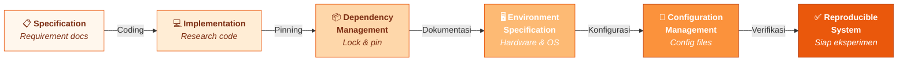

# Bab 9 — Reproducible Implementation Model (Gambar 9.1)

```mermaid
graph LR
    A["📋 <b>Specification</b><br/><i>Requirement docs</i>"]
    B["💻 <b>Implementation</b><br/><i>Research code</i>"]
    C["📦 <b>Dependency<br/>Management</b><br/><i>Lock & pin</i>"]
    D["🖥️ <b>Environment<br/>Specification</b><br/><i>Hardware & OS</i>"]
    E["📝 <b>Configuration<br/>Management</b><br/><i>Config files</i>"]
    F["✅ <b>Reproducible<br/>System</b><br/><i>Siap eksperimen</i>"]

    A -->|"Coding"| B
    B -->|"Pinning"| C
    C -->|"Dokumentasi"| D
    D -->|"Konfigurasi"| E
    E -->|"Verifikasi"| F

    style A fill:#FFF7ED,stroke:#EA580C,color:#7C2D12
    style B fill:#FFEDD5,stroke:#EA580C,color:#7C2D12
    style C fill:#FED7AA,stroke:#EA580C,color:#7C2D12
    style D fill:#FDBA74,stroke:#EA580C,color:#FFFFFF
    style E fill:#FB923C,stroke:#C2410C,color:#FFFFFF
    style F fill:#EA580C,stroke:#C2410C,color:#FFFFFF
```
