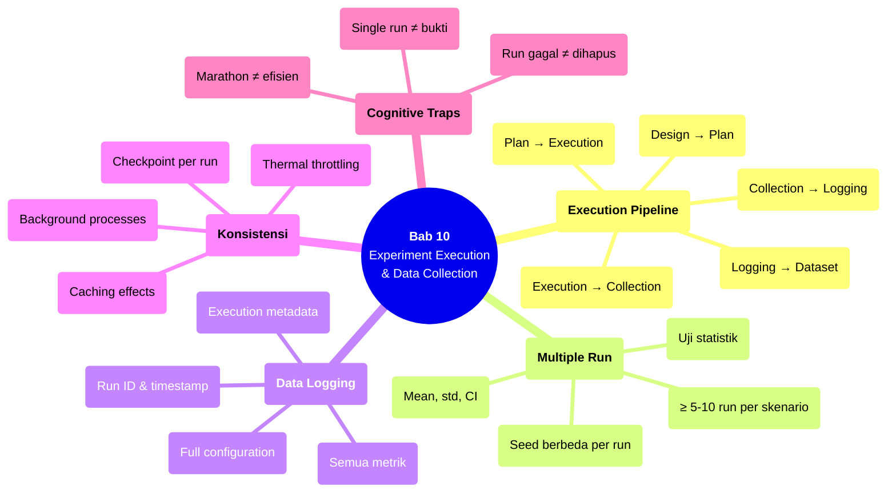

# Bab 10 — Mindmap (Gambar 10.2)

```mermaid
mindmap
  root(("**Bab 10**<br/>Experiment Execution<br/>& Data Collection"))
    ("**Execution Pipeline**")
      ("Design → Plan")
      ("Plan → Execution")
      ("Execution → Collection")
      ("Collection → Logging")
      ("Logging → Dataset")
    ("**Multiple Run**")
      ("≥ 5-10 run per skenario")
      ("Seed berbeda per run")
      ("Mean, std, CI")
      ("Uji statistik")
    ("**Data Logging**")
      ("Run ID & timestamp")
      ("Full configuration")
      ("Semua metrik")
      ("Execution metadata")
    ("**Konsistensi**")
      ("Background processes")
      ("Caching effects")
      ("Thermal throttling")
      ("Checkpoint per run")
    ("**Cognitive Traps**")
      ("Single run ≠ bukti")
      ("Run gagal ≠ dihapus")
      ("Marathon ≠ efisien")
```
