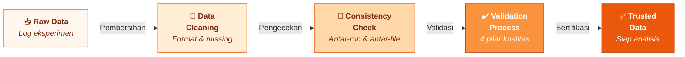

# Bab 11 — Data Trust Model (Gambar 11.1)

```mermaid
graph LR
    A["📥 <b>Raw Data</b><br/><i>Log eksperimen</i>"]
    B["🧹 <b>Data<br/>Cleaning</b><br/><i>Format & missing</i>"]
    C["🔗 <b>Consistency<br/>Check</b><br/><i>Antar-run & antar-file</i>"]
    D["✔️ <b>Validation<br/>Process</b><br/><i>4 pilar kualitas</i>"]
    E["✅ <b>Trusted<br/>Data</b><br/><i>Siap analisis</i>"]

    A -->|"Pembersihan"| B
    B -->|"Pengecekan"| C
    C -->|"Validasi"| D
    D -->|"Sertifikasi"| E

    style A fill:#FFF7ED,stroke:#EA580C,color:#7C2D12
    style B fill:#FFEDD5,stroke:#EA580C,color:#7C2D12
    style C fill:#FED7AA,stroke:#EA580C,color:#7C2D12
    style D fill:#FB923C,stroke:#C2410C,color:#FFFFFF
    style E fill:#EA580C,stroke:#C2410C,color:#FFFFFF
```
