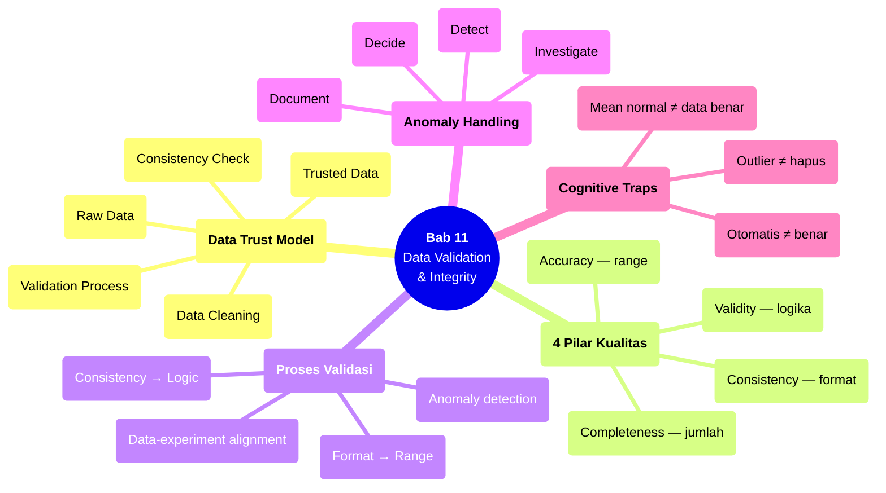

# Bab 11 — Mindmap (Gambar 11.2)

```mermaid
mindmap
  root(("**Bab 11**<br/>Data Validation<br/>& Integrity"))
    ("**Data Trust Model**")
      ("Raw Data")
      ("Data Cleaning")
      ("Consistency Check")
      ("Validation Process")
      ("Trusted Data")
    ("**4 Pilar Kualitas**")
      ("Accuracy — range")
      ("Consistency — format")
      ("Completeness — jumlah")
      ("Validity — logika")
    ("**Proses Validasi**")
      ("Format → Range")
      ("Consistency → Logic")
      ("Anomaly detection")
      ("Data-experiment alignment")
    ("**Anomaly Handling**")
      ("Detect")
      ("Investigate")
      ("Document")
      ("Decide")
    ("**Cognitive Traps**")
      ("Otomatis ≠ benar")
      ("Outlier ≠ hapus")
      ("Mean normal ≠ data benar")
```
