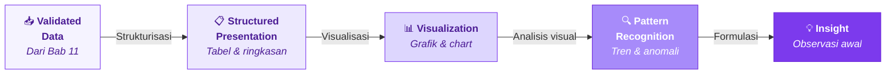

# Bab 12 — Data → Insight Model (Gambar 12.1)

```mermaid
graph LR
    A["📥 <b>Validated<br/>Data</b><br/><i>Dari Bab 11</i>"]
    B["📋 <b>Structured<br/>Presentation</b><br/><i>Tabel & ringkasan</i>"]
    C["📊 <b>Visualization</b><br/><i>Grafik & chart</i>"]
    D["🔍 <b>Pattern<br/>Recognition</b><br/><i>Tren & anomali</i>"]
    E["💡 <b>Insight</b><br/><i>Observasi awal</i>"]

    A -->|"Strukturisasi"| B
    B -->|"Visualisasi"| C
    C -->|"Analisis visual"| D
    D -->|"Formulasi"| E

    style A fill:#F5F3FF,stroke:#7C3AED,color:#4C1D95
    style B fill:#EDE9FE,stroke:#7C3AED,color:#4C1D95
    style C fill:#DDD6FE,stroke:#7C3AED,color:#4C1D95
    style D fill:#A78BFA,stroke:#6D28D9,color:#FFFFFF
    style E fill:#7C3AED,stroke:#6D28D9,color:#FFFFFF
```
