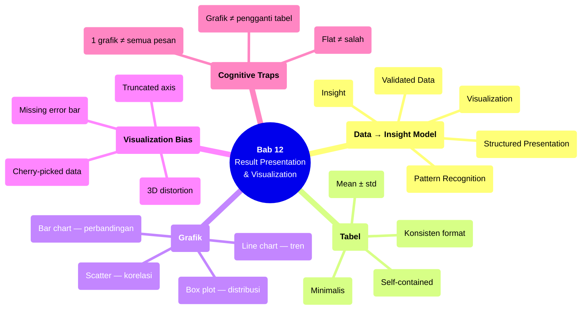

# Bab 12 — Mindmap (Gambar 12.2)

```mermaid
mindmap
  root(("**Bab 12**<br/>Result Presentation<br/>& Visualization"))
    ("**Data → Insight Model**")
      ("Validated Data")
      ("Structured Presentation")
      ("Visualization")
      ("Pattern Recognition")
      ("Insight")
    ("**Tabel**")
      ("Self-contained")
      ("Mean ± std")
      ("Konsisten format")
      ("Minimalis")
    ("**Grafik**")
      ("Bar chart — perbandingan")
      ("Box plot — distribusi")
      ("Line chart — tren")
      ("Scatter — korelasi")
    ("**Visualization Bias**")
      ("Truncated axis")
      ("Cherry-picked data")
      ("Missing error bar")
      ("3D distortion")
    ("**Cognitive Traps**")
      ("Grafik ≠ pengganti tabel")
      ("Flat ≠ salah")
      ("1 grafik ≠ semua pesan")
```
