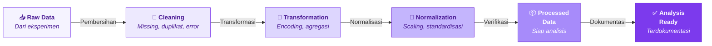

# Bab 13 — Data Refinement Pipeline (Gambar 13.1)

```mermaid
graph LR
    A["📥 <b>Raw Data</b><br/><i>Dari eksperimen</i>"]
    B["🧹 <b>Cleaning</b><br/><i>Missing, duplikat, error</i>"]
    C["🔄 <b>Transformation</b><br/><i>Encoding, agregasi</i>"]
    D["📐 <b>Normalization</b><br/><i>Scaling, standardisasi</i>"]
    E["📦 <b>Processed<br/>Data</b><br/><i>Siap analisis</i>"]
    F["✅ <b>Analysis<br/>Ready</b><br/><i>Terdokumentasi</i>"]

    A -->|"Pembersihan"| B
    B -->|"Transformasi"| C
    C -->|"Normalisasi"| D
    D -->|"Verifikasi"| E
    E -->|"Dokumentasi"| F

    style A fill:#F5F3FF,stroke:#7C3AED,color:#4C1D95
    style B fill:#EDE9FE,stroke:#7C3AED,color:#4C1D95
    style C fill:#DDD6FE,stroke:#7C3AED,color:#4C1D95
    style D fill:#C4B5FD,stroke:#6D28D9,color:#4C1D95
    style E fill:#A78BFA,stroke:#6D28D9,color:#FFFFFF
    style F fill:#7C3AED,stroke:#6D28D9,color:#FFFFFF
```
