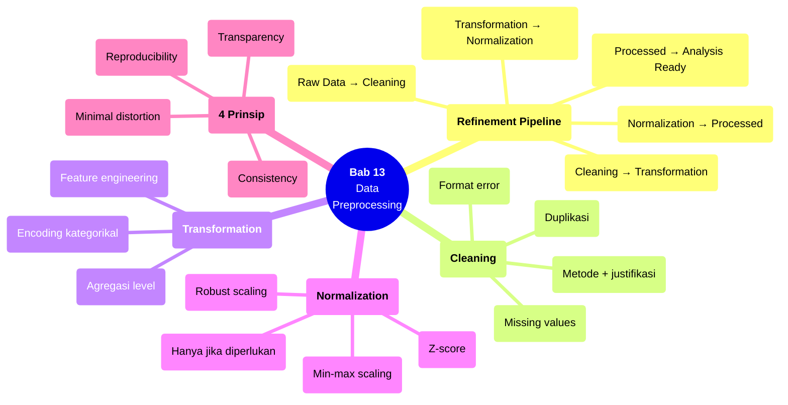

# Bab 13 — Mindmap (Gambar 13.2)

```mermaid
mindmap
  root(("**Bab 13**<br/>Data<br/>Preprocessing"))
    ("**Refinement Pipeline**")
      ("Raw Data → Cleaning")
      ("Cleaning → Transformation")
      ("Transformation → Normalization")
      ("Normalization → Processed")
      ("Processed → Analysis Ready")
    ("**Cleaning**")
      ("Missing values")
      ("Duplikasi")
      ("Format error")
      ("Metode + justifikasi")
    ("**Transformation**")
      ("Encoding kategorikal")
      ("Agregasi level")
      ("Feature engineering")
    ("**Normalization**")
      ("Min-max scaling")
      ("Z-score")
      ("Robust scaling")
      ("Hanya jika diperlukan")
    ("**4 Prinsip**")
      ("Consistency")
      ("Transparency")
      ("Reproducibility")
      ("Minimal distortion")
```
