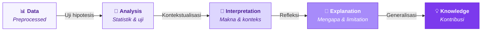

# Bab 14 — Data → Knowledge Model (Gambar 14.1)

```mermaid
graph LR
    A["📊 <b>Data</b><br/><i>Preprocessed</i>"]
    B["🔬 <b>Analysis</b><br/><i>Statistik & uji</i>"]
    C["🧠 <b>Interpretation</b><br/><i>Makna & konteks</i>"]
    D["💬 <b>Explanation</b><br/><i>Mengapa & limitation</i>"]
    E["💡 <b>Knowledge</b><br/><i>Kontribusi</i>"]

    A -->|"Uji hipotesis"| B
    B -->|"Kontekstualisasi"| C
    C -->|"Refleksi"| D
    D -->|"Generalisasi"| E

    style A fill:#F5F3FF,stroke:#7C3AED,color:#4C1D95
    style B fill:#EDE9FE,stroke:#7C3AED,color:#4C1D95
    style C fill:#DDD6FE,stroke:#7C3AED,color:#4C1D95
    style D fill:#A78BFA,stroke:#6D28D9,color:#FFFFFF
    style E fill:#7C3AED,stroke:#6D28D9,color:#FFFFFF
```
