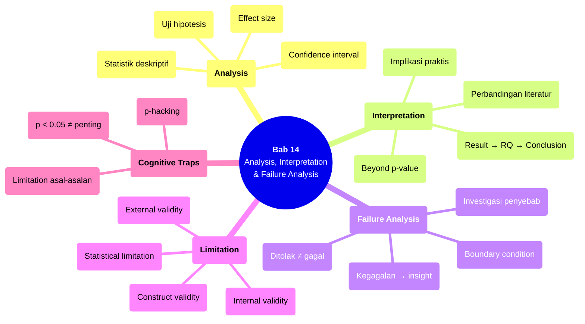

# Bab 14 — Mindmap (Gambar 14.2)

```mermaid
mindmap
  root(("**Bab 14**<br/>Analysis, Interpretation<br/>& Failure Analysis"))
    ("**Analysis**")
      ("Statistik deskriptif")
      ("Uji hipotesis")
      ("Effect size")
      ("Confidence interval")
    ("**Interpretation**")
      ("Result → RQ → Conclusion")
      ("Beyond p-value")
      ("Perbandingan literatur")
      ("Implikasi praktis")
    ("**Failure Analysis**")
      ("Ditolak ≠ gagal")
      ("Investigasi penyebab")
      ("Boundary condition")
      ("Kegagalan → insight")
    ("**Limitation**")
      ("Internal validity")
      ("External validity")
      ("Construct validity")
      ("Statistical limitation")
    ("**Cognitive Traps**")
      ("p < 0.05 ≠ penting")
      ("p-hacking")
      ("Limitation asal-asalan")
```
