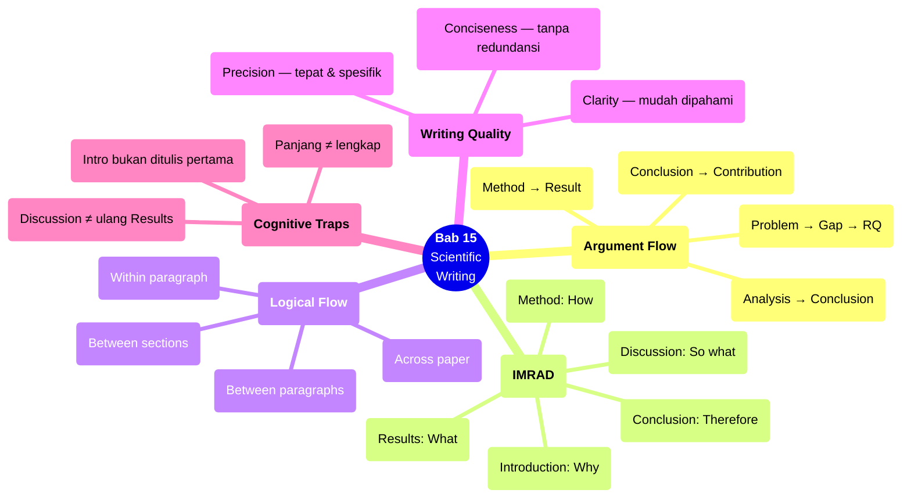

# Bab 15 — Mindmap (Gambar 15.2)

```mermaid
mindmap
  root(("**Bab 15**<br/>Scientific<br/>Writing"))
    ("**Argument Flow**")
      ("Problem → Gap → RQ")
      ("Method → Result")
      ("Analysis → Conclusion")
      ("Conclusion → Contribution")
    ("**IMRAD**")
      ("Introduction: Why")
      ("Method: How")
      ("Results: What")
      ("Discussion: So what")
      ("Conclusion: Therefore")
    ("**Logical Flow**")
      ("Within paragraph")
      ("Between paragraphs")
      ("Between sections")
      ("Across paper")
    ("**Writing Quality**")
      ("Clarity — mudah dipahami")
      ("Precision — tepat & spesifik")
      ("Conciseness — tanpa redundansi")
    ("**Cognitive Traps**")
      ("Panjang ≠ lengkap")
      ("Intro bukan ditulis pertama")
      ("Discussion ≠ ulang Results")
```
