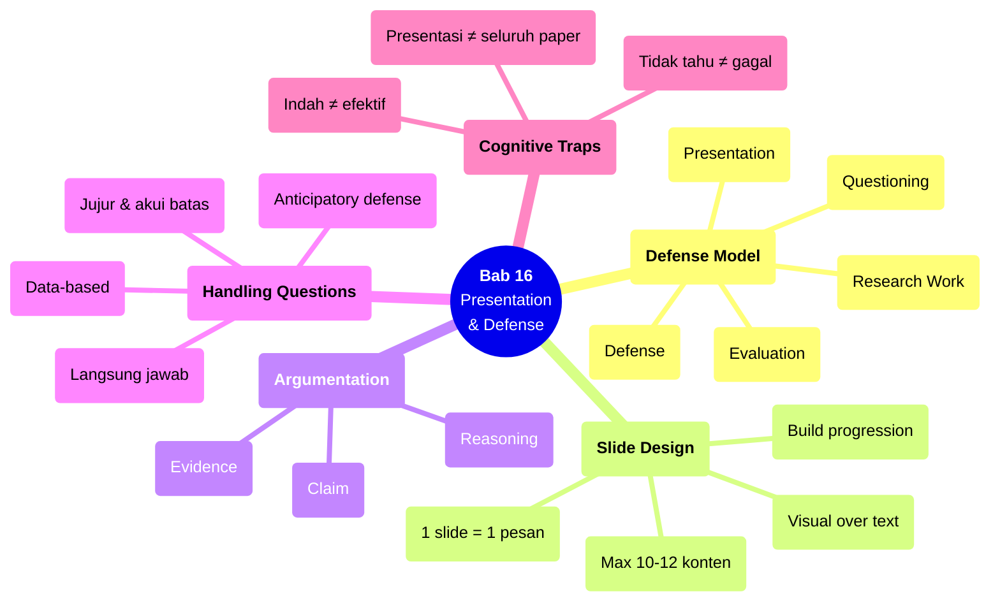

# Bab 16 — Mindmap (Gambar 16.2)

```mermaid
mindmap
  root(("**Bab 16**<br/>Presentation<br/>& Defense"))
    ("**Defense Model**")
      ("Research Work")
      ("Presentation")
      ("Questioning")
      ("Defense")
      ("Evaluation")
    ("**Slide Design**")
      ("1 slide = 1 pesan")
      ("Visual over text")
      ("Build progression")
      ("Max 10-12 konten")
    ("**Argumentation**")
      ("Claim")
      ("Evidence")
      ("Reasoning")
    ("**Handling Questions**")
      ("Langsung jawab")
      ("Data-based")
      ("Jujur & akui batas")
      ("Anticipatory defense")
    ("**Cognitive Traps**")
      ("Presentasi ≠ seluruh paper")
      ("Indah ≠ efektif")
      ("Tidak tahu ≠ gagal")
```
