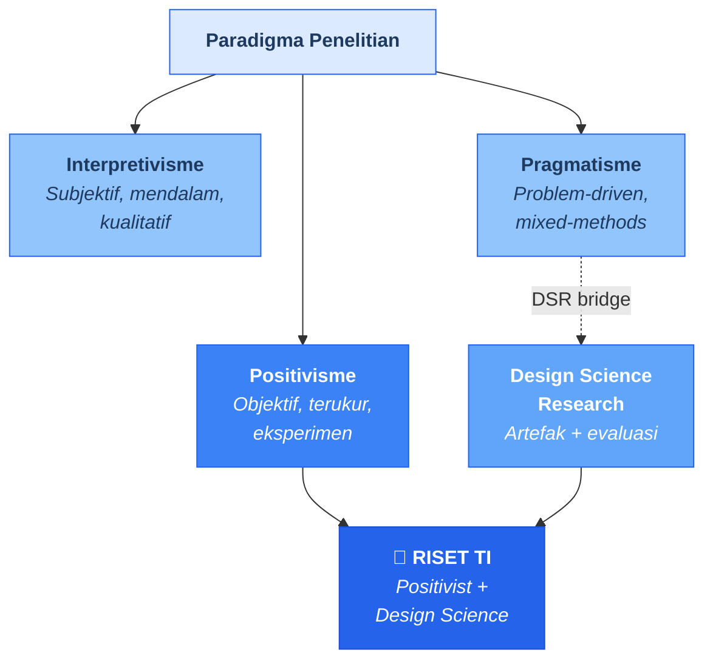
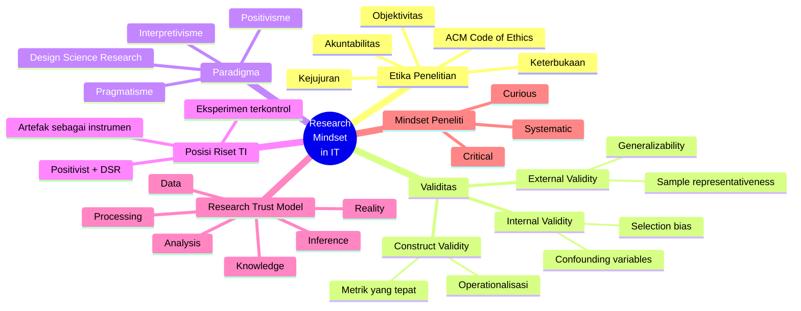

# Bab 1 — Research Mindset in IT

> **Sub-CPMK:** Sub-CPMK 1.1 — Membedakan pola pikir engineering vs research
> **CPMK:** CPMK01 — Menunjukkan pemahaman paradigma riset dalam TI
> **CPL Utama:** CPL03 (Penalaran logis, kritis, sistematis)
> **CPL Pendukung:** CPL01 (Etis, bertanggung jawab)
> **Fase:** Thinking (M1–M4)

---

## Ringkasan Bab

Bab ini membahas fondasi berpikir yang membedakan peneliti dari engineer. Riset bukan semata soal membuat sesuatu bekerja, melainkan soal memastikan apa yang ditemukan benar, valid, dan dapat dipercaya. Tiga pilar utama — etika sebagai penjaga integritas ilmiah, validitas sebagai standar kebenaran, dan paradigma sebagai lensa epistemologis — membentuk kerangka berpikir *Curious → Critical → Systematic* yang mendasari seluruh proses riset.

---

## 1.1 Pembuka

Seorang developer menyelesaikan proyek: sistem deteksi plagiarisme berbasis NLP. Input teks, output persentase kemiripan. Demo lancar, hasilnya terlihat menjanjikan.

Lalu muncul pertanyaan dari reviewer: "Bagaimana Anda membuktikan bahwa angka 87% itu benar-benar menunjukkan plagiarisme, bukan sekadar kesamaan topik? Apa baseline-nya? Apakah hasilnya konsisten jika diuji pada 1.000 dokumen dari domain berbeda? Bagaimana Anda memastikan proses pengumpulan data tidak bias?"

Pertanyaan-pertanyaan ini menandai batas antara dua peran: **engineer** yang membangun sistem berfungsi, dan **peneliti** yang membuktikan bahwa apa yang dibangun benar, valid, dan layak dipercaya oleh komunitas ilmiah. Perbedaan ini menjadi titik tolak buku ini.

Mata kuliah Riset Teknologi Informasi tidak mengajarkan cara membuat sistem — itu sudah dipelajari di mata kuliah lain. Yang diajarkan di sini adalah cara berpikir sebagai peneliti: bertanya dengan tajam, mengukur dengan presisi, menyimpulkan dengan jujur. Kemampuan ini bukan bawaan, melainkan mindset yang dilatih.

Buku ini mencakup seluruh pipeline penelitian: merumuskan masalah (Bab 2), menavigasi literatur (Bab 3), merancang eksperimen (Bab 6–7), hingga mempertahankan temuan di hadapan penguji (Bab 16). Bab pertama ini membangun fondasinya.

Pertanyaan utama bab ini: apa yang membedakan "membangun sistem yang bekerja" dari "menghasilkan pengetahuan yang dapat dipercaya"?

---

## 1.2 Research Trust Model

Konsep sentral bab ini adalah **Research Trust Model** — rantai kepercayaan dalam proses penelitian. Setiap tahap membawa risiko distorsi; etika dan validitas bertugas mengendalikan distorsi tersebut.

**Gambar 1.1** — Research Trust Model: Rantai Kepercayaan dari Realitas ke Pengetahuan


Pengetahuan ilmiah tidak muncul langsung dari realitas. Ia melewati enam tahap transformasi, masing-masing dengan potensi distorsi:

1. **Reality** — Fenomena dunia nyata yang menjadi objek penelitian. Bisa berupa perilaku pengguna, performa sistem, atau pola data.
2. **Data** — Representasi realitas yang ditangkap melalui observasi dan pengukuran. Di sinilah distorsi pertama terjadi: sampling bias, measurement error, atau instrumen yang tidak dikalibrasi.
3. **Processing** — Tahap membersihkan dan mentransformasi data mentah. Keputusan tentang bagaimana menangani missing values, outliers, atau normalisasi bisa mengubah makna data secara signifikan.
4. **Analysis** — Penerapan metode statistik atau analitik terhadap data yang telah diproses. Pemilihan metode yang salah atau pelanggaran asumsi statistik bisa menghasilkan kesimpulan yang menyesatkan.
5. **Inference** — Penarikan kesimpulan dari hasil analisis. Ini adalah lompatan logis yang paling rentan: apakah hasil analisis benar-benar menjawab research question, atau hanya menjawab pertanyaan yang berbeda?
6. **Knowledge** — Kontribusi yang diterima oleh komunitas ilmiah setelah melewati peer review dan replikasi. Hanya klaim yang bertahan dari scrutiny ilmiah yang menjadi pengetahuan.

Setiap transisi dalam model ini adalah titik rawan distorsi. Etika memastikan tidak ada distorsi yang disengaja. Validitas memastikan distorsi yang tidak disengaja bisa dideteksi dan diminimalkan. Tanpa keduanya, pengetahuan yang dihasilkan tidak bisa dipercaya.

---

## 1.3 Definisi Kunci

> 📌 **Research Mindset**
> Pola pikir yang menuntut bukti, mempertanyakan asumsi, dan mengevaluasi klaim berdasarkan validitas — bukan hanya fungsionalitas. Dalam konteks TI, research mindset membedakan "apakah sistem bekerja?" (engineering) dari "apakah klaim tentang sistem ini benar?" (research).

> 📌 **Etika Penelitian (*Research Ethics*)**
> Seperangkat prinsip dan standar perilaku yang mengatur bagaimana penelitian dilakukan, meliputi kejujuran dalam pelaporan data, penghormatan terhadap partisipan, transparansi metodologi, dan penghindaran fabrikasi serta falsifikasi (Resnik, 2020). Dalam riset TI, etika juga mencakup penggunaan data yang bertanggung jawab dan keadilan algoritmik.

> 📌 **Validitas (*Validity*)**
> Derajat sejauh mana kesimpulan penelitian mencerminkan realitas yang sebenarnya. Shadish et al. (2002) mendefinisikan tiga jenis utama: internal validity (apakah hubungan kausal benar?), external validity (apakah temuan bisa digeneralisasi?), dan construct validity (apakah kita mengukur apa yang seharusnya diukur?).

> 📌 **Paradigma Penelitian (*Research Paradigm*)**
> Kerangka filosofis yang mendasari asumsi tentang realitas (ontologi), cara mengetahui (epistemologi), dan metode yang digunakan (metodologi). Tiga paradigma utama: positivisme, interpretivisme, dan pragmatisme (Creswell & Creswell, 2018).

---

## 1.4 Konsep Inti

### 1.4.1 Etika: Penjaga Validitas Ilmiah, Bukan Sekadar Moral

Etika penelitian sering diasosiasikan dengan persetujuan (*informed consent*), privasi data, atau plagiarisme. Itu memang bagian dari etika, tapi baru permukaannya.

Dalam riset eksperimental, etika punya peran lebih mendasar: menjaga validitas. Ketika peneliti membuang outlier "karena mengganggu hasil," memilih metode statistik yang menghasilkan p-value paling rendah, atau hanya melaporkan eksperimen yang berhasil — ia mendistorsi kebenaran yang sedang dicari. Itu bukan sekadar pelanggaran moral; itu pelanggaran terhadap prinsip ilmiah itu sendiri.

Resnik (2020) mengidentifikasi beberapa prinsip etika kunci dalam penelitian:

- **Kejujuran (*Honesty*)** — Melaporkan data, metode, dan hasil apa adanya. Tidak membuat data (fabrikasi), mengubah data (falsifikasi), atau mengklaim karya orang lain (plagiarisme).
- **Objektivitas (*Objectivity*)** — Menghindari bias dalam desain, analisis, dan interpretasi. Menggunakan metode yang transparan dan dapat direplikasi.
- **Keterbukaan (*Openness*)** — Membagikan data, kode, dan metode agar peneliti lain bisa memverifikasi dan mereplikasi.
- **Akuntabilitas (*Accountability*)** — Bertanggung jawab atas seluruh proses penelitian, termasuk kegagalan.

ACM Code of Ethics (2018) menambahkan dimensi khusus untuk bidang komputasi:

- Menghindari bahaya (*avoid harm*) — termasuk bias algoritmik
- Menghormati privasi (*respect privacy*) — terutama dalam pengolahan data pengguna
- Jujur dan dapat dipercaya (*be honest and trustworthy*) — dalam pelaporan hasil

Etika bukan aturan eksternal yang membatasi penelitian. Etika adalah mekanisme internal yang menjamin kualitasnya. Penelitian tanpa etika mungkin menghasilkan angka, tapi angka tanpa integritas bukan pengetahuan.

### 1.4.2 Validitas: Tiga Pilar Kebenaran Ilmiah

Jika etika memastikan proses penelitian jujur, **validitas** memastikan hasilnya benar. Shadish et al. (2002) mendefinisikan tiga jenis validitas yang menjadi standar dalam riset eksperimental:

**Internal Validity** — Apakah hubungan kausal yang diklaim benar-benar ada? Jika Anda mengklaim "algoritma A lebih cepat dari B," apakah perbedaan kecepatan benar-benar disebabkan oleh algoritma — atau ada faktor lain (confounding variable) seperti perbedaan hardware, ukuran dataset, atau kondisi jaringan?

**External Validity** — Apakah temuan bisa digeneralisasi ke konteks lain? Jika eksperimen dilakukan pada dataset 1.000 record dari satu domain, apakah hasilnya berlaku untuk 1 juta record dari domain berbeda? External validity adalah tentang batas-batas di mana kesimpulan masih berlaku.

**Construct Validity** — Apakah kita mengukur apa yang seharusnya diukur? Jika Anda mengklaim mengukur "kepuasan pengguna" menggunakan task completion rate, apakah metrik tersebut benar-benar merepresentasikan kepuasan? Mungkin pengguna menyelesaikan task tapi merasa frustrasi sepanjang proses. Construct validity memastikan bahwa operasionalisasi variabel sesuai dengan konsep yang dimaksud.

**Tabel 1.1** — Tiga Jenis Validitas dan Ancamannya dalam Riset TI

| Jenis Validitas | Pertanyaan Kunci | Ancaman Umum | Contoh di TI |
|-----------------|------------------|--------------|-------------|
| Internal | Apakah X benar-benar menyebabkan Y? | Confounding variable, selection bias | Hardware berbeda antar grup eksperimen |
| External | Apakah hasil berlaku di konteks lain? | Sampel terlalu kecil/spesifik | Eksperimen hanya pada satu dataset |
| Construct | Apakah kita mengukur hal yang benar? | Metrik tidak merepresentasikan konsep | Accuracy sebagai proxy untuk kualitas rekomendasi |

Ketiga validitas ini saling terkait. Riset yang memiliki internal validity tinggi tapi external validity rendah belum bisa diklaim sebagai pengetahuan umum. Riset yang memiliki external validity tinggi tapi construct validity rendah mungkin mengukur hal yang salah di banyak konteks. Peneliti yang kompeten menyeimbangkan ketiganya melalui desain eksperimen yang cermat (Wohlin et al., 2012).

### 1.4.3 Paradigma: Lensa Epistemologis

Sebelum melakukan riset, setiap peneliti — sadar atau tidak — membawa asumsi tentang bagaimana dunia bekerja dan bagaimana pengetahuan diperoleh. Asumsi ini disebut **paradigma**.

Creswell dan Creswell (2018) mengidentifikasi tiga paradigma utama:

**Positivisme** — Realitas itu objektif dan bisa diukur. Pengetahuan diperoleh melalui observasi sistematis, pengukuran, dan pengujian hipotesis. Hubungan kausal bisa diidentifikasi melalui eksperimen terkontrol. Ini adalah paradigma dominan dalam sains eksperimental.

**Interpretivisme** — Realitas itu subjektif dan dikonstruksi oleh pengalaman individu. Pengetahuan diperoleh melalui pemahaman mendalam (*understanding*), bukan pengukuran. Metode utama: wawancara, observasi partisipatif, analisis tematik. Paradigma ini dominan dalam riset kualitatif.

**Pragmatisme** — Paradigma tidak perlu bersifat dogmatis. Yang penting adalah memilih pendekatan yang paling efektif untuk menjawab research question yang dihadapi. Creswell (2012) menjelaskan bahwa pragmatisme memungkinkan peneliti menggabungkan metode kuantitatif dan kualitatif.

### 1.4.4 Posisi Mata Kuliah: Positivist + Design Science

Lalu, di mana posisi mata kuliah Riset Teknologi Informasi?

Mata kuliah ini mengambil posisi **positivist** dengan diperkuat oleh **Design Science Research** (DSR). Artinya:

- Kita percaya bahwa fenomena TI bisa diukur secara objektif (positivist)
- Kita menggunakan eksperimen terkontrol sebagai metode utama (positivist)
- Kita juga membangun artefak (sistem, algoritma, framework) sebagai bagian dari riset (DSR)
- Artefak bukan tujuan akhir — artefak adalah **instrumen** untuk menguji hipotesis (Hevner et al., 2004)

**Gambar 1.2** — Paradigm Positioning: Posisi Riset TI dalam Lanskap Paradigma



Implikasi praktis dari posisi ini:

- Setiap klaim harus didukung **bukti kuantitatif** (data, metrik, statistik)
- Setiap eksperimen harus memiliki **variabel terkontrol** dan **baseline pembanding**
- Artefak yang dibangun harus **dievaluasi secara rigorous**, bukan hanya didemonstrasikan
- Kontribusi diukur dari **pengetahuan baru** yang dihasilkan, bukan dari artefak itu sendiri

Kesalahpahaman yang umum: riset dianggap selesai saat sistem dibangun. Dalam paradigma positivist + DSR, membangun sistem baru langkah awal. Evaluasi rigorous terhadap sistem itulah yang menghasilkan kontribusi ilmiah.

### 1.4.5 Curious → Critical → Systematic: Tiga Mode Berpikir Peneliti

Seluruh konsep di atas — etika, validitas, paradigma — bermuara pada satu hal: **bagaimana seorang peneliti berpikir**. Kita bisa merangkumnya dalam tiga mode berpikir yang saling berurutan:

**Curious (Ingin Tahu)** — Kemampuan untuk melihat fenomena dan bertanya "mengapa?" Bukan menerima status quo, tapi mempertanyakannya. Seseorang yang melihat model ML dengan akurasi 98% dan langsung bertanya "Tapi bagaimana dengan kelas minoritas? Apakah metrik ini menyembunyikan masalah?" sedang menerapkan rasa ingin tahu ilmiah.

**Critical (Kritis)** — Kemampuan untuk mengevaluasi klaim berdasarkan bukti, bukan otoritas atau popularitas. "Paper ini mengklaim metode X lebih baik — tapi datasetnya hanya 200 record, dan tidak ada controlled experiment. Apakah klaim ini valid?" Berpikir kritis berarti menolak menerima klaim hanya karena diterbitkan.

**Systematic (Sistematis)** — Kemampuan untuk merancang investigasi yang terstruktur, reproducible, dan falsifiable. Bukan menguji coba secara acak, melainkan merancang eksperimen dengan variabel yang jelas, baseline yang tepat, dan metrik yang terukur.

Ketiga mode ini bukan pilihan — ketiganya harus ada secara berurutan. Rasa ingin tahu tanpa sikap kritis menghasilkan research question yang naif. Sikap kritis tanpa pendekatan sistematis menghasilkan kritik tanpa solusi. Dan pendekatan sistematis tanpa rasa ingin tahu menghasilkan eksperimen yang teknis sempurna tapi tidak menjawab pertanyaan yang penting.

---

## 1.5 Research vs Engineering

**Tabel 1.2** — Perbandingan Perspektif Research vs Engineering dalam Mindset

| Aspek | Engineering Mindset | Research Mindset |
|-------|-------------------|-----------------|
| **Tujuan utama** | Membuat sistem yang bekerja | Menghasilkan pengetahuan yang valid |
| **Pertanyaan khas** | "Bagaimana membuatnya jalan?" | "Apakah klaim ini benar dan bisa dibuktikan?" |
| **Ukuran sukses** | Sistem berfungsi, client puas | Hipotesis terjawab, temuan tervalidasi |
| **Kegagalan** | Harus dihindari | Harus dilaporkan (negative result = kontribusi) |
| **Deadline** | Waktu delivery | Kebenaran temuan (jangan terburu-buru menyimpulkan) |
| **Validasi** | Testing (unit, integration, UAT) | Experimental validation + statistical significance |

Dalam engineering, kegagalan harus diperbaiki sebelum deploy. Dalam research, kegagalan — hipotesis yang ditolak — sama berharganya dengan keberhasilan, karena keduanya menambah pengetahuan. Peneliti yang hanya melaporkan hasil positif melakukan *publication bias*, salah satu masalah terbesar dalam sains modern.

---

## 1.6 Research Reality

### Fenomena 1 — "HARKing: Hypothesizing After Results are Known"

Fenomena ini terjadi ketika peneliti merumuskan hipotesis **setelah** melihat data — lalu menyajikannya seolah-olah hipotesis tersebut sudah ada sejak awal. Contoh: seorang peneliti menjalankan eksperimen membandingkan 5 algoritma. Hanya satu yang menghasilkan perbedaan signifikan. Di laporan, ia menulis seolah-olah sejak awal hipotesisnya adalah tentang algoritma tersebut saja.

Mengapa ini berbahaya? Karena jika Anda menguji 5 hipotesis pada data yang sama, probabilitas menemukan satu hasil "signifikan" secara kebetulan meningkat drastis (masalah *multiple comparisons*). HARKing memberikan ilusi certainty dari apa yang sebenarnya adalah temuan kebetulan. Ini bukan hanya masalah statistik — ini pelanggaran etika.

### Fenomena 2 — "Metric Gaming: Optimizing the Wrong Thing"

Di dunia TI, kita terbiasa dengan optimization. Tapi dalam riset, optimization tanpa pemahaman terhadap apa yang dioptimasi bisa berbahaya. Seorang peneliti yang fokus meningkatkan accuracy dari 95% ke 97% pada model klasifikasi mungkin sedang mengoptimasi metrik yang **tidak relevan dengan masalah sebenarnya** — misalnya, pada dataset imbalanced di mana precision atau recall lebih penting.

Fenomena ini diperparah oleh budaya leaderboard dan benchmark dalam komunitas machine learning, di mana improvement 0.1% pada metrik tertentu dianggap sebagai kontribusi. Tanpa research mindset yang kuat, peneliti bisa terjebak mengejar angka alih-alih mengejar pemahaman.

### Fenomena 3 — "Positive Result Bias"

Jurnal dan konferensi cenderung menerbitkan hasil positif — eksperimen yang "berhasil." Akibatnya, banyak peneliti pemula merasa bahwa riset harus menghasilkan hasil positif. Padahal, menemukan bahwa "metode X **tidak** lebih baik dari Y dalam konteks Z" adalah kontribusi ilmiah yang sah dan penting. Bias ini menciptakan *file drawer problem* — ratusan studi dengan hasil negatif yang tidak pernah dipublikasikan, menyebabkan komunitas ilmiah overestimate terhadap efektivitas metode tertentu.

Riset bukan demonstrasi — riset adalah investigasi. Hasilnya bisa positif, negatif, atau campuran. Yang menentukan kualitas riset bukan arah hasilnya, melainkan kekuatan bukti yang mendukungnya.

---

## 1.7 Cognitive Traps

**Trap 1: "Angka Tinggi = Benar"**

Akurasi 98%, precision 0.95, F1-score 0.92 — angka-angka ini terlihat mengesankan. Tapi tanpa konteks, angka tinggi bisa menyesatkan. Akurasi 98% pada dataset dengan 97% kelas mayoritas berarti model hampir tidak mendeteksi kelas minoritas. F1-score tinggi pada dataset sintetis tidak menjamin performa pada data real-world. Angka hanya bermakna dalam konteks validitas yang tepat (Shadish et al., 2002).

**Trap 2: "Data itu Netral"**

Data tidak pernah netral. Data selalu merupakan hasil keputusan: apa yang diukur, bagaimana diukur, siapa yang mengukur, kapan diukur. Dataset pelatihan untuk model AI membawa bias dari proses pengumpulannya — historical bias, sampling bias, measurement bias. Menganggap data netral berarti mengabaikan distorsi pada tahap pertama Research Trust Model: Reality → Data. Peneliti yang bertanggung jawab mempertanyakan asal-usul dan keterbatasan datanya (ACM, 2018).

**Trap 3: "Jika Jalan, Maka Benar"**

Ini bias engineering yang paling berbahaya ketika dibawa ke dunia riset. Sistem yang berjalan (functional) belum tentu menghasilkan pengetahuan yang valid. Demonstrasi ≠ validasi. Sistem rekomendasi yang menghasilkan output bukan bukti bahwa algoritma rekomendasinya efektif. Klaim semacam itu memerlukan eksperimen terkontrol, baseline pembanding, dan analisis statistik (Wohlin et al., 2012).

**Trap 4: "Kegagalan Tidak Perlu Dilaporkan"**

Contoh kasus: seorang peneliti menguji 3 algoritma dan hanya 1 yang menghasilkan perbedaan signifikan. Melaporkan hanya yang "berhasil" tanpa menyebutkan yang "gagal" adalah pelanggaran etika dan merusak reproducibility. Kegagalan memberikan informasi kritis tentang kondisi batas (*boundary conditions*) di mana sebuah metode tidak bekerja. Informasi ini sering lebih berharga daripada keberhasilan — mencegah peneliti lain mengulang kesalahan yang sama (Resnik, 2020).

---

## 1.8 Studi Kasus

### Kasus 1 (Basic): "Manipulasi Dataset ML — Akurasi Tinggi tapi Data Palsu"

**Konteks:**

Seorang peneliti mengerjakan riset tentang klasifikasi sentimen review produk e-commerce. Dataset yang dikumpulkan dari scraping menghasilkan distribusi yang timpang: 85% positif, 15% negatif. Untuk "memperbaiki" distribusi, ia membuat data sintetis — menulis sendiri 200 review negatif palsu agar dataset menjadi 60:40. Model dilatih, akurasi mencapai 91%. Hasilnya terlihat impresif.

**❌ Pendekatan Salah:**

Peneliti tidak melaporkan bahwa 200 review negatif adalah buatan sendiri. Di laporan tertulis: "Dataset dikumpulkan dari platform e-commerce X sebanyak 1.500 review." Tidak ada penjelasan tentang data sintetis.

Mengapa salah:

- **Fabrikasi data** — menambahkan data yang tidak berasal dari sumber nyata tanpa transparansi
- **Internal validity hancur** — model belajar pola dari teks buatan yang tidak merepresentasikan review nyata
- **Construct validity dipertanyakan** — apakah model benar-benar belajar sentimen natural, atau pola linguistik dari satu penulis?
- **Tidak reproducible** — peneliti lain tidak bisa mereplikasi karena data palsu tidak berasal dari populasi yang diklaim

**✅ Pendekatan Benar:**

Laporkan distribusi asli (85:15) secara transparan. Gunakan teknik yang established dan etis untuk menangani imbalance: SMOTE, oversampling, undersampling, atau cost-sensitive learning. Jelaskan setiap keputusan dan dampaknya terhadap hasil. Jika menambahkan data augmentasi, nyatakan secara eksplisit metode dan proporsinya.

**Perbandingan:**

| Aspek | Bad | Good |
|-------|-----|------|
| Transparansi | Data palsu tidak dilaporkan | Distribusi asli dan metode handling dijelaskan |
| Etika | Fabrikasi (pelanggaran berat) | Augmentasi yang transparan dan justified |
| Internal validity | Hancur (pola palsu) | Terjaga (metode terstandar) |
| Reproducibility | Tidak bisa direplikasi | Bisa direplikasi oleh peneliti lain |

Tidak ada shortcut yang etis dalam riset. Data yang "tidak sempurna" bukan alasan untuk fabrication — justru itulah yang harus dilaporkan. Keterbatasan data adalah bagian dari kontribusi ilmiah: menunjukkan pada peneliti lain di mana batas pengetahuan saat ini.

---

### Kasus 2 (Advanced): "AI Bias — Model Terlatih Bagus tapi Bias Tersembunyi"

**Konteks:**

Sebuah tim riset membangun model prediksi risiko kredit untuk perusahaan fintech. Model berbasis gradient boosting mencapai AUC-ROC 0.89 — performanya sangat baik secara agregat. Namun, saat dilakukan fairness audit per kelompok demografis, ditemukan bahwa false positive rate untuk kelompok etnis tertentu **3.2× lebih tinggi** dibandingkan kelompok mayoritas. Artinya, orang dari kelompok tersebut 3.2 kali lebih sering **salah ditolak** kreditnya.

**❌ Pendekatan Salah:**

Tim hanya melaporkan AUC-ROC agregat (0.89) dan menyimpulkan bahwa model "berperforma baik." Tidak ada analisis per-subgrup. Tidak ada fairness metric. Dalam paper, tidak disebutkan potensi bias karena dianggap "di luar scope penelitian."

Mengapa salah:

- **Etika dilanggar** — model yang digunakan dalam keputusan nyata (kredit) membawa dampak sosial langsung
- **Construct validity gagal** — AUC-ROC secara agregat menyembunyikan disparitas antar-kelompok
- **External validity dipertanyakan** — model mungkin hanya "berperforma baik" untuk kelompok mayoritas
- **ACM Code of Ethics** dilanggar — prinsip "avoid harm" dan "be fair"

**✅ Pendekatan Benar:**

Lakukan evaluasi berlapis: (1) metrik agregat (AUC-ROC, accuracy), (2) metrik per kelompok demografis, dan (3) fairness metrics (demographic parity, equalized odds, predictive parity). Laporkan seluruh hasil secara transparan — termasuk disparitas. Jika bias terdeteksi, eksplorasi teknik mitigasi (resampling, adversarial debiasing, post-processing calibration) dan evaluasi trade-off antara performa dan fairness.

**Perbandingan:**

| Aspek | Bad | Good |
|-------|-----|------|
| Evaluasi | Hanya agregat | Agregat + per-subgrup + fairness metrics |
| Transparansi | Bias tidak dilaporkan | Disparitas dilaporkan dan dianalisis |
| Etika | ACM Code dilanggar | Prinsip fairness diterapkan |
| Kontribusi | Klaim performa tanpa nuansa | Analisis trade-off performa vs fairness |

Dalam riset AI/ML, evaluasi etis bukan pelengkap — ia bagian integral dari validitas. Model yang performanya "baik" secara agregat namun mendiskriminasi subgrup tertentu bukan model yang baik. Pertanyaan yang harus selalu muncul: "Baik untuk siapa?"

---

## 1.9 Template Praktis

> 🔧 **Template: Research Mindset Self-Assessment**
>
> Gunakan template ini sebelum memulai riset untuk memastikan mindset Anda sudah benar.
>
> ```
> RESEARCH MINDSET SELF-ASSESSMENT
> ═══════════════════════════════════════════════════
>
> 1. CURIOUS — Rasa Ingin Tahu
>    Fenomena yang menarik perhatian saya:
>    _______________________________________________
>    Pertanyaan "mengapa" yang saya ajukan:
>    _______________________________________________
>    Apakah pertanyaan ini belum terjawab
>    di literatur? [Ya/Tidak]
>
> 2. CRITICAL — Sikap Kritis
>    Klaim yang saya temukan tentang fenomena ini:
>    _______________________________________________
>    Apa bukti yang mendukung klaim tersebut?
>    _______________________________________________
>    Apa kelemahan bukti tersebut?
>    _______________________________________________
>    Apakah ada klaim alternatif yang masuk akal?
>    _______________________________________________
>
> 3. SYSTEMATIC — Pendekatan Sistematis
>    Bagaimana saya bisa menguji klaim ini
>    secara empiris?
>    _______________________________________________
>    Variabel apa yang perlu diukur?
>    _______________________________________________
>    Baseline pembanding apa yang relevan?
>    _______________________________________________
>    Apakah eksperimen ini bisa direplikasi
>    oleh orang lain? [Ya/Tidak]
>    Jika tidak, apa yang kurang?
>    _______________________________________________
>
> 4. ETHICS CHECK
>    Data diperoleh secara etis?         [Ya/Tidak]
>    Ada potensi bias dalam data/metode? [Ya/Tidak]
>    Semua hasil akan dilaporkan?         [Ya/Tidak]
>    Proses transparan dan reproducible?  [Ya/Tidak]
>
> 5. VALIDITY CHECK
>    Internal: Confounding variables
>    terkendali?                          [Ya/Tidak]
>    External: Sampel cukup representatif?[Ya/Tidak]
>    Construct: Metrik merepresentasikan
>    konsep yang dimaksud?                [Ya/Tidak]
>
> ═══════════════════════════════════════════════════
> Jika ada jawaban "Tidak" di section 4–5:
> → perbaiki sebelum melanjutkan.
> ```

---

## 1.10 Mindmap Bab 1

**Gambar 1.3** — Mindmap: Research Mindset in IT



---

## 1.11 Rangkuman

1. **Research mindset** membedakan proses membangun sistem (engineering) dari proses menghasilkan pengetahuan yang valid (research). Keduanya bernilai — tetapi riset menuntut standar pembuktian yang lebih ketat.
2. **Research Trust Model** menggambarkan rantai transformasi Reality → Data → Processing → Analysis → Inference → Knowledge. Setiap tahap membawa risiko distorsi yang harus dikendalikan.
3. **Etika penelitian** bukan sekadar aturan moral — etika adalah penjaga validitas. Tanpa etika, seluruh rantai trust runtuh karena distorsi yang disengaja.
4. **Validitas** memiliki tiga dimensi: internal (kausalitas benar?), external (bisa digeneralisasi?), dan construct (mengukur hal yang benar?). Ketiganya harus dipenuhi secara simultan.
5. **Paradigma** menentukan lensa epistemologis. Mata kuliah ini mengambil posisi **positivist + Design Science Research**: artefak dibangun dan dievaluasi secara rigorous.
6. Mindset peneliti terangkum dalam tiga mode: **Curious** (mempertanyakan), **Critical** (mengevaluasi bukti), **Systematic** (merancang investigasi terstruktur).
7. Kegagalan adalah bagian dari riset — *negative results* sama berharganya dengan *positive results* karena keduanya menambah pengetahuan.

---

## 1.12 Latihan & Refleksi

### Latihan 1 — Identifikasi Distorsi

Perhatikan Research Trust Model. Untuk setiap tahap transisi (Reality→Data, Data→Processing, Processing→Analysis, Analysis→Inference, Inference→Knowledge), berikan **satu contoh konkret** distorsi yang bisa terjadi dalam riset sistem rekomendasi. Jelaskan bagaimana distorsi tersebut bisa dideteksi dan dicegah.

### Latihan 2 — Analisis Kasus Etika

Baca kasus berikut: *"Seorang peneliti mengembangkan model prediksi keberhasilan belajar berdasarkan data akademik. Model dilatih pada data 5 tahun terakhir dari satu universitas. Akurasi mencapai 82%. Peneliti mengklaim model bisa digunakan oleh semua universitas di Indonesia."*

Identifikasi:
- Pelanggaran etika (jika ada)
- Ancaman terhadap internal, external, dan construct validity
- Perbaikan yang diperlukan agar klaim menjadi valid

### Latihan 3 — Posisi Paradigma Anda

Pilih satu topik riset TI yang Anda minati. Jelaskan bagaimana topik tersebut akan didekati secara berbeda dari perspektif: (a) positivisme, (b) interpretivisme, (c) pragmatisme. Lalu argumentasikan mengapa pendekatan positivist + DSR paling sesuai (atau paling tidak sesuai) untuk topik Anda.

### Refleksi

> "Sebelum membaca bab ini, apa yang saya anggap sebagai 'riset' di bidang TI? Setelah membaca, apa yang berubah? Apakah ada asumsi saya yang perlu dikoreksi?"

---

Fondasi sudah diletakkan: etika sebagai penjaga, validitas sebagai standar, paradigma sebagai lensa. Pertanyaan berikutnya — dari mana penelitian dimulai? Bab 2 membahas keterampilan yang paling mendasar namun paling sering diabaikan: merumuskan masalah riset yang tajam, terukur, dan siap dieksperimenkan.

> *"Penelitian bukan tentang mendapatkan hasil, tetapi tentang memastikan hasil tersebut dapat dipercaya."*

---

## Daftar Pustaka

- ACM. (2018). *ACM Code of Ethics and Professional Conduct.* Association for Computing Machinery.
- Creswell, J. W. (2012). *Educational Research: Planning, Conducting, and Evaluating Quantitative and Qualitative Research* (4th ed.). Pearson.
- Creswell, J. W., & Creswell, J. D. (2018). *Research Design: Qualitative, Quantitative, and Mixed Methods Approaches* (5th ed.). SAGE Publications.
- Hevner, A. R., March, S. T., Park, J., & Ram, S. (2004). Design Science in Information Systems Research. *MIS Quarterly*, 28(1), 75–105.
- Resnik, D. B. (2020). *The Ethics of Science: An Introduction* (2nd ed.). Routledge.
- Shadish, W. R., Cook, T. D., & Campbell, D. T. (2002). *Experimental and Quasi-Experimental Designs for Generalized Causal Inference*. Houghton Mifflin.
- Wohlin, C., Runeson, P., Höst, M., Ohlsson, M. C., Regnell, B., & Wesslén, A. (2012). *Experimentation in Software Engineering*. Springer.

---

<!-- METADATA -->
| Key | Value |
|-----|-------|
| Signature Model | Research Trust Model |
| Sub-CPMK | 1.1 |
| CPMK | CPMK01 |
| CPL | CPL03, CPL01 |
| Fase | Thinking |
| Jumlah Referensi | 7 |
| Studi Kasus | 2 (Basic: ML data fabrication, Advanced: AI bias) |
| Cognitive Traps | 4 |
| Quality Gate — Relevansi | ✅ Mendorong pembaca berpikir kritis tentang apa itu riset |
| Quality Gate — Eksperimental | ✅ Mengarahkan ke pemahaman validitas eksperimen |
| Quality Gate — Output | ✅ Esai analisis kasus etika + posisi paradigma |
| Status | 🟢 Draft Complete |
