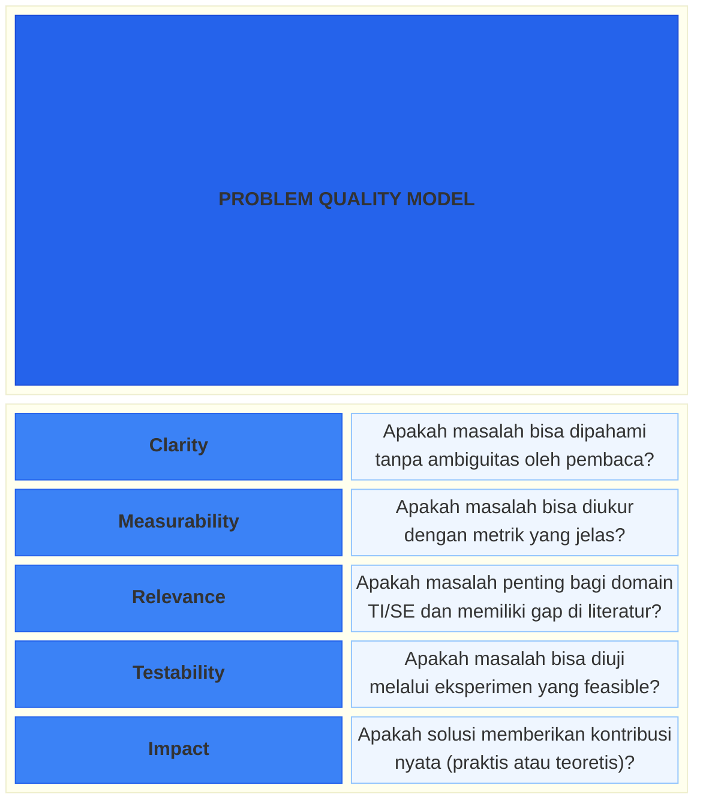
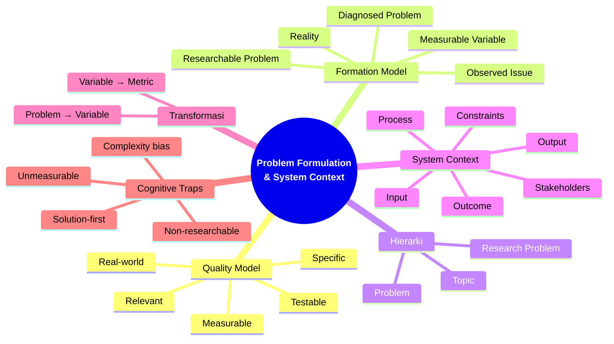

# Bab 2 — Problem Formulation & System Context

> **Sub-CPMK:** 1.2 — Merumuskan masalah riset dari fenomena TI
> **CPMK:** CPMK01 — Problem Framing
> **CPL Utama:** CPL03 (Penalaran logis, kritis, sistematis)
> **CPL Pendukung:** CPL06 (Desain & pengembangan)
> **Fase:** Thinking (M1–M4)

---

## Ringkasan Bab

Bab ini mengajarkan keterampilan paling mendasar namun paling sering diabaikan dalam riset: **merumuskan masalah**. Banyak penelitian gagal bukan karena metodenya lemah atau datanya kurang, melainkan karena masalah yang diteliti tidak pernah dirumuskan dengan jelas sejak awal. Kita akan belajar membedakan topik dari masalah, gejala dari akar masalah, dan — yang paling penting — mengubah masalah dunia nyata menjadi *researchable problem* yang bisa diukur, diuji, dan dibuktikan melalui eksperimen.

---

## 2.1 Pembuka

Bab 1 membahas bahwa riset di bidang Teknologi Informasi bukan sekadar membangun sistem, melainkan membuktikan bahwa temuan benar, valid, dan dapat dipercaya. Mindset *Curious → Critical → Systematic* sudah tertanam. Pertanyaan berikutnya: dari mana penelitian dimulai?

Jawabannya bukan dari metode. Bukan dari dataset. Bukan dari tool. Penelitian dimulai dari **masalah**.

Namun, "masalah" dalam konteks riset berbeda jauh dari keluhan sehari-hari. Seseorang yang mengatakan "website kampus lambat" sedang mengutarakan keluhan. Seorang peneliti yang mengatakan "waktu respons server meningkat 340% saat concurrent user melebihi 500, dan belum ada studi yang mengevaluasi efektivitas caching strategy X pada arsitektur monolitik di lingkungan akademik" sedang merumuskan masalah riset. Perbedaannya? **Presisi, konteks, dan testability.**

Dalam bidang Teknologi Informasi dan Software Engineering, masalah riset selalu terikat pada **sistem**. Sistem memiliki input, proses, output, outcome, constraints, dan stakeholders. Tanpa memahami konteks sistem, masalah hanya menjadi pernyataan abstrak yang tidak bisa dieksperimenkan. Karena itu, bab ini menggabungkan dua keterampilan: merumuskan masalah (*problem formulation*) dan memahami konteks sistem (*system context*).

Sasarannya: mampu mengambil fenomena apa pun di dunia TI — dari performa aplikasi yang menurun, pengguna yang meninggalkan fitur, hingga model machine learning yang bias — lalu mengubahnya menjadi research problem yang jelas, terukur, dan siap diproposalkan.

Pertanyaan utama bab ini: **Bagaimana mengubah pengamatan sehari-hari menjadi masalah riset yang bisa diuji secara ilmiah?**

---

## 2.2 Problem Formation Model & Problem Quality Model

Bab ini memiliki dua model visual yang saling melengkapi. Model pertama menunjukkan **proses** transformasi dari pengamatan menjadi masalah riset. Model kedua menunjukkan **kriteria** yang harus dipenuhi agar masalah tersebut layak diteliti.

### Problem Formation Model

**Gambar 2.1** — Problem Formation Model: Dari Realitas ke Variabel Terukur


Model ini menggambarkan bahwa masalah riset tidak muncul begitu saja — ia melewati proses transformasi bertahap. Setiap tahap memiliki fungsi spesifik:

1. **Reality** — Dunia nyata tempat fenomena terjadi. Bisa berupa lingkungan industri, kampus, aplikasi yang berjalan, atau interaksi pengguna dengan sistem.
2. **Observed Issue (Symptom)** — Pengamatan awal terhadap sesuatu yang "tidak beres." Ini belum tentu masalah — bisa jadi hanya gejala. Contoh: "pengguna mengeluh aplikasi lambat."
3. **Diagnosed Problem (Root Cause)** — Setelah investigasi, gejala ditelusuri ke akar masalah. Contoh: "query database tidak terindeks, menyebabkan full table scan pada tabel dengan 2 juta record."
4. **Researchable Problem** — Masalah yang sudah di-*scope*, dibatasi, dan dihubungkan dengan gap di literatur. Bukan semua masalah bisa diteliti — hanya yang memiliki kontribusi ilmiah.
5. **Measurable Variable** — Masalah yang telah ditransformasi menjadi variabel yang bisa diukur, dibandingkan, dan diuji secara statistik.

Sebagian besar kegagalan riset pemula terjadi karena melompat langsung dari *Reality* ke *Measurable Variable* tanpa melewati tiga tahap di tengah. Hasilnya: variabel yang diukur tidak menjawab masalah yang sebenarnya.

### Problem Quality Model

**Gambar 2.2** — Problem Quality Model: 5 Kriteria Masalah Riset yang Layak



Kedua model bekerja bersamaan: Problem Formation Model menjawab **"bagaimana prosesnya?"**, sementara Problem Quality Model menjawab **"apakah hasilnya cukup baik?"**. Setiap researchable problem yang dihasilkan dari tahap formasi harus divalidasi terhadap lima kriteria kualitas ini sebelum dilanjutkan ke tahap berikutnya dalam research pipeline.

Jika masalah riset tidak lulus kelima kriteria ini, ulangi proses formasi. Lebih baik menghabiskan satu minggu memperbaiki masalah daripada satu semester meneliti masalah yang salah.

---

## 2.3 Definisi Kunci

**Topik Riset (*Research Topic*)**
: Area atau bidang umum yang menjadi konteks penelitian. Topik belum memiliki pertanyaan spesifik dan tidak bisa diuji langsung. Contoh: "machine learning untuk deteksi anomali."

**Masalah Riset (*Research Problem*)**
: Pernyataan eksplisit tentang gap, kontradiksi, atau ketidakjelasan dalam pengetahuan yang ada, yang memerlukan investigasi ilmiah. Masalah riset harus spesifik, terukur, dan terikat pada konteks tertentu (Creswell & Creswell, 2018).

**Problem Statement**
: Formulasi tertulis dari masalah riset yang mencakup: konteks sistem, gap yang teridentifikasi, dampak masalah, dan mengapa masalah tersebut layak diteliti. Problem statement adalah "kontrak" antara peneliti dengan pembimbing dan penguji.

**System Context**
: Deskripsi lengkap tentang sistem tempat masalah berada, mencakup: input, proses, output, outcome, constraints, stakeholders, dan lingkungan operasional. Dalam riset TI, setiap masalah selalu terikat pada sistem tertentu (Hevner et al., 2004).

---

## 2.4 Konsep Inti

### 2.4.1 Topic vs Problem vs Research Problem: Hierarki Ketajaman

Salah satu kesalahan paling umum dalam riset adalah mencampuradukkan tiga konsep yang sebenarnya berbeda level kedalaman.

**Topik** adalah wilayah. Seperti peta, topik menunjukkan "di mana Anda berada" secara umum. Contoh: *"Keamanan jaringan IoT."* Ini informatif, tapi tidak bisa diteliti — terlalu luas.

**Masalah** (*problem*) adalah celah di dalam wilayah itu. Seperti lubang di jalan — Anda bisa menunjuknya dengan jelas. Contoh: *"Protokol MQTT pada perangkat IoT rumahan tidak mengenkripsi payload secara default, menyebabkan data sensor rentan terhadap man-in-the-middle attack."* Ini sudah spesifik, tapi belum tentu bisa diteliti.

**Masalah riset** (*research problem*) adalah masalah yang sudah melewati tiga filter: (1) ada gap di literatur — belum ada atau belum cukup studi yang menjawab, (2) bisa ditransformasi menjadi variabel terukur, dan (3) bisa diuji melalui eksperimen yang feasible.

Analoginya seperti ini:

| Level | Analogi | Contoh TI |
|-------|---------|-----------|
| Topik | "Ada masalah di kota ini" | "Keamanan IoT" |
| Masalah | "Jalan utama berlubang di KM 5" | "MQTT tidak terenkripsi pada IoT rumahan" |
| Masalah Riset | "Lubang di KM 5 disebabkan oleh drainase yang gagal, dan belum ada studi tentang material X untuk kondisi ini" | "Belum ada studi yang membandingkan overhead TLS 1.3 vs DTLS pada MQTT di perangkat IoT resource-constrained (RAM < 64KB)" |

Yang perlu dicatat: masalah riset memiliki tiga elemen yang tidak dimiliki masalah biasa — **gap** ("belum ada studi"), **variabel terukur** ("overhead"), dan **batasan konteks** ("resource-constrained, RAM < 64KB").

### 2.4.2 Symptom vs Problem: Menggali Akar Masalah

Dalam praktik riset TI, apa yang terlihat di permukaan bukan selalu masalah yang sebenarnya. Ada perbedaan penting antara **gejala** (*symptom*) dan **masalah** (*problem*).

Gejala adalah apa yang **diamati**. Masalah adalah **mengapa** pengamatan itu terjadi.

| Symptom (Gejala) | Diagnosed Problem (Akar Masalah) |
|-------------------|----------------------------------|
| "Aplikasi crash setiap 2 jam" | Memory leak pada modul caching yang tidak melakukan garbage collection |
| "User meninggalkan halaman checkout" | Waktu loading halaman > 8 detik karena API call berurutan (sequential) |
| "Model prediksi akurasinya 95% tapi bisnis tidak puas" | Model tidak menangkap kasus minority class (precision rendah pada kelas target) |
| "Pengguna tidak menggunakan fitur forum di LMS" | UX path ke forum membutuhkan 5 klik dari landing page |

Teknik untuk menggali akar masalah:

1. **5 Whys** — Tanyakan "mengapa?" berulang kali hingga sampai ke root cause. Wohlin et al. (2012) menekankan bahwa dalam software engineering, gejala teknis seringkali memiliki akar pada keputusan desain (*design decision*) yang tidak dievaluasi.
2. **Fishbone Diagram (Ishikawa)** — Klasifikasikan penyebab ke dalam kategori: Teknologi, Proses, Data, Manusia, Environment.
3. **Triangulasi** — Konfirmasi root cause dari minimal dua sumber berbeda (log, user feedback, metric monitoring).

### 2.4.3 System Thinking: Input → Process → Output → Outcome

Dalam riset Teknologi Informasi, masalah tidak pernah berdiri sendiri — ia selalu terikat pada **sistem**. Pendekatan *Design Science Research* (Hevner et al., 2004; Peffers et al., 2007) menempatkan masalah riset dalam konteks artefak dan lingkungan. Untuk itu, kita perlu memahami sistem secara utuh.

Setiap sistem TI dapat didekomposisi menjadi:

| Komponen | Deskripsi | Contoh (Sistem Rekomendasi) |
|----------|-----------|----------------------------|
| **Input** | Data atau permintaan yang masuk ke sistem | User rating, item metadata, click history |
| **Process** | Logika, algoritma, atau transformasi yang terjadi | Collaborative filtering, content-based filtering |
| **Output** | Hasil langsung dari proses | Daftar 10 rekomendasi teratas |
| **Outcome** | Dampak output terhadap pengguna/bisnis | User engagement, conversion rate, satisfaction |
| **Constraints** | Batasan teknis, waktu, atau sumber daya | Latensi < 200ms, RAM ≤ 4GB, cold-start users |
| **Stakeholders** | Pihak yang berkepentingan | End user, product owner, data team |

Mengapa system thinking penting dalam formulasi masalah? Karena masalah riset yang baik selalu **terikat pada komponen sistem yang spesifik**. "Sistem rekomendasi tidak akurat" terlalu umum. "Output ranking dari collaborative filtering tidak mencerminkan preferensi pengguna baru (cold-start) karena kurangnya data historis (< 5 rating)" — ini terikat pada komponen spesifik: **output** (ranking), **process** (CF), **constraints** (cold-start, < 5 rating), dan **stakeholder** (pengguna baru).

### 2.4.4 Problem → Variable → Metric: Transformasi Kunci

Langkah transformasi dari masalah ke variabel yang terukur adalah titik kritis dalam riset. Banyak peneliti pemula mampu mengidentifikasi masalah, namun gagal pada langkah ini.

**Prinsipnya sederhana: setiap pernyataan dalam masalah harus bisa diwujudkan menjadi sesuatu yang bisa diukur.**

Perhatikan transformasi berikut:

| Problem Statement | Variable | Metric | Alat Ukur |
|-------------------|----------|--------|-----------|
| "Algoritma A lebih lambat dari B" | Waktu eksekusi | Milidetik (ms) | Benchmark profiler |
| "Model ML tidak adil terhadap grup tertentu" | Fairness (*demographic parity*) | Rasio prediksi positif antar-grup | Fairness toolkit (AIF360) |
| "Pengguna tidak puas dengan antarmuka" | Usability (*satisfaction score*) | SUS score (0–100) | System Usability Scale questionnaire |
| "Enkripsi menambah overhead pada IoT" | Resource consumption | CPU usage (%), RAM (KB), latency (ms) | Profiler, system monitor |

Shadish et al. (2002) menekankan bahwa variabel harus memiliki **operational definition** — definisi yang cukup jelas sehingga peneliti lain bisa mengukur hal yang sama dengan cara yang sama dan mendapatkan hasil yang konsisten.

### 2.4.5 Lima Kriteria Problem Statement yang Kuat

Sebagai validasi akhir, evaluasi masalah riset Anda terhadap lima kriteria berikut:

1. **Specific** — Apakah masalah cukup sempit? Bisa dijawab dalam satu studi?
2. **Measurable** — Apakah ada metrik yang bisa mengukur masalah dan solusi?
3. **Relevant** — Apakah masalah penting bagi komunitas riset atau industri TI?
4. **Testable** — Apakah masalah bisa diuji melalui eksperimen?
5. **Real-world** — Apakah masalah berasal dari fenomena nyata, bukan imajinasi?

> 💡 **Insight:**
> Kriteria ini bukan checklist untuk dicentang sekali, melainkan filter iteratif. Setiap kali Anda memperbaiki problem statement, jalankan kembali kelima filter ini.

---

## 2.5 Research vs Engineering

**Tabel 2.1** — Perbandingan Perspektif Research vs Engineering dalam Problem Formulation

| Aspek | Engineering | Research |
|-------|------------|----------|
| **Tujuan** | Menyelesaikan masalah (*solve*) | Memahami dan membuktikan (*understand & prove*) |
| **Pertanyaan** | "Bagaimana membuat ini bekerja?" | "Mengapa pendekatan A lebih efektif dari B dalam konteks C?" |
| **Masalah** | Bug, error, fitur yang belum ada | Gap dalam pengetahuan, ketidakpastian metode |
| **Sukses diukur dari** | Sistem berjalan, client puas | Hipotesis terjawab, kontribusi tervalidasi |
| **Scope** | Selesaikan semua yang perlu | Batasi scope agar bisa dibuktikan |
| **Output** | Working system, deployment | Evidence, paper, replicable findings |

Seorang engineer yang menemukan bug dan memperbaikinya sedang melakukan problem solving. Seorang peneliti yang menyelidiki *mengapa* kategori bug tertentu lebih sering muncul di arsitektur microservice dibanding monolith, lalu menguji hipotesisnya melalui eksperimen terkontrol, sedang melakukan research. Keduanya berangkat dari masalah — tapi sifat masalahnya berbeda.

---

## 2.6 Research Reality

### Fenomena 1 — "Masalah yang Hilang di Tengah Jalan"

Banyak laporan riset yang jika ditelusuri dari Bab 1 (Pendahuluan) ke Bab 3 (Metodologi), masalahnya "bermutasi." Di Bab 1, masalah yang diangkat adalah performa sistem. Tapi di Bab 3, yang diukur tiba-tiba usability. Ini terjadi karena problem statement di awal tidak cukup presisi — sehingga peneliti "mengikuti data yang tersedia" alih-alih "mencari data yang dibutuhkan." Fenomena ini disebut **problem drift**, dan merupakan salah satu penyebab paling umum revisi berulang saat sidang.

### Fenomena 2 — "Solution-First Thinking"

Di industri software, mentalitas "mulai dari solusi" sangat lazim dan bahkan dianggap efisien. Namun dalam riset, mentalitas ini berbahaya. Peneliti yang memulai dari "saya ingin membuat chatbot berbasis GPT" tanpa masalah yang jelas akan kesulitan di tahap validasi — karena tidak ada baseline, tidak ada metrik yang didefinisikan sejak awal, dan tidak ada kriteria kapan "berhasil" dan kapan "gagal."

Creswell dan Creswell (2018) menegaskan: *"A research problem is a general issue, concern, or controversy addressed in research that narrows the topic."* Artinya, masalah selalu datang **sebelum** solusi.

### Fenomena 3 — "Masalah yang Tidak Bisa Gagal"

Beberapa peneliti pemula merumuskan masalah yang jawabannya sudah pasti — misalnya: "Apakah penerapan metode X dapat meningkatkan akurasi?" Jika metode X sudah terbukti di ratusan studi, maka pertanyaannya *trivial*. Riset yang baik harus memiliki kemungkinan untuk **gagal** — karena justru dari kemungkinan gagal itulah kontribusi ilmiah muncul. Jika hasilnya sudah pasti, itu bukan riset — itu demonstrasi.

Riset yang baik dimulai dari masalah yang jawabannya belum pasti. Jika jawabannya sudah diketahui sebelum eksperimen, yang terjadi bukan investigasi melainkan konfirmasi.

---

## 2.7 Cognitive Traps

**Trap 1: "Saya ingin menggunakan metode X"**

Bentuk klasik *solution-first thinking*. Metode adalah alat — dipilih setelah masalah dan research question jelas, bukan sebelumnya. Peneliti yang memulai dari metode akan terjebak mencari masalah yang "cocok" dengan metode, alih-alih mencari metode yang tepat untuk masalah. Wohlin et al. (2012) menekankan bahwa pemilihan metode harus didorong oleh sifat masalah (*problem-driven*), bukan ketersediaan metode (*method-driven*).

**Trap 2: "Semakin kompleks semakin bagus"**

Masalah riset yang baik bukan yang paling kompleks, melainkan yang paling tajam. Peneliti pemula sering menambahkan variabel, memperluas scope, atau memilih algoritma rumit karena mengira kompleksitas = kualitas. Riset yang kuat justru berhasil menjawab pertanyaan sederhana namun penting dengan bukti yang solid. Occam's Razor berlaku: jangan menambah kompleksitas tanpa kebutuhan.

**Trap 3: "Problem tidak perlu diukur"**

Beberapa peneliti pemula menulis masalah dalam bentuk narasi panjang tanpa satupun metrik. "Sistem kurang optimal" — kurang optimal dibanding apa? Diukur dengan apa? Tanpa metrik, masalah hanya opini. Masalah riset harus bisa diterjemahkan ke dalam variabel terukur, atau ia bukan masalah riset — ia keluhan (Shadish et al., 2002).

**Trap 4: "Semua problem bisa diteliti"**

Tidak semua masalah adalah masalah riset. "Server kampus sering down" adalah masalah operasional — solusinya upgrade server, bukan riset. Masalah menjadi *researchable* hanya jika: (a) ada gap pengetahuan yang relevan, (b) jawabannya belum pasti, dan (c) penyelesaiannya menghasilkan kontribusi yang bisa direplikasi oleh peneliti lain.

---

## 2.8 Studi Kasus

### Kasus 1 (Basic): "Sistem Rekomendasi Film — Akurasi Tinggi tapi User Tidak Puas"

**Konteks:**

Sebuah tim peneliti membangun sistem rekomendasi film menggunakan collaborative filtering. Hasil evaluasi menunjukkan RMSE (*Root Mean Square Error*) sebesar 0.87 — angka yang cukup baik menurut standar literatur. Namun, saat dilakukan user testing terhadap 30 pengguna, mayoritas menyatakan bahwa rekomendasi yang diberikan "membosankan" dan "sudah ditebak." Satisfaction score hanya 45/100.

**❌ Pendekatan Salah (Bad Approach):**

"Masalah: Sistem rekomendasi film menggunakan collaborative filtering belum optimal. Tujuan: Mengoptimalkan sistem rekomendasi film."

Mengapa salah:
- "Belum optimal" — dibanding apa? Tidak ada baseline.
- "Mengoptimalkan" — mengoptimalkan metrik yang mana?
- Problem tidak bisa diukur dan tidak bisa gagal.

**✅ Pendekatan Benar (Good Approach):**

"Masalah: Sistem rekomendasi berbasis collaborative filtering menghasilkan RMSE rendah (0.87) namun satisfaction score rendah (45/100). Perbedaan antara akurasi prediktif dan kepuasan pengguna mengindikasikan bahwa metrik evaluasi tradisional (RMSE) tidak cukup merepresentasikan kualitas rekomendasi dari perspektif pengguna. Belum ada studi yang mengevaluasi pengaruh penambahan diversity metric (Intra-List Diversity) terhadap trade-off antara akurasi dan kepuasan pengguna pada domain film."

Mengapa benar:
- Masalah spesifik dan terikat pada data (RMSE 0.87, satisfaction 45/100)
- Ada kontradiksi yang jelas (akurasi bagus ↔ kepuasan rendah)
- Ada gap ("belum ada studi yang mengevaluasi...")
- Variabel terukur jelas (ILD, RMSE, satisfaction score)
- Bisa diuji dan bisa gagal

**Perbandingan:**

| Aspek | Bad | Good |
|-------|-----|------|
| Specificity | "Belum optimal" | RMSE 0.87, satisfaction 45/100 |
| Measurability | Tidak ada metrik | RMSE, ILD, satisfaction score |
| Gap | Tidak disebutkan | "Belum ada studi yang..." |
| Testability | Tidak jelas kapan selesai | Bisa dieksperimen (A/B test) |
| Potential to fail | Tidak bisa gagal | Bisa: ILD mungkin tidak meningkatkan satisfaction |

Akurasi teknis dan kepuasan pengguna adalah dua metrik berbeda. Masalah riset yang kuat mengidentifikasi kontradiksi antara dua metrik dan menyelidiki penyebabnya.

---

### Kasus 2 (Advanced): "Sistem Deteksi Fraud — 98% Akurasi tapi Fraud Tetap Lolos"

**Konteks:**

Sebuah perusahaan fintech mengimplementasikan model deteksi fraud berbasis Random Forest. Model mencapai overall accuracy 98.2%. Namun, departemen risk management melaporkan bahwa kerugian akibat fraud justru meningkat 15% dibanding kuartal sebelumnya. Investigasi menunjukkan bahwa dataset training sangat imbalanced: 97.8% transaksi legitimate, 2.2% fraud. Model "belajar" untuk hampir selalu memprediksi "legitimate" — dan tetap mendapat akurasi tinggi karena class distribution.

**❌ Pendekatan Salah:**

"Masalah: Sistem deteksi fraud menggunakan Random Forest memiliki akurasi 98% namun masih ada fraud yang lolos. Tujuan: Meningkatkan akurasi sistem deteksi fraud."

Mengapa salah:
- Masalah sebenarnya bukan akurasi — akurasinya sudah tinggi
- Tidak mengidentifikasi root cause (class imbalance)
- Metrik yang dipilih (accuracy) justru menyembunyikan masalah
- "Meningkatkan akurasi" akan memperkuat bias yang sudah ada

**✅ Pendekatan Benar:**

"Masalah: Model deteksi fraud berbasis Random Forest menunjukkan accuracy 98.2% namun recall pada kelas fraud hanya 12.4% (sensitivity). Penyebab utama adalah class imbalance ratio 44.5:1 pada dataset training. Studi sebelumnya (Rahman et al., 2020; Chen et al., 2021) telah mengevaluasi SMOTE dan cost-sensitive learning secara terpisah, namun belum ada studi yang membandingkan efektivitas kombinasi keduanya terhadap recall dan precision pada dataset transaksi dengan imbalance ratio > 40:1. Penelitian ini bertujuan mengevaluasi apakah kombinasi SMOTE + cost-sensitive Random Forest secara signifikan meningkatkan recall kelas fraud tanpa menurunkan precision di bawah threshold operasional (≥ 70%)."

Mengapa benar:
- Mengidentifikasi root cause (class imbalance ratio 44.5:1)
- Menggunakan metrik yang tepat (recall, precision) bukan accuracy
- Gap jelas dan spesifik (kombinasi teknik belum diuji pada ratio > 40:1)
- Threshold sukses didefinisikan (recall ↑ tanpa precision < 70%)
- Bisa gagal: kombinasi mungkin tidak lebih baik dari teknik individual

**Perbandingan:**

| Aspek | Bad | Good |
|-------|-----|------|
| Root cause | Tidak teridentifikasi | Class imbalance ratio 44.5:1 |
| Metrik | Accuracy (misleading) | Recall, Precision (appropriate) |
| Gap | Tidak ada | Kombinasi teknik belum diuji pada extreme imbalance |
| Threshold | Tidak ada | Precision ≥ 70% sebagai threshold operasional |
| Falsifiability | Tidak bisa gagal | Kombinasi bisa saja tidak lebih baik |

Dalam masalah domain-spesifik seperti fraud detection, pemilihan metrik evaluasi adalah bagian dari problem formulation. Akurasi tinggi pada dataset imbalanced justru bisa menjadi indikator masalah, bukan indikator kesuksesan. Peneliti yang cermat mempertanyakan metrik sebelum percaya pada angka.

---

## 2.9 Template Praktis

> 🔧 **Template: Problem Statement Builder**
>
> Gunakan template ini untuk menyusun problem statement Anda. Isi setiap bagian secara berurutan.
>
> ```
> PROBLEM STATEMENT
> ═══════════════════════════════════════════════════
>
> 1. KONTEKS SISTEM
>    Sistem/domain    : [Nama sistem/domain]
>    Input            : [Apa yang masuk ke sistem]
>    Process          : [Algoritma/metode yang digunakan]
>    Output           : [Apa yang dihasilkan]
>    Stakeholders     : [Siapa yang terdampak]
>    Constraints      : [Batasan teknis/waktu/resources]
>
> 2. FENOMENA (Symptom)
>    Apa yang diamati : [Deskripsi pengamatan]
>    Bukti/data       : [Angka, log, feedback]
>
> 3. AKAR MASALAH (Diagnosed Problem)
>    Root cause       : [Penyebab utama]
>    Investigasi      : [Bagaimana root cause ditemukan]
>
> 4. GAP LITERATUR
>    Studi terdahulu  : [Apa yang sudah diteliti]
>    Celah            : [Apa yang belum diteliti]
>
> 5. MASALAH RISET (Researchable Problem)
>    Statement        : [1-2 kalimat problem statement final]
>
> 6. VARIABEL TERUKUR
>    Independent Var  : [Variabel yang dimanipulasi]
>    Dependent Var    : [Variabel yang diukur]
>    Metrik           : [Satuan ukuran]
>    Alat ukur        : [Tool/instrument]
>
> 7. VALIDASI (Problem Quality Model)
>    [ ] Specific     : [Ya/Tidak — jelaskan]
>    [ ] Measurable   : [Ya/Tidak — jelaskan]
>    [ ] Relevant     : [Ya/Tidak — jelaskan]
>    [ ] Testable     : [Ya/Tidak — jelaskan]
>    [ ] Real-world   : [Ya/Tidak — jelaskan]
>
> ═══════════════════════════════════════════════════
> ```

---

## 2.10 Mindmap Ringkasan

**Gambar 2.3** — Mindmap Bab 2: Problem Formulation & System Context



---

## 2.11 Rangkuman

**Poin-poin utama bab ini:**

1. **Penelitian dimulai dari masalah**, bukan dari metode atau solusi. Masalah harus dirumuskan secara eksplisit sebelum melangkah lebih jauh dalam research pipeline.

2. **Problem Formation Model** menunjukkan bahwa masalah riset melewati lima tahap transformasi: Reality → Observed Issue → Diagnosed Problem → Researchable Problem → Measurable Variable. Setiap tahap tidak boleh dilompati.

3. **Topic ≠ Problem ≠ Research Problem.** Topik adalah area umum, masalah adalah celah spesifik, dan masalah riset adalah celah yang memiliki gap literatur, variabel terukur, dan bisa dieksperimenkan.

4. **Symptom ≠ Root Cause.** Apa yang terlihat di permukaan belum tentu masalah yang sebenarnya. Gunakan teknik 5 Whys, Fishbone, atau triangulasi untuk menggali akar masalah.

5. **System context wajib ada.** Setiap masalah riset TI harus terikat pada sistem yang jelas: input, process, output, outcome, constraints, dan stakeholders.

6. **Problem Quality Model** memberikan 5 kriteria validasi: Clarity, Measurability, Relevance, Testability, dan Impact. Kelimanya harus terpenuhi.

7. **Transformasi Problem → Variable → Metric** adalah langkah kritis yang menghubungkan masalah abstrak dengan eksperimen konkret.

Masalah yang terformulasi dengan baik membuka jalan ke tahap berikutnya. Bab 3 membahas bagaimana menempatkan masalah riset dalam konteks literatur yang ada, mengidentifikasi gap, dan memposisikan kontribusi secara tepat.

> 🔥 **Final Statement:**
> "Penelitian tidak dimulai dari solusi, tetapi dari masalah yang dipahami secara mendalam dan dapat diuji secara ilmiah."

---

## 2.12 Latihan & Refleksi

### Pertanyaan Refleksi

1. Pikirkan proyek riset yang pernah atau sedang Anda kerjakan. Apakah Anda memulai dari masalah atau dari solusi? Jika dari solusi, coba rumuskan ulang: apa masalah yang sebenarnya Anda coba selesaikan?

2. Ambil satu topik TI yang Anda minati. Transformasikan dari level **topik** ke level **research problem** menggunakan hierarki Topic → Problem → Research Problem. Di mana hambatan terbesarnya?

3. Mengapa akurasi 98% pada kasus deteksi fraud justru bisa menjadi indikator masalah? Apa pelajarannya tentang pemilihan metrik evaluasi?

4. Apa perbedaan antara masalah yang "tidak bisa gagal" dengan masalah riset yang baik? Berikan satu contoh masing-masing dari domain TI.

### Latihan Praktis

1. **Problem Statement Exercise:** Pilih satu dari fenomena berikut, lalu susun problem statement lengkap menggunakan template di section 2.9:
   - (a) Aplikasi e-commerce memiliki cart abandonment rate 73%
   - (b) Chatbot customer service hanya bisa menjawab 40% pertanyaan dengan benar
   - (c) Model prediksi churn pelanggan memiliki AUC 0.82 tapi false positive rate 35%

2. **Root Cause Analysis:** Untuk problem statement yang Anda buat di latihan 1, lakukan analisis 5 Whys. Dokumentasikan setiap level "mengapa" dan identifikasi apakah akar masalah Anda sudah benar-benar root cause atau masih symptom.

---

## Daftar Pustaka

- Creswell, J. W., & Creswell, J. D. (2018). *Research Design: Qualitative, Quantitative, and Mixed Methods Approaches* (5th ed.). SAGE Publications.
- Hevner, A. R., March, S. T., Park, J., & Ram, S. (2004). Design Science in Information Systems Research. *MIS Quarterly*, 28(1), 75–105.
- Peffers, K., Tuunanen, T., Rothenberger, M. A., & Chatterjee, S. (2007). A Design Science Research Methodology for Information Systems Research. *Journal of Management Information Systems*, 24(3), 45–77.
- Shadish, W. R., Cook, T. D., & Campbell, D. T. (2002). *Experimental and Quasi-Experimental Designs for Generalized Causal Inference*. Houghton Mifflin.
- Wohlin, C., Runeson, P., Höst, M., Ohlsson, M. C., Regnell, B., & Wesslén, A. (2012). *Experimentation in Software Engineering*. Springer.

---

<!-- METADATA INTERNAL (tidak dicetak) -->

### AI-Ready Prompt

```
Anda adalah asisten riset untuk peneliti di bidang Teknologi Informasi. Bantu mereka merumuskan masalah riset dari fenomena TI yang mereka amati. Gunakan Problem Formation Model (Reality → Symptom → Diagnosed Problem → Researchable Problem → Measurable Variable) dan validasi hasilnya terhadap Problem Quality Model (Clarity, Measurability, Relevance, Testability, Impact). Pastikan:
1. Masalah terikat pada system context (Input/Process/Output/Outcome/Constraints/Stakeholders)
2. Ada gap literatur yang teridentifikasi
3. Variable dan metrik yang terukur
4. Masalah bisa gagal (falsifiable)
Gaya bahasa: semi-formal, penjelasan mendalam, contoh dari domain TI/SE.
```

### Referensi Bab Ini

- Creswell, J. W., & Creswell, J. D. (2018). *Research Design: Qualitative, Quantitative, and Mixed Methods Approaches* (5th ed.). SAGE Publications.
- Hevner, A. R., March, S. T., Park, J., & Ram, S. (2004). Design Science in Information Systems Research. *MIS Quarterly*, 28(1), 75–105.
- Peffers, K., Tuunanen, T., Rothenberger, M. A., & Chatterjee, S. (2007). A Design Science Research Methodology for Information Systems Research. *Journal of Management Information Systems*, 24(3), 45–77.
- Shadish, W. R., Cook, T. D., & Campbell, D. T. (2002). *Experimental and Quasi-Experimental Designs for Generalized Causal Inference*. Houghton Mifflin.
- Wohlin, C., Runeson, P., Höst, M., Ohlsson, M. C., Regnell, B., & Wesslén, A. (2012). *Experimentation in Software Engineering*. Springer.

### Checklist Penyelesaian

- [x] Narasi pembuka kuat (opening bridge dari Bab 1)
- [x] Signature model (Problem Formation Model + Problem Quality Model)
- [x] Definisi kunci lengkap (4 definisi)
- [x] Konsep inti mendalam (5 sub-konsep)
- [x] Research vs Engineering (tabel + insight)
- [x] Research Reality (3 fenomena)
- [x] Cognitive Traps (4 traps)
- [x] Case Study Basic — Rekomendasi Film (bad vs good)
- [x] Case Study Advanced — Fraud Detection (bad vs good)
- [x] Template praktis (Problem Statement Builder)
- [x] Mindmap ringkasan
- [x] Rangkuman + closing bridge ke Bab 3
- [x] Latihan & refleksi (4 refleksi + 2 praktis)
- [x] Sitasi 5 referensi (Creswell, Wohlin, Shadish, Peffers, Hevner)
- [x] Final Statement
- [x] AI-Ready Prompt

<!-- STATUS: 🟢 Draft Complete -->
