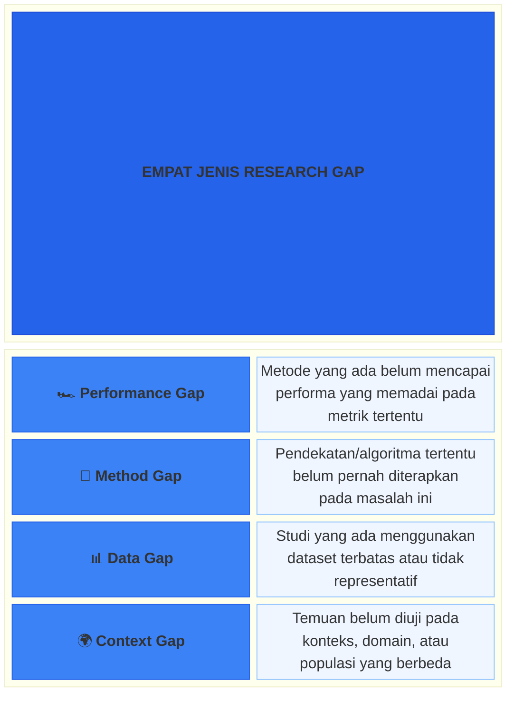
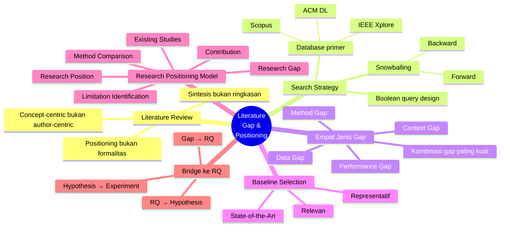

# Bab 3 — Literature Review, Research Gap & Baseline

> **Sub-CPMK:** Sub-CPMK 1.3 — Mengidentifikasi gap dari literatur dan memposisikan riset
> **CPMK:** CPMK01 — Problem Framing
> **CPL Utama:** CPL03 (Penalaran logis, kritis, sistematis)
> **CPL Pendukung:** CPL02 (Menyusun karya ilmiah)
> **Fase:** Thinking (M1–M4)

---

## Ringkasan Bab

Bab ini mengajarkan cara membaca literatur bukan untuk merangkum, melainkan untuk **memposisikan** riset Anda. Kita akan belajar membedakan empat jenis gap (performance, method, data, context), merancang strategi pencarian literatur yang sistematis, memilih baseline yang tepat, dan — yang paling penting — mengubah gap menjadi posisi kontribusi yang jelas. Di akhir bab ini, Anda akan mampu menyusun tabel literatur yang bukan sekadar daftar bacaan, melainkan **peta medan perang** yang menunjukkan di mana posisi Anda berdiri dan mengapa posisi itu layak dipertahankan.

---

## 3.1 Pembuka

Bab 2 menunjukkan bahwa masalah riset yang baik harus spesifik, terukur, dan testable. Masalah sudah ada. Pertanyaannya sekarang: apakah masalah ini benar-benar layak diteliti?

Untuk menjawabnya, perlu masuk ke ruang diskusi ilmiah yang lebih luas: literatur. Literatur bukan tumpukan paper yang harus dibaca dan dirangkum. Literatur adalah percakapan — percakapan global antar peneliti yang sudah berlangsung bertahun-tahun tentang topik tertentu. Tugas peneliti bukan mendengarkan percakapan itu secara pasif, melainkan menemukan titik di mana percakapan itu belum selesai, lalu mengisi kekosongan itu.

Titik itulah yang disebut **research gap**: celah dalam pengetahuan yang belum dijawab secara memadai oleh studi-studi sebelumnya. Tanpa gap yang jelas, riset tidak memiliki justifikasi ilmiah — meski masalahnya menarik dan metodenya canggih.

Namun menemukan gap saja tidak cukup. Anda juga harus memposisikan riset Anda: apa yang Anda lakukan berbeda dari studi sebelumnya? Mengapa pendekatan Anda menjanjikan? Dan apa baseline yang akan Anda gunakan sebagai pembanding? Webster dan Watson (2002) menekankan bahwa literature review yang baik bukan kronologi, melainkan **argumentasi terstruktur** tentang posisi Anda dalam lanskap ilmiah.

Pertanyaan utama bab ini: bagaimana menemukan celah dalam pengetahuan yang ada dan memposisikan riset sebagai kontribusi yang bermakna?

---

## 3.2 Research Positioning Model

Bab ini memiliki satu signature model — **Research Positioning Model** — yang menggambarkan proses transformasi dari studi-studi yang ada menjadi posisi riset yang jelas.

**Gambar 3.1** — Research Positioning Model: Dari Studi Terdahulu ke Kontribusi

```mermaid
graph LR
    A["📚 <b>Existing<br/>Studies</b><br/><i>Literatur relevan</i>"]
    B["⚖️ <b>Method<br/>Comparison</b><br/><i>Analisis & sintesis</i>"]
    C["🔍 <b>Limitation<br/>Identification</b><br/><i>Kelemahan studi</i>"]
    D["🕳️ <b>Research<br/>Gap</b><br/><i>Celah pengetahuan</i>"]
    E["📍 <b>Research<br/>Position</b><br/><i>Posisi Anda</i>"]
    F["🎯 <b>Contribution</b><br/><i>Nilai tambah</i>"]

    A -->|"Systematic<br/>search"| B
    B -->|"Critical<br/>analysis"| C
    C -->|"Gap<br/>formulation"| D
    D -->|"Positioning<br/>statement"| E
    E -->|"Justification"| F

    style A fill:#DBEAFE,stroke:#2563EB,color:#1E3A5F
    style B fill:#BFDBFE,stroke:#2563EB,color:#1E3A5F
    style C fill:#93C5FD,stroke:#2563EB,color:#1E3A5F
    style D fill:#60A5FA,stroke:#2563EB,color:#FFFFFF
    style E fill:#3B82F6,stroke:#2563EB,color:#FFFFFF
    style F fill:#2563EB,stroke:#1D4ED8,color:#FFFFFF
```



Kontribusi ilmiah tidak bisa diklaim begitu saja — ia dibangun melalui proses yang rigorous:

1. **Existing Studies** — Kumpulan paper, jurnal, dan konferensi yang relevan dengan topik riset Anda. Tahap ini memerlukan strategi pencarian yang sistematis (database, keyword, boolean query).
2. **Method Comparison** — Analisis kritis terhadap apa yang sudah dilakukan peneliti sebelumnya: metode apa yang digunakan, dataset apa, metrik apa, konteks apa. Bukan ringkasan — melainkan **sintesis perbandingan**.
3. **Limitation Identification** — Identifikasi kelemahan, keterbatasan, atau asumsi yang belum diuji dari studi-studi terdahulu. Setiap studi pasti memiliki limitasi — tugas Anda menemukannya.
4. **Research Gap** — Celah yang teridentifikasi dari kumpulan limitasi. Gap bukan satu limitasi tunggal, melainkan **pola** keterbatasan yang belum dijawab secara kolektif oleh studi-studi yang ada.
5. **Research Position** — Pernyataan eksplisit tentang di mana Anda berdiri: apa yang membedakan riset Anda dari studi sebelumnya.
6. **Contribution** — Nilai tambah yang dijanjikan: apa yang akan diketahui setelah riset Anda selesai yang sebelumnya belum diketahui?

Literature review bukan kegiatan pasif. Jika setelah membaca 30 paper seseorang masih belum bisa mengatakan "inilah yang belum diselesaikan," ia belum melakukan literature review — ia hanya membaca.

---

## 3.3 Definisi Kunci

**Literature Review**
: Proses sistematis untuk mengidentifikasi, mengevaluasi, dan mensintesis studi-studi yang relevan dengan topik riset, dengan tujuan membangun argumentasi tentang posisi dan kontribusi riset yang akan dilakukan (Webster & Watson, 2002). Literature review bukan daftar bacaan — ia adalah peta intelektual.

**Research Gap**
: Celah dalam pengetahuan yang ada di mana pertanyaan penting belum terjawab secara memadai, atau di mana bukti yang ada masih tidak konsisten, tidak lengkap, atau belum diuji pada konteks tertentu. Gap adalah justifikasi utama mengapa riset perlu dilakukan.

**Baseline**
: Metode, model, atau pendekatan yang sudah ada dan digunakan sebagai titik pembanding (*benchmark*) untuk mengevaluasi kontribusi riset. Baseline harus relevan, representatif, dan idealnya merupakan state-of-the-art dalam domain yang sama (Wohlin et al., 2012).

**Research Position**
: Pernyataan eksplisit yang menjelaskan bagaimana riset berbeda dari dan membangun di atas studi-studi sebelumnya. Research position menjawab pertanyaan: "Di antara semua studi yang sudah ada, di mana posisi riset ini dan mengapa?"

---

## 3.4 Konsep Inti

### 3.4.1 Literature Review = Positioning, Bukan Ringkasan

Kesalahan paling umum dalam literature review adalah memperlakukan setiap paper sebagai item yang harus dirangkum. Hasilnya: daftar panjang paragraf yang dimulai dengan "Pada tahun 20XX, Penulis A melakukan penelitian tentang..." tanpa analisis dan tanpa sintesis.

Webster dan Watson (2002) dengan tegas menyatakan bahwa literature review yang baik bersifat **concept-centric**, bukan **author-centric**. Artinya:

| Author-Centric (❌) | Concept-Centric (✅) |
|---------------------|----------------------|
| "Penulis A (2020) menggunakan metode X..." | "Untuk masalah deteksi anomali, tiga pendekatan utama telah digunakan: X, Y, Z..." |
| "Penulis B (2021) menemukan bahwa..." | "Perbandingan metode X dan Y menunjukkan trade-off antara..." |
| Fokus pada **siapa** | Fokus pada **apa yang diketahui dan belum diketahui** |

Dalam pendekatan concept-centric, literatur diorganisasi berdasarkan **tema, metode, atau variabel** — bukan berdasarkan kronologi atau penulis. Ini memungkinkan Anda untuk melihat pola, menemukan kontradiksi, dan mengidentifikasi gap secara lebih natural.

Sebagai perbandingan untuk memperjelas perbedaan kedua pendekatan:

### 3.4.2 Empat Jenis Research Gap

Tidak semua gap diciptakan sama. Kitchenham (2004) dan pengalaman empiris dalam riset TI menunjukkan bahwa gap bisa dikategorikan menjadi empat jenis:

**Gambar 3.2** — Empat Jenis Research Gap



Masing-masing jenis gap memiliki karakteristik tersendiri:

**1. Performance Gap** — Metode yang ada belum cukup baik. Contoh: "Deteksi malware berbasis signature hanya mencapai detection rate 78% pada zero-day malware, sedangkan threshold operasional membutuhkan minimal 90%." Gap ini paling mudah diidentifikasi karena angkanya jelas — tetapi juga paling umum, sehingga kontribusi Anda harus cukup signifikan.

**2. Method Gap** — Sebuah pendekatan belum pernah diterapkan pada masalah tertentu. Contoh: "Transformer-based NLP telah terbukti efektif untuk sentiment analysis dalam bahasa Inggris, namun belum ada studi yang menerapkan dan mengevaluasi pendekatan serupa untuk bahasa Indonesia dengan karakteristik morfologi aglutinasi." Method gap sering muncul dari transfer pengetahuan lintas domain.

**3. Data Gap** — Studi yang ada menggunakan dataset yang terbatas, tidak realistis, atau tidak representatif. Contoh: "Seluruh studi tentang prediksi bug menggunakan dataset open-source (Mozilla, Eclipse), namun belum ada yang mengevaluasi pada codebase proprietary dengan karakteristik development process yang berbeda." Data gap menunjukkan bahwa klaim generalisasi dari studi sebelumnya belum teruji.

**4. Context Gap** — Temuan dari satu konteks belum diverifikasi pada konteks lain. Contoh: "Studi tentang efektivitas code review dilakukan pada tim software besar (>50 developer), namun belum ada bukti apakah temuan yang sama berlaku pada tim startup (3–5 developer)." Context gap adalah ancaman langsung terhadap external validity.

Gap terkuat biasanya adalah kombinasi dua jenis. Misalnya: "Method gap + Context gap" — pendekatan X belum diterapkan (method) pada domain Y (context). Kombinasi semacam ini menghasilkan posisi yang lebih unik dan defensible.

### 3.4.3 Strategi Pencarian Literatur: Systematic, Bukan Acak

Menemukan literatur yang relevan bukan soal mengetik keyword di Google Scholar dan berharap yang terbaik. Kitchenham (2004) mendefinisikan prinsip pencarian literatur yang sistematis:

**Database Primer:**
- **IEEE Xplore** — Fokus engineering dan computing
- **ACM Digital Library** — Fokus computer science
- **Scopus** — Multi-disiplin, terindeks ketat
- **Google Scholar** — Cakupan luas, tapi perlu filter kualitas

**Boolean Query Design:**

Query pencarian harus dirancang secara eksplisit, bukan ad hoc. Contoh:

```
("anomaly detection" OR "outlier detection") 
AND ("IoT" OR "Internet of Things") 
AND ("deep learning" OR "neural network")
AND (2019..2024)
```

Setiap keputusan pencarian — database mana, keyword apa, rentang tahun berapa — harus **didokumentasikan** agar reproducible. Jika Anda tidak bisa menjelaskan bagaimana Anda menemukan 30 paper yang Anda cite, Anda tidak bisa mengklaim bahwa literature review Anda sistematis.

**Strategi Snowballing:**

Selain pencarian database, gunakan dua teknik tambahan:
- **Backward snowballing** — Telusuri referensi dari paper yang sudah ditemukan. Jika paper A mengutip paper B yang sangat relevan, baca paper B.
- **Forward snowballing** — Cari paper yang mengutip paper kunci. Jika paper C (tahun 2019) sangat foundational, cari siapa yang mengutip paper C setelah 2019. Ini menunjukkan perkembangan terbaru.

### 3.4.4 Baseline: Relevan, Representatif, State-of-the-Art

Baseline adalah titik pembanding yang akan digunakan untuk mengevaluasi kontribusi Anda. Tanpa baseline, klaim "metode saya efektif" tidak memiliki makna — efektif **dibandingkan apa?**

Tiga kriteria baseline yang baik:

**1. Relevan** — Baseline harus menyelesaikan masalah yang sama atau sangat mirip dengan masalah riset Anda. Membandingkan model deteksi fraud Anda dengan model klasifikasi gambar bukan perbandingan yang valid.

**2. Representatif** — Baseline harus merepresentasikan pendekatan yang umum digunakan (*common practice*) atau pendekatan terbaik yang tersedia (*state-of-the-art*). Membandingkan deep learning model Anda dengan Naive Bayes pada tahun 2025 untuk task yang kompleks bukan perbandingan yang fair.

**3. State-of-the-Art (SOTA)** — Idealnya, setidaknya satu baseline harus merupakan pendekatan terbaru dan terbaik yang tersedia. Ini menunjukkan bahwa kontribusi Anda benar-benar melampaui apa yang sudah dicapai — bukan hanya melampaui metode lama.

**Kesalahan umum dalam pemilihan baseline:**

| Kesalahan | Masalah | Dampak |
|-----------|---------|--------|
| Baseline terlalu lemah | "Straw man comparison" | Kemenangan tidak bermakna |
| Baseline tidak relevan | Comparing apples to oranges | Klaim kontribusi tidak valid |
| Tidak ada baseline sama sekali | Tidak ada pembanding | Tidak tahu apakah metode Anda benar-benar lebih baik |
| Baseline kadaluarsa | SOTA sudah bergerak | Kontribusi sudah irrelevant saat dipublikasi |

Wohlin et al. (2012) menekankan bahwa pemilihan baseline bukan keputusan teknis semata — ia adalah keputusan **metodologis** yang mempengaruhi seluruh validitas eksperimen.

### 3.4.5 Gap → RQ → Hypothesis → Experiment: Jembatan ke Tahap Berikutnya

Gap yang teridentifikasi bukan tujuan akhir. Gap harus ditransformasi menjadi **research question** yang actionable, lalu menjadi **hipotesis** yang testable, dan akhirnya menjadi **eksperimen** yang executable. Ini adalah bridge menuju Bab 4 dan seterusnya.

Perhatikan rantai transformasi:

| Tahap | Contoh |
|-------|--------|
| **Gap** | "Belum ada studi yang membandingkan BERT vs GPT-2 untuk klasifikasi intent pada chatbot bahasa Indonesia" |
| **RQ** | "Apakah BERT menghasilkan F1-score yang lebih tinggi dibandingkan GPT-2 dalam klasifikasi intent pada dataset chatbot bahasa Indonesia?" |
| **Hypothesis** | "H₁: BERT menghasilkan F1-score signifikan lebih tinggi dari GPT-2 pada dataset chatbot bahasa Indonesia (α = 0.05)" |
| **Experiment** | Controlled experiment: 2 model × 1 dataset × 5-fold cross-validation × Wilcoxon signed-rank test |

Setiap tahap mempersempit scope: dari pertanyaan umum (gap) menjadi rencana aksi yang spesifik (experiment). Jika gap Anda tidak bisa ditransformasi ke RQ yang jelas — mungkin gap tersebut belum cukup spesifik.

---

## 3.5 Research vs Engineering

**Tabel 3.1** — Perbandingan Perspektif Research vs Engineering dalam Literature & Gap

| Aspek | Engineering | Research |
|-------|------------|----------|
| **Tujuan baca literatur** | Mencari solusi yang sudah ada | Memahami apa yang belum terjawab |
| **Cara membaca paper** | Tutorial, how-to, implementasi | Metode, limitasi, gap |
| **Jumlah paper** | Secukupnya untuk menyelesaikan masalah | Komprehensif dan sistematis |
| **Baseline** | Framework/library terpopuler | State-of-the-art yang rigorous |
| **Dokumentasi pencarian** | Tidak diperlukan | Wajib (reproducible) |
| **Tujuan akhir** | Working solution | Posisi kontribusi yang justified |

Seorang engineer membaca Stack Overflow untuk menemukan jawaban. Seorang peneliti membaca paper untuk menemukan pertanyaan yang belum dijawab. Keduanya membaca — tapi dengan tujuan yang berlawanan.

---

## 3.6 Research Reality

### Fenomena 1 — "Literature Review sebagai Formalitas"

Di banyak laporan riset, Bab 2 (Tinjauan Pustaka) ditulis sebagai formalitas — daftar konsep yang di-*copy-paste* dari textbook tanpa analisis kritis. "Machine learning adalah cabang dari artificial intelligence..." — informasi ini benar, tapi tidak memiliki nilai sebagai literature review. Literature review bukan tempat mendefinisikan konsep dasar. Literature review adalah tempat menunjukkan bahwa Anda **memahami lanskap riset** dan tahu di mana kontribusi Anda.

Creswell (2018) menegaskan bahwa fungsi literature review adalah membangun **kerangka argumentasi**: mengapa masalah ini penting, apa yang sudah dicoba, apa yang belum berhasil, dan mengapa pendekatan Anda menjanjikan.

### Fenomena 2 — "'Belum Ada Penelitian yang...' Tanpa Bukti Pencarian"

Kalimat ini sering muncul di proposal: "Belum ada penelitian yang membahas..." Namun, klaim "belum ada" hanya valid jika didukung oleh **bukti pencarian yang sistematis**. Sudahkah IEEE Xplore, ACM DL, dan Scopus ditelusuri? Dengan keyword apa? Rentang tahun berapa? Berapa total paper yang di-*screen*?

Tanpa bukti pencarian, "belum ada penelitian" bisa berarti tiga hal: (1) benar-benar belum ada, (2) ada tapi tidak ditemukan, atau (3) ada tapi dalam bahasa/database yang tidak ditelusuri. Pembimbing dan reviewer yang berpengalaman akan langsung mempertanyakan klaim ini.

### Fenomena 3 — "Baseline yang Dipilih untuk Dimenangkan"

Beberapa peneliti secara sadar memilih baseline yang lemah agar metode mereka terlihat lebih baik. Membandingkan deep learning model 2024 dengan decision tree sederhana tanpa justifikasi, lalu mengklaim "metode kami 25% lebih baik." Ini adalah bentuk **intellectual dishonesty** yang merusak kredibilitas seluruh riset. Baseline harus dipilih secara fair — jika state-of-the-art menggunakan pendekatan Y, Anda harus membandingkan dengan Y, bukan dengan Z yang sudah pasti lebih lemah.

Kekuatan kontribusi berbanding lurus dengan kekuatan baseline yang dikalahkan. Mengalahkan baseline lemah = kontribusi lemah. Mengalahkan state-of-the-art (atau menunjukkan performa setara dengan biaya lebih rendah) = kontribusi kuat.

---

## 3.7 Cognitive Traps

**Trap 1: "Semakin Banyak Referensi, Semakin Bagus"**

Kuantitas referensi tidak menentukan kualitas literature review. 50 paper yang diringkas tanpa analisis bernilai lebih rendah dari 15 paper yang disintesis secara kritis. Yang penting bukan berapa banyak yang dibaca, melainkan seberapa dalam pola, kontradiksi, dan gap dipahami dari apa yang dibaca. Webster dan Watson (2002) menyarankan mengorganisasi literatur berdasarkan konsep, bukan menumpuk referensi.

**Trap 2: "Belum Ada = Gap"**

"Belum ada penelitian tentang deteksi kucing menggunakan quantum computing" — apakah ini gap? Secara teknis memang belum ada. Tapi gap yang valid harus punya justifikasi: mengapa celah ini penting untuk diisi? Apakah ada alasan ilmiah atau praktis yang masuk akal? Gap tanpa justifikasi bukan gap — ia hanya kekosongan yang tidak perlu diisi. Kitchenham (2004) menekankan bahwa gap harus terhubung dengan masalah nyata dan research question yang bermakna.

**Trap 3: "Tidak Perlu Baseline"**

"Saya membuat sistem baru, jadi tidak ada yang perlu dibandingkan." Keliru. Setiap riset memerlukan pembanding — jika bukan metode yang persis sama, setidaknya pendekatan yang menyelesaikan masalah serupa. Bahkan untuk sesuatu yang benar-benar novel, perbandingan tetap bisa dilakukan dengan: (a) solusi manual, (b) random baseline, (c) simple heuristic, atau (d) closest existing approach. Tanpa baseline, klaim "metode saya efektif" tidak bisa divalidasi (Wohlin et al., 2012).

---

## 3.8 Studi Kasus

### Kasus 1 (Basic): "Image Classification — Banyak Paper, Gap Tidak Jelas"

**Konteks:**

Seorang peneliti tertarik meneliti klasifikasi gambar untuk identifikasi tanaman obat menggunakan convolutional neural network (CNN). Ia menemukan 40+ paper tentang klasifikasi gambar tanaman. Semua hasil menunjukkan akurasi di atas 90%. Pertanyaannya: jika semua metode sudah bagus, apa yang perlu diteliti?

**❌ Pendekatan Salah:**

Peneliti menulis literature review dengan merangkum setiap paper satu per satu: "Penulis A (2019) menggunakan ResNet dan mendapat akurasi 92%... Penulis B (2020) menggunakan VGG-16 dan mendapat akurasi 94%..." Di akhir review, ditulis: "Belum ada penelitian yang menggunakan MobileNet untuk klasifikasi tanaman obat." Ini diklaim sebagai gap.

Mengapa salah:
- Literature review bersifat author-centric, bukan concept-centric
- "Belum ada yang menggunakan MobileNet" bukan gap yang bermakna — mengapa MobileNet penting?
- Tidak ada analisis limitasi dari studi sebelumnya
- Gap tidak terhubung dengan masalah nyata

**✅ Pendekatan Benar:**

Langkah 1 — Organisasi literatur berdasarkan **konsep**:

| Aspek | Findings dari Literatur |
|-------|------------------------|
| **Arsitektur** | ResNet, VGG, InceptionV3 → semua akurasi >90% pada lab dataset |
| **Dataset** | Mayoritas menggunakan dataset terkontrol (in-lab, background seragam) |
| **Kondisi real-world** | Hanya 2 dari 40 studi menguji pada foto field (pencahayaan bervariasi, background kompleks) |
| **Deployment** | Tidak ada studi yang mengevaluasi performa pada perangkat mobile (latency, model size) |

Langkah 2 — Identifikasi gap:

"Studi yang ada menunjukkan bahwa akurasi klasifikasi tanaman obat sudah tinggi (>90%) pada dataset lab. Namun, terdapat **data gap**: hanya 5% studi yang menggunakan dataset field dengan variasi pencahayaan dan background natural. Selain itu, terdapat **context gap**: tidak ada studi yang mengevaluasi trade-off antara akurasi dan resource efficiency (model size, inference latency) untuk deployment pada perangkat mobile Android dengan RAM ≤ 3GB."

Langkah 3 — Posisi kontribusi:

"Penelitian ini memposisikan diri pada intersection data gap + context gap: mengevaluasi performa model lightweight (MobileNetV3, EfficientNet-Lite) terhadap dataset field tanaman obat, dengan metrik evaluasi yang mencakup akurasi, inference latency, dan model size pada perangkat Android target."

**Perbandingan:**

| Aspek | Bad | Good |
|-------|-----|------|
| Organisasi | Author-centric (kronologis) | Concept-centric (tematik) |
| Gap | "Belum ada yang pakai X" (method gap lemah) | Data gap + context gap (kombina kuat) |
| Justifikasi | Tidak ada — hanya karena belum ada | Jelas — real-world deployment needs |
| Baseline | Tidak disebutkan | ResNet, VGG, InceptionV3 (dari literatur) |
| Kontribusi | Menerapkan X (application report) | Evaluasi trade-off pada konteks baru (riset) |

Ketika semua studi sudah menunjukkan hasil bagus, gap bukan tentang metode baru yang lebih bagus — gap mungkin tentang konteks yang belum diuji atau dataset yang belum realistis. Literatur yang "sudah lengkap" di satu dimensi sering memiliki celah di dimensi lain.

---

### Kasus 2 (Advanced): "Deteksi Penyakit — Baseline Lemah, Kontribusi Diragukan"

**Konteks:**

Sebuah tim riset membangun model deep learning untuk deteksi penyakit paru-paru dari citra X-ray. Model berbasis DenseNet-121 mencapai AUC-ROC 0.94. Di paper, tim mengklaim "metode kami outperform semua baseline." Namun, saat reviewer dan penguji memeriksa lebih detail...

**❌ Pendekatan Salah:**

Baseline yang digunakan: Logistic Regression, SVM, dan Random Forest — semua metode tradisional yang sudah diketahui kurang optimal untuk image classification. Tidak ada baseline deep learning (misalnya ResNet atau EfficientNet). Di literature review, tim hanya meng-cite 8 paper dan tidak ada yang diterbitkan setelah 2019.

Mengapa salah:
- **Baseline terlalu lemah** — membandingkan deep learning dengan ML tradisional untuk task visual
- **Straw man comparison** — hasilnya pasti menang, bukan karena metode bagus tapi karena baseline tidak fair
- **Literatur tidak up-to-date** — ada kemungkinan SOTA sudah melewati 0.94 AUC-ROC
- **Pencarian tidak sistematis** — 8 paper tidak cukup untuk klaim "outperform semua"

**✅ Pendekatan Benar:**

Langkah 1 — Systematic search:

```
Database: PubMed, IEEE Xplore, arXiv
Query: ("chest X-ray" OR "CXR") AND ("disease detection" OR 
        "diagnosis") AND ("deep learning" OR "CNN")
Period: 2019–2024
Result: 127 papers → 45 after title/abstract screening → 
        22 included after full-text review
```

Langkah 2 — Literature mapping table:

| Study | Method | Dataset | AUC-ROC | Limitasi |
|-------|--------|---------|---------|----------|
| Author A (2022) | ResNet-50 | ChestX-ray14 | 0.91 | Single dataset, no external validation |
| Author B (2023) | EfficientNet-B4 | CheXpert | 0.93 | High computational cost, no mobile deployment study |
| Author C (2023) | Vision Transformer | MIMIC-CXR | 0.95 | Requires large training data, no few-shot evaluation |

Langkah 3 — Gap dan posisi:

"Studi terbaru mencapai AUC-ROC 0.91–0.95 pada deteksi penyakit paru dari CXR. Namun, terdapat **context gap**: seluruh studi menggunakan dataset dari negara maju (USA, UK) dan belum ada evaluasi pada dataset CXR dari rumah sakit Indonesia dengan karakteristik peralatan X-ray yang berbeda. Selain itu, terdapat **performance gap** pada skenario few-shot: belum ada studi yang mengevaluasi performa model ketika data training terbatas (<500 sampel per kelas) — skenario yang realistis untuk rumah sakit daerah."

Langkah 4 — Fair baseline selection:

Baseline: ResNet-50 (2022), EfficientNet-B4 (2023), ViT (2023) — semua merupakan SOTA dari literatur.

**Perbandingan:**

| Aspek | Bad | Good |
|-------|-----|------|
| Pencarian | Ad hoc, 8 paper | Systematic, 22 included dari 127 |
| Baseline | ML tradisional (unfair) | SOTA deep learning (fair) |
| Gap | Implied, tidak eksplisit | Eksplisit: context gap + performance gap |
| Claim | "Outperform semua" (overclaim) | "Evaluasi pada konteks baru" (measured claim) |
| Reproducibility | Search strategy tidak didokumentasikan | Query, database, dan screening process didokumentasikan |

Kekuatan riset bukan ditentukan oleh seberapa tinggi angka performa, melainkan oleh seberapa fair dan rigorous perbandingannya. Mengalahkan baseline fair dengan margin kecil bernilai lebih tinggi daripada mengalahkan baseline lemah dengan margin besar.

---

## 3.9 Template Praktis

> 🔧 **Template: Literature Mapping & Gap Identification**
>
> Gunakan template ini untuk menyusun literature review yang terstruktur.
>
> ```
> LITERATURE MAPPING & GAP IDENTIFICATION
> ═══════════════════════════════════════════════════
>
> 1. SEARCH STRATEGY
>    Database         : [IEEE / ACM / Scopus / PubMed / ...]
>    Query            : [Boolean query lengkap]
>    Period           : [Tahun mulai — tahun akhir]
>    Total found      : [Jumlah paper ditemukan]
>    After screening  : [Jumlah paper setelah screening]
>    Included         : [Jumlah paper final]
>
> 2. LITERATURE MAPPING TABLE
>    ┌─────────┬────────┬────────┬────────┬──────────┐
>    │ Study   │ Method │ Dataset│ Result │ Limitasi │
>    ├─────────┼────────┼────────┼────────┼──────────┤
>    │ [...]   │ [...]  │ [...]  │ [...]  │ [...]    │
>    └─────────┴────────┴────────┴────────┴──────────┘
>
> 3. GAP IDENTIFICATION
>    Gap Type         : [Performance / Method / Data /
>                        Context / Kombinasi]
>    Gap Statement    : [Pernyataan gap yang spesifik]
>    Evidence         : [Bukti dari literatur yang
>                        mendukung eksistensi gap]
>    Justification    : [Mengapa gap ini penting
>                        untuk diisi]
>
> 4. RESEARCH POSITION
>    Posisi           : [Di mana riset Anda berdiri
>                        relatif terhadap studi lain]
>    Perbedaan utama  : [Apa yang membedakan dari
>                        studi terdahulu]
>    Kontribusi       : [Apa yang akan diketahui
>                        setelah riset selesai]
>
> 5. BASELINE SELECTION
>    ┌───────────┬───────────┬───────────────────────┐
>    │ Baseline  │ Justifi-  │ Source                │
>    │           │ kasi      │                       │
>    ├───────────┼───────────┼───────────────────────┤
>    │ [...]     │ [...]     │ [Paper reference]     │
>    └───────────┴───────────┴───────────────────────┘
>
> ═══════════════════════════════════════════════════
> Checklist:
> [ ] Gap terhubung dengan masalah di Bab 2?
> [ ] Baseline relevan, representatif, & SOTA?
> [ ] Search strategy terdokumentasi?
> [ ] Gap bisa ditransformasi menjadi RQ?
> ```

---

## 3.10 Mindmap Bab 3

**Gambar 3.3** — Mindmap: Literature Review, Research Gap & Baseline



---

## 3.11 Rangkuman

1. **Literature review** bukan ringkasan studi — ia adalah proses aktif untuk memposisikan riset Anda dalam konteks pengetahuan yang ada. Pendekatan **concept-centric** lebih bernilai daripada author-centric.
2. **Research Positioning Model** menggambarkan jalur: Existing Studies → Comparison → Limitation → Gap → Position → Contribution. Setiap tahap harus dilalui secara eksplisit.
3. Terdapat **empat jenis gap**: performance, method, data, dan context. Gap terkuat adalah kombinasi dua jenis atau lebih.
4. **Strategi pencarian** harus sistematis dan terdokumentasi: database, boolean query, rentang tahun, proses screening. Klaim "belum ada" harus didukung bukti pencarian.
5. **Baseline** harus relevan, representatif, dan idealnya state-of-the-art. Baseline lemah menghasilkan kontribusi yang lemah — dan bisa merusak kredibilitas riset.
6. Gap harus ditransformasikan menjadi **research question** yang actionable — ini adalah jembatan menuju desain eksperimen di bab-bab selanjutnya.
7. Kekuatan kontribusi Anda berbanding lurus dengan **kekuatan baseline** yang Anda kalahkan dan **kekuatan gap** yang Anda isi.

---

## 3.12 Latihan & Refleksi

### Latihan 1 — Concept-Centric Literature Table

Pilih satu topik riset TI. Cari 10 paper dari IEEE Xplore atau Google Scholar (2020–2025). Buatlah tabel literature mapping (Study, Method, Dataset, Result, Limitasi) — **bukan** ringkasan per paper. Identifikasi pola: metode apa yang dominan? Dataset apa yang paling sering digunakan? Limitasi apa yang berulang?

### Latihan 2 — Gap Identification

Dari tabel literature mapping di Latihan 1, identifikasi minimal **dua jenis gap** (dari empat jenis: performance, method, data, context). Tuliskan gap statement yang spesifik dan berikan justifikasi mengapa gap tersebut penting.

### Latihan 3 — Baseline Selection Challenge

Untuk gap yang Anda identifikasi, pilih **3 baseline** yang fair. Jelaskan untuk setiap baseline: (a) mengapa ia relevan, (b) mengapa ia representatif, dan (c) dari paper mana ia diambil. Evaluasi apakah baseline Anda cukup kuat — atau apakah Anda sedang melakukan "straw man comparison."

### Refleksi

> "Sebelum membaca bab ini, bagaimana cara saya membaca paper? Apakah saya merangkum atau menganalisis? Setelah memahami concept-centric approach, apa yang akan saya ubah dalam cara membaca literatur?"

---

Gap sudah teridentifikasi, posisi jelas, baseline fair — fondasi Bagian 1 (Foundation of Research Thinking) lengkap. Mindset sudah dibangun (Bab 1), masalah sudah dirumuskan (Bab 2), dan posisi dalam lanskap ilmiah sudah ditentukan (Bab 3). Langkah selanjutnya: mentransformasi gap menjadi pertanyaan yang tajam dan hipotesis yang testable. Bab 4 membahas Research Question, Contribution Statement, dan Hypothesis Formulation.

> *"Literature review bukan tentang apa yang sudah diketahui, tetapi tentang apa yang belum diselesaikan dan bagaimana Anda mengisinya."*

---

## Daftar Pustaka

- Creswell, J. W., & Creswell, J. D. (2018). *Research Design: Qualitative, Quantitative, and Mixed Methods Approaches* (5th ed.). SAGE Publications.
- Kitchenham, B. (2004). *Procedures for Performing Systematic Reviews*. Keele University Technical Report TR/SE-0401.
- Webster, J., & Watson, R. T. (2002). Analyzing the Past to Prepare for the Future: Writing a Literature Review. *MIS Quarterly*, 26(2), xiii–xxiii.
- Wohlin, C., Runeson, P., Höst, M., Ohlsson, M. C., Regnell, B., & Wesslén, A. (2012). *Experimentation in Software Engineering*. Springer.

---

<!-- METADATA -->
| Key | Value |
|-----|-------|
| Signature Model | Research Positioning Model |
| Sub-CPMK | 1.3 |
| CPMK | CPMK01 |
| CPL | CPL03, CPL02 |
| Fase | Thinking |
| Jumlah Referensi | 4 |
| Studi Kasus | 2 (Basic: Image classification gap, Advanced: Weak baseline fraud) |
| Cognitive Traps | 3 |
| Quality Gate — Relevansi | ✅ Mendorong pembaca menganalisis, bukan merangkum |
| Quality Gate — Eksperimental | ✅ Mengarahkan ke baseline selection dan gap→RQ pipeline |
| Quality Gate — Output | ✅ Tabel literatur + gap statement + baseline selection |
| Status | 🟢 Draft Complete |
