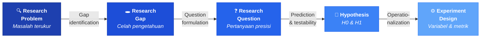
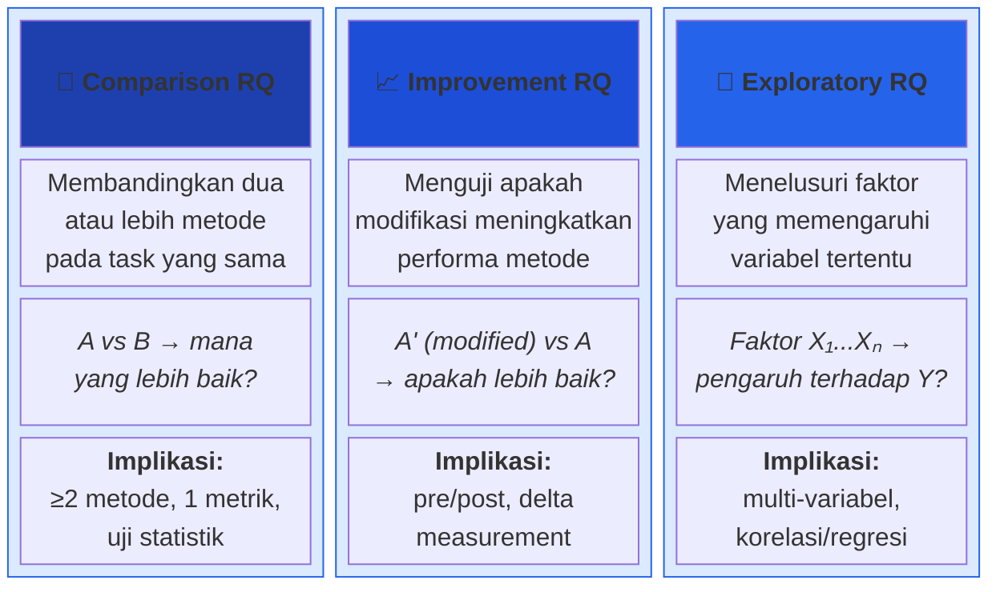
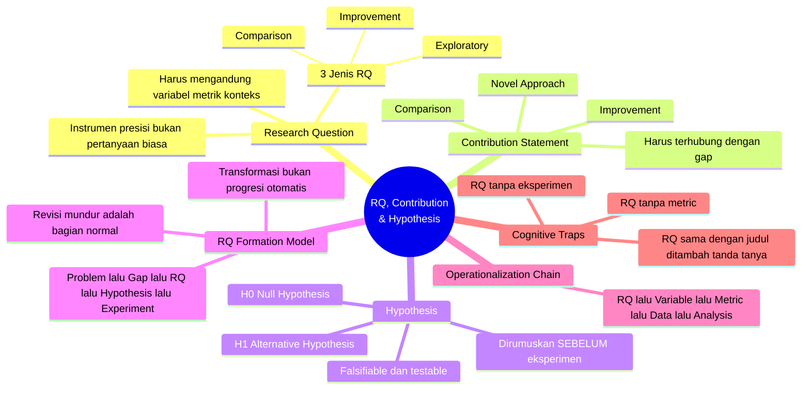

# Bab 4 — Research Question, Contribution & Hypothesis

> **Sub-CPMK:** Sub-CPMK 1.4 — Merumuskan Research Question, Contribution Statement, dan Hypothesis
> **CPMK:** CPMK01 — Problem Framing
> **CPL Utama:** CPL03 (Penalaran logis, kritis, sistematis)
> **CPL Pendukung:** CPL06 (Desain & pengembangan)
> **Fase:** Thinking (M1–M4)
> **Signature Model:** RQ Formation Model (Problem → Gap → RQ → Hypothesis → Experiment Design)

---

## Ringkasan Bab

Bab ini mengajarkan cara mentransformasi research gap menjadi research question yang tajam, mengartikulasikan kontribusi secara eksplisit, dan merumuskan hipotesis yang testable. Tiga komponen ini — RQ, contribution statement, dan hypothesis — membentuk kerangka yang menentukan seluruh desain eksperimen. Di akhir bab, pembaca mampu menyusun RQ yang spesifik, contribution statement yang jelas, serta pasangan H0/H1 yang siap diuji.

---

## 4.1 Pembuka

Bab 3 berakhir dengan sebuah posisi: gap sudah teridentifikasi, literatur sudah dipetakan, dan baseline sudah dipilih. Secara logis, langkah berikutnya adalah mengubah gap menjadi pertanyaan. Tapi pertanyaan seperti apa?

Bukan sembarang pertanyaan. Research question dalam riset eksperimental TI bukan pertanyaan filosofis, bukan pertanyaan deskriptif, dan — yang sering disalahpahami — bukan judul penelitian yang diakhiri tanda tanya. Research question adalah instrumen presisi yang menentukan apa yang akan diukur, bagaimana mengukurnya, dan apa kriteria keberhasilannya. Creswell dan Creswell (2018) mendefinisikan research question sebagai pertanyaan yang menyempitkan fokus penelitian ke dalam variabel-variabel spesifik yang dapat diselidiki secara empiris.

Sebuah analogi sederhana: research question seperti koordinat GPS. Tanpa koordinat, seseorang bisa berkendara ke "arah utara" dan berakhir di mana saja. Dengan koordinat yang tepat, tujuannya jelas, rute bisa direncanakan, dan keberhasilan bisa diverifikasi — apakah sudah sampai atau belum. RQ yang baik memberikan presisi yang sama terhadap eksperimen.

Selain RQ, dua komponen lain yang sama pentingnya: **contribution statement** dan **hypothesis**. Contribution statement menjelaskan apa yang akan diketahui dunia setelah riset selesai yang sebelumnya belum diketahui. Hypothesis menerjemahkan RQ menjadi prediksi yang bisa diuji secara statistik. Tanpa ketiganya, eksperimen tidak memiliki arah, justifikasi, maupun kriteria evaluasi.

Pertanyaan sentral bab ini: bagaimana merumuskan research question yang bukan sekadar pertanyaan, melainkan cetak biru eksperimen?

---

## 4.2 RQ Formation Model

Bab ini menggunakan satu signature model — **RQ Formation Model** — yang menggambarkan proses transformasi dari masalah dan gap menjadi desain eksperimen melalui perumusan RQ dan hipotesis.

**Gambar 4.1** — RQ Formation Model: Dari Problem ke Experiment Design



Model ini bekerja sebagai pipeline linear: setiap tahap membutuhkan output tahap sebelumnya. Problem yang sudah dirumuskan di Bab 2 menjadi input. Gap yang ditemukan di Bab 3 menyempitkan fokus. Research question mengubah gap menjadi pertanyaan yang actionable. Hypothesis menerjemahkan pertanyaan itu menjadi prediksi empiris. Dan experiment design — yang akan dibahas di bab-bab berikutnya — mengoperasionalisasi semuanya menjadi variabel, metrik, dan prosedur pengukuran.

Dua hal penting tentang model ini. Pertama, setiap panah menandakan transformasi, bukan sekadar progresi. Problem tidak otomatis menjadi RQ — ia harus *ditransformasi* melalui proses intelektual yang disengaja. Kedua, model ini bi-directional dalam praktiknya: RQ yang tidak bisa menghasilkan hipotesis testable adalah sinyal bahwa RQ perlu direvisi, dan hipotesis yang tidak bisa dioperasionalisasi menunjukkan bahwa RQ terlalu abstrak. Revisi mundur adalah bagian normal dari proses.

---

## 4.3 Definisi Kunci

**Research Question (RQ)**
: Pertanyaan spesifik yang menyempitkan fokus penelitian ke dalam variabel-variabel yang dapat diukur dan diuji secara empiris. RQ menentukan apa yang akan diamati, bagaimana mengamatinya, dan apa yang dianggap sebagai jawaban (Creswell & Creswell, 2018). RQ yang baik selalu mengandung setidaknya: subjek/objek penelitian, variabel yang diukur, dan konteks pengukuran.

**Contribution Statement**
: Pernyataan eksplisit tentang apa yang akan diketahui atau tersedia setelah riset selesai yang sebelumnya belum ada. Contribution bisa berupa: metode baru (novel approach), perbaikan metode existing (improvement), atau perbandingan sistematis yang memberikan kejelasan (comparison). Contribution harus terhubung langsung dengan gap yang diidentifikasi di Bab 3.

**Hypothesis**
: Prediksi tentang hubungan antar variabel yang dirumuskan sebelum eksperimen dilakukan dan diuji melalui data empiris. Terdiri dari H0 (null hypothesis) — prediksi bahwa tidak ada perbedaan atau pengaruh signifikan, dan H1 (alternative hypothesis) — prediksi bahwa perbedaan atau pengaruh signifikan ada. Hipotesis harus falsifiable: kondisi di mana hipotesis ditolak harus bisa didefinisikan sebelum eksperimen dimulai (Creswell, 2012).

---

## 4.4 Konsep Inti

### 4.4.1 RQ sebagai Instrumen, Bukan Pertanyaan Biasa

Banyak peneliti pemula memperlakukan research question sebagai formalitas — hal yang harus ada di proposal karena template mengharuskannya. Dalam praktiknya, RQ justru merupakan komponen paling kritis dari seluruh penelitian. RQ yang baik secara implisit sudah mengandung informasi tentang metode apa yang akan digunakan, data apa yang perlu dikumpulkan, dan analisis apa yang harus dilakukan.

Perhatikan perbedaan dua "pertanyaan" berikut:

**Pertanyaan A:** "Bagaimana pengaruh deep learning terhadap deteksi malware?"

**Pertanyaan B:** "Apakah model CNN menghasilkan F1-Score deteksi malware lebih tinggi dibandingkan Random Forest pada dataset CIC-MalMem-2022?"

Pertanyaan A terdengar seperti pertanyaan penelitian, tapi sebenarnya ia adalah topik yang disamarkan sebagai pertanyaan. "Pengaruh deep learning" — pengaruh apa? Diukur dengan apa? Dibandingkan dengan apa? Pada konteks apa? Tidak satupun yang bisa dijawab tanpa menyempitkan pertanyaan lebih jauh.

Pertanyaan B, sebaliknya, sudah mengandung cetak biru eksperimen:

- **Subjek**: model CNN
- **Baseline**: Random Forest
- **Metrik**: F1-Score
- **Domain**: deteksi malware
- **Dataset**: CIC-MalMem-2022

Dari pertanyaan ini, peneliti sudah tahu persis apa yang harus dilakukan: melatih dua model pada dataset yang sama, menghitung F1-Score masing-masing, dan membandingkan hasilnya. RQ yang baik berfungsi sebagai blueprint — ia memberi tahu apa yang harus dibangun dan bagaimana mengukur hasilnya.

### 4.4.2 Tiga Jenis Research Question

Tidak semua research question sama. Dalam konteks riset eksperimental TI, terdapat tiga jenis utama yang masing-masing memiliki implikasi berbeda terhadap desain eksperimen.

**Gambar 4.2** — Tiga Jenis Research Question dan Implikasi Eksperimennya



**Comparison RQ** membandingkan dua atau lebih pendekatan yang sudah ada pada task yang sama. Contoh: "Apakah BERT menghasilkan akurasi sentimen analisis lebih tinggi dibandingkan SVM pada dataset Twitter berbahasa Indonesia?" Jenis ini paling umum dalam riset TI dan memerlukan desain eksperimen dengan minimal dua kondisi, satu metrik utama, dan uji statistik untuk menentukan apakah perbedaannya signifikan.

**Improvement RQ** menguji apakah modifikasi terhadap metode yang sudah ada menghasilkan performa yang lebih baik. Contoh: "Apakah penambahan attention mechanism pada model LSTM meningkatkan akurasi prediksi harga saham dibandingkan LSTM standar?" Jenis ini memerlukan pengukuran sebelum dan sesudah modifikasi dengan metrik yang sama, serta demonstrasi bahwa peningkatan bukan kebetulan.

**Exploratory RQ** menelusuri hubungan antara beberapa variabel tanpa prediksi arah yang spesifik. Contoh: "Faktor apa saja yang memengaruhi waktu respons API pada arsitektur microservices?" Jenis ini lebih terbuka dan membutuhkan desain yang melibatkan pengukuran beberapa variabel serta analisis korelasi atau regresi. Dalam riset TI eksperimental, exploratory RQ biasanya digunakan pada tahap awal investigasi, dan hasilnya sering memunculkan comparison atau improvement RQ yang lebih spesifik.

Setiap jenis memiliki implikasi desain yang berbeda. Comparison membutuhkan baseline eksplisit. Improvement membutuhkan versi sebelum dan sesudah modifikasi. Exploratory membutuhkan identifikasi variabel yang komprehensif. Memilih jenis RQ yang salah untuk masalah yang dihadapi akan menghasilkan desain eksperimen yang tidak cocok.

### 4.4.3 Contribution: Apa yang Dunia Peroleh

Contribution statement menjawab pertanyaan yang sering dilupakan: setelah riset selesai, apa yang berubah? Apa yang sekarang diketahui yang sebelumnya tidak diketahui?

Terdapat tiga jenis contribution utama dalam riset TI:

1. **Improvement** — menghasilkan metode atau pendekatan yang terbukti lebih baik dari yang sudah ada pada metrik tertentu. Contoh: "Metode X-Modified terbukti meningkatkan F1-Score sebesar 12% dibandingkan metode X original pada dataset Y."

2. **Comparison** — memberikan perbandingan sistematis yang sebelumnya belum ada, sehingga komunitas ilmiah memiliki referensi untuk memilih metode yang tepat. Contoh: "Studi ini memberikan perbandingan komprehensif antara tiga metode deteksi anomali pada data IoT, yang sebelumnya belum dilakukan."

3. **Novel Approach** — memperkenalkan pendekatan yang benar-benar baru untuk menyelesaikan masalah yang sudah diketahui. Contoh: "Model hybrid CNN-GAN yang diajukan merupakan pendekatan pertama yang mengombinasikan data augmentation dengan deteksi untuk domain X."

Contribution harus terhubung langsung dengan gap. Jika gap di Bab 3 menyatakan "belum ada perbandingan metode A dan B pada konteks C," maka contribution harus berupa perbandingan tersebut. Kontribusi yang tidak mengisi gap yang sudah diidentifikasi menandakan adanya disconnect dalam alur logis penelitian.

### 4.4.4 Hipotesis: Prediksi yang Harus Dinyatakan Sebelum Eksperimen

Hipotesis sering disamakan dengan "tebakan terdidik." Meski tidak sepenuhnya salah, definisi ini meremehkan fungsi sesungguhnya. Hipotesis adalah komitmen intelektual — pernyataan yang dibuat *sebelum* eksperimen tentang apa yang diharapkan terjadi, beserta kondisi di mana harapan itu dinyatakan salah.

Dalam riset kuantitatif, hipotesis selalu dipasangkan:

- **H0 (Null Hypothesis)**: Tidak ada perbedaan signifikan antara kondisi yang dibandingkan. H0 adalah asumsi default — yang harus dibuktikan salah, bukan dibuktikan benar.
- **H1 (Alternative Hypothesis)**: Ada perbedaan signifikan. H1 adalah apa yang peneliti harapkan, tetapi hanya bisa diterima jika H0 berhasil ditolak melalui data.

Contoh untuk comparison RQ sebelumnya:

> **H0:** Tidak terdapat perbedaan signifikan pada F1-Score antara model CNN dan Random Forest untuk deteksi malware pada dataset CIC-MalMem-2022.
>
> **H1:** Model CNN menghasilkan F1-Score yang signifikan lebih tinggi dibandingkan Random Forest untuk deteksi malware pada dataset CIC-MalMem-2022.

Yang membuat hipotesis bernilai ilmiah bukan kebenaran prediksinya, melainkan *falsifiability*-nya. Hipotesis yang tidak bisa dibuktikan salah — "sistem ini akan bermanfaat" — bukanlah hipotesis ilmiah. Hipotesis harus menyertakan metrik yang terukur, ambang batas statistik, dan kondisi eksperimen yang cukup spesifik sehingga data bisa menolak atau gagal menolaknya.

Creswell (2012) menekankan bahwa hipotesis harus dirumuskan sebelum pengumpulan data. Hipotesis yang dibuat setelah melihat hasil (post-hoc hypothesis) rentan terhadap *HARKing* (Hypothesizing After Results are Known) — praktik yang merusak integritas ilmiah karena menciptakan ilusi konfirmasi.

### 4.4.5 Rantai Operasionalisasi: RQ → Variable → Metric → Data → Analysis

Research question, contribution, dan hypothesis tidak berdiri sendiri. Ketiganya terhubung dalam rantai operasionalisasi yang mengubah konsep abstrak menjadi prosedur terukur:

| Tahap | Contoh |
|-------|--------|
| **RQ** | Apakah CNN lebih akurat dari RF untuk deteksi malware? |
| **Variable** | Independent: jenis model (CNN, RF). Dependent: akurasi deteksi |
| **Metric** | F1-Score |
| **Data** | CIC-MalMem-2022 (10.000 sampel, 4 kelas malware) |
| **Analysis** | Independent sample t-test (α = 0.05) |

Setiap baris tabel di atas adalah turunan langsung dari baris sebelumnya. RQ menentukan variabel. Variabel menentukan metrik (bagaimana variabel diukur). Metrik menentukan data apa yang diperlukan. Dan data menentukan analisis apa yang cocok. Rantai ini akan dibahas lebih detail di Bab 5 (Metric & Measurement), tetapi penting dipahami sejak sekarang bahwa RQ yang tidak bisa menghasilkan rantai ini secara lengkap adalah RQ yang belum mature.

---

## 4.5 Research vs Engineering

**Tabel 4.1** — Pertanyaan dalam Research vs Engineering

| Aspek | Engineering | Research |
|-------|------------|----------|
| **Tujuan pertanyaan** | Apa yang harus dibangun? | Apa yang harus dibuktikan? |
| **Bentuk jawaban** | Sistem yang berfungsi | Bukti empiris yang terukur |
| **Sukses diukur oleh** | User satisfaction, uptime, SLA | Signifikansi statistik, effect size |
| **Baseline** | Requirement specification | Metode terbaik saat ini (SOTA) |
| **Jika gagal** | Debug dan perbaiki | Laporkan, analisis mengapa, revisi hipotesis |

Seorang engineer bertanya "Bagaimana cara membuat sistem rekomendasi yang akurat?" dan jawabannya adalah kode yang berjalan. Seorang peneliti bertanya "Apakah collaborative filtering menghasilkan rekomendasi yang lebih relevan daripada content-based filtering pada dataset MovieLens?" dan jawabannya adalah data perbandingan yang dianalisis secara statistik. Keduanya membangun sistem, tetapi untuk tujuan yang berbeda. Sistem engineer adalah produk. Sistem peneliti adalah alat uji.

---

## 4.6 Research Reality

### Fenomena 1 — Judul Penelitian sebagai "Research Question"

Salah satu pola paling umum di lingkungan akademik: peneliti pemula mengubah judul penelitian menjadi pertanyaan, lalu menyebutnya research question. "Implementasi Metode K-Means untuk Segmentasi Pelanggan" menjadi "Bagaimana implementasi metode K-Means untuk segmentasi pelanggan?" Secara sintaksis, ini memang pertanyaan. Secara ilmiah, ini bukan research question — ini deskripsi pekerjaan. Tidak ada variabel yang dibandingkan, tidak ada metrik yang ditargetkan, tidak ada hipotesis yang bisa ditolak.

### Fenomena 2 — Hipotesis yang Tidak Bisa Salah

Fenomena kedua yang sama seringnya: hipotesis yang dirumuskan sedemikian rupa sehingga tidak mungkin ditolak. "Sistem ini bermanfaat bagi pengguna." Bermanfaat bagaimana? Diukur dengan apa? Dibandingkan dengan kondisi tanpa sistem? Jika pengguna mengatakan "ya, bermanfaat" pada kuesioner, apakah itu cukup? Hipotesis semacam ini tidak testable — ia adalah harapan yang dibungkus bahasa formal. Riset yang berbasis pada hipotesis tak-testable menghasilkan kesimpulan yang tidak bisa dipercaya maupun direplikasi.

### Fenomena 3 — Contribution yang Mengambang

Fenomena ini lebih halus: riset mengklaim kontribusi berupa "metode baru," tetapi tidak pernah mendefinisikan gap secara eksplisit. Jika gap tidak didefinisikan, maka kontribusi tidak punya akar — ia mengambang tanpa justifikasi. Pertanyaan kritis untuk setiap contribution statement: kontribusi ini mengisi gap apa, tepatnya?

---

## 4.7 Cognitive Traps

**Trap 1: "RQ = Judul dalam Bentuk Tanya"**

Mengubah judul menjadi kalimat tanya bukan memformulasi research question. "Penerapan Metode X untuk Y" diubah menjadi "Bagaimana penerapan metode X untuk Y?" tidak menambah nilai ilmiah apapun. RQ yang valid harus mengandung variabel yang terukur, metrik yang jelas, dan secara implisit menunjukkan desain eksperimen yang diperlukan untuk menjawabnya. Jika sebuah pertanyaan bisa dijawab dengan "baik" atau "berhasil" tanpa data kuantitatif, itu bukan RQ — itu topik.

**Trap 2: "RQ Tidak Perlu Metric"**

"Apakah metode A lebih baik dari metode B?" — lebih baik dalam hal apa? Lebih cepat? Lebih akurat? Lebih hemat memori? RQ tanpa metrik adalah pertanyaan yang tidak bisa dijawab secara definitif karena tidak ada kriteria untuk menentukan jawaban. Setiap RQ harus mengandung atau paling tidak mengimplikasikan metric yang spesifik. "Lebih baik" harus didefinisikan: lebih baik menurut F1-Score, menurut latency, menurut throughput — bukan dibiarkan ambigu.

**Trap 3: "RQ Bisa Dijawab Tanpa Eksperimen"**

Jika sebuah pertanyaan bisa dijawab hanya dengan membaca literatur atau argumentasi logis, ia bukan research question untuk riset eksperimental. "Apa saja jenis metode machine learning untuk NLP?" bisa dijawab dengan survey. "Metode mana yang paling efektif untuk sentimen analisis teks pendek?" membutuhkan eksperimen. Dalam konteks mata kuliah Riset TI, setiap RQ harus memerlukan eksperimen untuk menjawabnya — jika tidak, pertanyaan itu lebih cocok untuk mata kuliah lain.

---

## 4.8 Studi Kasus

### Studi Kasus Basic — RQ Terlalu Umum

**Konteks:** Seorang peneliti meneliti penggunaan machine learning untuk mendeteksi email spam.

**Versi Awal (Bermasalah):**

- RQ: "Bagaimana machine learning dapat mendeteksi email spam?"
- Contribution: "Menerapkan machine learning untuk deteksi email spam."
- Hypothesis: "Machine learning dapat mendeteksi spam."

**Analisis masalah:**

RQ ini tidak actionable. "Machine learning" terlalu luas — algoritma mana? "Mendeteksi" — diukur dengan apa? Tidak ada baseline, tidak ada dataset spesifik, tidak ada metrik. Contribution-nya bukan kontribusi — spam detection dengan ML sudah ada ribuan studi. Hipotesisnya tidak testable — apa kondisi untuk menolak H0 dalam konteks ini?

**Versi Revisi:**

- RQ: "Apakah model Naive Bayes menghasilkan precision deteksi email spam yang lebih tinggi dibandingkan rule-based filtering pada dataset Enron Email?"
- Contribution: "Perbandingan kuantitatif antara pendekatan probabilistik (Naive Bayes) dan rule-based filtering untuk spam detection pada dataset email korporat, yang belum tersedia dalam literatur saat ini."
- H0: "Tidak terdapat perbedaan signifikan pada precision antara Naive Bayes dan rule-based filtering pada dataset Enron Email."
- H1: "Naive Bayes menghasilkan precision yang signifikan lebih tinggi dibandingkan rule-based filtering pada dataset Enron Email."

**Tabel 4.2** — Perbandingan Versi Awal dan Revisi

| Komponen | Versi Awal | Versi Revisi |
|----------|-----------|--------------|
| **Spesifisitas** | "Machine learning" (terlalu luas) | "Naive Bayes" (spesifik) |
| **Metric** | Tidak ada | Precision |
| **Baseline** | Tidak ada | Rule-based filtering |
| **Dataset** | Tidak ada | Enron Email |
| **Testability** | Tidak testable | Bisa diuji dengan t-test |

### Studi Kasus Advanced — RQ Tanpa Baseline

**Konteks:** Seorang peneliti mengajukan model hybrid CNN-LSTM untuk prediksi trafik jaringan.

**Versi Awal (Bermasalah):**

- RQ: "Apakah model CNN-LSTM efektif untuk memprediksi trafik jaringan?"
- Contribution: "Mengajukan model CNN-LSTM untuk prediksi trafik."
- H0: "Model CNN-LSTM tidak efektif untuk prediksi trafik jaringan."
- H1: "Model CNN-LSTM efektif untuk prediksi trafik jaringan."

**Analisis masalah:**

RQ ini memiliki model spesifik (CNN-LSTM), tetapi tidak memiliki baseline. "Efektif" relatif terhadap apa? Tanpa pembanding, klaim efektivitas tidak bermakna secara ilmiah. Contribution-nya juga bermasalah: mengajukan model bukan kontribusi jika tidak jelas apa yang membuatnya lebih baik dari pendekatan existing. Dan hipotesisnya — "efektif" atau "tidak efektif" — tidak bisa diuji secara statistik karena tidak ada metrik kuantitatif.

**Versi Revisi:**

- RQ: "Apakah model hybrid CNN-LSTM menghasilkan RMSE prediksi trafik jaringan yang lebih rendah dibandingkan LSTM standar dan ARIMA pada dataset Abilene Network 2019–2023?"
- Contribution: "Evaluasi komparatif model hybrid CNN-LSTM terhadap dua baseline established (LSTM dan ARIMA) menggunakan data trafik jaringan nyata, dengan fokus pada akurasi prediksi jangka pendek (1–24 jam)."
- H0: "Tidak terdapat perbedaan signifikan pada RMSE antara model CNN-LSTM, LSTM standar, dan ARIMA untuk prediksi trafik jaringan pada dataset Abilene Network."
- H1: "Model CNN-LSTM menghasilkan RMSE yang signifikan lebih rendah dibandingkan LSTM standar dan ARIMA untuk prediksi trafik jaringan pada dataset Abilene Network."

**Tabel 4.3** — Analisis Revisi

| Perbaikan | Penjelasan |
|-----------|-----------|
| **Baseline ditambahkan** | LSTM standar + ARIMA — dua metode established |
| **Metrik dispesifikasi** | RMSE, bukan "efektivitas" |
| **Dataset konkret** | Abilene Network 2019–2023 |
| **Contribution terhubung gap** | Evaluasi komparatif yang sebelumnya belum ada |
| **H0/H1 testable** | Falsifiable melalui statistical test |

Perbedaan antara kedua versi bukan kosmetik. Versi awal mengarah pada eksperimen yang hasilnya sulit diinterpretasi. Versi revisi menghasilkan eksperimen yang jelas: latih tiga model, hitung RMSE masing-masing, bandingkan secara statistik. Hasilnya bisa positif (CNN-LSTM lebih baik), negatif (tidak lebih baik), atau mixed — dan semua hasil tersebut bermakna ilmiah.

---

## 4.9 Template Praktis

> **Template RQ-Contribution-Hypothesis**
>
> ```
> ═══════════════════════════════════════════════════
>         RQ-CONTRIBUTION-HYPOTHESIS TEMPLATE
> ═══════════════════════════════════════════════════
>
> 1. RESEARCH QUESTION
>    Jenis RQ   : [Comparison / Improvement / Exploratory]
>    Formulasi  : [Tulis RQ lengkap di sini]
>
>    Checklist:
>    [ ] Mengandung variabel spesifik?
>    [ ] Menyebutkan metrik?
>    [ ] Memiliki baseline/pembanding?
>    [ ] Menyebutkan dataset/konteks?
>    [ ] Memerlukan eksperimen untuk menjawab?
>
> 2. CONTRIBUTION STATEMENT
>    Jenis      : [Improvement / Comparison / Novel Approach]
>    Statement  : [Apa yang akan diketahui setelah riset
>                  selesai yang sebelumnya belum diketahui?]
>    Gap link   : [Gap mana dari Bab 3 yang diisi?]
>
> 3. HYPOTHESIS
>    H0         : [Null hypothesis — tidak ada perbedaan
>                  signifikan...]
>    H1         : [Alternative hypothesis — terdapat
>                  perbedaan signifikan...]
>    Metric     : [Metrik yang digunakan untuk uji]
>    Threshold  : [Significance level, e.g., α = 0.05]
>
> 4. OPERATIONALIZATION CHAIN
>    RQ         → [...]
>    Variable   → Independent: [...], Dependent: [...]
>    Metric     → [...]
>    Data       → [...]
>    Analysis   → [...]
>
> ═══════════════════════════════════════════════════
> Checklist:
> [ ] RQ terhubung dengan gap di Bab 3?
> [ ] Contribution mengisi gap yang diidentifikasi?
> [ ] H0 bisa ditolak (falsifiable)?
> [ ] H1 spesifik dan terukur?
> [ ] Rantai operasionalisasi lengkap sampai analysis?
> ```

---

## 4.10 Mindmap Bab 4

**Gambar 4.3** — Mindmap: Research Question, Contribution & Hypothesis



---

## 4.11 Rangkuman

1. **Research question** bukan sekadar pertanyaan — ia adalah instrumen yang menentukan variabel, metrik, data, dan analisis yang diperlukan. RQ yang tidak mengandung komponen-komponen ini belum cukup mature untuk memulai eksperimen.
2. Terdapat **tiga jenis RQ** dalam riset eksperimental TI: comparison (membandingkan metode), improvement (menguji modifikasi), dan exploratory (menelusuri faktor). Masing-masing memiliki implikasi desain eksperimen yang berbeda.
3. **Contribution statement** mengartikulasikan apa yang dunia peroleh dari riset. Contribution harus terhubung langsung dengan gap — kontribusi tanpa gap adalah klaim tanpa justifikasi.
4. **Hypothesis** adalah prediksi yang dibuat sebelum eksperimen. H0 (null) menyatakan tidak ada perbedaan signifikan; H1 (alternative) menyatakan ada. Hipotesis harus falsifiable.
5. **RQ Formation Model** menggambarkan pipeline: Problem → Gap → RQ → Hypothesis → Experiment Design. Model ini bi-directional — RQ yang tidak bisa menghasilkan hipotesis testable harus direvisi.
6. **Rantai operasionalisasi** (RQ → Variable → Metric → Data → Analysis) adalah alat uji kematangan RQ. Jika rantai ini tidak bisa dilengkapi, RQ perlu disempurnakan.

---

## 4.12 Latihan & Refleksi

### Latihan 1 — Dari Gap ke RQ

Ambil gap statement yang dihasilkan dari latihan Bab 3. Transformasikan menjadi research question yang memenuhi lima kriteria: variabel spesifik, metrik jelas, baseline ada, dataset/konteks disebutkan, dan memerlukan eksperimen. Tentukan jenis RQ-nya (comparison, improvement, atau exploratory).

### Latihan 2 — Contribution Statement

Untuk RQ yang dirumuskan di Latihan 1, tulis contribution statement yang menjelaskan: (a) apa yang akan diketahui setelah riset selesai, (b) jenis contribution (improvement, comparison, novel approach), dan (c) gap spesifik mana yang diisi oleh kontribusi ini.

### Latihan 3 — Hypothesis Pair

Rumuskan pasangan H0 dan H1 untuk RQ di atas. Pastikan: (a) H0 menyatakan tidak ada perbedaan signifikan, (b) H1 menyatakan ada perbedaan signifikan, (c) metrik pengujian disebut eksplisit, dan (d) kondisi di mana H0 ditolak bisa didefinisikan dengan jelas.

### Refleksi

> "Apakah research question yang selama ini saya rumuskan benar-benar bisa dijawab melalui eksperimen? Atau ia hanya topik yang disamarkan sebagai pertanyaan?"

---

Bagian 1 (Foundation of Research Thinking) berakhir di sini. Empat bab telah membangun fondasi lengkap: cara berpikir sebagai peneliti (Bab 1), merumuskan masalah yang terukur (Bab 2), menemukan posisi dalam lanskap ilmiah (Bab 3), dan mentransformasi gap menjadi pertanyaan, kontribusi, dan hipotesis yang siap diuji (Bab 4). Bagian 2 melangkah ke tahap selanjutnya: menerjemahkan RQ dan hipotesis menjadi desain eksperimen yang konkret, dimulai dari metrik dan pengukuran di Bab 5.

> *"Research Question bukan sekadar pertanyaan, tetapi blueprint dari eksperimen yang akan dilakukan."*

---

## Daftar Pustaka

- Creswell, J. W., & Creswell, J. D. (2018). *Research Design: Qualitative, Quantitative, and Mixed Methods Approaches* (5th ed.). SAGE Publications.
- Creswell, J. W. (2012). *Educational Research: Planning, Conducting, and Evaluating Quantitative and Qualitative Research* (4th ed.). Pearson.
- Wohlin, C., Runeson, P., Höst, M., Ohlsson, M. C., Regnell, B., & Wesslén, A. (2012). *Experimentation in Software Engineering*. Springer.
- Shadish, W. R., Cook, T. D., & Campbell, D. T. (2002). *Experimental and Quasi-Experimental Designs for Generalized Causal Inference*. Houghton Mifflin.

<!-- STATUS: 🟢 Draft Complete -->
