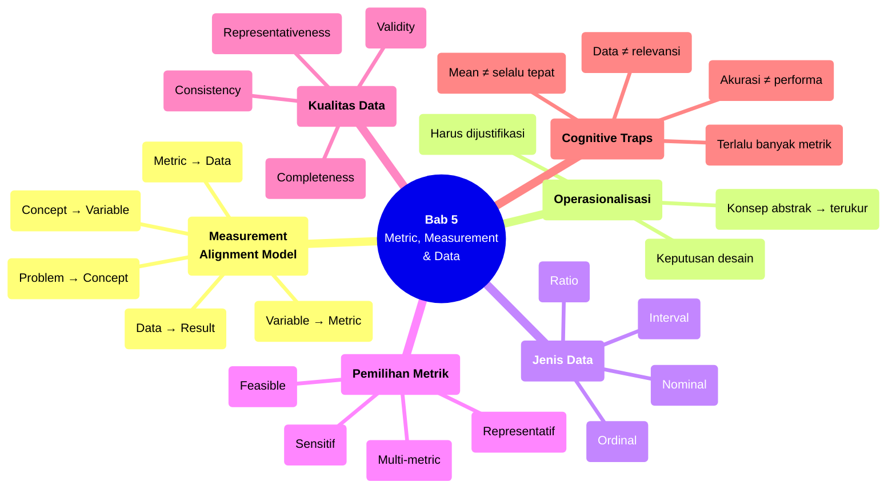

# Bab 5 — Metric, Measurement & Data

> **Sub-CPMK:** 2.1 — Mendefinisikan metrik yang valid dan representatif
> **CPMK:** CPMK02 — Measurement & Design
> **CPL Utama:** CPL06 (Desain & pengembangan)
> **Fase:** Designing (M5–M7)
> **Signature Model:** Measurement Alignment Model (Problem → Concept → Variable → Metric → Data → Result)

---

## Ringkasan Bab

Bab ini membahas bagaimana menerjemahkan konsep abstrak menjadi angka yang bisa diukur, dibandingkan, dan diuji. Proses ini — yang dalam literatur disebut *operationalization* — adalah jembatan antara teori dan eksperimen. Tanpa metrik yang valid, research question sebagus apa pun tidak akan menghasilkan jawaban yang bermakna. Kita akan belajar memilih metrik yang tepat, memahami jenis data, menilai kualitas data, dan menghindari jebakan pengukuran yang sering tidak disadari hingga tahap analisis.

---

## 5.1 Pembuka

Bab 4 berakhir dengan sebuah produk: research question yang tajam, contribution statement yang eksplisit, dan pasangan hipotesis H0/H1 yang siap diuji. Secara konseptual, arahnya sudah jelas. Tapi ada satu pertanyaan krusial yang belum terjawab: **apa yang sebenarnya akan diukur?**

Pertanyaan ini terdengar sederhana, padahal justru di sinilah banyak eksperimen mulai goyah. Seorang peneliti menulis hipotesis "sistem yang diusulkan memiliki performa lebih baik dibanding baseline." Performa diukur dari apa? Akurasi? Precision? F1-score? Waktu respons? Dan jika dipilih akurasi — akurasi terhadap apa? Apakah distribusi datanya seimbang? Jika tidak, apakah akurasi masih representatif?

Dalam riset TI dan software engineering, metrik bukan sekadar angka yang dilaporkan di akhir eksperimen. Metrik adalah *kontrak* antara peneliti dan pembaca: ia mendefinisikan apa yang dimaksud "berhasil" dan apa yang dimaksud "gagal." Wohlin et al. (2012) menjelaskan bahwa pemilihan metrik harus dilakukan sebelum eksperimen berjalan — bukan setelah melihat data dan memilih metrik yang kebetulan menghasilkan angka bagus.

Metrik juga bukan entitas yang berdiri sendiri. Setiap metrik harus bisa ditelusuri balik ke variabel, variabel ke konsep, dan konsep ke masalah riset. Jika rantai ini terputus, eksperimen kehilangan *construct validity* — mengukur sesuatu, tapi bukan yang seharusnya diukur. Field (2018) menyebut fenomena ini sebagai salah satu risiko terbesar dalam pengukuran: ketidaksesuaian antara apa yang *ingin* diukur dan apa yang *sebenarnya* diukur.

Bab ini membuka Bagian 2 (Measurement & Design) dengan pertanyaan sentral: **Bagaimana memastikan bahwa apa yang kita ukur benar-benar merepresentasikan apa yang ingin kita ketahui?**

---

## 5.2 Measurement Alignment Model

Inti dari bab ini terangkum dalam satu model: setiap pengukuran yang valid harus bisa ditelusuri dari masalah riset sampai ke hasil akhir tanpa "lompatan logis" di tengah jalan.

**Gambar 5.1** — Measurement Alignment Model: Dari Problem ke Result


Setiap transisi dalam model ini memiliki fungsi spesifik:

1. **Problem → Concept (Abstraksi).** Masalah riset diekstrak menjadi konsep yang akan diselidiki. Contoh: jika masalahnya "pengguna meninggalkan aplikasi setelah 3 hari," konsepnya mungkin *user retention* atau *user engagement*. Satu masalah bisa mengandung lebih dari satu konsep.

2. **Concept → Variable (Operasionalisasi).** Konsep abstrak diterjemahkan menjadi variabel yang bisa diobservasi. *User engagement* bisa dioperasionalisasikan menjadi "jumlah sesi per minggu," "durasi rata-rata sesi," atau "jumlah fitur yang digunakan per sesi." Langkah ini adalah titik paling kritis — karena di sinilah peneliti membuat keputusan tentang *apa yang mewakili apa*.

3. **Variable → Metric (Kuantifikasi).** Variabel diberi satuan pengukuran yang spesifik. "Jumlah sesi per minggu" diukur sebagai bilangan bulat. "Durasi rata-rata sesi" diukur dalam menit. "Waktu respons" diukur dalam milidetik. Tanpa metrik yang jelas, variabel hanya label tanpa substansi.

4. **Metric → Data (Pengumpulan).** Metrik diaplikasikan pada subjek/objek eksperimen untuk menghasilkan data aktual. Di tahap ini, kualitas data menjadi penentu: apakah datanya lengkap, konsisten, dan representatif?

5. **Data → Result (Analisis).** Data diproses melalui uji statistik untuk menghasilkan temuan yang menjawab research question. Temuan ini baru bermakna jika seluruh rantai sebelumnya valid.

Jika rantai ini putus di mana saja — misalnya metrik tidak merepresentasikan variabel, atau variabel tidak merepresentasikan konsep — maka hasilnya cacat secara fundamental, meskipun angkanya terlihat meyakinkan.

Wohlin et al. (2012) menyebut prinsip ini sebagai *measurement validity*: sejauh mana instrumen pengukuran benar-benar mengukur apa yang dimaksudkan untuk diukur. Bukan soal angkanya besar atau kecil, tapi soal apakah angkanya *relevan*.

---

## 5.3 Definisi Kunci

**Operasionalisasi (*Operationalization*)**
: Proses mentransformasi konsep abstrak menjadi variabel yang dapat diobservasi dan diukur secara empiris. Operasionalisasi adalah jembatan antara dunia teori dan dunia data (Wohlin et al., 2012).

**Metrik (*Metric*)**
: Satuan pengukuran kuantitatif yang digunakan untuk mengevaluasi variabel tertentu. Metrik harus spesifik (apa yang diukur), reprodusibel (bisa diulang dengan hasil serupa), dan relevan (terkait langsung dengan research question).

**Construct Validity**
: Sejauh mana pengukuran benar-benar mengukur konsep yang dimaksudkan untuk diukur. Pelanggaran construct validity terjadi ketika metrik yang dipilih tidak merepresentasikan konsep yang diteliti (Shadish et al., 2002).

**Skala Pengukuran (*Measurement Scale*)**
: Klasifikasi jenis data berdasarkan sifat matematisnya: nominal (kategori tanpa urutan), ordinal (kategori dengan urutan), interval (jarak bermakna tanpa nol absolut), dan ratio (jarak bermakna dengan nol absolut). Jenis skala menentukan analisis statistik yang valid (Field, 2018).

---

## 5.4 Konsep Inti

### 5.4.1 Dari Konsep ke Metrik: Operasionalisasi sebagai Keputusan Desain

Operasionalisasi bukan proses mekanis — ia adalah keputusan desain yang memiliki konsekuensi besar terhadap seluruh eksperimen. Ketika seorang peneliti memutuskan bahwa "kualitas kode" akan diukur melalui "jumlah code smell yang terdeteksi oleh SonarQube," keputusan itu mengandung asumsi implisit: bahwa code smell yang dideteksi oleh tool tertentu merepresentasikan kualitas kode secara keseluruhan.

Apakah asumsi itu benar? Belum tentu. Code smell yang terdeteksi SonarQube mungkin tidak mencakup masalah arsitektural. Tool yang berbeda mungkin mendeteksi code smell yang berbeda. Dan "kualitas kode" sendiri sebagai konsep bisa mencakup readability, maintainability, performance, atau security — masing-masing membutuhkan metrik yang berbeda.

Inilah mengapa operasionalisasi harus didokumentasikan secara eksplisit dan dijustifikasi. Pembaca harus bisa memahami:
- Konsep apa yang dioperasionalisasikan?
- Mengapa variabel ini dipilih untuk merepresentasikan konsep tersebut?
- Apa keterbatasan representasi ini?
- Apakah ada variabel alternatif yang dipertimbangkan?

Dokumentasi ini bukan formalitas — ia adalah bagian dari *research transparency*. Tanpa justifikasi operasionalisasi, reviewer tidak bisa menilai apakah temuan eksperimen benar-benar menjawab research question atau hanya menjawab pertanyaan yang berbeda dari yang dimaksud.

### 5.4.2 Empat Jenis Data: Nominal, Ordinal, Interval, Ratio

Tidak semua data diciptakan sama. Jenis data menentukan operasi matematika apa yang valid dilakukan dan uji statistik apa yang bisa digunakan. Field (2018) mengklasifikasikan data ke dalam empat skala:

**Nominal** — Data berupa kategori tanpa urutan. Contoh: jenis browser (Chrome, Firefox, Safari), bahasa pemrograman (Python, Java, Go), genre aplikasi (e-commerce, healthcare, fintech). Operasi yang valid: frekuensi, modus, Chi-square test. Menghitung rata-rata jenis browser tidak bermakna.

**Ordinal** — Data berupa kategori dengan urutan, tapi jarak antar kategori tidak seragam. Contoh: skala Likert (sangat tidak setuju → sangat setuju), tingkat severity bug (low, medium, high, critical). Operasi yang valid: median, percentile, Mann-Whitney U test. Meskipun bisa dikodekan 1-2-3-4-5, perbedaan antara "setuju" dan "sangat setuju" belum tentu sama dengan perbedaan antara "netral" dan "setuju."

**Interval** — Data numerik dengan jarak yang bermakna, tapi tidak memiliki nol absolut. Contoh: temperatur dalam Celsius, skor IQ, tahun kalender. Operasi yang valid: rata-rata, standar deviasi, t-test. Nol derajat Celsius bukan berarti "tidak ada temperatur."

**Ratio** — Data numerik dengan jarak bermakna dan nol absolut. Contoh: waktu respons (ms), throughput (request/detik), jumlah bug, akurasi (%). Operasi yang valid: semua operasi aritmetika, termasuk rasio. Nol milidetik berarti tidak ada waktu respons.

Dalam riset TI, sebagian besar metrik performa berada di skala ratio — waktu eksekusi, akurasi, jumlah error, throughput. Tapi metrik yang melibatkan persepsi pengguna (usability, satisfaction) biasanya berada di skala ordinal. Kesalahan paling umum: memperlakukan data ordinal seolah-olah interval, lalu menghitung rata-rata skala Likert dan menggunakan t-test. Secara teknis, operasi ini tidak valid — meskipun dalam praktek banyak peneliti melakukannya dengan justifikasi tertentu (panjang skala ≥ 5, distribusi mendekati normal). Perbedaan ini penting karena menentukan keabsahan analisis statistik di tahap selanjutnya.

### 5.4.3 Memilih Metrik: Representatif, Sensitif, dan Feasible

Tidak ada metrik yang sempurna. Setiap metrik memiliki kelebihan dan keterbatasan. Yang penting adalah memilih metrik yang paling sesuai dengan research question — bukan metrik yang paling mudah dikumpulkan atau paling sering digunakan di literatur.

Tiga kriteria pemilihan metrik:

**Representatif** — Metrik harus merepresentasikan konsep yang diteliti. Jika research question tentang "efektivitas deteksi malware," maka detection rate lebih representatif daripada waktu eksekusi. Waktu eksekusi mungkin penting, tapi ia mengukur efisiensi — bukan efektivitas.

**Sensitif** — Metrik harus mampu menangkap perbedaan yang bermakna. Jika dua algoritma menghasilkan akurasi 99.1% vs 99.3%, apakah perbedaan itu signifikan? Tergantung dataset dan konteks. Metrik yang "ceiling effect" — sudah mendekati batas maksimal — kehilangan kemampuan untuk membedakan performa. Dalam kasus ini, metrik lain mungkin lebih sensitif (misalnya F1-score pada kelas minoritas).

**Feasible** — Metrik harus bisa dikumpulkan dalam batasan waktu, biaya, dan akses yang tersedia. Mengukur "kepuasan pengguna jangka panjang" mungkin ideal secara konseptual, tapi jika waktu riset hanya 4 bulan, survei longitudinal tidak feasible. Metrik alternatif yang bisa dikumpulkan dalam waktu terbatas harus dipilih, dengan keterbatasan ini dinyatakan secara eksplisit.

Wohlin et al. (2012) merekomendasikan penggunaan **multiple metrics** untuk setiap konsep yang diukur. Satu metrik tunggal jarang cukup untuk merepresentasikan konsep yang kompleks. Sistem rekomendasi, misalnya, sebaiknya tidak hanya diukur dari akurasi — tambahkan diversity, novelty, atau coverage untuk gambaran yang lebih lengkap.

### 5.4.4 Kualitas Data: Empat Dimensi yang Harus Dipenuhi

Data yang sudah dikumpulkan belum tentu layak dianalisis. Sebelum masuk ke tahap statistik, data harus melewati empat pemeriksaan kualitas:

**Completeness** — Apakah semua data point yang direncanakan berhasil dikumpulkan? Missing data adalah masalah serius yang bisa mengubah hasil analisis. Jika dari 100 responden hanya 60 yang mengisi lengkap, 40% data hilang — dan cara menangani missing data (deletion, imputation, atau analisis terpisah) mempengaruhi kesimpulan.

**Consistency** — Apakah data bebas dari kontradiksi internal? Contoh: seorang responden menjawab "sangat puas" pada survei kepuasan tetapi memberikan skor 1/10 pada pertanyaan rating. Atau log eksperimen mencatat waktu respons negatif. Inconsistency bisa disebabkan human error, bug pada instrumen, atau noise.

**Validity** — Apakah data benar-benar mengukur apa yang dimaksudkan? Ini berbeda dari completeness dan consistency: data bisa lengkap dan konsisten, tapi tidak valid. Contoh: mengukur "kemampuan coding" menggunakan jumlah baris kode yang ditulis. Data ini bisa lengkap dan konsisten, tapi jumlah baris kode bukan indikator valid untuk kemampuan coding.

**Representativeness** — Apakah data merepresentasikan populasi yang dituju? Jika eksperimen tentang "pengguna aplikasi mobile" tetapi seluruh partisipan dari satu departemen di satu universitas, datanya tidak representatif terhadap populasi umum. Ini mempengaruhi *external validity* — sejauh mana temuan bisa digeneralisasi.

Keempat dimensi ini bukan checklist opsional. Data yang gagal di satu dimensi saja bisa menginvalidasi seluruh eksperimen. Lebih baik mengulang pengumpulan data daripada menganalisis data yang cacat — karena analisis statistik yang canggih sekalipun tidak bisa memperbaiki data yang fundamentalnya bermasalah.

---

## 5.5 Research vs Engineering

**Tabel 5.1** — Perspektif Metrik: Engineering vs Research

| Aspek | Engineering | Research |
|-------|------------|----------|
| **Tujuan pengukuran** | Monitoring performa sistem di production | Menguji hipotesis dan menjawab research question |
| **Pemilihan metrik** | Berdasarkan kebiasaan industri atau tool yang tersedia | Berdasarkan construct validity dan representasi konsep |
| **Jumlah metrik** | Semakin banyak dashboard, semakin baik | Dipilih secara selektif, setiap metrik harus dijustifikasi |
| **Penanganan anomali** | Dihapus atau di-filter agar laporan bersih | Diinvestigasi — anomali bisa mengandung temuan penting |
| **Baseline** | Versi sebelumnya (rilis terakhir) | Metode/algoritma dari literatur yang sudah divalidasi |
| **Kapan metrik dipilih** | Setelah sistem jadi (monitoring) | Sebelum eksperimen berjalan (desain) |

Perbedaan paling kritis ada di kolom terakhir. Dalam engineering, metrik sering ditambahkan setelah sistem berjalan — sebagai alat monitoring. Dalam riset, metrik *harus* didefinisikan sebelum data dikumpulkan. Memilih metrik setelah melihat data adalah salah satu bentuk *p-hacking* — cherry-picking metrik yang kebetulan menghasilkan hasil signifikan.

---

## 5.6 Research Reality

### Fenomena 1 — "Metrik Diam-diam Dipilih Setelah Eksperimen"

Praktik ini lebih umum daripada yang diakui. Seorang peneliti menjalankan eksperimen, melihat hasilnya, lalu memilih metrik yang menghasilkan angka paling bagus. Akurasi tidak menunjukkan peningkatan? Coba precision. Precision juga biasa saja? Mungkin F1-score. Masih kurang? Gunakan AUC-ROC. Proses ini mengubah riset dari *hypothesis testing* menjadi *data fishing* — dan hasilnya, meskipun terlihat valid secara teknis, kehilangan kredibilitas ilmiah.

Solusinya sederhana tapi memerlukan disiplin: metrik harus didefinisikan dan didaftarkan dalam dokumen desain eksperimen *sebelum* data dikumpulkan. Jika kemudian ditemukan metrik tambahan yang menarik, ia bisa dilaporkan — tapi sebagai temuan eksplorasi, bukan sebagai pengujian hipotesis utama.

### Fenomena 2 — "Satu Angka Mewakili Segalanya"

Banyak ringkasan riset menyederhanakan temuan menjadi satu angka: "akurasi 94%." Tapi angka tunggal hampir selalu menyembunyikan sesuatu. Akurasi 94% pada dataset seimbang (50:50) artinya sangat berbeda dari akurasi 94% pada dataset tidak seimbang (95:5) — karena pada kasus kedua, model yang selalu menebak kelas mayoritas sudah mencapai akurasi 95% tanpa "belajar" apa-apa.

Multi-metric evaluation bukan kemewahan — ia kebutuhan. Accuracy tanpa precision/recall, throughput tanpa latency, usability score tanpa task completion rate — semuanya memberikan gambaran yang tidak lengkap. Peneliti yang hanya melaporkan satu metrik meninggalkan pertanyaan kritis yang tidak terjawab.

### Fenomena 3 — "Data Dikumpulkan, Baru Kemudian Dicari Metriknya"

Ini kebalikan dari Fenomena 1, namun efeknya sama destruktif. Peneliti mengumpulkan data — log sistem, survei, atau output eksperimen — tanpa rencana metrik yang jelas. Setelah data terkumpul, baru ia bertanya: "data ini bisa diukur pakai apa?" Akibatnya, banyak data yang ternyata tidak relevan (membuang waktu), dan data yang sebenarnya dibutuhkan justru tidak dikumpulkan (memaksa eksperimen ulang).

Urutan yang benar selalu sama: research question → metrik → instrumen pengumpulan → data. Bukan sebaliknya.

---

## 5.7 Cognitive Traps

### Trap 1: "Akurasi tinggi berarti model bagus"

Akurasi adalah metrik yang paling intuitif — tapi juga paling menipu dalam banyak konteks. Pada dataset dengan distribusi kelas 90:10, model yang selalu memprediksi kelas mayoritas sudah mencapai akurasi 90%. Untuk masalah dengan kelas tidak seimbang (deteksi fraud, deteksi malware, diagnosis penyakit langka), precision, recall, dan F1-score pada kelas minoritas jauh lebih informatif. Wohlin et al. (2012) menekankan bahwa pemilihan metrik harus mempertimbangkan karakteristik dataset dan konteks domain.

### Trap 2: "Semakin banyak metrik, semakin lengkap"

Paradoksnya, terlalu banyak metrik justru membingungkan. Jika sebuah studi melaporkan 15 metrik dan 10 di antaranya menunjukkan peningkatan sementara 5 sisanya tidak, apa kesimpulannya? Metrik yang berlebihan tanpa hierarki prioritas membuat pembaca tidak bisa menilai apa yang sebenarnya dibuktikan. Metrik utama (*primary metric*) harus didefinisikan sejak awal — metrik inilah yang langsung terkait dengan hipotesis. Metrik sekunder boleh dilaporkan, tapi statusnya jelas: pendukung, bukan penentu.

### Trap 3: "Data yang sudah ada pasti cukup"

Peneliti pemula sering tergoda menggunakan dataset publik atau data yang sudah tersedia tanpa memeriksa apakah data tersebut sesuai dengan research question mereka. Dataset ImageNet untuk riset deteksi objek medis? Mungkin tidak representatif. Data log server kampus untuk riset tentang e-commerce? Jelas tidak relevan. Kesesuaian data dengan research question bukan soal "data apa yang tersedia" — melainkan "data apa yang dibutuhkan."

### Trap 4: "Mean dan standar deviasi cukup untuk semua data"

Mean hanya bermakna untuk data interval dan ratio dengan distribusi yang mendekati normal. Untuk data ordinal (skala Likert), median lebih tepat. Untuk data dengan outlier ekstrem, mean bisa sangat misleading — satu waktu respons 30 detik di antara 99 respons yang masing-masing 200ms akan mendistorsi rata-rata secara dramatis. Selalu periksa distribusi sebelum memilih statistik deskriptif.

---

## 5.8 Studi Kasus

### Kasus 1 (Basic): "Akurasi Tinggi tapi Metrik Menipu"

**Konteks:**

Sebuah penelitian tentang deteksi email spam menggunakan classifier berbasis Naive Bayes. Dataset terdiri dari 10.000 email: 9.000 non-spam dan 1.000 spam. Setelah training dan testing, peneliti melaporkan akurasi 95% dan menyimpulkan bahwa model bekerja efektif.

**❌ Pendekatan Salah (Bad Approach):**

Peneliti hanya melaporkan akurasi keseluruhan. Tidak ada analisis per-kelas. Tidak ada confusion matrix. Kesimpulan: "Model berhasil mendeteksi spam dengan akurasi 95%."

Mengapa salah: model yang *selalu* memprediksi "non-spam" sudah mencapai akurasi 90% (9.000/10.000). Akurasi 95% hanya menunjukkan peningkatan 5% dari baseline bodoh (*majority classifier*). Lebih penting lagi, jika dari 1.000 email spam hanya 500 yang terdeteksi (recall 50%), maka setengah spam lolos — sebuah kegagalan fundamental untuk detektor spam.

**✅ Pendekatan Benar (Good Approach):**

Peneliti mendefinisikan metrik sebelum eksperimen:
- **Primary metric:** Recall kelas spam (karena tujuannya mendeteksi spam, bukan mengklasifikasi non-spam)
- **Secondary metrics:** Precision kelas spam, F1-score kelas spam, akurasi keseluruhan
- **Baseline:** Majority classifier (akurasi 90%, recall spam 0%)

Hasil dilaporkan dengan confusion matrix lengkap. Recall spam 78% dengan precision 85% (F1 = 0.81). Akurasi keseluruhan 95%. Kesimpulan jauh lebih nuanced: "Model mendeteksi 78% spam dengan false positive rate rendah, meskipun 22% spam masih lolos."

**Perbandingan:**

| Aspek | Bad | Good |
|-------|-----|------|
| **Metrik utama** | Akurasi saja | Recall spam (metrik paling relevan) |
| **Baseline** | Tidak ada | Majority classifier (90%) |
| **Interpretasi** | "95% akurat = berhasil" | "78% spam terdeteksi, 22% masih lolos" |
| **Construct validity** | Rendah — akurasi tidak merepresentasikan kemampuan deteksi pada kelas minoritas | Tinggi — recall langsung mengukur kemampuan deteksi |

**Pelajaran:** Metrik harus dipilih berdasarkan apa yang paling penting dalam konteks masalah, bukan berdasarkan apa yang menghasilkan angka tertinggi.

---

### Kasus 2 (Advanced): "User Satisfaction vs System Metric — Dua Dunia yang Tidak Bertemu"

**Konteks:**

Sebuah tim mengembangkan sistem rekomendasi buku menggunakan collaborative filtering. Evaluasi teknis menunjukkan hasil solid: RMSE 0.82 (lebih baik dari baseline content-based filtering yang mencapai 0.91) dan precision@10 sebesar 0.73. Namun saat dilakukan user study terhadap 45 partisipan, Net Promoter Score (NPS) hanya 22 — tergolong rendah. Komentar kualitatif dominan: "rekomendasi sudah ditebak" dan "tidak ada sesuatu yang baru."

**❌ Pendekatan Salah:**

Peneliti memilih salah satu: hanya melaporkan metrik teknis (karena hasilnya bagus) atau hanya melaporkan NPS (karena hasilnya menguntungkan narasi perbaikan). Metrik yang tidak menguntungkan dihilangkan dari laporan.

Mengapa salah: *selective reporting* adalah bentuk bias yang merusak integritas riset. Metrik teknis dan metrik pengalaman pengguna mengukur konsep yang berbeda — keduanya relevan dan harus dilaporkan.

**✅ Pendekatan Benar:**

Peneliti mendefinisikan dua kelompok metrik sejak awal desain eksperimen:
- **Metrik teknis:** RMSE (akurasi prediksi), Precision@10 (relevansi), Coverage (diversitas katalog), Novelty (seberapa "baru" rekomendasi bagi user)
- **Metrik pengalaman pengguna:** NPS, task completion rate, self-reported discovery score

Hasil dilaporkan lengkap: metrik teknis unggul di RMSE dan precision, tapi coverage hanya 12% (dari seluruh katalog) dan novelty rendah. Ini menjelaskan *mengapa* NPS rendah: sistem akurat tapi repetitif — merekomendasikan buku yang sudah dikenal pengguna.

Kesimpulan: "Collaborative filtering lebih akurat dalam prediksi rating, tetapi kurang efektif dalam memberikan penemuan baru (*serendipity*) bagi pengguna. Dibutuhkan mekanisme hybrid yang menggabungkan akurasi prediksi dengan explorasi katalog."

**Perbandingan:**

| Aspek | Bad | Good |
|-------|-----|------|
| **Pelaporan** | Selektif (hanya metrik yang menguntungkan) | Lengkap (teknis + pengalaman pengguna) |
| **Diagnosis** | Tidak ada penjelasan mengapa user tidak puas | Coverage rendah + novelty rendah = repetisi |
| **Kontribusi** | "Sistem kami lebih akurat" | "Akurasi tinggi tidak menjamin kepuasan — butuh dimensi novelty" |
| **Implikasi** | Tidak ada | Arah riset baru: hybrid recommender |

**Pelajaran:** Metrik teknis dan metrik pengguna mengukur dimensi yang berbeda. Riset yang hanya melaporkan satu sisi kehilangan setengah cerita. Multi-dimensional evaluation bukan pilihan — ia keharusan jika research question menyentuh aspek manusia dan sistem sekaligus.

---

## 5.9 Template Praktis

### Template: Definisi Variabel, Metrik & Justifikasi

```
═══════════════════════════════════════════════════════════════
  VARIABEL, METRIK & JUSTIFIKASI — [Judul Penelitian]
═══════════════════════════════════════════════════════════════

RESEARCH QUESTION:
  [Tulis RQ lengkap di sini]

VARIABEL INDEPENDEN:
  Nama       : _______________
  Tipe       : [Nominal / Ordinal / Interval / Ratio]
  Level      : [Sebutkan level/kondisi, misal: Metode A vs Metode B]
  Kontrol    : [Bagaimana variabel ini dimanipulasi?]

VARIABEL DEPENDEN:
  ┌──────────────────┬────────────┬──────────┬──────────────────┐
  │ Konsep           │ Variabel   │ Metrik   │ Skala            │
  ├──────────────────┼────────────┼──────────┼──────────────────┤
  │ [Konsep abstrak] │ [Variabel  │ [Satuan  │ [Nominal/Ordinal/│
  │                  │  terukur]  │  ukur]   │  Interval/Ratio] │
  ├──────────────────┼────────────┼──────────┼──────────────────┤
  │                  │            │          │                  │
  └──────────────────┴────────────┴──────────┴──────────────────┘

VARIABEL KONTROL (confounding yang dikontrol):
  1. [Variabel] — Dikontrol dengan cara: [...]
  2. [Variabel] — Dikontrol dengan cara: [...]

JUSTIFIKASI METRIK:
  Primary Metric  : [Nama] — Dipilih karena: [alasan terkait RQ]
  Secondary Metric: [Nama] — Dipilih karena: [alasan pendukung]

BASELINE:
  [Metode/algoritma pembanding + sumber referensi]

DATA QUALITY CHECKLIST:
  □ Completeness — Target: ___% data point terkumpul
  □ Consistency  — Mekanisme validasi: [...]
  □ Validity     — Instrumen telah divalidasi melalui: [...]
  □ Representativeness — Sampel mencakup: [...]

═══════════════════════════════════════════════════════════════
```

---

## 5.10 Mindmap Ringkasan

**Gambar 5.2** — Mindmap Bab 5: Metric, Measurement & Data



---

## 5.11 Rangkuman

**Poin-poin utama bab ini:**

1. Setiap pengukuran dalam eksperimen harus bisa ditelusuri dari masalah riset melalui konsep, variabel, metrik, hingga data — tanpa lompatan logis. Rantai ini disebut *measurement alignment*.

2. Operasionalisasi adalah keputusan desain yang consequential: bagaimana konsep abstrak diterjemahkan menjadi variabel terukur menentukan apa yang sebenarnya diuji oleh eksperimen.

3. Jenis data (nominal, ordinal, interval, ratio) menentukan analisis statistik yang valid. Memperlakukan data ordinal sebagai interval atau menggunakan mean untuk data dengan outlier ekstrem menghasilkan kesimpulan yang menyesatkan.

4. Metrik harus dipilih *sebelum* eksperimen berjalan berdasarkan tiga kriteria: representatif terhadap konsep, sensitif terhadap perbedaan, dan feasible untuk dikumpulkan.

5. Kualitas data mencakup empat dimensi — completeness, consistency, validity, dan representativeness — yang harus dipenuhi sebelum analisis dilakukan.

6. Multi-metric evaluation bukan kemewahan. Satu metrik tunggal hampir selalu gagal merepresentasikan konsep yang kompleks secara memadai.

Bab ini meletakkan fondasi pengukuran. Tapi metrik tidak berada di ruang hampa — ia harus diimplementasikan melalui sistem. Bab 6 membahas bagaimana merancang sistem sebagai *experimental artifact*: bukan untuk dipakai, melainkan untuk membuktikan sesuatu secara ilmiah.

> *"Penelitian yang baik bukan hanya mengukur, tetapi memastikan bahwa apa yang diukur benar-benar merepresentasikan realitas."*

---

## 5.12 Latihan & Refleksi

### Latihan 1 — Operasionalisasi Konsep

Pilih satu konsep abstrak dari daftar berikut: (a) kualitas kode, (b) kepuasan pengguna, (c) keamanan sistem, (d) efisiensi algoritma. Untuk konsep yang dipilih, definisikan minimal dua variabel berbeda yang bisa merepresentasikannya. Untuk setiap variabel, tentukan metrik spesifik, skala pengukuran, dan jelaskan keterbatasan representasinya.

### Latihan 2 — Evaluasi Metrik pada Kasus Nyata

Sebuah penelitian mengklaim bahwa "model NLP yang diusulkan lebih baik dari baseline dengan akurasi 92% vs 88%." Dataset berisi 10.000 sampel dengan 7 kelas, distribusi kelas: 60%, 15%, 10%, 5%, 4%, 3%, 3%. Evaluasi: (a) apakah akurasi merupakan metrik yang representatif untuk dataset ini? (b) metrik apa yang lebih informatif? (c) informasi tambahan apa yang dibutuhkan untuk menilai temuan ini?

### Latihan 3 — Data Quality Audit

Ambil dataset publik yang relevan dengan bidang riset yang diminati (misalnya dari Kaggle, UCI ML Repository, atau GitHub). Lakukan audit terhadap empat dimensi kualitas data: completeness, consistency, validity, dan representativeness. Dokumentasikan temuan dan rekomendasi penanganan untuk setiap masalah yang ditemukan.

### Refleksi

> "Apakah metrik yang saya pilih dalam riset benar-benar mengukur konsep yang ingin saya teliti — atau hanya mengukur apa yang paling mudah diukur?"

---

## Daftar Pustaka

- Wohlin, C., Runeson, P., Höst, M., Ohlsson, M. C., Regnell, B., & Wesslén, A. (2012). *Experimentation in Software Engineering*. Springer.
- Field, A. (2018). *Discovering Statistics Using IBM SPSS Statistics* (5th ed.). SAGE Publications.
- Shadish, W. R., Cook, T. D., & Campbell, D. T. (2002). *Experimental and Quasi-Experimental Designs for Generalized Causal Inference*. Houghton Mifflin.
- Creswell, J. W., & Creswell, J. D. (2018). *Research Design: Qualitative, Quantitative, and Mixed Methods Approaches* (5th ed.). SAGE Publications.

<!-- STATUS: 🟢 Draft Complete -->
