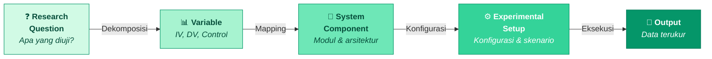
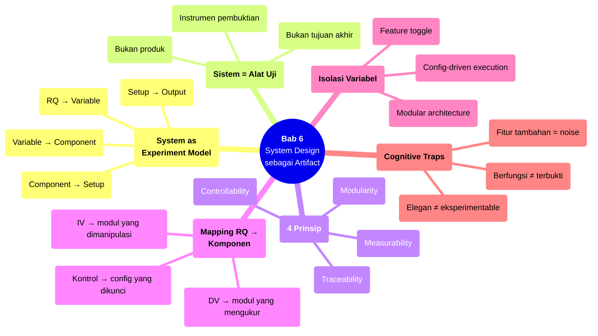

# Bab 6 — System Design sebagai Experimental Artifact

> **Sub-CPMK:** 2.2 — Merancang sistem sebagai alat uji hipotesis
> **CPMK:** CPMK02 — Measurement & Design
> **CPL Utama:** CPL06 (Desain & pengembangan)
> **Fase:** Designing (M5–M7)
> **Signature Model:** System as Experiment Model (RQ → Variable → System Component → Experimental Setup → Output)

---

## Ringkasan Bab

Bab ini membahas prinsip yang sering diabaikan oleh peneliti di bidang TI: bahwa sistem yang dibangun dalam riset bukan produk — ia adalah **alat uji hipotesis**. Arsitektur sistem, pemilihan komponen, dan cara modul berinteraksi seharusnya ditentukan oleh research question dan variabel eksperimen, bukan oleh preferensi teknis atau tren industri. Kita akan belajar memetakan RQ ke komponen sistem, menerapkan empat prinsip desain eksperimental (traceability, modularity, controllability, measurability), dan mengendalikan variabel melalui arsitektur.

---

## 6.1 Pembuka

Bab 5 menyiapkan fondasi pengukuran: konsep sudah dioperasionalisasikan menjadi variabel, metrik sudah dipilih dan dijustifikasi, jenis data sudah ditentukan. Pertanyaan selanjutnya: **di mana variabel-variabel itu hidup?**

Jawabannya: di dalam sistem.

Dalam riset TI dan software engineering, hipotesis diuji melalui sistem — entah itu aplikasi web, model machine learning, API, atau pipeline data. Sistem adalah medium tempat variabel independen dimanipulasi dan variabel dependen diukur. Tapi di sinilah masalah dimulai: banyak peneliti merancang sistem dengan mentalitas *engineer*, bukan mentalitas *eksperimentalis*.

Seorang engineer membangun sistem agar berfungsi dengan baik, scalable, dan user-friendly. Seorang eksperimentalis membangun sistem agar **bisa mengisolasi variabel**. Kedua tujuan ini tidak selalu sejalan. Sistem yang paling elegan secara arsitektural belum tentu paling mudah dieksperimenkan. Sebaliknya, sistem yang dirancang untuk eksperimen mungkin terlihat "berlebihan" dari perspektif engineering — modul yang seharusnya bisa digabung justru dipisah, konfigurasi yang seharusnya di-hardcode justru dibuat parameterik.

Hevner et al. (2004) mendefinisikan sistem dalam konteks riset sebagai *artifact* — sebuah objek yang sengaja diciptakan untuk mendemonstrasikan atau menguji claim tertentu. Artifact bukan tujuan akhir; ia adalah instrumen pembuktian. Peffers et al. (2007) mempertegas bahwa dalam Design Science Research, artifact harus dievaluasi melalui demonstrasi yang terukur — dan evaluasi itu hanya mungkin jika artifact dirancang dengan mempertimbangkan *apa yang akan diukur* sejak awal.

Pertanyaan sentral bab ini: **Bagaimana merancang sistem yang bukan sekadar berfungsi, melainkan bisa membuktikan sesuatu secara ilmiah?**

---

## 6.2 System as Experiment Model

Model ini menunjukkan bahwa setiap komponen sistem harus bisa ditelusuri balik ke variabel penelitian, dan setiap variabel harus bisa ditelusuri ke research question.

**Gambar 6.1** — System as Experiment Model: Dari RQ ke Output Terukur



Setiap transisi menjalankan fungsi spesifik:

1. **RQ → Variable (Dekomposisi).** Research question dipecah menjadi variabel-variabel: independen (yang dimanipulasi), dependen (yang diukur), dan kontrol (yang dijaga konstan). Contoh: RQ "Apakah caching strategy X mengurangi waktu respons dibanding strategy Y?" menghasilkan IV = caching strategy (X vs Y), DV = waktu respons (ms), dan variabel kontrol = beban server, ukuran data, konfigurasi hardware.

2. **Variable → System Component (Mapping).** Setiap variabel dipetakan ke komponen sistem tertentu. IV (caching strategy) → modul caching. DV (waktu respons) → logging module yang mengukur latensi. Variabel kontrol → konfigurasi environment yang di-lock. Jika sebuah variabel tidak bisa dipetakan ke komponen manapun, berarti arsitektur sistem perlu dirancang ulang.

3. **System Component → Experimental Setup (Konfigurasi).** Komponen-komponen dirangkai menjadi skenario eksperimen. Setup A menggunakan caching strategy X; Setup B menggunakan caching strategy Y. Semua variabel kontrol identik di kedua setup. Konfigurasi ini harus bisa direproduksi — artinya, semua parameter didokumentasikan secara eksplisit.

4. **Experimental Setup → Output (Eksekusi).** Eksperimen dijalankan dan menghasilkan data terukur. Output ini harus langsung terkait dengan DV yang sudah didefinisikan. Jika output yang dihasilkan ternyata tidak bisa menjawab RQ, masalahnya ada di tahap mapping atau dekomposisi — bukan di analisis.

Kekuatan model ini terletak pada **traceability dua arah**: dari RQ ke bawah (apakah setiap variabel diimplementasikan?) dan dari output ke atas (apakah setiap pengukuran menjawab RQ?). Jika salah satu arah terputus, eksperimen memiliki *loose end* yang harus diperbaiki sebelum data dikumpulkan.

---

## 6.3 Definisi Kunci

**Artifact**
: Dalam konteks Design Science Research, artifact adalah objek yang sengaja diciptakan untuk memecahkan masalah atau menguji proposisi tertentu. Artifact bisa berupa sistem, model, metode, atau instantiation. Dalam riset eksperimental TI, artifact biasanya berupa sistem perangkat lunak yang menjadi medium pengujian hipotesis (Hevner et al., 2004).

**Traceability**
: Kemampuan untuk menelusuri hubungan antara research question, variabel, komponen sistem, dan output eksperimen secara eksplisit. Setiap keputusan desain harus bisa dijawab: "mengapa komponen ini ada, dan variabel mana yang dilayaninya?"

**Variable Isolation**
: Prinsip eksperimental yang mengharuskan perubahan hanya dilakukan pada satu variabel pada satu waktu, sementara semua variabel lain dijaga konstan. Dalam konteks sistem, ini berarti arsitektur harus memungkinkan substitusi satu komponen tanpa mempengaruhi komponen lain (Bass et al., 2012).

**Experimental Setup**
: Konfigurasi lengkap dari sistem, data, parameter, dan lingkungan yang digunakan untuk satu skenario eksperimen. Setiap setup merepresentasikan satu kondisi eksperimental.

---

## 6.4 Konsep Inti

### 6.4.1 Sistem Bukan Tujuan — Sistem adalah Alat Uji

Perbedaan antara proyek engineering dan proyek riset terletak pada pertanyaan dasar. Engineer bertanya: "Apakah sistem ini berfungsi?" Peneliti bertanya: "Apa yang bisa dibuktikan oleh sistem ini?"

Dalam proyek engineering, keberhasilan diukur dari apakah sistem memenuhi requirement dan berjalan di production. Dalam riset, keberhasilan diukur dari apakah sistem mampu **mengisolasi variabel** dan **menghasilkan data yang menjawab research question**. Sistem yang berfungsi dengan baik tapi tidak bisa dieksperimenkan adalah kegagalan riset.

Peffers et al. (2007) mendeskripsikan artifact dalam Design Science Research sebagai sesuatu yang harus melewati siklus *build-evaluate*: dibangun berdasarkan design theory, lalu dievaluasi melalui demonstrasi yang terukur. Evaluasi bukan "apakah sistem berhasil di-deploy" — melainkan "apakah evaluasi terhadap artifact menghasilkan bukti yang mendukung atau menolak hipotesis."

Konsekuensi praktisnya signifikan. Seorang peneliti yang membangun sistem rekomendasi untuk riset perlu memikirkan: bagaimana cara mengaktifkan dan menonaktifkan fitur tertentu tanpa mengubah kode? Bagaimana cara menjalankan eksperimen dengan dataset berbeda tanpa rebuild? Bagaimana cara logging yang cukup detail untuk menjawab RQ, tapi tidak terlalu invasif sehingga mengubah perilaku sistem?

### 6.4.2 Mapping RQ ke System Component

Setiap research question mengimplikasikan komponen sistem tertentu. Proses mapping ini harus dilakukan secara eksplisit — bukan dibiarkan "terbentuk sendiri" selama development.

Ambil contoh RQ: "Apakah penggunaan attention mechanism pada model sentiment analysis meningkatkan F1-score dibanding model tanpa attention pada dataset review produk berbahasa Indonesia?"

Mapping yang diperlukan:

| Variabel | Jenis | Komponen Sistem |
|----------|-------|-----------------|
| Attention mechanism (ada/tidak) | Independen | Model layer — harus bisa di-toggle on/off |
| F1-score | Dependen | Evaluation module — menghitung per-kelas dan macro |
| Dataset review produk | Kontrol | Data pipeline — dataset identik untuk kedua kondisi |
| Preprocessing | Kontrol | NLP pipeline — tokenizer, stopword, stemming identik |
| Hyperparameter | Kontrol | Config file — learning rate, batch size, epoch identik |
| Hardware | Kontrol | Environment spec — GPU, RAM, OS identik |

Tanpa mapping ini, sering terjadi situasi di mana variabel kontrol tidak benar-benar terkontrol. Peneliti mengganti model (IV) tetapi juga mengganti preprocessing (seharusnya kontrol) — sehingga perbedaan hasil tidak bisa diatribusikan ke model saja. Arsitektur yang memisahkan modul model dari modul preprocessing mencegah masalah ini secara struktural.

### 6.4.3 Empat Prinsip Desain Eksperimental

Bass et al. (2012) dan Wohlin et al. (2012) secara implisit menunjukkan bahwa sistem yang baik untuk eksperimen memiliki empat kualitas:

**Traceability** — Setiap komponen dalam sistem harus bisa dijawab: "ini melayani variabel apa?" Komponen yang tidak terkait dengan variabel manapun adalah noise arsitektural — ia menambah kompleksitas tanpa menambah kemampuan eksperimental. Traceability juga berarti dokumentasi: arsitektur komponen, mapping ke variabel, dan justifikasi keberadaan setiap modul.

**Modularity** — Komponen yang merepresentasikan variabel independen harus bisa diganti tanpa mempengaruhi komponen lain. Jika mengganti algoritma klasifikasi memaksa perubahan pada modul preprocessing, modul evaluasi, dan modul logging secara bersamaan, berarti arsitekturnya *tightly coupled* — dan eksperimen tidak bisa mengisolasi efek algoritma saja.

**Controllability** — Variabel kontrol harus bisa dikunci nilainya. Ini berarti konfigurasi (hyperparameter, versi library, random seed, dataset split) harus di-eksternalisasi ke config file — bukan di-hardcode di dalam kode. Controllability juga mencakup reproducibility: siapa pun yang menjalankan eksperimen dengan konfigurasi yang sama harus mendapat hasil yang sama (atau sangat serupa).

**Measurability** — Sistem harus menghasilkan data yang dibutuhkan secara otomatis. Logging, metric collection, dan output formatting harus dirancang sejak awal — bukan ditambahkan setelah eksperimen selesai sebagai afterthought. Jika research question membutuhkan waktu respons per-request, sistem harus memiliki mekanisme pencatatan waktu di level yang tepat. Jika membutuhkan confusion matrix, evaluation module harus menghasilkan prediksi per-sampel, bukan hanya akurasi agregat.

### 6.4.4 Kontrol dan Isolasi Variabel Melalui Arsitektur

Isolasi variabel bukan hanya prinsip statistik — ia prinsip arsitektural. Sistem yang monolitik, di mana semua komponen saling tergantung, secara inheren sulit untuk dieksperimenkan. Mengubah satu hal berarti mengubah banyak hal — dan hasilnya tidak bisa diatribusikan ke perubahan tunggal.

Solusi arsitektural untuk isolasi variabel:

**Modular architecture** — Pisahkan komponen berdasarkan variabel yang dilayani. Model tersendiri, preprocessing tersendiri, evaluation tersendiri, data loading tersendiri. Setiap modul berkomunikasi melalui interface yang terdefinisi — sehingga substitusi satu modul tidak memaksa perubahan di modul lain.

**Configuration-driven execution** — Semua parameter eksperimen disimpan di config file (YAML, JSON, atau sejenisnya), bukan di-hardcode. Menjalankan eksperimen dengan kondisi berbeda cukup mengubah config, bukan mengubah kode. Ini juga memudahkan reproduksi: config file *adalah* dokumentasi eksperimen.

**Feature toggle** — Untuk variabel independen yang bersifat binary (ada/tidak), implementasikan sebagai flag yang bisa diaktifkan atau dinonaktifkan. Ini memungkinkan ablation study — menguji kontribusi setiap komponen secara individual tanpa membangun ulang sistem.

---

## 6.5 Research vs Engineering

**Tabel 6.1** — Perspektif Sistem: Engineering vs Research

| Aspek | Engineering | Research |
|-------|------------|----------|
| **Tujuan sistem** | Memenuhi kebutuhan pengguna | Menguji hipotesis dan menghasilkan bukti |
| **Keberhasilan** | Sistem berjalan di production | Eksperimen menghasilkan data yang menjawab RQ |
| **Arsitektur** | Optimasi untuk performa dan skalabilitas | Optimasi untuk isolasi variabel dan reproducibility |
| **Komponen** | Dipilih berdasarkan best practice industri | Dipilih berdasarkan mapping ke variabel eksperimen |
| **Konfigurasi** | Sering di-hardcode untuk simplisitas | Di-eksternalisasi ke config file untuk kontrol |
| **Fitur tambahan** | Menambah nilai bagi pengguna | Menambah noise pada eksperimen jika tidak terkait RQ |

Perbedaan ini bukan berarti riset menghasilkan sistem yang buruk. Sistem riset bisa saja di-deploy kemudian. Tapi prioritas pertamanya jelas: **kemampuan eksperimental**. Sistem yang bagus secara engineering tapi tidak bisa mengisolasi variabel adalah kegagalan riset.

---

## 6.6 Research Reality

### Fenomena 1 — "Model ML Monolith: Bagus tapi Tidak Bisa Diuji"

Situasi ini sangat umum: seorang peneliti membangun model machine learning end-to-end — dari data loading, preprocessing, feature engineering, model training, hingga evaluation — dalam satu notebook atau satu file script panjang. Hasilnya mungkin bagus (akurasi tinggi), tapi ketika reviewer bertanya "apa kontribusi spesifik dari teknik preprocessing yang diusulkan?" — jawaban jujurnya, tidak bisa diketahui.

Karena semua tahap saling tergantung dalam satu alur, tidak ada cara untuk mengisolasi efek preprocessing saja. Mengganti preprocessing berarti menjalankan ulang seluruh pipeline — dan jika parameter lain juga berubah (sengaja atau tidak), hasilnya bukan perbandingan yang adil.

Solusi arsitektural: pisahkan pipeline menjadi modul independen. Simpan output setiap tahap sebagai file intermediate. Pastikan setiap modul bisa dijalankan sendiri dengan input yang konsisten. Ini membutuhkan effort lebih di awal, tapi menghemat waktu signifikan saat eksperimen perlu diulang atau divariasikan.

### Fenomena 2 — "Multiple Feature Change, No Clear Impact"

Peneliti membangun sistem versi 2 yang "lebih baik" dari versi 1. Tapi versi 2 mengubah tiga hal sekaligus: algoritma baru, preprocessing baru, dan hyperparameter baru. Hasil versi 2 lebih tinggi — tapi peningkatan itu datang dari mana? Algoritma? Preprocessing? Hyperparameter? Atau kombinasi ketiganya?

Tanpa isolasi variabel, pertanyaan ini tidak bisa dijawab. Dan jika tidak bisa dijawab, kontribusi riset menjadi ambigu. Reviewer akan bertanya: "Jika hanya algoritmanya yang diganti dan preprocessing tetap sama, apakah hasilnya tetap meningkat?" Jika jawabannya tidak diketahui, klaim "metode yang diusulkan lebih baik" tidak memiliki dasar yang kuat.

Prinsip dasarnya sederhana: **ubah satu, kontrol sisanya**. Jika ingin menguji tiga faktor, jalankan tiga eksperimen terpisah (atau desain faktorial, yang dibahas di Bab 7) — bukan satu eksperimen yang mengubah semuanya sekaligus.

---

## 6.7 Cognitive Traps

### Trap 1: "Sistem saya berfungsi, berarti hipotesis terbukti"

Sistem yang berfungsi *tidak sama* dengan hipotesis yang terbukti. Hipotesis memerlukan bukti komparatif: lebih baik dari apa? Diukur dengan apa? Pada kondisi apa? Sistem yang berfungsi hanya membuktikan bahwa implementasi berhasil secara teknis — bukan bahwa pendekatan yang dipilih superior terhadap alternatif yang ada.

### Trap 2: "Arsitektur paling elegan pasti paling baik untuk riset"

Arsitektur yang elegan (clean, DRY, well-abstracted) merupakan praktik baik dalam engineering, tapi bisa kontraproduktif dalam riset. Abstraksi yang terlalu dalam menyembunyikan parameter eksperimen. Dependency injection yang berlebihan membuat tracing variabel menjadi sulit. Dalam riset, transparansi lebih penting daripada elegansi — setiap keputusan arsitektural harus bisa ditelusuri ke variabel.

### Trap 3: "Menambah fitur pasti menambah nilai riset"

Dalam engineering, fitur tambahan bisa menambah nilai produk. Dalam riset, fitur tambahan yang tidak terkait dengan variabel eksperimen justru menambah **confounding factor**. Setiap komponen yang tidak bisa dijustifikasi keberadaannya terhadap RQ seharusnya dihilangkan dari sistem eksperimen — atau setidaknya dikontrol nilainya.

### Trap 4: "Config bisa diatur nanti"

Menunda eksternalisasi konfigurasi ke tahap akhir development hampir selalu berakhir dengan dua hal: parameter yang ter-hardcode di berbagai tempat dan eksperimen yang tidak bisa direproduksi. Konfigurasi bukan afterthought — ia adalah infrastruktur eksperimen. Tanpa config yang terpusat dan terdokumentasi, menjalankan ulang eksperimen dengan kondisi identik menjadi mustahil.

---

## 6.8 Studi Kasus

### Kasus 1 (Basic): "Model ML Tidak Bisa Diuji — Monolith Tanpa Isolasi"

**Konteks:**

Seorang peneliti membangun model klasifikasi sentimen menggunakan LSTM. Seluruh pipeline — data loading, cleaning, tokenization, embedding, training, dan evaluation — ditulis dalam satu Jupyter notebook berurutan (500+ baris kode). Model menghasilkan akurasi 87%, lebih tinggi dari baseline SVM (82%). Peneliti menyimpulkan bahwa LSTM lebih baik dari SVM untuk klasifikasi sentimen.

**❌ Pendekatan Salah:**

Tidak ada pemisahan modul. Preprocessing untuk LSTM dan SVM berbeda (LSTM menggunakan word embedding, SVM menggunakan TF-IDF). Hyperparameter tuning hanya dilakukan untuk LSTM. Dataset split tidak konsisten (random seed berbeda). Kesimpulan: "LSTM 5% lebih akurat dari SVM."

Mengapa salah: perbedaan 5% bisa disebabkan oleh preprocessing yang berbeda, tuning yang tidak seimbang, atau split data yang tidak identik — bukan oleh model LSTM itu sendiri. Perbandingan ini tidak adil (*unfair comparison*).

**✅ Pendekatan Benar:**

Arsitektur dipisah menjadi modul:
- **Data module:** loading dan split (random seed terkunci di config)
- **Preprocessing module:** dua variant (embedding untuk LSTM, TF-IDF untuk SVM) — keduanya menerima input identik
- **Model module:** LSTM dan SVM sebagai komponen yang interchangeable
- **Evaluation module:** menghitung akurasi, F1, precision, recall — menerima output dari model manapun

Config file mengatur semua parameter: `{model: "lstm", preprocessing: "embedding", seed: 42, epochs: 50, ...}`. Menjalankan eksperimen untuk SVM cukup mengubah config, bukan menulis ulang notebook. Hyperparameter tuning dilakukan untuk kedua model secara setara.

**Perbandingan:**

| Aspek | Bad | Good |
|-------|-----|------|
| **Arsitektur** | Monolith notebook | Modular pipeline |
| **Variabel kontrol** | Tidak konsisten | Terkunci di config file |
| **Fairness** | Preprocessing dan tuning tidak setara | Identical split, equal tuning effort |
| **Reproducibility** | Tidak bisa diulang dengan hasil sama | Config file = dokumentasi eksperimen |

**Pelajaran:** Perbandingan yang adil membutuhkan arsitektur yang memungkinkan isolasi variabel. Tanpa modularitas, perbedaan hasil tidak bisa diatribusikan ke satu faktor.

---

### Kasus 2 (Advanced): "Multiple Feature Change — Mana yang Berkontribusi?"

**Konteks:**

Sebuah tim mengembangkan sistem deteksi intrusi jaringan. Versi awal (v1) menggunakan Random Forest dengan fitur statistik dasar (mean, std, max packet size) dan evaluasi pada dataset NSL-KDD. Versi baru (v2) dibangun dengan tiga perubahan sekaligus: (a) model diganti ke XGBoost, (b) fitur ditambah 15 fitur baru berbasis temporal, dan (c) preprocessing ditambah normalization Z-score. Hasil: akurasi v2 = 93%, v1 = 86%. Peneliti menyimpulkan: "XGBoost lebih baik dari Random Forest untuk deteksi intrusi."

**❌ Pendekatan Salah:**

Hanya melaporkan v1 vs v2. Tidak ada ablation study. Klaim bahwa "XGBoost lebih baik" tidak bisa dibuktikan karena tiga variabel berubah bersamaan. Peningkatan 7% mungkin seluruhnya berasal dari 15 fitur baru — bukan dari model XGBoost.

**✅ Pendekatan Benar:**

Arsitektur dirancang dengan tiga modul independen: feature extraction, preprocessing, dan model. Eksperimen dijalankan secara bertahap:

| Eksperimen | Model | Fitur | Preprocessing | Akurasi |
|------------|-------|-------|---------------|---------|
| Baseline (v1) | Random Forest | Dasar | Tanpa normalisasi | 86% |
| Exp-A | **XGBoost** | Dasar | Tanpa normalisasi | 87% |
| Exp-B | Random Forest | **Dasar + Temporal** | Tanpa normalisasi | 91% |
| Exp-C | Random Forest | Dasar | **Z-score** | 87% |
| Exp-D | XGBoost | Dasar + Temporal | Z-score | 93% |

Temuan: peningkatan terbesar berasal dari fitur temporal (+5%), bukan dari model XGBoost (+1%) atau normalisasi (+1%). Kontribusi riset berubah dari "XGBoost lebih baik" menjadi "fitur temporal berbasis window menjadi faktor dominan dalam peningkatan deteksi intrusi" — klaim yang lebih spesifik, lebih honest, dan lebih bernilai ilmiah.

**Perbandingan:**

| Aspek | Bad | Good |
|-------|-----|------|
| **Variabel yang berubah** | 3 sekaligus | 1 per eksperimen (ablation) |
| **Klaim** | "XGBoost lebih baik" (overstatement) | "Fitur temporal berkontribusi paling besar" (presisi) |
| **Arsitektur** | Dua versi monolith | Tiga modul yang bisa dikombinasikan |
| **Evidential strength** | Lemah (confounded) | Kuat (isolated factors) |

**Pelajaran:** Ablation study — menguji kontribusi setiap faktor secara independen — hanya mungkin jika arsitektur mendukung substitusi komponen. Klaim riset yang kuat membutuhkan bukti yang terpisah untuk setiap faktor yang berubah.

---

## 6.9 Template Praktis

### Template: Mapping RQ ke Arsitektur Sistem

```
═══════════════════════════════════════════════════════════════
  MAPPING RQ → SYSTEM ARCHITECTURE — [Judul Penelitian]
═══════════════════════════════════════════════════════════════

RESEARCH QUESTION:
  [Tulis RQ lengkap di sini]

DEKOMPOSISI VARIABEL:
  ┌──────────────────┬────────────┬──────────────────────────┐
  │ Variabel         │ Jenis      │ Komponen Sistem          │
  ├──────────────────┼────────────┼──────────────────────────┤
  │ [Variabel 1]     │ Independen │ [Modul/layer yang       │
  │                  │            │  mengimplementasikan]     │
  ├──────────────────┼────────────┼──────────────────────────┤
  │ [Variabel 2]     │ Dependen   │ [Modul yang mengukur]    │
  ├──────────────────┼────────────┼──────────────────────────┤
  │ [Variabel 3]     │ Kontrol    │ [Komponen yang dikunci]  │
  └──────────────────┴────────────┴──────────────────────────┘

4 PRINSIP DESAIN:
  □ Traceability   — Setiap komponen terhubung ke variabel: [Y/N]
  □ Modularity     — IV bisa disubstitusi tanpa ubah komponen lain: [Y/N]
  □ Controllability — Variabel kontrol di-eksternalisasi ke config: [Y/N]
  □ Measurability  — DV tercatat otomatis oleh sistem: [Y/N]

CONFIG FILE CHECKLIST:
  □ Random seed
  □ Dataset path & split ratio
  □ Hyperparameter model
  □ Preprocessing parameter
  □ Environment spec (library version, hardware)

SKENARIO EKSPERIMEN:
  ┌─────────────┬─────────────┬───────────────┬─────────────┐
  │ Setup       │ IV (kondisi)│ Kontrol       │ DV (diukur) │
  ├─────────────┼─────────────┼───────────────┼─────────────┤
  │ Baseline    │ [Kondisi A] │ [Semua sama]  │ [Metrik]    │
  ├─────────────┼─────────────┼───────────────┼─────────────┤
  │ Treatment   │ [Kondisi B] │ [Semua sama]  │ [Metrik]    │
  └─────────────┴─────────────┴───────────────┴─────────────┘

═══════════════════════════════════════════════════════════════
```

---

## 6.10 Mindmap Ringkasan

**Gambar 6.2** — Mindmap Bab 6: System Design sebagai Experimental Artifact



---

## 6.11 Rangkuman

**Poin-poin utama bab ini:**

1. Sistem dalam riset bukan produk — ia adalah *experimental artifact* yang dirancang untuk menguji hipotesis. Keberhasilannya bukan dari apakah ia berfungsi, melainkan dari apakah ia bisa mengisolasi variabel dan menghasilkan data yang menjawab research question.

2. Setiap komponen sistem harus bisa ditelusuri ke variabel eksperimen tertentu. Komponen yang tidak terkait dengan variabel manapun adalah noise arsitektural.

3. Empat prinsip desain eksperimental — traceability, modularity, controllability, measurability — menentukan apakah sebuah sistem layak dijadikan alat uji.

4. Isolasi variabel bukan hanya prinsip statistik; ia prinsip arsitektural. Sistem monolitik yang mengubah banyak hal sekaligus tidak bisa menghasilkan klaim yang spesifik.

5. Ablation study — menguji kontribusi setiap faktor secara independen — hanya mungkin jika arsitektur mendukung substitusi komponen secara modular.

6. Konfigurasi yang di-eksternalisasi adalah fondasi reproducibility. Tanpa config file yang terdokumentasi, eksperimen yang "berhasil" tidak bisa diverifikasi.

Dengan pemahaman tentang metrik (Bab 5) dan arsitektur sistem (Bab 6), tahap terakhir dari desain eksperimen adalah merancang eksperimen itu sendiri: bagaimana menyusun skenario pengujian, memastikan validitas, dan membangun bukti kausalitas yang dapat dipercaya. Ini menjadi fokus Bab 7.

> *"Dalam penelitian, sistem bukan dibangun untuk digunakan, tetapi untuk membuktikan sesuatu secara ilmiah."*

---

## 6.12 Latihan & Refleksi

### Latihan 1 — Mapping RQ ke Arsitektur

Ambil research question dari latihan Bab 4. Identifikasi semua variabel (independen, dependen, kontrol). Petakan setiap variabel ke komponen sistem yang akan mengimplementasikan atau mengukurnya. Gambarkan diagram arsitektur sederhana yang menunjukkan mapping ini.

### Latihan 2 — Evaluasi 4 Prinsip

Pilih satu proyek riset (milik sendiri atau dari literatur). Evaluasi arsitektur sistemnya terhadap empat prinsip: traceability, modularity, controllability, measurability. Untuk setiap prinsip, beri skor (1-5) dan jelaskan alasannya. Identifikasi prinsip mana yang paling lemah dan usulkan perbaikan.

### Latihan 3 — Desain Ablation Study

Untuk sistem dari Latihan 1, rancang ablation study yang menguji kontribusi setiap komponen secara independen. Buat tabel skenario eksperimen (seperti Kasus 2 di atas) yang menunjukkan: kondisi baseline, variasi per faktor, dan kombinasi final.

### Refleksi

> "Apakah sistem yang saya bangun dirancang untuk berfungsi, atau dirancang untuk membuktikan sesuatu? Apakah setiap komponen bisa dijustifikasi terhadap research question?"

---

## Daftar Pustaka

- Hevner, A. R., March, S. T., Park, J., & Ram, S. (2004). Design Science in Information Systems Research. *MIS Quarterly*, 28(1), 75–105.
- Peffers, K., Tuunanen, T., Rothenberger, M. A., & Chatterjee, S. (2007). A Design Science Research Methodology for Information Systems Research. *Journal of Management Information Systems*, 24(3), 45–77.
- Wohlin, C., Runeson, P., Höst, M., Ohlsson, M. C., Regnell, B., & Wesslén, A. (2012). *Experimentation in Software Engineering*. Springer.
- Bass, L., Clements, P., & Kazman, R. (2012). *Software Architecture in Practice* (3rd ed.). Addison-Wesley.

<!-- STATUS: 🟢 Draft Complete -->
