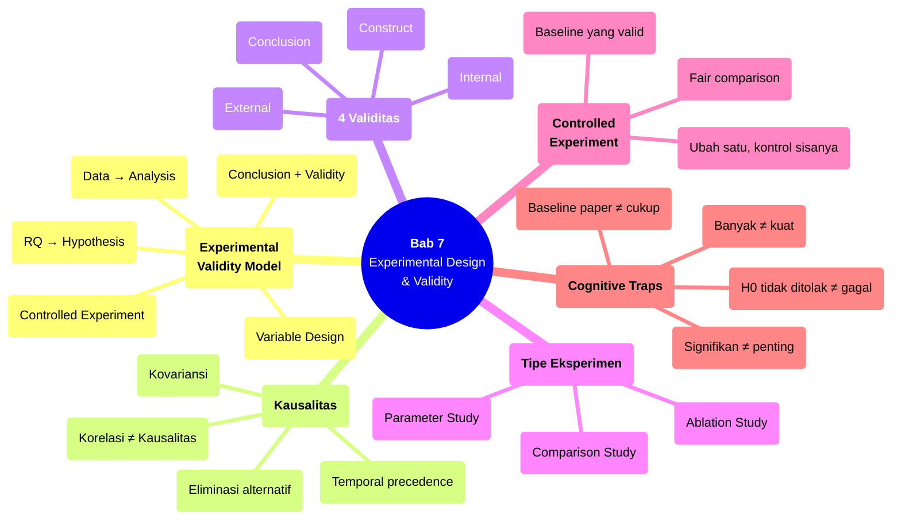

# Bab 7 — Experimental Design & Validity

> **Sub-CPMK:** 2.3 — Merancang eksperimen terkontrol dengan validitas tinggi
> **CPMK:** CPMK02 — Measurement & Design
> **CPL Utama:** CPL06 (Desain & pengembangan)
> **Fase:** Designing (M5–M7)
> **Signature Model:** Experimental Validity Model (RQ → Hypothesis → Variable Design → Controlled Experiment → Data → Analysis → Conclusion)

---

## Ringkasan Bab

Bab ini membahas inti dari riset eksperimental: bagaimana merancang eksperimen yang mampu membuktikan hubungan sebab-akibat, bukan sekadar korelasi. Kita akan belajar membedakan *causality* dari *correlation*, merancang eksperimen terkontrol, memahami empat jenis validitas (internal, external, construct, conclusion), dan mengenal tiga tipe eksperimen yang paling relevan di bidang TI — comparison study, ablation study, dan parameter study. Bab ini menutup Bagian 2 (Measurement & Design) dan menyiapkan transisi ke Bagian 3 (Execution).

---

## 7.1 Pembuka

Bab 5 mendefinisikan apa yang akan diukur. Bab 6 merancang sistem sebagai instrumen pengukuran. Pertanyaan terakhir sebelum eksperimen benar-benar dijalankan: **bagaimana memastikan bahwa apa yang diukur menghasilkan bukti yang valid?**

Pertanyaan ini bukan retoris. Banyak eksperimen yang secara teknis berhasil — sistem jalan, data terkumpul, angka ada — tetapi buktinya lemah karena desain eksperimennya cacat. Contoh klasik: seorang peneliti membandingkan algoritma A dan algoritma B, melaporkan bahwa A lebih baik (akurasi 91% vs 87%), tapi ternyata A diuji pada versi dataset yang sudah di-cleaning sementara B diuji pada versi raw. Perbedaan 4% itu mungkin sepenuhnya disebabkan oleh perbedaan data — bukan algoritma.

Ini bukan masalah statistik. Ini masalah **desain**.

Shadish, Cook, dan Campbell (2002) mendefinisikan eksperimen sebagai investigasi di mana peneliti secara sengaja memanipulasi satu atau lebih variabel independen dan mengamati efeknya pada variabel dependen, sambil mengontrol variabel-variabel lain yang bisa mempengaruhi hasil. Kata kunci di sini ada tiga: **manipulasi** (ada intervensi yang disengaja), **pengamatan** (efeknya diukur), dan **kontrol** (faktor-faktor lain dijaga konstan).

Tanpa kontrol, yang terjadi bukan eksperimen — melainkan observasi. Tanpa manipulasi, yang terjadi bukan eksperimen — melainkan survei. Dan tanpa pengamatan yang terukur, yang terjadi bukan eksperimen — melainkan demonstrasi.

Wohlin et al. (2012) menekankan bahwa desain eksperimen di software engineering memiliki tantangan unik. Berbeda dengan eksperimen di laboratorium kimia yang bisa mengontrol suhu, tekanan, dan konsentrasi secara presisi, eksperimen TI berurusan dengan variabel yang lebih sulit dikontrol: perilaku pengguna, kualitas kode yang bervariasi, versi library yang berubah, dan hardware yang tidak identik. Justru karena kontrol lebih sulit, desain yang cermat menjadi lebih penting.

Pertanyaan sentral bab ini: **Bagaimana merancang eksperimen yang menghasilkan bukti kausalitas yang dapat dipercaya, bukan sekadar angka yang terlihat meyakinkan?**

---

## 7.2 Experimental Validity Model

Model ini menggambarkan alur lengkap dari research question hingga kesimpulan, dengan **validitas** sebagai filter di setiap tahap.

**Gambar 7.1** — Experimental Validity Model: Dari RQ ke Conclusion yang Valid

```mermaid
graph LR
    A["❓ <b>RQ</b><br/><i>Apa yang diuji?</i>"]
    B["🎯 <b>Hypothesis</b><br/><i>H0 & H1</i>"]
    C["📊 <b>Variable<br/>Design</b><br/><i>IV, DV, Control</i>"]
    D["⚙️ <b>Controlled<br/>Experiment</b><br/><i>Setup & skenario</i>"]
    E["📦 <b>Data</b><br/><i>Hasil observasi</i>"]
    F["📈 <b>Analysis</b><br/><i>Uji statistik</i>"]
    G["✅ <b>Conclusion</b><br/><i>Validity Level</i>"]

    A -->|"Prediksi"| B
    B -->|"Operasionalisasi"| C
    C -->|"Eksekusi"| D
    D -->|"Pengumpulan"| E
    E -->|"Pengujian"| F
    F -->|"Interpretasi"| G

    style A fill:#D1FAE5,stroke:#059669,color:#064E3B
    style B fill:#A7F3D0,stroke:#059669,color:#064E3B
    style C fill:#6EE7B7,stroke:#059669,color:#064E3B
    style D fill:#34D399,stroke:#059669,color:#FFFFFF
    style E fill:#10B981,stroke:#047857,color:#FFFFFF
    style F fill:#059669,stroke:#047857,color:#FFFFFF
    style G fill:#047857,stroke:#065F46,color:#FFFFFF
```



Setiap transisi membawa risiko ancaman validitas (*validity threat*):

1. **RQ → Hypothesis:** Apakah hipotesis benar-benar menterjemahkan RQ? Hipotesis yang terlalu sempit atau terlalu luas menghasilkan eksperimen yang tidak menjawab pertanyaan sebenarnya.

2. **Hypothesis → Variable Design:** Apakah variabel yang dipilih merepresentasikan konsep dalam hipotesis? Ini adalah isu *construct validity* yang dibahas di Bab 5.

3. **Variable Design → Controlled Experiment:** Apakah eksperimen benar-benar mengontrol semua variabel yang seharusnya? Jika ada variabel yang tidak terkontrol — *confounding variable* — maka hubungan yang ditemukan mungkin palsu. Ini ancaman *internal validity*.

4. **Controlled Experiment → Data:** Apakah pengumpulan data bebas dari bias? Instrumen yang cacat, sampling yang tidak representatif, atau kondisi pengumpulan yang tidak konsisten mengancam kualitas data.

5. **Data → Analysis:** Apakah uji statistik yang dipilih sesuai dengan jenis data dan distribsinya? Ini ancaman *conclusion validity* — kemampuan analisis untuk mendeteksi efek yang sebenarnya ada (atau tidak melihat efek yang sebenarnya tidak ada).

6. **Analysis → Conclusion:** Apakah temuan bisa digeneralisasi di luar konteks eksperimen? Ini ancaman *external validity* — sejauh mana hasil eksperimen berlaku untuk populasi, setting, atau waktu yang berbeda.

Model ini menunjukkan bahwa validitas bukan properti tunggal — ia terdistribusi di seluruh rantai eksperimen. Satu kelemahan di satu titik bisa menginvalidasi seluruh kesimpulan.

---

## 7.3 Definisi Kunci

**Kausalitas (*Causality*)**
: Hubungan sebab-akibat di mana perubahan pada variabel X secara langsung menyebabkan perubahan pada variabel Y. Kausalitas memerlukan tiga syarat: korelasi (X dan Y bergerak bersama), urutan temporal (X terjadi sebelum Y), dan eliminasi alternatif (tidak ada faktor lain yang menjelaskan hubungan tersebut). Eksperimen terkontrol adalah satu-satunya metode yang bisa membuktikan kausalitas (Shadish et al., 2002).

**Internal Validity**
: Sejauh mana hubungan yang ditemukan antara variabel independen dan dependen benar-benar disebabkan oleh manipulasi eksperimental — bukan oleh faktor lain (*confounding variable*). Internal validity tinggi berarti peneliti bisa yakin bahwa "perubahan Y memang disebabkan oleh X" (Shadish et al., 2002).

**External Validity**
: Sejauh mana temuan eksperimen bisa digeneralisasi ke populasi, setting, waktu, atau konteks yang berbeda dari kondisi eksperimen. Eksperimen laboratorium cenderung tinggi internal validity tetapi rendah external validity; field study sebaliknya (Wohlin et al., 2012).

**Conclusion Validity**
: Sejauh mana kesimpulan tentang hubungan antar variabel secara statistik valid. Ini mencakup kekuatan uji statistik (*statistical power*), ukuran sampel, dan kesesuaian metode analisis dengan jenis data (Field, 2018).

**Construct Validity**
: Sejauh mana variabel yang diukur dan dimanipulasi benar-benar merepresentasikan konsep yang dimaksudkan. Pelanggaran construct validity terjadi ketika metrik tidak sesuai dengan konsep — seperti mengukur "kualitas kode" hanya dari jumlah baris (Shadish et al., 2002).

---

## 7.4 Konsep Inti

### 7.4.1 Korelasi Bukan Kausalitas — dan Mengapa Ini Penting

Pernyataan "korelasi bukan kausalitas" mungkin terdengar klise, tapi implikasinya sangat praktis dalam riset TI. Pertimbangkan situasi berikut: seorang peneliti menemukan bahwa proyek open-source dengan lebih banyak kontributor memiliki lebih sedikit bug kritis. Kesimpulan naif: "lebih banyak kontributor menyebabkan lebih sedikit bug." Tapi mungkin yang terjadi adalah proyek yang lebih matang (dan sudah stabil) menarik lebih banyak kontributor — dan kematangan itulah yang mengurangi bug, bukan jumlah orang.

Tanpa desain eksperimental yang mengontrol variabel "kematangan proyek," hubungan yang ditemukan hanya korelasi — bukan bukti bahwa menambah kontributor akan mengurangi bug. Ini bukan masalah statistik yang bisa diselesaikan dengan teknik analisis lebih canggih. Ini masalah desain.

Eksperimen terkontrol menyelesaikan masalah ini dengan prinsip sederhana: **ubah satu variabel, kontrol sisanya, lalu amati efeknya**. Jika variabel independen (caching strategy) berubah, variabel kontrol (beban server, hardware, versi software) dijaga konstan, dan variabel dependen (waktu respons) berubah — maka ada dasar untuk klaim kausal: perubahan caching strategy menyebabkan perubahan waktu respons.

Tiga syarat kausalitas dari Shadish et al. (2002) harus dipenuhi secara simultan:
- **Kovariansi:** X dan Y memang bergerak bersama (ditunjukkan oleh data eksperimen).
- **Temporal precedence:** X berubah sebelum Y berubah (dijamin oleh urutan manipulasi).
- **Eliminasi alternatif:** Tidak ada faktor lain yang menjelaskan perubahan Y (dijamin oleh kontrol variabel).

### 7.4.2 Empat Jenis Validitas: Peta Ancaman Eksperimen

Shadish et al. (2002) mengidentifikasi empat jenis validitas yang berfungsi sebagai "peta ancaman" terhadap eksperimen. Setiap jenis menjaga aspek berbeda dari klaim ilmiah:

**Internal Validity** — Ancaman utama: *confounding variable*. Jika ada variabel yang berubah bersamaan dengan variabel independen tanpa dikontrol, hubungan kausal yang diklaim mungkin palsu. Contoh di TI: membandingkan framework A dan B, tapi A diuji di server baru sementara B di server lama. Perbedaan performa mungkin disebabkan hardware.

Cara meminimalkan ancaman: random assignment (jika ada subjek manusia), counterbalancing (urutan pengujian dirotasi), dan standardisasi prosedur (semua kondisi dijalankan pada environment identik).

**External Validity** — Ancaman utama: *generalizability*. Temuan dari eksperimen di satu konteks belum tentu berlaku di konteks lain. Model yang diuji pada dataset bahasa Inggris belum tentu bekerja sama baiknya pada bahasa Indonesia. Sistem yang diuji dengan 100 pengguna simulasi belum tentu berperilaku sama dengan 10.000 pengguna nyata.

Cara meminimalkan ancaman: variasi subjek (gunakan dataset dari beberapa domain), variasi setting (uji di beberapa environment), dan replikasi (ulangi eksperimen di kondisi berbeda). Perlu diingat: internal dan external validity sering berkonflik. Semakin ketat kontrol (internal tinggi), semakin tidak natural situasinya (external rendah).

**Construct Validity** — Ancaman utama: *operationalization gap*. Variabel yang diukur tidak merepresentasikan konsep yang dimaksud. Mengukur "usability" hanya dari waktu penyelesaian tugas mengabaikan aspek learnability, satisfaction, dan error rate. Ini sudah dibahas mendalam di Bab 5, tapi menjadi relevan kembali di sini: bahkan desain eksperimen yang sempurna menjadi tidak bermakna jika metriknya salah.

**Conclusion Validity** — Ancaman utama: *statistical power*. Ukuran sampel yang terlalu kecil tidak mampu mendeteksi efek yang sebenarnya ada (*Type II error*). Sebaliknya, ukuran sampel yang sangat besar bisa mendeteksi perbedaan yang secara statistik signifikan tapi secara praktis tidak bermakna. Conclusion validity juga mencakup pemilihan uji statistik yang tepat — menggunakan t-test pada data yang tidak terdistribusi normal, misalnya, menghasilkan kesimpulan yang meragukan.

### 7.4.3 Tiga Tipe Eksperimen di Riset TI

Wohlin et al. (2012) dan Creswell (2012) mendeskripsikan beberapa desain eksperimen. Dalam konteks riset TI dan software engineering, tiga tipe paling umum:

**Comparison Study** — Membandingkan dua atau lebih pendekatan/metode/algoritma pada kondisi yang sama. Struktur: metode A vs metode B vs baseline, diukur pada dataset dan metrik yang identik. Ini tipe paling fundamental — hampir semua riset eksperimental TI mengandung elemen perbandingan.

Syarat utama: **fairness**. Perbandingan hanya valid jika semua kondisi selain variabel independen benar-benar identik. Dataset sama, preprocessing sama, hyperparameter di-tune dengan effort setara, hardware sama. Jika satu kondisi mendapat "perlakuan istimewa" (data lebih bersih, tuning lebih lama, hardware lebih cepat), perbandingan menjadi bias.

**Ablation Study** — Menguji kontribusi setiap komponen sistem secara individual. Dimulai dari sistem lengkap, lalu satu per satu komponen dihapus atau dinonaktifkan untuk mengamati efeknya. Contoh: sistem rekomendasi memiliki tiga modul — collaborative filtering, content-based, dan popularity-based. Ablation study menguji: sistem penuh, sistem tanpa CF, sistem tanpa CB, sistem tanpa popularity.

Ablation study menjawab pertanyaan yang tidak bisa dijawab oleh comparison study: *bagian mana yang paling berkontribusi?* Ini sangat relevan jika sistem yang diusulkan memiliki beberapa komponen novel.

**Parameter Study** — Menguji efek variasi parameter tertentu pada performa sistem. Contoh: bagaimana learning rate (0.001, 0.01, 0.1) mempengaruhi convergence time dan akurasi akhir? Bagaimana jumlah hidden layer (1, 2, 3, 5) mempengaruhi overfitting?

Parameter study berguna untuk memahami *sensitivitas* sistem terhadap konfigurasi. Jika performa berfluktuasi drastis dengan perubahan parameter kecil, sistem tidak robust — dan ini informasi penting untuk dilaporkan.

### 7.4.4 Controlled Experiment: Ubah Satu, Kontrol Sisanya

Prinsip paling fundamental dalam eksperimen terkontrol: **hanya satu variabel yang berubah pada satu waktu**. Semua variabel lain dijaga konstan. Jika hasilnya berubah, perubahan bisa diatribusikan ke variabel yang dimanipulasi.

Dalam praktek riset TI, "kontrol" berarti:
- **Dataset identik** untuk semua kondisi (split, preprocessing, seed)
- **Environment identik** (versi library, hardware, OS)
- **Parameter identik** untuk semua variabel yang bukan IV
- **Prosedur identik** (urutan langkah, durasi training, stopping criteria)
- **Evaluasi identik** (metrik sama, threshold sama, metode statistik sama)

Wohlin et al. (2012) mengingatkan bahwa dalam software engineering, kontrol sempurna sering tidak mungkin — ada *accidental complexity* dari environment, timing, dan non-determinisme. Yang penting adalah: variabel yang tidak bisa dikontrol sepenuhnya harus **diakui dan didokumentasikan** sebagai *threat to validity*. Mengakui keterbatasan bukan kelemahan — mengabaikannya yang merupakan kelemahan.

---

## 7.5 Research vs Engineering

**Tabel 7.1** — Perspektif Eksperimen: Engineering vs Research

| Aspek | Engineering | Research |
|-------|------------|----------|
| **Tujuan pengujian** | Memastikan sistem berfungsi sesuai requirement | Membuktikan hubungan kausal antara variabel |
| **Testing** | Black-box (input → output sesuai spesifikasi) | Hypothesis-driven (apakah H0 bisa ditolak?) |
| **Kontrol** | Environment staging/production | Semua variabel selain IV dikunci konstan |
| **Baseline** | Versi sebelumnya | Metode dari literatur yang sudah divalidasi |
| **Failure** | Bug report, fix, release | H0 tidak ditolak — tetap kontribusi ilmiah |
| **Keberhasilan** | 100% test pass | Bukti valid — entah mendukung atau menolak hipotesis |

Poin terakhir layak ditekankan: dalam engineering, "gagal" berarti ada bug. Dalam riset, hipotesis yang ditolak *bukan* kegagalan — ia temuan yang sah. Bahkan temuan negatif ("metode A tidak lebih baik dari metode B") berkontribusi pada pengetahuan ilmiah, selama eksperimennya dirancang dengan valid.

---

## 7.6 Research Reality

### Fenomena 1 — "Eksperimen Tanpa Kontrol: Semua Variabel Berubah"

Ini mungkin masalah paling prevalent dalam riset TI pemula. Peneliti membangun "sistem baru" yang berbeda dari "sistem lama" di banyak aspek — algoritma baru, fitur baru, preprocessing baru, dataset berbeda, bahkan hardware berbeda. Hasilnya lebih baik. Tapi lebih baik karena apa?

Tanpa kontrol, pertanyaan ini tidak bisa dijawab. Dan jika tidak bisa dijawab, klaim "metode yang diusulkan lebih baik" kehilangan fondasi. Reviewer yang cermat akan menanyakan: "Bagaimana Anda tahu peningkatan ini berasal dari metode yang diusulkan, bukan dari preprocessing yang berbeda atau dataset yang lebih bersih?"

Solusinya bukan menghindari perubahan — melainkan mengisolasi setiap perubahan. Jika ada tiga hal yang berbeda, lakukan tiga eksperimen terpisah yang masing-masing mengubah satu hal saja. Ini membutuhkan waktu lebih lama, tapi menghasilkan bukti yang jauh lebih kuat.

### Fenomena 2 — "Baseline yang Tidak Fair"

Masalah kedua yang sering muncul: baseline yang sengaja atau tidak sengaja "diperlemah." Peneliti membandingkan algoritma yang ia usulkan (di-tuning secara optimal, preprocessing terbaik, hardware terbaru) dengan baseline dari paper 5 tahun lalu (default parameter, preprocessing minimal, hardware tidak disebut). Hasilnya: metode yang diusulkan menang. Tapi apakah perbandingan ini adil?

Creswell (2012) mengingatkan bahwa perbandingan hanya bermakna jika kondisinya *comparable*. Baseline harus mendapat perlakuan yang sama: tuning effort setara, preprocessing setara, dataset identik, hardware identik. Jika baseline tidak di-tune tapi metode yang diusulkan di-tune, perbedaan hasilnya bukan bukti superioritas metode — melainkan bukti superioritas tuning.

### Fenomena 3 — "Threat to Validity yang Hanya Ditulis di Akhir"

Banyak paper yang memiliki section "threats to validity" di akhir — tapi isinya template generik yang tidak spesifik terhadap eksperimen yang dilakukan. "External validity mungkin terbatas karena kami hanya menggunakan satu dataset." Ya, tapi apa implikasinya terhadap kesimpulan?

Ancaman validitas seharusnya diidentifikasi *sebelum* eksperimen berjalan — dan langkah mitigasi dirancang sebagai bagian dari desain eksperimen. Menulis threats to validity setelah eksperimen bukan refleksi — ia damage control.

---

## 7.7 Cognitive Traps

### Trap 1: "Hasilnya signifikan, berarti penting"

Signifikansi statistik (*p-value* < 0.05) hanya berarti hasil tersebut tidak mungkin terjadi secara kebetulan jika H0 benar. Ia tidak mengatakan bahwa perbedaannya *bermakna* secara praktis. Dengan sampel yang cukup besar, perbedaan akurasi 0.1% pun bisa signifikan secara statistik — meskipun secara praktis tidak relevan. Selalu laporkan *effect size* bersamaan dengan p-value untuk memberikan konteks besaran efek (Field, 2018).

### Trap 2: "Semakin banyak eksperimen, semakin kuat buktinya"

Menjalankan banyak eksperimen tanpa desain yang koheren tidak memperkuat bukti — justru meningkatkan risiko *multiple comparison problem*. Jika 20 uji statistik independen dijalankan dengan α = 0.05, kemungkinan setidaknya satu menunjukkan hasil "signifikan" secara kebetulan mendekati 64%. Setiap eksperimen harus direncanakan sebagai bagian dari desain keseluruhan dengan koreksi yang sesuai (misal: Bonferroni correction).

### Trap 3: "Eksperimen kami gagal karena H0 tidak ditolak"

Hipotesis yang tidak ditolak bukan kegagalan — ia temuan. Temuan bahwa "metode A tidak lebih baik dari metode B pada kondisi tertentu" sama validnya dengan temuan bahwa "metode A lebih baik." Yang penting adalah eksperimennya dirancang dengan benar dan memiliki statistical power yang memadai. Jika power rendah (sampel terlalu kecil), maka gagal menolak H0 mungkin karena kurangnya power — bukan karena benar-benar tidak ada efek.

### Trap 4: "Baseline dari paper asli sudah cukup"

Mengambil angka hasil dari paper lain sebagai baseline tanpa mereplikasinya sendiri sangat berisiko. Kondisi eksperimen di paper asli mungkin berbeda: versi dataset, preprocessing, split, hardware, bahkan versi library. Baseline harus dijalankan ulang pada kondisi identik dengan eksperimen yang dilakukan — bukan disalin dari tabel paper lain.

---

## 7.8 Studi Kasus

### Kasus 1 (Basic): "Eksperimen Tanpa Kontrol — Semua Variabel Berubah"

**Konteks:**

Seorang peneliti membandingkan sistem chatbot versi lama (berbasis rule-based) dengan versi baru (berbasis GPT fine-tuned). Klaim: "Chatbot berbasis GPT memiliki kepuasan pengguna 35% lebih tinggi dari chatbot berbasis rule." Eksperimen melibatkan 40 pengguna.

**❌ Pendekatan Salah:**

Versi lama diuji 6 bulan yang lalu dengan 20 pengguna (karyawan internal). Versi baru diuji minggu lalu dengan 20 pengguna berbeda (campuran karyawan dan mahasiswa). Survei kepuasan menggunakan skala dan pertanyaan yang berbeda. UI chatbot versi baru juga sudah di-redesign.

Mengapa salah: setidaknya empat variabel berubah bersamaan — model (rule vs GPT), pengguna (internal vs campuran), waktu (6 bulan lalu vs sekarang), instrument survei (pertanyaan berbeda), dan UI (desain berbeda). Perbedaan 35% tidak bisa diatribusikan ke model chatbot.

**✅ Pendekatan Benar:**

Desain eksperimen terkontrol:
- **Partisipan:** 40 pengguna yang sama, diacak jadi dua kelompok (20 rule-based, 20 GPT), atau within-subject design di mana setiap pengguna mencoba kedua versi (dengan counterbalancing).
- **UI identik:** Kedua versi menggunakan interface yang sama — hanya backend (model) yang berbeda.
- **Waktu:** Kedua kondisi diuji pada periode yang sama.
- **Survei identik:** Pertanyaan, skala, dan urutan yang sama untuk kedua kondisi.
- **Variabel kontrol:** Skenario percakapan yang sama (5 pertanyaan standar dari domain yang konsisten).

Hasil: kepuasan pengguna GPT 72/100 vs rule-based 58/100. Perbedaan 14 poin bisa diatribusikan ke model karena semua variabel lain dikontrol.

**Perbandingan:**

| Aspek | Bad | Good |
|-------|-----|------|
| **Variabel yang berubah** | ≥ 4 (model, user, waktu, UI, survei) | 1 (model saja) |
| **Partisipan** | Kelompok berbeda, waktu berbeda | Sama atau comparable, randomized |
| **Instrumen** | Survei berbeda | Survei identik |
| **Atribusi** | Tidak bisa diatribusikan | Jelas: efek model |

**Pelajaran:** Eksperimen tanpa kontrol bisa menghasilkan angka — tapi angka tanpa kontrol adalah cerita tanpa dasar. Setiap klaim kausal membutuhkan isolasi variabel.

---

### Kasus 2 (Advanced): "Baseline Tidak Fair — Perbandingan yang Bias"

**Konteks:**

Sebuah paper mengklaim bahwa "model deteksi intrusi berbasis Transformer outperform Random Forest dan SVM pada dataset CICIDS-2017." Tabel hasil menunjukkan: Transformer 96.3%, Random Forest 89.1%, SVM 84.5%. Sekilas, buktinya meyakinkan.

**❌ Pendekatan Salah:**

Pada pemeriksaan lebih lanjut:
- Transformer menggunakan feature engineering yang di-custom (30 fitur tambahan berbasis temporal flow)
- Random Forest dan SVM menggunakan fitur default dari dataset (hanya 15 fitur dasar)
- Transformer di-tune menggunakan Bayesian optimization (100 trial)
- Random Forest menggunakan default hyperparameter scikit-learn
- SVM menggunakan parameter dari paper 2015

Perbandingan ini tidak adil. Transformer mendapat fitur lebih banyak, tuning lebih intensif, dan konfigurasi lebih modern. Angka 96.3% mungkin sepenuhnya disebabkan oleh fitur tambahan dan tuning — bukan oleh arsitektur Transformer.

**✅ Pendekatan Benar:**

Perbandingan yang fair:

| Kondisi | Model | Fitur | Tuning | Akurasi |
|---------|-------|-------|--------|---------|
| V1a | Transformer | 15 fitur dasar | Grid search (50 trial) | 91.2% |
| V1b | Random Forest | 15 fitur dasar | Grid search (50 trial) | 90.8% |
| V1c | SVM | 15 fitur dasar | Grid search (50 trial) | 88.4% |
| V2a | Transformer | 45 fitur (dasar + temporal) | Grid search (50 trial) | 96.3% |
| V2b | Random Forest | 45 fitur (dasar + temporal) | Grid search (50 trial) | 94.7% |
| V2c | SVM | 45 fitur (dasar + temporal) | Grid search (50 trial) | 91.8% |

Temuan yang sebenarnya: pada fitur yang sama, perbedaan model hanya 0.4-2.8%. Peningkatan terbesar berasal dari fitur temporal (+5.1% untuk Transformer, +3.9% untuk RF). Kontribusi utama paper bergeser dari "Transformer lebih baik" menjadi "fitur temporal meningkatkan deteksi secara signifikan terlepas dari model yang digunakan."

**Perbandingan:**

| Aspek | Bad | Good |
|-------|-----|------|
| **Fitur** | Berbeda per model | Identik per perbandingan |
| **Tuning effort** | Tidak setara | Grid search standar untuk semua |
| **Klaim** | "Transformer outperform" (overstatement) | "Fitur temporal berkontribusi dominan" (presisi) |
| **Scientific value** | Rendah (confounded) | Tinggi (disentangled) |

**Pelajaran:** Perbandingan yang bias tidak hanya menghasilkan kesimpulan yang salah — ia juga menyia-nyiakan kesempatan untuk menemukan kontribusi yang sebenarnya lebih penting dan lebih interesting dari klaim awal.

---

## 7.9 Template Praktis

### Template: Desain Eksperimen Lengkap

```
═══════════════════════════════════════════════════════════════
  DESAIN EKSPERIMEN — [Judul Penelitian]
═══════════════════════════════════════════════════════════════

RESEARCH QUESTION:
  [Tulis RQ lengkap]

HIPOTESIS:
  H0: [Tidak ada perbedaan signifikan antara... pada metrik...]
  H1: [Ada perbedaan signifikan antara... pada metrik...]

TIPE EKSPERIMEN:
  [Comparison / Ablation / Parameter Study]

VARIABEL:
  Independen : [Apa yang dimanipulasi? Berapa level?]
  Dependen   : [Apa yang diukur? Metrik apa? Skala apa?]
  Kontrol    : [Apa yang dijaga konstan?]

SKENARIO:
  ┌─────────────┬───────────────┬──────────────┬─────────────┐
  │ Kondisi     │ IV            │ Kontrol      │ DV          │
  ├─────────────┼───────────────┼──────────────┼─────────────┤
  │ Baseline    │ [Metode A]    │ [Semua sama] │ [Metrik]    │
  ├─────────────┼───────────────┼──────────────┼─────────────┤
  │ Treatment 1 │ [Metode B]    │ [Semua sama] │ [Metrik]    │
  ├─────────────┼───────────────┼──────────────┼─────────────┤
  │ Treatment 2 │ [Metode C]    │ [Semua sama] │ [Metrik]    │
  └─────────────┴───────────────┴──────────────┴─────────────┘

BASELINE:
  Metode: [Nama] — Sumber: [Referensi]
  Dijalankan ulang pada kondisi identik: [Ya / Tidak — alasan]

FAIRNESS CHECKLIST:
  □ Dataset identik untuk semua kondisi
  □ Preprocessing identik
  □ Tuning effort setara
  □ Hardware & environment identik
  □ Random seed terkunci
  □ Evaluasi metrik identik

ANALISIS STATISTIK:
  Uji: [t-test / Mann-Whitney / ANOVA / Wilcoxon / dll.]
  Justifikasi: [Berdasarkan jenis data dan distribusi]
  Significance level: α = [0.05 / 0.01]
  Effect size measure: [Cohen's d / η² / dll.]

THREATS TO VALIDITY:
  Internal  : [Ancaman spesifik + mitigasi]
  External  : [Ancaman spesifik + mitigasi]
  Construct : [Ancaman spesifik + mitigasi]
  Conclusion: [Ancaman spesifik + mitigasi]

═══════════════════════════════════════════════════════════════
```

---

## 7.10 Mindmap Ringkasan

**Gambar 7.2** — Mindmap Bab 7: Experimental Design & Validity



---

## 7.11 Rangkuman

**Poin-poin utama bab ini:**

1. Eksperimen terkontrol adalah satu-satunya metode yang bisa membuktikan kausalitas. Tiga syaratnya: kovariansi, temporal precedence, dan eliminasi alternatif — ketiganya harus dipenuhi simultan.

2. Empat jenis validitas — internal, external, construct, conclusion — menjaga aspek berbeda dari klaim ilmiah. Kelemahan di satu jenis bisa menginvalidasi seluruh kesimpulan.

3. Tiga tipe eksperimen paling relevan di riset TI: comparison study (membandingkan pendekatan), ablation study (mengisolasi kontribusi komponen), dan parameter study (menguji sensitivitas konfigurasi).

4. Prinsip "ubah satu, kontrol sisanya" bukan idealisme — ia keharusan. Tanpa isolasi variabel, tidak ada klaim kausal yang bisa dipertahankan.

5. Fairness dalam perbandingan mencakup: dataset identik, preprocessing setara, tuning effort setara, environment identik, dan evaluasi metrik yang sama. Baseline yang "diperlemah" menghasilkan perbandingan yang tidak bermakna.

6. Ancaman validitas harus diidentifikasi sebelum eksperimen berjalan — dan langkah mitigasi dirancang sebagai bagian dari desain, bukan ditulis sebagai formalitas di akhir paper.

Bagian 2 (Measurement & Design) berakhir di sini. Tiga bab telah membangun kerangka desain lengkap: apa yang diukur (Bab 5), di mana diukur (Bab 6), dan bagaimana mendapat bukti yang valid (Bab 7). Bagian 3 melangkah ke tahap berikutnya — mengeksekusi desain yang sudah dirancang. Bab 8 terlebih dahulu merakit seluruh fondasi dan desain menjadi satu proposal yang koheren, sebelum Bab 9 mengimplementasikan sistem dan menyiapkan environment eksperimen.

> *"Eksperimen bukan sekadar menjalankan sistem, tetapi membangun bukti yang dapat dipercaya."*

---

## 7.12 Latihan & Refleksi

### Latihan 1 — Identifikasi Ancaman Validitas

Pilih satu paper riset eksperimental dari bidang TI/SE. Identifikasi ancaman validitas untuk keempat jenis (internal, external, construct, conclusion). Untuk setiap ancaman, usulkan langkah mitigasi yang spesifik — bukan generik.

### Latihan 2 — Desain Perbandingan yang Fair

Ambil research question dari latihan Bab 4. Rancang comparison study dengan minimal dua kondisi (metode yang diusulkan vs baseline). Isi template desain eksperimen dari Section 7.9 secara lengkap. Pastikan fairness checklist terpenuhi seluruhnya.

### Latihan 3 — Kausalitas vs Korelasi

Untuk setiap pernyataan berikut, tentukan: apakah ini klaim kausal atau klaim korelasi? Jika korelasi, variabel confounding apa yang mungkin menjelaskan hubungan tersebut? Bagaimana mendesain eksperimen untuk mengubah korelasi ini menjadi bukti kausal?
- (a) "Proyek dengan code review lebih ketat memiliki lebih sedikit bug."
- (b) "Aplikasi yang menggunakan caching memiliki waktu respons lebih cepat."
- (c) "Developer yang menghadiri training Agile menyelesaikan sprint lebih tepat waktu."

### Refleksi

> "Jika seseorang meragukan hasil eksperimen saya, apakah desain eksperimen saya mampu menjawab keraguan tersebut — atau justru membenarkannya?"

---

## Daftar Pustaka

- Shadish, W. R., Cook, T. D., & Campbell, D. T. (2002). *Experimental and Quasi-Experimental Designs for Generalized Causal Inference*. Houghton Mifflin.
- Wohlin, C., Runeson, P., Höst, M., Ohlsson, M. C., Regnell, B., & Wesslén, A. (2012). *Experimentation in Software Engineering*. Springer.
- Creswell, J. W. (2012). *Educational Research: Planning, Conducting, and Evaluating Quantitative and Qualitative Research* (4th ed.). Pearson.
- Hevner, A. R., March, S. T., Park, J., & Ram, S. (2004). Design Science in Information Systems Research. *MIS Quarterly*, 28(1), 75–105.
- Peffers, K., Tuunanen, T., Rothenberger, M. A., & Chatterjee, S. (2007). A Design Science Research Methodology for Information Systems Research. *Journal of Management Information Systems*, 24(3), 45–77.
- Field, A. (2018). *Discovering Statistics Using IBM SPSS Statistics* (5th ed.). SAGE Publications.

<!-- STATUS: 🟢 Draft Complete -->
