# Bab 8 — Proposal & Checkpoint

> **Catatan:** Bab ini bersifat integratif — merangkum Bab 1–7 ke dalam proposal riset.
> **Fase:** Transisi dari Designing ke Executing
> **Konten Utama:** Template proposal, rubrik penilaian, peta integrasi antar-bab

---

## Ringkasan Bab

Bab ini bukan bab konseptual baru. Ia adalah **checkpoint**: titik di mana seluruh fondasi (Bab 1–4) dan desain (Bab 5–7) dirakit menjadi satu dokumen yang koheren — proposal riset. Proposal adalah bukti bahwa peneliti memahami masalah, memiliki posisi di literatur, merumuskan pertanyaan yang tajam, memilih metrik yang valid, merancang sistem sebagai alat uji, dan mendesain eksperimen yang terkontrol. Bab ini menyediakan template, rubrik evaluasi, dan panduan untuk memastikan setiap komponen proposal terhubung secara logis.

---

## 8.1 Pembuka

Tujuh bab telah dilalui. Bab 1 membangun mindset peneliti. Bab 2 merumuskan masalah yang terukur. Bab 3 menemukan posisi di lanskap ilmiah. Bab 4 mentransformasi gap menjadi research question, contribution statement, dan hipotesis. Bab 5 mendefinisikan metrik dan pengukuran. Bab 6 merancang sistem sebagai instrumen eksperimen. Bab 7 mendesain eksperimen terkontrol dengan validitas tinggi.

Sekarang pertanyaannya: **apakah semua itu terhubung?**

Sebuah proposal riset bukan kumpulan bab-bab independen yang dijejer berurutan. Ia adalah **argumen tunggal** yang mengalir dari masalah ke solusi yang direncanakan. Setiap komponen harus merujuk komponen lain: research question harus menjawab gap yang ditemukan di literatur, metrik harus mengukur variabel yang ada di hipotesis, desain sistem harus mengimplementasikan variabel tersebut, dan desain eksperimen harus mampu menghasilkan data yang menjawab research question.

Jika ada satu sambungan yang putus — misalnya, metrik yang dipilih tidak mengukur variabel dalam hipotesis — seluruh proposal kehilangan koherensi. Reviewer akan langsung menyadari ketidakkonsistenan ini, bahkan jika setiap bagian secara individual terlihat baik.

Bab ini menyediakan dua hal: **template proposal** yang menunjukkan struktur standar, dan **integration map** yang membantu memverifikasi bahwa setiap komponen terhubung secara logis.

---

## 8.2 Peta Integrasi: Bagaimana Setiap Bab Terhubung

Sebelum menulis proposal, pahami dulu alur logis yang harus terjaga:

```mermaid
graph LR
    A["🔍 <b>Problem</b><br/><i>Bab 2</i>"]
    B["📚 <b>Gap</b><br/><i>Bab 3</i>"]
    C["❓ <b>RQ & H</b><br/><i>Bab 4</i>"]
    D["📏 <b>Metrik</b><br/><i>Bab 5</i>"]
    E["🔧 <b>Sistem</b><br/><i>Bab 6</i>"]
    F["⚙️ <b>Eksperimen</b><br/><i>Bab 7</i>"]

    A -->|"Gap muncul<br/>dari problem"| B
    B -->|"RQ menjawab<br/>gap"| C
    C -->|"Metrik mengukur<br/>variabel di H"| D
    D -->|"Sistem mengimple-<br/>mentasikan variabel"| E
    E -->|"Eksperimen menguji<br/>via sistem"| F

    style A fill:#FFF7ED,stroke:#EA580C,color:#7C2D12
    style B fill:#FFEDD5,stroke:#EA580C,color:#7C2D12
    style C fill:#FED7AA,stroke:#EA580C,color:#7C2D12
    style D fill:#FDBA74,stroke:#EA580C,color:#FFFFFF
    style E fill:#FB923C,stroke:#C2410C,color:#FFFFFF
    style F fill:#EA580C,stroke:#C2410C,color:#FFFFFF
```



**Gambar 8.1** — Peta Integrasi Proposal: Setiap Bab Harus Terhubung

Setiap panah di diagram ini merepresentasikan hubungan yang harus **eksplisit** di dalam proposal:

| Koneksi | Pertanyaan Verifikasi | Bab Sumber |
|---------|----------------------|------------|
| Problem → Gap | Apakah gap muncul dari analisis literatur terhadap problem? | 2 → 3 |
| Gap → RQ | Apakah RQ secara langsung menjawab gap yang teridentifikasi? | 3 → 4 |
| RQ → Metrik | Apakah setiap variabel di RQ memiliki metrik yang terdefinisi? | 4 → 5 |
| Metrik → Sistem | Apakah setiap metrik bisa diukur oleh komponen sistem? | 5 → 6 |
| Sistem → Eksperimen | Apakah desain eksperimen menggunakan sistem sebagai instrumen? | 6 → 7 |

Jika ada satu baris di tabel ini yang jawabannya "tidak" atau "tidak yakin," proposal belum siap. Kembali ke bab yang bermasalah dan perbaiki koneksinya.

---

## 8.3 Struktur Proposal Riset

Proposal riset eksperimental di bidang TI umumnya mengikuti struktur berikut. Setiap bagian dipetakan ke bab yang relevan:

### Bagian 1 — Pendahuluan (dari Bab 1 + 2)

Pendahuluan membangun konteks dan menyajikan masalah. Urutan yang efektif:
1. **Konteks domain** — Bidang apa yang diteliti dan mengapa relevan?
2. **Fenomena/masalah** — Apa yang diamati? Apa gejalanya?
3. **Problem statement** — Apa akar masalah yang terdiagnosis?
4. **Urgensi** — Mengapa masalah ini harus diteliti sekarang?
5. **Scope** — Batasan penelitian (apa yang diteliti dan tidak diteliti)

Kesalahan paling umum di Pendahuluan: terlalu banyak konteks umum, terlalu sedikit presisi terhadap masalah spesifik. Pendahuluan yang baik menyempit secara progresif — dari domain luas ke masalah presisi.

### Bagian 2 — Tinjauan Pustaka (dari Bab 3)

Tinjauan pustaka bukan daftar ringkasan paper. Ia adalah **argumen** yang menunjukkan posisi penelitian di lanskap ilmiah:
1. **Literature mapping** — Apa yang sudah diketahui tentang topik ini?
2. **Comparison** — Bagaimana studi-studi sebelumnya berbeda dan serupa?
3. **Gap identification** — Apa yang belum diteliti atau belum terjawab?
4. **Positioning** — Di mana posisi penelitian ini relatif terhadap studi yang ada?

### Bagian 3 — Research Question, Contribution & Hypothesis (dari Bab 4)

Bagian ini menerjemahkan gap menjadi pertanyaan dan prediksi yang testable:
1. **Research Question** — Pertanyaan spesifik yang akan dijawab eksperimen
2. **Contribution Statement** — Apa yang akan diketahui dunia setelah riset selesai?
3. **Hypothesis (H0/H1)** — Prediksi yang bisa diuji secara statistik

### Bagian 4 — Metodologi (dari Bab 5 + 6 + 7)

Metodologi adalah jantung proposal eksperimental:
1. **Definisi variabel dan metrik** (Bab 5) — Apa yang diukur, dengan apa, skala apa?
2. **Desain sistem** (Bab 6) — Arsitektur sistem sebagai alat uji, mapping ke variabel
3. **Desain eksperimen** (Bab 7) — Skenario, baseline, fairness, kontrol variabel
4. **Analisis statistik** — Uji apa yang akan digunakan dan mengapa?
5. **Threats to validity** — Ancaman yang sudah diidentifikasi dan mitigasinya

### Bagian 5 — Timeline & Output

Timeline harus realistis dan mencakup:
1. **Fase implementasi** — Berapa lama membangun sistem?
2. **Fase eksperimen** — Berapa lama pengumpulan data?
3. **Fase analisis** — Berapa lama analisis dan penulisan?
4. **Output yang dijanjikan** — Artefak apa yang dihasilkan di setiap tahap?

---

## 8.4 Rubrik Evaluasi Proposal

Gunakan rubrik berikut untuk self-assessment sebelum mengajukan proposal:

| Kriteria | Bobot | Indikator Kuat (4) | Indikator Lemah (1) |
|----------|-------|--------------------|--------------------|
| **Kejelasan masalah** | 20% | Problem statement presisi, terukur, terikat konteks | Masalah terlalu umum atau ambigu |
| **Kualitas gap** | 15% | Gap teridentifikasi dari analisis literatur sistematis | Gap tidak jelas atau hanya asumsi |
| **Ketajaman RQ** | 15% | RQ spesifik, memiliki variabel dan metrik eksplisit | RQ terlalu luas atau tidak testable |
| **Validitas metrik** | 15% | Metrik dijustifikasi, representatif, multi-metric | Metrik generik tanpa justifikasi |
| **Desain eksperimen** | 20% | Terkontrol, fair, threats diidentifikasi | Tanpa kontrol, baseline tidak fair |
| **Koherensi keseluruhan** | 15% | Semua komponen terhubung secara logis | Koneksi antar-bagian terputus |

Skor ≥ 3.0 per kriteria menunjukkan proposal yang siap. Skor < 2.0 di kriteria manapun menunjukkan kelemahan fundamental yang harus diperbaiki sebelum lanjut ke eksekusi.

---

## 8.5 Cognitive Traps dalam Proposal

### Trap 1: "Pendahuluan yang Menjual, Bukan Menjelaskan"

Proposal bukan brosur produk. Kalimat seperti "penelitian ini sangat penting dan akan memberikan kontribusi besar" tanpa bukti spesifik hanya mengisi ruang. Pendahuluan yang kuat menyajikan *data*, *fakta*, dan *gap* — bukan klaim kosong tentang pentingnya penelitian.

### Trap 2: "Metodologi Copy-Paste"

Menulis metodologi dengan menyalin deskripsi metode dari textbook tanpa menyesuaikan dengan research question spesifik. "Penelitian ini menggunakan metode eksperimental" — lalu apa? Setiap elemen metodologi harus dijustifikasi terhadap RQ: mengapa metode *ini*, mengapa metrik *ini*, mengapa baseline *ini*.

### Trap 3: "Timeline Optimis"

Timeline yang mengalokasikan 2 minggu untuk implementasi dan 1 minggu untuk analisis hampir selalu unrealistic. Implementasi selalu lebih lama dari perkiraan — ada bug, ada dependency issue, ada fitur yang perlu redesign. Tambahkan buffer 30-50% dari estimasi awal.

### Trap 4: "Proposal Tanpa Kemungkinan Gagal"

Proposal yang menyiratkan bahwa hasilnya pasti berhasil — "metode yang diusulkan akan meningkatkan akurasi" — menunjukkan bahwa peneliti tidak memahami sifat eksperimen. Proposal yang jujur mengakui: ini yang diprediksi, ini cara mengujinya, ini kemungkinan hasilnya (termasuk kemungkinan H0 tidak ditolak).

---

## 8.6 Integration Checklist

Sebelum menganggap proposal selesai, jawab setiap pertanyaan berikut dengan **ya** dan tunjukkan buktinya di proposal:

```
═══════════════════════════════════════════════════════════════
  INTEGRATION CHECKLIST — Proposal Riset Eksperimental
═══════════════════════════════════════════════════════════════

KOHERENSI VERTIKAL (apakah mengalir dari atas ke bawah?):
  □ Problem → gap yang teridentifikasi dari literatur
  □ Gap → RQ yang secara langsung menjawab gap
  □ RQ → hipotesis yang testable
  □ Hipotesis → variabel yang terdefinisi
  □ Variabel → metrik yang spesifik dan dijustifikasi
  □ Metrik → komponen sistem yang mengukurnya
  □ Sistem → desain eksperimen yang menggunakannya
  □ Eksperimen → analisis statistik yang sesuai

KOHERENSI HORIZONTAL (apakah konsisten di setiap level?):
  □ Istilah variabel konsisten di seluruh dokumen
  □ Nama metrik sama di metodologi dan di rencana analisis
  □ Baseline yang disebut di tinjauan pustaka = baseline di eksperimen
  □ Scope di pendahuluan = scope di metodologi

KELENGKAPAN:
  □ Setiap keputusan desain memiliki justifikasi
  □ Threats to validity teridentifikasi dengan mitigasi spesifik
  □ Timeline realistis dengan buffer
  □ Output di setiap tahap terdefinisi

═══════════════════════════════════════════════════════════════
```

---

## 8.7 Rangkuman

**Poin-poin utama bab ini:**

1. Proposal riset bukan kumpulan bagian independen — ia satu argumen tunggal yang mengalir dari masalah ke rencana eksperimen. Setiap komponen harus merujuk dan terhubung dengan komponen lain.

2. Peta integrasi menunjukkan enam koneksi kritis: Problem→Gap→RQ→Metrik→Sistem→Eksperimen. Satu koneksi yang putus berarti proposal belum koheren.

3. Rubrik evaluasi membantu menilai kualitas proposal secara objektif sebelum diajukan. Kelemahan di satu kriteria harus diperbaiki — bukan ditutupi dengan narasi yang panjang.

4. Integration checklist memverifikasi koherensi vertikal (alur logis atas-bawah) dan horizontal (konsistensi istilah dan scope di setiap level).

Dengan proposal yang koheren, langkah berikutnya adalah **mengeksekusi** rencana tersebut. Bab 9 membahas bagaimana mengimplementasikan sistem dan menyiapkan environment eksperimen dengan prinsip reproducibility.

> *"Proposal yang baik bukan yang paling panjang, melainkan yang paling koheren — setiap kalimat terhubung ke kalimat sebelumnya, setiap keputusan dijustifikasi oleh keputusan sebelumnya."*

---

## 8.8 Latihan & Refleksi

### Latihan 1 — Integration Map

Ambil output dari semua latihan Bab 2–7 (problem statement, gap, RQ, hipotesis, metrik, arsitektur sistem, desain eksperimen). Susun ke dalam satu dokumen proposal mengikuti struktur di Section 8.3. Setelah selesai, periksa setiap koneksi di peta integrasi (Gambar 8.1) — apakah semuanya terhubung?

### Latihan 2 — Self-Assessment

Evaluasi proposal dari Latihan 1 menggunakan rubrik di Section 8.4. Beri skor per kriteria dan identifikasi dua kriteria dengan skor terendah. Untuk masing-masing, buat rencana perbaikan spesifik.

### Latihan 3 — Peer Review

Tukar proposal dengan rekan. Gunakan integration checklist (Section 8.6) untuk mengevaluasi proposal rekan. Tandai setiap checklist item yang belum terpenuhi dan berikan rekomendasi perbaikan.

### Refleksi

> "Jika proposal saya dievaluasi bukan dari panjangnya, melainkan dari koherensi koneksi antar-bagian — apakah ia akan lulus?"

---

## Daftar Pustaka

- Creswell, J. W., & Creswell, J. D. (2018). *Research Design: Qualitative, Quantitative, and Mixed Methods Approaches* (5th ed.). SAGE Publications.
- Wohlin, C., Runeson, P., Höst, M., Ohlsson, M. C., Regnell, B., & Wesslén, A. (2012). *Experimentation in Software Engineering*. Springer.
- Peffers, K., Tuunanen, T., Rothenberger, M. A., & Chatterjee, S. (2007). A Design Science Research Methodology for Information Systems Research. *Journal of Management Information Systems*, 24(3), 45–77.

---

<!-- STATUS: 🟢 Draft Complete -->

<!-- STATUS: ⬜ Not Started -->
