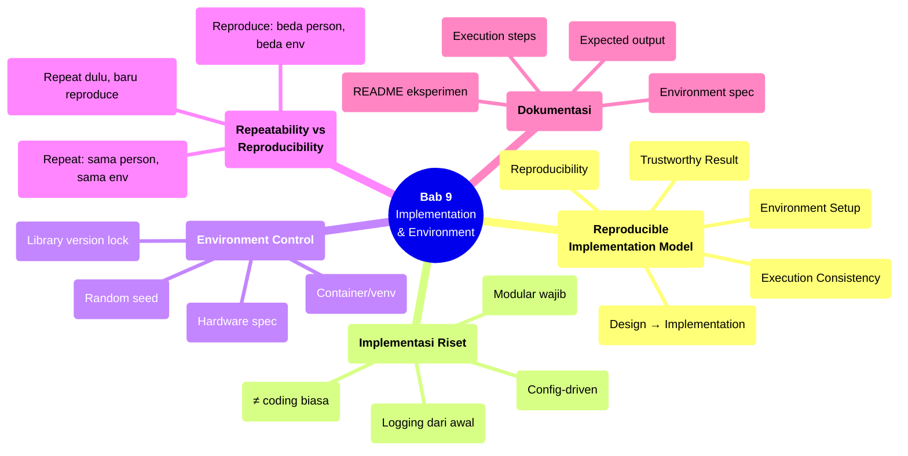

# Bab 9 — Implementation & Environment

> **Sub-CPMK:** 3.1 — Mengimplementasikan sistem dan environment eksperimen yang reproducible
> **CPMK:** CPMK03 — Research Execution
> **CPL Utama:** CPL06 (Desain & pengembangan)
> **Fase:** Executing (M9–M12)
> **Signature Model:** Reproducible Implementation Model (Experiment Design → Implementation → Environment Setup → Execution Consistency → Reproducibility → Trustworthy Result)

---

## Ringkasan Bab

Bab ini membahas langkah transisi dari desain ke eksekusi: mengimplementasikan sistem eksperimen dan menyiapkan environment yang reproducible. Implementasi dalam riset berbeda secara fundamental dari coding biasa — tujuannya bukan menghasilkan software yang berfungsi, melainkan menciptakan instrumen pengukuran yang konsisten dan bisa direproduksi. Kita akan belajar mengelola environment (hardware, software, dependency), membedakan repeatability dari reproducibility, dan mendokumentasikan setup dengan standar yang memungkinkan siapa pun mereplikasi eksperimen.

---

## 9.1 Pembuka

Bab 8 menghasilkan proposal yang koheren — sebuah rencana. Tapi rencana bukan eksperimen. Transisi dari desain ke eksekusi ternyata bukan sekadar "mulai coding." Ada jarak yang sering diremehkan antara "saya tahu apa yang akan saya bangun" dan "saya memiliki sistem yang siap dieksperimenkan."

Jarak itu diisi oleh tiga hal: **implementasi yang konsisten**, **environment yang terkontrol**, dan **dokumentasi yang memungkinkan reproduksi**. Tanpa ketiganya, eksperimen mungkin berhasil di mesin peneliti — tapi tidak bisa diverifikasi, diulang, atau dipercaya oleh siapapun.

Wohlin et al. (2012) menjelaskan bahwa dalam software engineering experiments, variasi tak terencana pada environment (versi library, konfigurasi OS, spesifikasi hardware) bisa mengubah hasil secara signifikan. Dua peneliti yang menjalankan "eksperimen yang sama" pada environment berbeda mungkin mendapat hasil berbeda — bukan karena metode berbeda, melainkan karena *infrastruktur* berbeda. Ini bukan ancaman teoretis; studi replikasi di machine learning secara konsisten menunjukkan bahwa reproduksi hasil lebih sulit dari yang diasumsikan.

Pertanyaan sentral bab ini: **Bagaimana memastikan bahwa eksperimen yang "berhasil" di mesin kita bisa direproduksi oleh siapa pun, kapan pun, di mana pun?**

---

## 9.2 Reproducible Implementation Model

Model ini menunjukkan bahwa trustworthy result bukan hanya produk dari desain eksperimen yang baik — ia juga produk dari implementasi dan environment yang terkontrol.

**Gambar 9.1** — Reproducible Implementation Model

```mermaid
graph LR
    A["📋 <b>Experiment<br/>Design</b><br/><i>Rencana dari Bab 7</i>"]
    B["💻 <b>Implementation</b><br/><i>Kode & sistem</i>"]
    C["🖥️ <b>Environment<br/>Setup</b><br/><i>HW, SW, dependency</i>"]
    D["🔄 <b>Execution<br/>Consistency</b><br/><i>Setiap run identik</i>"]
    E["♻️ <b>Reproducibility</b><br/><i>Siapa pun bisa<br/>mengulang</i>"]
    F["✅ <b>Trustworthy<br/>Result</b><br/><i>Hasil yang<br/>dipercaya</i>"]

    A -->|"Coding"| B
    B -->|"Konfigurasi"| C
    C -->|"Kontrol"| D
    D -->|"Dokumentasi"| E
    E -->|"Verifikasi"| F

    style A fill:#FFF7ED,stroke:#EA580C,color:#7C2D12
    style B fill:#FFEDD5,stroke:#EA580C,color:#7C2D12
    style C fill:#FED7AA,stroke:#EA580C,color:#7C2D12
    style D fill:#FDBA74,stroke:#EA580C,color:#FFFFFF
    style E fill:#FB923C,stroke:#C2410C,color:#FFFFFF
    style F fill:#EA580C,stroke:#C2410C,color:#FFFFFF
```



Setiap transisi memiliki syarat:

1. **Design → Implementation (Coding).** Desain eksperimen diterjemahkan menjadi kode. Setiap modul sistem harus sesuai dengan mapping variabel-ke-komponen dari Bab 6. Implementasi yang tidak sesuai desain menghasilkan eksperimen yang menguji sesuatu yang berbeda dari yang direncanakan.

2. **Implementation → Environment Setup (Konfigurasi).** Kode memerlukan environment: versi Python/Java, library dependencies, GPU driver, dataset path, OS. Jika environment tidak didefinisikan secara eksplisit, eksperimen hanya bisa berjalan di mesin yang kebetulan memiliki konfigurasi serupa.

3. **Environment → Execution Consistency (Kontrol).** Setiap kali eksperimen dijalankan, hasilnya harus konsisten (atau variasinya terukur). Ini memerlukan: random seed terkunci, urutan eksekusi deterministik, dan kondisi environment yang stabil.

4. **Consistency → Reproducibility (Dokumentasi).** Konsistensi internal belum cukup. Agar orang lain bisa mereproduksi, dokumentasi harus lengkap: versi kode, environment spec, parameter, data, dan langkah-langkah eksekusi.

5. **Reproducibility → Trustworthy Result (Verifikasi).** Hasil baru dipercaya ketika ada jaminan bahwa siapa pun yang mengikuti dokumentasi akan mendapat hasil yang sama atau sangat serupa.

---

## 9.3 Definisi Kunci

**Repeatability**
: Kemampuan untuk mendapatkan hasil yang sama ketika eksperimen diulang oleh **peneliti yang sama**, di **environment yang sama**, dengan **kode yang sama**. Repeatability adalah syarat minimum — jika eksperimen tidak bisa diulang sendiri, ia pasti tidak bisa direproduksi oleh orang lain.

**Reproducibility**
: Kemampuan untuk mendapatkan hasil yang sama (atau serupa) ketika eksperimen diulang oleh **peneliti berbeda**, di **environment berbeda**, mengikuti **dokumentasi yang disediakan**. Reproducibility adalah standar emas riset ilmiah (Wohlin et al., 2012).

**Environment Specification**
: Deskripsi lengkap tentang seluruh komponen infrastruktur yang diperlukan untuk menjalankan eksperimen: hardware (CPU, RAM, GPU), operating system, versi bahasa pemrograman, library dependencies (dengan versi), konfigurasi parameter, dan random seed.

**Dependency**
: Komponen eksternal (library, framework, API) yang dibutuhkan oleh kode eksperimen. Dependency yang tidak di-lock versinya adalah sumber variasi tak terkontrol — library versi baru mungkin memiliki perilaku yang berbeda dari versi yang digunakan saat eksperimen asli.

---

## 9.4 Konsep Inti

### 9.4.1 Implementasi Riset ≠ Coding Biasa

Perbedaan fundamental antara coding proyek software dan coding untuk riset terletak pada **tujuan akhir**. Proyek software bertujuan menghasilkan sistem yang berfungsi untuk pengguna. Kode riset bertujuan menghasilkan **instrumen pengukuran** yang konsisten.

Konsekuensi praktis dari perbedaan ini:

**Modularity bukan opsional.** Bab 6 sudah menjelaskan bahwa komponen sistem harus dipetakan ke variabel. Saat implementasi, pemetaan ini harus dipertahankan: modul preprocessing terpisah dari modul model, modul evaluasi terpisah dari modul training. Jika godaan muncul untuk "menyederhanakan" dengan menggabungkan modul — jangan. Modularitas adalah syarat untuk isolasi variabel.

**Hardcoded parameter adalah musuh.** Setiap parameter eksperimen — learning rate, batch size, jumlah epoch, threshold, random seed — harus disimpan di config file, bukan di dalam kode. Perubahan konfigurasi tidak boleh memerlukan perubahan kode. Ini bukan tentang "clean code"; ini tentang kemampuan menjalankan eksperimen dengan kondisi berbeda tanpa risiko memperkenalkan bug.

**Logging bukan afterthought.** Sistem harus mencatat: input yang diterima, parameter yang digunakan, output yang dihasilkan, waktu eksekusi, dan environment info. Tanpa log, debugging hasil yang aneh menjadi tebak-tebakan.

### 9.4.2 Environment Control: Hardware, Software, Dependency

Environment adalah segalanya yang mengelilingi kode — dan ia bisa mengubah hasil secara diam-diam. Beberapa sumber variasi environment yang sering diabaikan:

**Versi library.** TensorFlow 2.10 dan 2.15 bisa menghasilkan hasil training yang berbeda meskipun kode dan data identik. Perubahan implementasi internal (optimizer behavior, floating point handling) yang tidak terlihat di API level bisa menyebabkan perbedaan output. Solusi: gunakan dependency lock file (`requirements.txt` dengan versi pinned, `Pipfile.lock`, `package-lock.json`).

**Random seed.** Banyak proses dalam machine learning bersifat stokastik: inisialisasi weight, shuffling data, dropout. Tanpa random seed yang di-fix, dua run identik bisa menghasilkan hasil berbeda. Tapi perhatian: fix seed di satu library tidak cukup — Python, NumPy, dan framework ML masing-masing memiliki random generator sendiri. Semua harus di-set.

**Hardware.** GPU yang berbeda (model berbeda, memori berbeda) bisa menghasilkan hasil floating point yang sedikit berbeda karena paralelisme dan urutan operasi. Ini biasanya tidak mengubah kesimpulan, tapi bisa menyebabkan perbedaan numerik di belakang koma. Dokumentasikan spesifikasi hardware yang digunakan.

**Lingkungan OS.** Path separator, encoding default, environment variable — semua ini bisa berbeda antar OS. Kode yang berjalan di Linux mungkin gagal di Windows karena perbedaan path handling. Jika feasible, gunakan container (Docker) untuk mengisolasi environment.

### 9.4.3 Repeatability vs Reproducibility: Dua Level Kepercayaan

Repeatability dan reproducibility sering dicampuradukkan, padahal keduanya mengukur hal yang berbeda:

**Repeatability** menjawab: "Jika saya tekan 'run' lagi sekarang, apakah hasilnya sama?" Ini paling dasar, tapi banyak eksperimen gagal di sini karena random seed tidak terkunci, data di-shuffle ulang, atau environment berubah (update library otomatis).

**Reproducibility** menjawab: "Jika orang lain mengikuti instruksi saya, apakah ia bisa mendapat hasil yang sama?" Ini jauh lebih sulit karena melibatkan: apakah dokumentasi cukup lengkap? Apakah semua dependency terdaftar? Apakah data tersedia? Apakah langkah-langkah cukup rinci?

Dalam praktek, prioritaskan repeatability dulu. Jika eksperimen tidak bisa diulang oleh peneliti sendiri, ia pasti tidak bisa direproduksi oleh orang lain. Setelah repeatability tercapai, tambahkan dokumentasi dan packaging untuk mencapai reproducibility.

### 9.4.4 Dokumentasi: README Eksperimen sebagai Kontrak

Dokumentasi eksperimen bukan formalitas — ia kontrak antara peneliti dengan komunitas ilmiah. Minimum yang harus didokumentasikan:

1. **Environment specification** — Versi bahasa, library, OS, hardware
2. **Installation steps** — Langkah-langkah dari mesin kosong sampai siap run
3. **Data** — Di mana data tersedia, bagaimana preprocessing, format apa
4. **Execution** — Command atau script untuk menjalankan eksperimen
5. **Expected output** — Apa yang seharusnya muncul jika berhasil
6. **Configuration** — Semua parameter dan cara mengubahnya

Format standar: README.md di root repository eksperimen. Jika memungkinkan, sertakan script otomatis (`setup.sh`, `run_experiment.py`) yang menjalankan seluruh pipeline dengan satu command.

---

## 9.5 Research vs Engineering

**Tabel 9.1** — Perspektif Implementasi: Engineering vs Research

| Aspek | Engineering | Research |
|-------|------------|----------|
| **Tujuan** | Sistem yang berfungsi untuk user | Instrumen pengukuran yang konsisten |
| **Dependency management** | Update ke versi terbaru (fitur baru, security patch) | Lock di versi spesifik (konsistensi hasil) |
| **Testing** | Unit test, integration test, E2E test | Repeatability test (run ulang → hasil sama?) |
| **Dokumentasi** | User guide, API docs | Environment spec, execution steps, expected output |
| **Config** | Default yang masuk akal | Setiap parameter eksplisit dan adjustable |
| **Kode cleanup** | Refactor, DRY, abstraksi | Hati-hati — refactor bisa mengubah perilaku |

Perbedaan di baris terakhir sering diabaikan. Dalam engineering, refactoring kode untuk membuatnya lebih bersih adalah praktik baik. Dalam riset, refactoring di tengah eksperimen berbahaya — perubahan kode sekecil apa pun bisa mengubah perilaku dan menginvalidasi hasil sebelumnya. Refactor hanya sebelum eksperimen dimulai, tidak selama data dikumpulkan.

---

## 9.6 Research Reality

### Fenomena 1 — "Berjalan di Laptop Saya"

Situasi klasik: eksperimen berhasil di laptop peneliti, tapi ketika reviewer atau pembimbing mencoba mereplikasi, hasilnya berbeda — atau bahkan error. Penyebab paling umum: dependency yang tidak terdaftar (library terinstall tapi tidak ada di requirements), environment variable yang di-set manual tapi tidak didokumentasikan, atau data path yang hardcoded ke lokasi lokal.

Solusi yang sederhana tapi efektif: sebelum mengklaim eksperimen berhasil, coba jalankan dari environment bersih (fresh virtual environment atau container). Jika gagal, dokumentasi belum lengkap.

### Fenomena 2 — "Hasil Berubah Setelah Update Library"

Seorang peneliti menjalankan eksperimen di bulan Maret dan mendapat akurasi 91%. Di bulan Juni, saat menulis laporan, ia menjalankan ulang — dan akurasi turun menjadi 88%. Setelah investigasi, ternyata library scikit-learn ter-update secara otomatis, dan implementasi internal random forest sedikit berubah. Tiga bulan kerja analisis menjadi usang karena dependency tidak di-lock.

Lesson: `pip install scikit-learn` tanpa versi spesifik adalah bom waktu. Selalu gunakan `scikit-learn==1.3.2` (atau versi spesifik lainnya) di requirements.

### Fenomena 3 — "Random Seed? Tidak Penting..."

Banyak peneliti pemula menganggap random seed hanya mempengaruhi "sedikit." Dalam beberapa kasus memang benar — perbedaannya mungkin 0.1-0.5%. Tapi dalam kasus lain (dataset kecil, model sensitif, split yang tidak representatif), perbedaan bisa mencapai 3-5%. Jika eksperimen membandingkan dua metode dengan perbedaan 2%, dan random seed menghasilkan variasi 3%, maka kesimpulan eksperimen sepenuhnya ditentukan oleh kebetulan — bukan oleh metode.

---

## 9.7 Cognitive Traps

### Trap 1: "Setup environment nanti saja, yang penting coding dulu"

Menunda environment setup ke akhir hampir selalu berakhir dengan dokumentasi yang tidak lengkap. Jika environment dibuat dari awal (virtual environment, requirements file, config template), setiap dependency yang ditambahkan otomatis terdokumentasi. Jika dibuat di akhir, harus rekonstruksi dari ingatan — dan selalu ada yang terlewat.

### Trap 2: "Kode saya sederhana, tidak perlu version control"

Setiap eksperimen — sekecil apa pun — harus di-version control (Git). Bukan hanya karena backup, tapi karena *traceability*: harus bisa diketahui versi kode mana yang menghasilkan data mana. Tanpa version control, situasi "data ini dihasilkan oleh versi kode yang mana?" tidak bisa dijawab.

### Trap 3: "Docker/container terlalu ribet untuk riset kecil"

Benar bahwa container memiliki learning curve. Tapi untuk eksperimen yang melibatkan multiple dependencies, model training, atau interaksi dengan system-level library, container menyelesaikan mayoritas masalah reproducibility sekaligus. Investasi waktu untuk setup Docker di awal sering terbayar berkali-kali lipat saat harus mereproduksi eksperimen berbulan-bulan kemudian.

### Trap 4: "Hasilnya sama persis tiga kali, pasti sudah repeatable"

Tiga run yang sama belum menjamin repeatability — mungkin random seed tidak benar-benar aktif dan hasilnya deterministik secara kebetulan (contoh: cache yang menyimpan hasil sebelumnya). Uji repeatability yang benar: ubah random seed secara sadar, jalankan beberapa kali, dan verifikasi bahwa variasi hasilnya terukur dan masuk akal.

---

## 9.8 Studi Kasus

### Kasus 1 (Basic): "Eksperimen Tidak Bisa Diulang — Dependency Hilang"

**Konteks:**

Seorang peneliti mengembangkan model klasifikasi teks menggunakan Python. Setelah 3 bulan pengembangan, hasilnya memuaskan (F1 82%). Saat diminta mereplikasi untuk verifikasi, ia membuat virtual environment baru dan menjalankan `pip install -r requirements.txt` — tapi script error karena library `ftfy` (digunakan untuk text cleaning) tidak ada di requirements. Setelah install manual, versi `ftfy` terbaru ternyata mengubah perilaku fungsi `fix_text()`, dan hasil preprocessing berbeda. F1 turun ke 78%.

**❌ Pendekatan Salah:**

Requirements file dibuat di akhir proyek dengan `pip freeze > requirements.txt` — tapi di environment kerja sehari-hari, banyak library tidak relevan juga ikut terinstall di global, sehingga requirements bloated (200+ library) dan beberapa yang kritis justru terlewat karena diinstall terpisah.

**✅ Pendekatan Benar:**

Dari awal, gunakan virtual environment (venv atau conda) yang dedicated untuk proyek ini. Setiap kali install library baru: (1) install di venv, (2) tambahkan ke requirements dengan versi spesifik, (3) test bahwa pipeline masih berjalan. Sebelum finalisasi, uji reproducibility: buat venv baru, install requirements, jalankan pipeline dari awal.

**Perbandingan:**

| Aspek | Bad | Good |
|-------|-----|------|
| **Requirements** | Dump di akhir, bloated, ada yang terlewat | Maintained sepanjang development, versi pinned |
| **Virtual environment** | Global install, campur dengan proyek lain | Dedicated venv dari awal |
| **Reproducibility test** | Tidak pernah diuji | Diuji di environment bersih sebelum finalisasi |

**Pelajaran:** Reproducibility bukan tugas akhir — ia proses yang dimulai dari hari pertama implementasi.

---

### Kasus 2 (Advanced): "Hasil Berbeda di GPU Berbeda — Siapa yang Benar?"

**Konteks:**

Sebuah tim mentraining model deep learning di dua mesin: Mesin A (NVIDIA RTX 3090, CUDA 11.7, cuDNN 8.4) dan Mesin B (NVIDIA A100, CUDA 12.0, cuDNN 8.9). Kode, data, random seed, dan hyperparameter identik. Training di Mesin A menghasilkan akurasi 87.3%. Training di Mesin B menghasilkan 88.1%. Perbedaan 0.8% kecil tapi konsisten di multiple run.

**❌ Pendekatan Salah:**

Melaporkan 88.1% (Mesin B) karena lebih tinggi, tanpa menyebutkan bahwa hasilnya berbeda di mesin lain. Atau membuang salah satu hasil dan hanya melaporkan satu mesin.

**✅ Pendekatan Benar:**

Mengakui bahwa perbedaan ini adalah artefak dari hardware (floating point arithmetic, parallelism order, cuDNN algorithm selection). Melaporkan kedua hasil. Menjalankan eksperimen di kedua mesin untuk semua kondisi (treatment dan baseline) — sehingga perbandingan *relatif* tetap valid meskipun angka absolut berbeda. Mendokumentasikan spesifikasi kedua mesin dan menyebutkan variasi hardware sebagai threat to validity.

**Perbandingan:**

| Aspek | Bad | Good |
|-------|-----|------|
| **Pelaporan** | Satu angka dari satu mesin | Kedua angka, variasi didokumentasikan |
| **Perbandingan** | Mungkin bias karena treatment dan baseline di mesin berbeda | Fair — semua kondisi dijalankan di setiap mesin |
| **Transparency** | Hardware tidak disebut | Spesifikasi lengkap, variasi diakui |

**Pelajaran:** Variasi hardware tidak bisa selalu dihilangkan — tapi bisa didokumentasikan dan dikelola. Yang penting bukan angka absolut identik, melainkan **perbandingan relatif yang konsisten** di setiap environment.

---

## 9.9 Template Praktis

### Template: Dokumentasi Setup Eksperimen

```
═══════════════════════════════════════════════════════════════
  EXPERIMENT SETUP DOCUMENTATION — [Judul Penelitian]
═══════════════════════════════════════════════════════════════

HARDWARE:
  CPU    : [Model, jumlah core]
  RAM    : [Kapasitas]
  GPU    : [Model, VRAM] (jika digunakan)
  Storage: [Tipe, kapasitas]

SOFTWARE:
  OS              : [Nama, versi]
  Language        : [Python 3.x / Java x / dll.]
  Framework       : [TensorFlow 2.x / PyTorch x.y / dll.]
  Key libraries   : [library==versi, library==versi, ...]
  CUDA / cuDNN    : [Versi] (jika GPU)

DEPENDENCY MANAGEMENT:
  Lock file       : [requirements.txt / Pipfile.lock / package-lock.json]
  Container       : [Docker image tag, jika ada]

CONFIGURATION:
  Config file     : [path ke config.yaml / config.json]
  Random seed     : [nilai]
  Key parameters  : [list parameter kunci dan nilainya]

DATA:
  Dataset         : [Nama, versi, sumber]
  Split           : [Train/Val/Test ratio, stratifikasi]
  Preprocessing   : [Langkah-langkah]

EXECUTION:
  Setup command   : [pip install -r requirements.txt / docker build / dll.]
  Run command     : [python run_experiment.py --config config.yaml]
  Expected output : [Deskripsi output yang seharusnya muncul]
  Expected runtime: [Estimasi per-run]

VERSION CONTROL:
  Repository      : [URL atau lokasi]
  Commit/tag      : [Hash atau tag yang digunakan untuk eksperimen]

═══════════════════════════════════════════════════════════════
```

---

## 9.10 Mindmap Ringkasan

**Gambar 9.2** — Mindmap Bab 9: Implementation & Environment



---

## 9.11 Rangkuman

**Poin-poin utama bab ini:**

1. Implementasi dalam riset bukan coding biasa — tujuannya menciptakan instrumen pengukuran yang konsisten, bukan software yang berfungsi. Modularitas, config-driven execution, dan logging dari awal adalah keharusan.

2. Environment control mencakup: versi library (di-lock), random seed (di-set untuk semua library), hardware specification (didokumentasikan), dan OS/dependency (idealnya di-containerkan).

3. Repeatability (bisa diulang sendiri) dan reproducibility (bisa diulang orang lain) adalah dua level kepercayaan yang berbeda. Capai repeatability dulu, lalu tambahkan dokumentasi untuk reproducibility.

4. Dokumentasi setup eksperimen bukan formalitas akhir — ia proses yang dimulai dari hari pertama. README eksperimen harus memungkinkan siapa pun mereplikasi dari nol.

5. Variasi environment (hardware, library version) bisa mengubah hasil. Yang penting bukan menghilangkan variasi sepenuhnya, melainkan mendokumentasikan dan memastikan perbandingan relatif tetap konsisten.

Dengan sistem terimplementasi dan environment terkontrol, langkah berikutnya adalah menjalankan eksperimen itu sendiri. Bab 10 membahas execution plan, multiple run, data collection, dan bagaimana memastikan proses pengumpulan data menghasilkan dataset yang layak dianalisis.

> *"Riset bukan hanya tentang apa yang ditemukan, tetapi apakah temuan itu bisa diverifikasi oleh siapa pun yang mengikuti langkah yang sama."*

---

## 9.12 Latihan & Refleksi

### Latihan 1 — Setup Reproducibility

Dari sistem yang dirancang di latihan Bab 6, buat dokumentasi setup eksperimen menggunakan template di Section 9.9. Pastikan setiap field terisi. Lalu minta satu rekan untuk mencoba mereplikasi setup berdasarkan dokumentasi saja (tanpa bantuan verbal) — catat di mana mereka tersandung.

### Latihan 2 — Repeatability Test

Jalankan eksperimen (atau latihan eksperimen) dua kali berturut-turut dengan konfigurasi identik. Bandingkan hasilnya. Jika berbeda: identifikasi penyebabnya (random seed? dependency? caching?). Jika sama: ubah random seed dan jalankan lagi — apakah variasi hasilnya masuk akal?

### Latihan 3 — Dependency Audit

Pilih satu proyek riset open-source dari GitHub. Evaluasi reproducibility-nya: apakah requirements lengkap? Apakah versi di-lock? Apakah ada instruksi setup yang jelas? Apakah random seed disediakan? Beri skor 1-5 untuk setiap aspek dan jelaskan alasannya.

### Refleksi

> "Jika laptop saya hilang besok, apakah dokumentasi yang saya miliki cukup untuk membangun ulang seluruh eksperimen dari nol?"

---

## Daftar Pustaka

- Wohlin, C., Runeson, P., Höst, M., Ohlsson, M. C., Regnell, B., & Wesslén, A. (2012). *Experimentation in Software Engineering*. Springer.
- Hevner, A. R., March, S. T., Park, J., & Ram, S. (2004). Design Science in Information Systems Research. *MIS Quarterly*, 28(1), 75–105.

<!-- STATUS: 🟢 Draft Complete -->

<!-- STATUS: ⬜ Not Started -->
