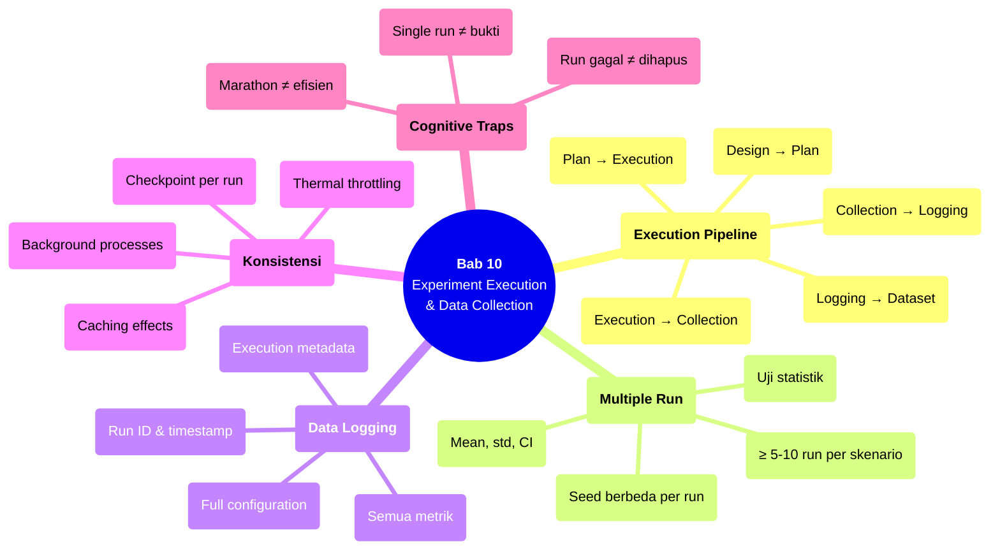

# Bab 10 — Experiment Execution & Data Collection

> **Sub-CPMK:** 3.2 — Menjalankan eksperimen terkontrol dan mengumpulkan data
> **CPMK:** CPMK03 — Research Execution
> **CPL Utama:** CPL06 (Desain & pengembangan)
> **Fase:** Executing (M9–M12)
> **Signature Model:** Experiment Execution Pipeline (Design → Execution Plan → Controlled Execution → Data Collection → Data Logging → Dataset for Analysis)

---

## Ringkasan Bab

Bab ini membahas bagaimana menjalankan eksperimen yang sudah dirancang: menyusun execution plan, memastikan konsistensi setiap run, mengumpulkan data secara sistematis, dan menyimpan log yang lengkap. Menjalankan eksperimen bukan sekadar menekan tombol "run" — ia proses terkontrol yang memerlukan perencanaan jumlah run, urutan eksekusi, mekanisme logging, dan verifikasi bahwa setiap skenario dijalankan sesuai rencana.

---

## 10.1 Pembuka

Bab 9 menyiapkan infrastruktur: sistem terimplementasi, environment terkontrol, dependency terkunci. Sekarang saatnya menjalankan eksperimen. Dan di sinilah banyak peneliti membuat kesalahan yang tidak mereka sadari sampai tahap analisis.

Kesalahan paling umum? **Single run**. Seorang peneliti menjalankan eksperimen sekali, mendapat angka, lalu melaporkannya. Tapi satu run tidak cukup untuk membuat klaim ilmiah. Hasil dari satu run bisa dipengaruhi oleh variasi stokastik (random initialization, data shuffling, non-determinisme GPU), kondisi sesaat (beban CPU saat itu, caching OS), atau kebetulan (split data yang kebetulan mudah).

Wohlin et al. (2012) menjelaskan bahwa eksperimen yang valid harus dijalankan **multiple times** untuk memastikan bahwa hasilnya stabil — bukan artefak dari satu kondisi lucky. Berapa kali? Tergantung variabilitas, tapi prinsip umumnya: cukup banyak untuk menghitung statistik deskriptif yang bermakna (rata-rata, standar deviasi, confidence interval).

Selain multiple run, aspek kritis lainnya adalah **data collection yang sistematis**. Data yang dikumpulkan harus lengkap (semua run tercatat), konsisten (format sama), dan traceable (setiap data point bisa ditelusuri ke run spesifik dengan konfigurasi spesifik). Jika data hilang, tidak konsisten, atau tidak bisa ditelusuri — analisis selanjutnya dibangun di atas fondasi yang rapuh.

Pertanyaan sentral bab ini: **Bagaimana memastikan bahwa eksekusi eksperimen menghasilkan dataset yang valid, lengkap, dan siap dianalisis?**

---

## 10.2 Experiment Execution Pipeline

Model ini menggambarkan alur dari desain eksperimen hingga dataset yang siap analisis.

**Gambar 10.1** — Experiment Execution Pipeline


Setiap transisi:

1. **Design → Execution Plan.** Desain eksperimen (Bab 7) diterjemahkan menjadi rencana eksekusi konkret: berapa skenario, berapa run per skenario, random seed apa yang digunakan, urutan eksekusi bagaimana.

2. **Execution Plan → Controlled Execution.** Setiap skenario dijalankan sesuai rencana. "Controlled" berarti: satu variabel berubah per skenario, semua variabel kontrol dijaga, environment konsisten.

3. **Controlled Execution → Data Collection.** Output dari setiap run dikumpulkan: metrik yang diukur, prediksi per-sampel, waktu eksekusi, resource usage.

4. **Data Collection → Data Logging.** Data mentah distrukturkan dengan metadata: run ID, timestamp, konfigurasi yang digunakan, environment info.

5. **Data Logging → Dataset for Analysis.** Log divalidasi: apakah semua run tercatat? Apakah ada data yang hilang? Apakah format konsisten? Dataset yang lulus validasi siap masuk ke tahap analisis.

---

## 10.3 Definisi Kunci

**Execution Plan**
: Dokumen yang mendeskripsikan secara rinci bagaimana eksperimen akan dijalankan: urutan skenario, jumlah run per skenario, parameter per run, random seed per run, dan checklist pra-eksekusi. Execution plan adalah "resep" yang memastikan eksperimen berjalan secara sistematis.

**Multiple Run**
: Praktek menjalankan setiap skenario eksperimen lebih dari satu kali (dengan random seed berbeda) untuk menangkap variabilitas stokastik dan memungkinkan perhitungan statistik deskriptif (mean, std, CI). Single run tidak cukup untuk klaim ilmiah.

**Data Log**
: Catatan terstruktur dari setiap run eksperimen yang mencakup: identitas run (ID, timestamp), konfigurasi (parameter, seed), dan hasil (metrik, output). Data log harus cukup lengkap untuk merekonstruksi run secara teoritis.

**Run Traceability**
: Kemampuan untuk menghubungkan setiap data point dengan run spesifik, konfigurasi spesifik, dan code version spesifik. Tanpa traceability, data anomali tidak bisa diinvestigasi.

---

## 10.4 Konsep Inti

### 10.4.1 Execution Plan: Dari Desain ke Jadwal Konkret

Execution plan menerjemahkan desain eksperimen menjadi langkah-langkah yang bisa dieksekusi. Elemennya:

**Daftar skenario.** Setiap kondisi eksperimental (baseline, treatment 1, treatment 2, dst.) didaftarkan secara eksplisit. Dari desain di Bab 7, ini sudah terdefinisi — execution plan hanya memformatnya menjadi daftar yang executable.

**Jumlah run per skenario.** Berapa kali setiap skenario dijalankan? Minimum yang umum dalam riset machine learning: 5-10 run dengan random seed berbeda. Untuk eksperimen yang melibatkan subjek manusia: tergantung power analysis. Kuncinya: jumlah run harus cukup untuk menghitung standar deviasi dan confidence interval yang bermakna.

**Random seed per run.** Setiap run menggunakan seed yang berbeda, tapi seed-nya didaftarkan di execution plan — bukan dipilih secara acak pada saat run. Ini memungkinkan reproduksi setiap run individu jika diperlukan.

**Urutan eksekusi.** Dalam beberapa kasus, urutan bisa mempengaruhi hasil (terutama jika melibatkan caching, GPU thermal throttling, atau dataset yang berubah antar-run). Randomisasi urutan atau counterbalancing bisa mengurangi bias urutan.

**Checklist pra-eksekusi.** Sebelum run pertama: (1) environment sudah di-set sesuai dokumentasi, (2) config file sesuai skenario, (3) data tersedia dan utuh, (4) logging aktif, (5) disk space cukup.

### 10.4.2 Multiple Run: Mengapa Satu Run Tidak Pernah Cukup

Satu run menghasilkan satu angka. Satu angka tidak memiliki distribusi, tidak memiliki variabilitas, dan tidak bisa diuji secara statistik. Pertanyaan "apakah metode A lebih baik dari metode B?" tidak bisa dijawab dari satu angka per metode.

Dengan multiple run (misal 10 run per skenario), didapat:
- **Rata-rata (mean)** — estimasi sentral dari performa
- **Standar deviasi (std)** — seberapa besar variasi antar-run
- **Confidence interval** — rentang di mana performa sebenarnya kemungkinan berada
- **Uji statistik** — apakah perbedaan mean antara dua skenario signifikan atau kebetulan

Contoh: Metode A menghasilkan akurasi [88.1, 87.5, 88.3, 87.9, 88.0] (mean=87.96, std=0.30). Metode B menghasilkan [87.2, 88.4, 86.8, 88.1, 87.0] (mean=87.50, std=0.70). Mean A lebih tinggi, tapi variabilitas B lebih besar. Apakah perbedaan 0.46% signifikan? Hanya uji statistik yang bisa menjawab — dan uji statistik memerlukan multiple data points.

Single run? A=88.1, B=87.2. Kesimpulan naif: "A lebih baik 0.9%." Tapi jika run berikutnya A=87.5 dan B=88.4, kesimpulan terbalik. Tanpa variabilitas, angka tunggal bisa menipu.

### 10.4.3 Data Logging: Apa yang Harus Dicatat

Setiap run eksperimen harus menghasilkan log yang mencakup:

**Identitas run:**
- Run ID (unik, konsisten)
- Timestamp (mulai dan selesai)
- Skenario (baseline/treatment)

**Konfigurasi:**
- Semua parameter (termasuk yang default)
- Random seed
- Dataset version/path
- Code version (commit hash)

**Hasil:**
- Metrik utama (primary metric)
- Metrik sekunder (secondary metrics)
- Output detail jika diperlukan (confusion matrix, prediksi per-sampel, loss curve)

**Metadata eksekusi:**
- Waktu eksekusi (training, inference)
- Resource usage (GPU memory, CPU load)
- Warning atau error yang muncul

Format logging: strukturisasi dalam format yang mudah diproses — CSV, JSON, atau database. Hindari logging ke stdout yang kemudian di-copy-paste manual. Otomasi logging mengurangi human error dan meningkatkan konsistensi.

### 10.4.4 Konsistensi Eksekusi: Menjaga Kontrol di Setiap Run

Konsistensi berarti: variabel kontrol benar-benar terkontrol di setiap run. Beberapa ancaman konsistensi yang sering diabaikan:

**Background processes.** Jika eksperimen mengukur waktu eksekusi, beban CPU dari aplikasi lain bisa mengubah hasil. Tutup aplikasi yang tidak diperlukan, atau bahkan lebih baik — jalankan eksperimen di mesin dedicated.

**Caching.** Run pertama mungkin lebih lambat karena cold cache. Run berikutnya lebih cepat karena data sudah di-cache di memory/disk. Solusi: warming run sebelum data collection dimulai, atau flush cache antar-run.

**Disk I/O variability.** Operasi yang melibatkan baca/tulis disk bisa bervariasi tergantung fragmentasi, aktivitas lain, atau jenis storage (HDD vs SSD). Jika I/O time kritis, monitor dan dokumentasikan.

**Thermal throttling.** GPU yang dijalankan berkepanjangan bisa mengalami thermal throttling — menurunkan clock speed untuk menjaga temperatur. Ini memperlambat run berikutnya tanpa perubahan kode atau konfigurasi. Monitoring temperatur GPU bisa membantu mendeteksi masalah ini.

---

## 10.5 Research vs Engineering

**Tabel 10.1** — Perspektif Eksekusi: Engineering vs Research

| Aspek | Engineering | Research |
|-------|------------|----------|
| **Run** | Sekali jalan (deploy ke production) | Multiple run (minimal 5-10 dengan seed berbeda) |
| **Logging** | Error log, access log | Semua parameter, semua metrik, semua metadata |
| **Variasi** | Minimalisir (stabilitas) | Tangkap (ukur variabilitas) |
| **Urutan** | Tidak penting | Bisa bias — randomisasi/counterbalancing |
| **Anomali** | Bug → fix → redeploy | Investigasi → dokumentasi → analisis |

Perbedaan kritis pada penanganan anomali: dalam engineering, anomali adalah bug yang harus diperbaiki. Dalam riset, anomali bisa menjadi **temuan** — data yang tidak sesuai ekspektasi mungkin mengungkap sesuatu yang menarik tentang hipotesis atau desain eksperimen.

---

## 10.6 Research Reality

### Fenomena 1 — "Run Sekali, Langsung Laporan"

Ini mungkin masalah paling umum di riset TI: peneliti menjalankan eksperimen satu kali, mendapat angka, langsung memasukkannya ke tabel hasil. Tidak ada standar deviasi, tidak ada confidence interval, tidak ada uji statistik. Reviewer mendapat tabel dengan angka-angka tanpa konteks variabilitas — dan tidak bisa menilai apakah perbedaan yang terlihat bermakna atau kebetulan.

### Fenomena 2 — "Log Hilang, Data Tidak Bisa Ditelusuri"

Situasi: analisis menunjukkan satu run yang anomali (jauh lebih rendah dari rata-rata). Apakah ini outlier yang legitimate? Atau ada kesalahan konfigurasi di run tersebut? Tanpa log yang lengkap — parameter, seed, timestamp, environment — pertanyaan ini tidak bisa dijawab. Dan tanpa jawaban, keputusan untuk menyertakan atau mengecualikan data point tersebut menjadi arbitrary.

### Fenomena 3 — "Eksperimen Marathon: 72 Jam Non-stop"

Beberapa peneliti menjalankan seluruh eksperimen (semua skenario, semua run) dalam satu session panjang tanpa checkpoint. Jika crash di jam ke-60, data dari 60 jam sebelumnya mungkin hilang atau tidak bisa digunakan karena tidak di-save. Eksperimen harus di-checkpoint secara berkala — simpan hasil per-run segera setelah selesai, bukan setelah semua run selesai.

---

## 10.7 Cognitive Traps

### Trap 1: "Satu angka sudah cukup meyakinkan"

Satu angka tanpa distribusi tidak pernah cukup. Akurasi 91% dari satu run bisa menjadi 88% di run berikutnya — atau 94%. Tanpa multiple run, tidak diketahui apakah 91% itu titik tengah, ujung atas, atau ujung bawah dari distribusi performa sebenarnya. Selalu laporkan mean ± std (atau confidence interval).

### Trap 2: "Random seed tidak penting untuk algoritma deterministik"

Bahkan algoritma yang terlihat deterministik bisa memiliki komponen stokastik yang tersembunyi: urutan iterasi, threading, floating point accumulation order. Dan meskipun algoritmanya benar-benar deterministik, data split biasanya stokastik. Variasi split → variasi hasil. Uji dengan multiple seed tetap diperlukan.

### Trap 3: "Run yang gagal bisa dihapus saja"

Run yang gagal (error, crash, anomali) tidak boleh dihapus tanpa dokumentasi. Jika dihapus, dataset menjadi bias (hanya menyimpan run yang "berhasil"). Jika gagal karena bug, dokumentasikan dan re-run setelah fix. Jika gagal karena alasan legitimate (out of memory, timeout), dokumentasikan sebagai informasi tentang batas kemampuan metode.

### Trap 4: "Semua run harus dilakukan hari ini"

Menjalankan 30 run dalam satu hari di satu mesin bisa terkena thermal throttling, resource contention, atau kelelahan (jika melibatkan human judgment). Lebih baik membagi run ke beberapa sesi — selama environment dan konfigurasi tetap identik di setiap sesi.

---

## 10.8 Studi Kasus

### Kasus 1 (Basic): "Single Run — Angka Tanpa Makna Statistik"

**Konteks:**

Sebuah paper melaporkan perbandingan tiga model NLP (BERT, LSTM, SVM) pada task klasifikasi review. Tabel hasil menunjukkan: BERT F1=89.2%, LSTM F1=85.7%, SVM F1=82.1%. Kesimpulan: "BERT secara signifikan lebih baik dari LSTM dan SVM."

**❌ Pendekatan Salah:**

Setiap model hanya dijalankan 1 kali. Tidak ada standar deviasi. Tidak ada uji statistik. Kata "signifikan" digunakan secara informal (bukan statistical significance). Reviewer tidak bisa menilai apakah perbedaan 3.5% (BERT vs LSTM) bermakna atau artefak dari satu data split tertentu.

**✅ Pendekatan Benar:**

Setiap model dijalankan 10 kali dengan random seed berbeda (seed 1-10, didaftarkan di execution plan). Hasil:

| Model | Mean F1 | Std | 95% CI |
|-------|---------|-----|--------|
| BERT | 88.4% | 1.2% | [87.5, 89.3] |
| LSTM | 86.1% | 1.8% | [84.8, 87.4] |
| SVM | 82.3% | 0.9% | [81.7, 82.9] |

Uji statistik (paired t-test atau Wilcoxon): BERT vs LSTM p=0.03 (signifikan). BERT vs SVM p<0.001 (signifikan). LSTM vs SVM p=0.001 (signifikan). Effect size dilaporkan.

Kesimpulan lebih nuanced: "BERT mengungguli LSTM (p=0.03, Cohen's d=1.5) dan SVM (p<0.001, d=6.9), meskipun perbedaan BERT-LSTM relatif kecil (2.3%) dengan overlap confidence interval."

**Pelajaran:** Multiple run mengubah "A lebih besar dari B" menjadi "A secara statistik lebih baik dari B dengan effect size tertentu" — klaim yang jauh lebih kuat dan jujur.

---

### Kasus 2 (Advanced): "Data Yang Hilang — Run Tidak Terdokumentasi"

**Konteks:**

Seorang peneliti menjalankan 20 run untuk eksperimen benchmark. Di tengah proses, 3 run crash karena GPU out of memory. Peneliti menjalankan ulang 3 run tersebut, tapi menggunakan batch size lebih kecil agar tidak crash. Hasil akhir: 20 run lengkap. Tapi 3 di antaranya menggunakan batch size berbeda dari 17 lainnya.

**❌ Pendekatan Salah:**

Tidak didokumentasikan bahwa 3 run menggunakan batch size berbeda. Semua 20 data point dicampur dan dihitung rata-rata. Batch size yang berbeda mungkin menghasilkan model yang sedikit berbeda — mencampurkan hasil dari dua konfigurasi berbeda menginvalidasi statistik.

**✅ Pendekatan Benar:**

Dokumentasikan masalah secara transparan. Opsi: (a) buang 3 run anomali dan hanya laporkan 17 run yang konsisten, (b) jalankan ulang semua 20 run dengan batch size yang lebih kecil (konsisten), atau (c) laporkan kedua set secara terpisah dan analisis efek batch size. Opsi manapun yang dipilih, justifikasi keputusan dan dokumentasikan anomali.

**Perbandingan:**

| Aspek | Bad | Good |
|-------|-----|------|
| **Dokumentasi** | Anomali tidak dicatat | Semua anomali terdokumentasi |
| **Konsistensi** | 3 run dengan config berbeda dicampur | Config identik, atau dipisah |
| **Transparansi** | Pembaca tidak tahu ada masalah | Masalah diakui dan ditangani |

**Pelajaran:** Transparency bukan kelemahan — ia menunjukkan rigor. Menyembunyikan anomali untuk membuat data "terlihat bersih" merusak integritas riset.

---

## 10.9 Template Praktis

### Template: Execution Plan & Data Log

```
═══════════════════════════════════════════════════════════════
  EXECUTION PLAN — [Judul Penelitian]
═══════════════════════════════════════════════════════════════

SKENARIO EKSPERIMEN:
  ┌─────────────┬────────────┬────────────┬──────────────────┐
  │ ID Skenario │ Kondisi IV │ Jumlah Run │ Seeds            │
  ├─────────────┼────────────┼────────────┼──────────────────┤
  │ S1-baseline │ [Metode A] │ 10         │ [42,43,...,51]   │
  ├─────────────┼────────────┼────────────┼──────────────────┤
  │ S2-treatment│ [Metode B] │ 10         │ [42,43,...,51]   │
  └─────────────┴────────────┴────────────┴──────────────────┘

PRE-EXECUTION CHECKLIST:
  □ Environment sesuai dokumentasi Bab 9
  □ Config file sesuai skenario
  □ Dataset tersedia dan checksum terverifikasi
  □ Logging aktif dan output path terdefinisi
  □ Disk space cukup untuk semua run
  □ Background processes diminimalkan

DATA LOG FORMAT (per run):
  ┌──────────┬────────────┬───────┬──────────┬──────────────┐
  │ Run ID   │ Scenario   │ Seed  │ Metrik   │ Timestamp    │
  ├──────────┼────────────┼───────┼──────────┼──────────────┤
  │ R001     │ S1-baseline│ 42    │ [nilai]  │ [datetime]   │
  ├──────────┼────────────┼───────┼──────────┼──────────────┤
  │ R002     │ S1-baseline│ 43    │ [nilai]  │ [datetime]   │
  └──────────┴────────────┴───────┴──────────┴──────────────┘

POST-EXECUTION CHECKLIST:
  □ Semua run tercatat (tidak ada yang hilang)
  □ Format data konsisten di semua run
  □ Anomali didokumentasikan
  □ Backup data sudah dibuat

═══════════════════════════════════════════════════════════════
```

---

## 10.10 Mindmap Ringkasan

**Gambar 10.2** — Mindmap Bab 10: Experiment Execution & Data Collection



---

## 10.11 Rangkuman

**Poin-poin utama bab ini:**

1. Execution plan menerjemahkan desain eksperimen menjadi langkah-langkah konkret: daftar skenario, jumlah run, random seed per run, dan urutan eksekusi.

2. Single run tidak pernah cukup untuk klaim ilmiah. Multiple run (5-10 minimum) memungkinkan perhitungan statistik deskriptif dan pengujian signifikansi.

3. Data logging harus mencakup identitas (run ID, timestamp), konfigurasi (semua parameter, seed, code version), dan hasil (semua metrik, output detail). Log harus otomatis dan terstruktur.

4. Konsistensi eksekusi memerlukan kontrol terhadap faktor-faktor yang bisa mempengaruhi hasil: background processes, caching, thermal throttling, dan disk I/O.

5. Anomali dan run yang gagal harus didokumentasikan — bukan dihapus. Transparansi menunjukkan rigor, bukan kelemahan.

Dengan dataset yang lengkap dan terdokumentasi, langkah berikutnya adalah memastikan data tersebut valid dan layak dianalisis. Bab 11 membahas proses validasi data dan mekanisme untuk membangun kepercayaan terhadap dataset eksperimen.

> *"Eksperimen bukan tombol 'run' yang ditekan sekali. Ia proses terkontrol yang memerlukan perencanaan, repetisi, dan dokumentasi di setiap langkah."*

---

## 10.12 Latihan & Refleksi

### Latihan 1 — Execution Plan

Buat execution plan lengkap untuk eksperimen dari latihan Bab 7. Tentukan: jumlah skenario, jumlah run per skenario, random seed per run, urutan eksekusi, dan pre-execution checklist. Pastikan plan cukup rinci untuk diikuti oleh orang lain tanpa penjelasan verbal.

### Latihan 2 — Multiple Run Analysis

Jalankan satu pipeline sederhana (misal: classifier di dataset publik) 10 kali dengan random seed 1-10. Hitung mean, std, dan 95% confidence interval. Bandingkan: apakah kesimpulan dari run tunggal (seed=1) sama dengan kesimpulan dari 10 run?

### Latihan 3 — Data Log Design

Rancang skema data log untuk eksperimen dari Latihan 1. Tentukan: kolom apa saja, format data, tempat penyimpanan, dan mekanisme otomasi. Implementasikan logging otomatis menggunakan bahasa yang relevan.

### Refleksi

> "Jika saya hanya punya waktu untuk satu hal ekstra di eksperimen saya — multiple run atau dokumentasi yang lebih baik — mana yang akan saya pilih, dan mengapa?"

---

## Daftar Pustaka

- Wohlin, C., Runeson, P., Höst, M., Ohlsson, M. C., Regnell, B., & Wesslén, A. (2012). *Experimentation in Software Engineering*. Springer.
- Field, A. (2018). *Discovering Statistics Using IBM SPSS Statistics* (5th ed.). SAGE Publications.
- Shadish, W. R., Cook, T. D., & Campbell, D. T. (2002). *Experimental and Quasi-Experimental Designs for Generalized Causal Inference*. Houghton Mifflin.

<!-- STATUS: 🟢 Draft Complete -->

<!-- STATUS: ⬜ Not Started -->
