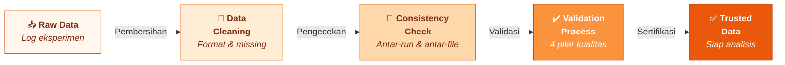
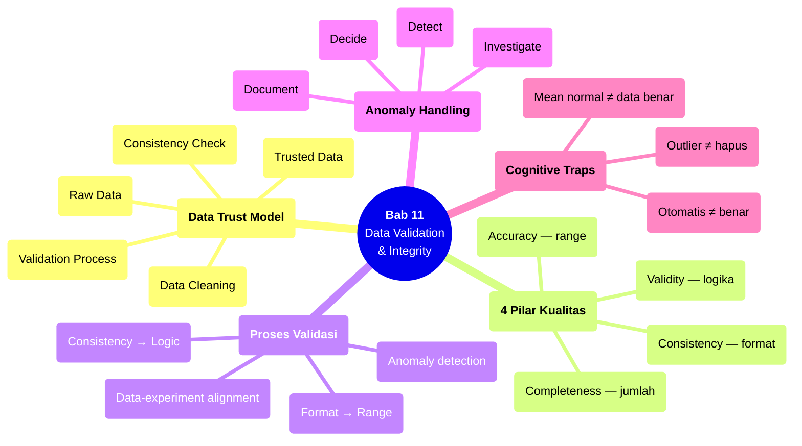

# Bab 11 — Data Validation & Integrity

> **Sub-CPMK:** 3.3 — Memvalidasi data eksperimen dan memastikan integritas dataset
> **CPMK:** CPMK03 — Research Execution
> **CPL Utama:** CPL06 (Desain & pengembangan)
> **Fase:** Executing (M9–M12)
> **Signature Model:** Data Trust Model (Raw Data → Data Cleaning → Consistency Check → Validation Process → Trusted Data)

---

## Ringkasan Bab

Bab ini membahas proses memastikan bahwa data yang dikumpulkan dari eksperimen layak dianalisis. Data mentah tidak serta-merta bisa langsung dimasukkan ke analisis — ia perlu divalidasi: apakah formatnya konsisten? Apakah ada data yang hilang? Apakah nilainya masuk akal? Apakah data sesuai dengan desain eksperimen? Validasi data adalah garis pertahanan terakhir sebelum analisis — jika data yang masuk ke analisis cacat, semua kesimpulan yang dihasilkan turut cacat.

---

## 11.1 Pembuka

Bab 10 menghasilkan dataset mentah: kumpulan log dari setiap run eksperimen, lengkap dengan metrik, parameter, dan metadata. Sekarang pertanyaannya: **apakah data ini bisa dipercaya?**

"Bisa dipercaya" bukan soal apakah hasilnya sesuai harapan — ini bukan tentang validasi hipotesis. Validasi data adalah tentang memastikan bahwa data tersebut **akurat, konsisten, lengkap, dan valid** sebelum digunakan untuk perhitungan statistik apa pun.

Mengapa tahap ini diperlukan? Beberapa skenario nyata:

- Satu run menghasilkan akurasi 0.001 — kemungkinan besar error, bukan performa model yang sebenarnya. Tanpa validasi, angka ini masuk ke rata-rata dan mendistorsi hasilnya.
- Log dari 2 run ternyata memiliki format kolom yang berbeda karena perubahan script di tengah eksperimen. Penggabungan langsung menghasilkan data yang salah alignment.
- Dari 30 planned run, hanya 28 yang ada di log. Dua run hilang tanpa penjelasan.

Han et al. (2012) mengidentifikasi empat pilar kualitas data: **accuracy, consistency, completeness, dan validity**. Keempat pilar ini menjadi kerangka kerja untuk validasi data eksperimen. Bab ini menerjemahkan kerangka tersebut menjadi proses konkret yang bisa diterapkan pada dataset hasil eksperimen.

Pertanyaan sentral bab ini: **Bagaimana memastikan bahwa dataset eksperimen layak dipercaya dan siap dianalisis?**

---

## 11.2 Data Trust Model

Model ini menggambarkan alur dari data mentah menuju data yang layak dipercaya untuk analisis.

**Gambar 11.1** — Data Trust Model



Setiap transisi:

1. **Raw Data → Data Cleaning.** Data mentah dari log eksperimen dibaca dan dibersihkan: parsing format, penanganan missing values, normalisasi tipe data. Tujuannya bukan mengubah data — melainkan memastikan data bisa dibaca dan diproses secara konsisten.

2. **Data Cleaning → Consistency Check.** Data yang sudah bersih diperiksa konsistensinya: apakah semua run memiliki kolom yang sama? Apakah jumlah data point sesuai dengan jumlah planned run? Apakah ada duplikasi?

3. **Consistency Check → Validation Process.** Data yang konsisten divalidasi terhadap empat pilar: apakah nilainya akurat (range), apakah format konsisten, apakah data lengkap, apakah data valid secara logis.

4. **Validation Process → Trusted Data.** Data yang lulus validasi "disertifikasi" sebagai trusted — siap digunakan untuk analisis statistik. Anomali yang terdeteksi didokumentasikan, bukan dihapus.

---

## 11.3 Definisi Kunci

**Accuracy (Akurasi Data)**
: Sejauh mana nilai data mencerminkan nilai sebenarnya. Metrik per-run harus berada dalam rentang yang masuk akal. Akurasi klasifikasi di luar [0, 1] jelas error. Waktu eksekusi negatif jelas error. Validasi akurasi mendeteksi data yang jelas salah.

**Consistency (Konsistensi Data)**
: Keseragaman format, skala, dan representasi data di seluruh dataset. Semua run harus menggunakan format yang sama (jumlah kolom, tipe data, satuan). Inkonsistensi biasanya menandakan perubahan script atau konfigurasi di tengah eksperimen.

**Completeness (Kelengkapan Data)**
: Apakah semua data yang direncanakan benar-benar ada. Jika execution plan menyatakan 30 run, apakah ada 30 entry di log? Missing data harus diidentifikasi dan alasannya didokumentasikan.

**Validity (Validitas Logis)**
: Apakah data konsisten secara logis dengan desain eksperimen. Misalnya: apakah run untuk skenario "baseline" menggunakan parameter baseline (bukan treatment)? Apakah seed yang tercatat sesuai dengan yang direncanakan di execution plan?

---

## 11.4 Konsep Inti

### 11.4.1 Empat Pilar Data Quality

Han et al. (2012) mengidentifikasi accuracy, consistency, completeness, dan validity sebagai dimensi utama kualitas data. Dalam konteks eksperimen riset TI:

**Accuracy** — setiap data point berada dalam range yang masuk akal. Cara memeriksa: definisikan expected range untuk setiap metrik sebelum eksperimen. Akurasi klasifikasi: [0, 1]. Waktu respons: > 0 ms. F1-score: [0, 1]. Loss: ≥ 0 (untuk kebanyakan loss function). Nilai di luar range → flag untuk investigasi.

**Consistency** — format identik di semua run. Cara memeriksa: load semua file log, bandingkan schema (nama kolom, jumlah kolom, tipe data). Jika ada perbedaan, identifikasi kapan perubahan terjadi dan mengapa. Perbedaan format biasanya berarti ada perubahan script di tengah eksperimen — yang merupakan pelanggaran konsistensi eksekusi.

**Completeness** — tidak ada data yang hilang. Cara memeriksa: bandingkan jumlah run di log dengan jumlah di execution plan. Untuk setiap run, periksa apakah semua kolom terisi (bukan null/NaN). Missing data perlu ditandai: apakah structurally missing (run tidak jalan) atau randomly missing (run jalan tapi kolom tertentu tidak tercatat)?

**Validity** — data sesuai dengan desain eksperimen. Cara memeriksa: cross-reference setiap run dengan execution plan. Apakah parameter yang tercatat sesuai skenario? Apakah seed sesuai rencana? Apakah dataset yang digunakan benar? Validitas logis menangkap error yang tidak terdeteksi oleh tiga pilar lainnya.

### 11.4.2 Proses Validasi: Format → Range → Consistency → Logic

Validasi data bukanlah satu langkah — ia urutan pemeriksaan yang progresif:

**Langkah 1: Format validation.** Apakah file bisa dibaca? Apakah parsing berhasil? Apakah jumlah kolom benar? Ini langkah paling dasar — jika gagal di sini, tidak perlu lanjut.

**Langkah 2: Range validation.** Apakah setiap nilai numerik berada dalam range yang masuk akal? Definisikan range per metrik dan flag semua nilai di luar range. Nilai di luar range bisa berarti: (a) error logging, (b) error eksekusi, (c) outlier legitimate. Investigasi diperlukan untuk membedakan ketiganya.

**Langkah 3: Consistency validation.** Apakah semua run memiliki format yang sama? Apakah satuan konsisten? Apakah jumlah data point per run seragam? Inkonsistensi memerlukan alignment sebelum analisis.

**Langkah 4: Logic validation.** Apakah data sesuai desain eksperimen? Apakah parameter per skenario benar? Apakah tidak ada run yang "terbalik" (parameter treatment digunakan di skenario baseline)? Logic validation memerlukan cross-reference dengan execution plan.

### 11.4.3 Anomaly Detection: Menemukan yang Tidak Beres

Anomali adalah data point yang menyimpang secara signifikan dari pola mayoritas. Dalam konteks eksperimen:

**Statistical outliers** — nilai yang berada di luar 1.5×IQR (interquartile range) atau lebih dari 3 standar deviasi dari mean. Metode deteksi: box plot, z-score, atau IQR method.

**Contextual anomalies** — nilai yang normal secara absolut tapi tidak normal dalam konteksnya. Contoh: waktu eksekusi 10 detik normal untuk training, tapi jika 9 run lainnya memerlukan 8 detik dan 1 run memerlukan 10 detik, perbedaan tersebut layak diinvestigasi.

**Pattern anomalies** — pola yang tidak normal di seluruh dataset. Contoh: performa yang terus menurun di run berurutan (mungkin thermal throttling). Atau: performa skenario A dan B yang identik (mungkin parameter tidak berubah antara skenario).

Prinsip penanganan anomali: **detect → investigate → document → decide**. Jangan langsung hapus. Investigasi penyebabnya. Dokumentasikan temuan. Baru kemudian putuskan: sertakan, eksklusi dengan justifikasi, atau re-run.

### 11.4.4 Data vs Experiment Alignment

Validasi terakhir — dan sering terlewat — adalah memastikan bahwa dataset yang dihasilkan benar-benar selaras dengan desain eksperimen:

**Coverage check.** Apakah semua skenario yang direncanakan memiliki data? Apakah semua level variabel independen terwakili? Jika desain menyatakan 3 skenario × 10 run = 30 data point, apakah ada 30 data point?

**Parameter verification.** Untuk setiap run, apakah parameter yang tercatat sesuai dengan yang seharusnya untuk skenario tersebut? Ini menangkap error konfigurasi yang tidak terdeteksi saat eksekusi.

**Temporal consistency.** Apakah urutan timestamp masuk akal? Apakah ada gap waktu yang tidak bisa dijelaskan? Apakah durasi setiap run konsisten (tidak ada run yang terlalu cepat atau terlalu lambat)?

**Output completeness.** Apakah setiap run menghasilkan semua output yang dibutuhkan? Jika desain mengukur 3 metrik, apakah ketiga metrik ada di setiap run? Missing metrik di beberapa run → investigasi.

---

## 11.5 Research vs Engineering

**Tabel 11.1** — Perspektif Validasi Data: Engineering vs Research

| Aspek | Engineering | Research |
|-------|------------|----------|
| **Tujuan validasi** | Data sesuai spesifikasi bisnis | Data layak untuk analisis statistik |
| **Missing data** | Impute atau set default | Investigasi penyebab, dokumentasi, justifikasi |
| **Outlier** | Mungkin bug → fix | Mungkin temuan → investigasi |
| **Threshold** | Definisi bisnis (SLA) | Definisi statistik (IQR, z-score) |
| **Dokumentasi** | Minimal (log error) | Komprehensif (catatan anomali + keputusan) |
| **Penanganan** | Otomatis (retry, fallback) | Manual review + keputusan terdokumentasi |

Perbedaan kunci: dalam engineering, anomali biasanya berarti "sesuatu rusak — perbaiki." Dalam riset, anomali bisa berarti "sesuatu menarik terjadi — investigasi." Membuang semua outlier tanpa investigasi sama berbahayanya dengan menyimpan semua outlier tanpa pemeriksaan.

---

## 11.6 Research Reality

### Fenomena 1 — "Data Langsung Dianalisis, Tanpa Validasi"

Skenario paling umum: peneliti menjalankan eksperimen, mengumpulkan log, langsung menghitung rata-rata dan membuat grafik. Tidak ada pengecekan format, range, atau kelengkapan. Baru ditemukan saat reviewer bertanya: "Kenapa ada 28 data point untuk skenario A tapi 30 untuk skenario B?" Jawabannya: 2 run untuk skenario A gagal dan tidak tercatat. Tapi tanpa validasi, ketidaklengkapan ini tidak terdeteksi.

### Fenomena 2 — "Outlier Dihapus Demi Tabel yang Bersih"

Seorang peneliti menjalankan 10 run. Sembilan menghasilkan akurasi antara 87-89%. Satu menghasilkan 72%. Peneliti menghapus run 72% karena "jelas outlier" dan melaporkan mean dari 9 run. Masalahnya: (1) tidak ada investigasi mengapa 72% terjadi — mungkin parameter salah, mungkin data shuffle yang buruk, mungkin bug, mungkin performa sebenarnya, (2) menghapus tanpa justifikasi adalah cherry-picking, (3) pembaca tidak tahu ada run yang dibuang.

### Fenomena 3 — "Format Log Berubah di Tengah Eksperimen"

Selama eksperimen yang berjalan beberapa hari, peneliti memperbaiki bug di script logging. Perbaikan mengubah urutan kolom dan menambah kolom baru. Setengah data menggunakan format lama, setengah menggunakan format baru. Penggabungan tanpa validasi menghasilkan misalignment — metrik yang salah masuk ke kolom yang salah. Tanpa format validation di awal, error ini baru terdeteksi (jika terdeteksi) saat analisis.

---

## 11.7 Cognitive Traps

### Trap 1: "Data yang dikumpulkan secara otomatis pasti benar"

Otomasi logging mengurangi human error, tapi tidak menjamin correctness. Script logging bisa punya bug. Format bisa berubah. Disk bisa penuh dan menyebabkan truncated output. Otomasi membantu konsistensi, bukan jaminan akurasi. Data otomatis tetap perlu divalidasi.

### Trap 2: "Outlier berarti error — hapus saja"

Outlier bisa berarti error (parameter salah, sistem crash), tapi juga bisa berarti fenomena yang legitimate (model gagal pada split data tertentu, kondisi boundary tertentu). Menghapus outlier tanpa investigasi berisiko menghilangkan informasi penting atau bias hasil.

### Trap 3: "Validasi hanya untuk data besar — dataset kecil bisa diperiksa manual"

Dataset kecil (misal 30 data point) memang bisa diperiksa secara visual. Tapi pemeriksaan visual rentan terhadap oversight — terutama untuk inkonsistensi format atau logic error. Validasi terstruktur (bahkan dengan script sederhana) lebih reliable daripada mata manusia, terlepas dari ukuran dataset.

### Trap 4: "Jika rata-ratanya masuk akal, datanya pasti benar"

Rata-rata bisa terlihat normal bahkan jika ada masalah serius di data. Contoh: 5 run menghasilkan [94, 95, 93, 44, 94]. Rata-rata = 84% — mungkin terlihat masuk akal untuk task tertentu. Tapi satu run (44%) jelas anomali, dan kehadirannya mendistorsi rata-rata. Statistik deskriptif (range, std) dan pemeriksaan distribusi menangkap masalah yang mean sendiri tidak bisa deteksi.

---

## 11.8 Studi Kasus

### Kasus 1 (Basic): "Missing Run — Dataset Tidak Lengkap"

**Konteks:**

Sebuah eksperimen membandingkan 2 algoritma sorting pada 5 dataset berbeda. Execution plan: 2 algoritma × 5 dataset × 10 run = 100 data point. Setelah eksperimen selesai, peneliti langsung menghitung rata-rata per kondisi.

**❌ Pendekatan Salah:**

Tidak ada completeness check. Ternyata salah satu dataset × algoritma gagal di 3 run karena timeout (dataset terlalu besar untuk algoritma yang lambat). Hanya 7 run yang tercatat. Rata-rata dihitung dari 7 run tanpa keterangan. Perbandingan antar-algoritma menjadi tidak seimbang: satu kondisi punya 10 data point, lainnya 7.

**✅ Pendekatan Benar:**

Sebelum analisis, jalankan completeness check:

```
Expected: 2 × 5 × 10 = 100 data points
Actual:   97 data points
Missing:  3 (Algo=BubbleSort, Dataset=Large, Run 8-10)
```

Investigasi: timeout karena kompleksitas O(n²) pada dataset besar. Dokumentasikan sebagai temuan (bukan error): "BubbleSort tidak dapat menyelesaikan eksekusi pada dataset > 100K elemen dalam batas waktu 1 jam."

Opsi: (a) laporkan sebagai DNF (Did Not Finish) — informasi yang berguna, (b) tambah timeout yang lebih panjang dan re-run, (c) analisis terpisah: dataset kecil-menengah (semua algoritma) dan dataset besar (hanya algoritma yang selesai).

**Pelajaran:** Completeness check menangkap missing data sebelum ia mencemari analisis. Missing data yang teridentifikasi bisa menjadi temuan yang informatif.

---

### Kasus 2 (Advanced): "Anomali Sistematis — Bukan Random, Tapi Pola"

**Konteks:**

Eksperimen deep learning: 20 run dari model yang sama pada dataset yang sama. Tujuannya mengukur variabilitas performa karena random initialization. Setelah validasi, ditemukan pola: run 1-10 menghasilkan akurasi ~91%, run 11-20 menghasilkan ~88%. Bukan random: ada penurunan sistematis.

**Investigasi:**

Step 1 — Temporal analysis. Run 1-10 dijalankan Senin pagi. Run 11-20 dijalankan Senin sore. Apakah waktu berpengaruh?

Step 2 — Environment check. Monitoring menunjukkan GPU temperature: run 1-10 pada 65°C, run 11-20 pada 83°C. Thermal throttling menurunkan clock speed mulai run 11, yang mempengaruhi batch timing dan (dalam kasus tertentu) convergence karena numerical precision changes.

Step 3 — Reproduksi. Run 11-20 dijalankan ulang keesokan paginya (GPU dingin). Hasil: ~90.5%, konsisten dengan run 1-10.

**Penanganan:**

| Opsi | Tindakan | Justifikasi |
|------|----------|-------------|
| A | Laporkan semua 20 run | Rata-rata terdistorsi oleh confound (thermal) |
| B | Laporkan 10 run pertama | Hanya data dari kondisi yang konsisten |
| C | Re-run semua 20 dengan cooling interval | Eliminasi confound |
| **D (Dipilih)** | **Re-run 20 dengan cooling interval + laporkan temuan thermal** | **Eliminasi confound + informasi untuk komunitas** |

**Pelajaran:** Anomali sistematis (bukan random) menandakan confounding variable. Deteksi memerlukan validasi yang lebih dari sekadar range check — perlu temporal analysis dan cross-reference dengan metadata environment.

---

## 11.9 Template Praktis

### Template: Data Validation Checklist

```
═══════════════════════════════════════════════════════════════
  DATA VALIDATION REPORT — [Judul Penelitian]
═══════════════════════════════════════════════════════════════

1. FORMAT VALIDATION
   □ Semua file log bisa dibaca/parsed
   □ Jumlah kolom konsisten di semua file
   □ Tipe data per kolom sesuai ekspektasi
   □ Encoding konsisten (UTF-8)
   Catatan: _______________________________________________

2. RANGE VALIDATION
   Metrik utama: [nama] — Range valid: [min, max]
   □ Semua nilai dalam range valid
   □ Outlier teridentifikasi: ___ dari ___ data point
   □ Investigasi outlier:
     - Run ID: ___ | Nilai: ___ | Penyebab: ___
   Catatan: _______________________________________________

3. COMPLETENESS VALIDATION
   Expected data points: ___
   Actual data points  : ___
   Missing             : ___
   □ Missing data teridentifikasi dan didokumentasikan
   □ Alasan missing: ______________________________________
   Catatan: _______________________________________________

4. LOGIC VALIDATION
   □ Parameter per skenario sesuai execution plan
   □ Seed per run sesuai execution plan
   □ Timestamp masuk akal (urutan, durasi)
   □ Tidak ada duplikasi run
   Catatan: _______________________________________________

5. ANOMALY DOCUMENTATION
   ┌──────────┬──────────────┬──────────────┬──────────────┐
   │ Run ID   │ Anomali      │ Investigasi  │ Keputusan    │
   ├──────────┼──────────────┼──────────────┼──────────────┤
   │          │              │              │              │
   └──────────┴──────────────┴──────────────┴──────────────┘

KEPUTUSAN AKHIR:
   □ Dataset validated — siap analisis
   □ Dataset perlu re-run (alasan: _______________)
   □ Dataset validated dengan catatan anomali

═══════════════════════════════════════════════════════════════
```

---

## 11.10 Mindmap Ringkasan

**Gambar 11.2** — Mindmap Bab 11: Data Validation & Integrity



---

## 11.11 Rangkuman

**Poin-poin utama bab ini:**

1. Data mentah dari eksperimen harus divalidasi sebelum dianalisis. Data Trust Model menggambarkan alur: Raw Data → Cleaning → Consistency Check → Validation → Trusted Data.

2. Empat pilar kualitas data (Han et al., 2012): accuracy (nilai dalam range), consistency (format seragam), completeness (tidak ada data hilang), dan validity (sesuai desain eksperimen).

3. Proses validasi bersifat progresif: format → range → consistency → logic. Setiap langkah menangkap jenis error yang berbeda.

4. Anomali harus di-detect, investigate, document, lalu decide — bukan langsung dihapus. Anomali bisa menjadi error, tapi juga bisa menjadi temuan riset yang berharga.

5. Data-experiment alignment memverifikasi bahwa dataset yang dihasilkan benar-benar sesuai dengan desain eksperimen: coverage lengkap, parameter benar, temporal consistency masuk akal.

Dengan dataset yang tervalidasi dan terdokumentasi, Bagian III — Execution selesai. Dataset siap menjadi input untuk tahap analisis. Bagian IV dimulai dengan Bab 12 yang membahas bagaimana menyajikan dan menganalisis hasil eksperimen secara sistematis.

> *"Data yang divalidasi bukan data yang sempurna — melainkan data yang anomalinya diketahui, didokumentasikan, dan ditangani secara transparan."*

---

## 11.12 Latihan & Refleksi

### Latihan 1 — Completeness Check

Dari execution plan yang dibuat di Latihan 1 Bab 10, simulasikan bahwa 2 run hilang (timeout). Buatlah laporan completeness check yang menjelaskan: berapa data point yang diharapkan, berapa yang ada, mana yang hilang, dan apa penanganannya.

### Latihan 2 — Anomaly Investigation

Diberikan dataset simulasi: 10 run menghasilkan akurasi [88.2, 87.9, 88.5, 88.1, 45.3, 87.7, 88.4, 88.0, 87.8, 88.3]. Identifikasi anomali, investigasi kemungkinan penyebab, dan tuliskan dokumentasi anomali menggunakan format dari template.

### Latihan 3 — Full Validation Report

Jalankan eksperimen sederhana (misal: classifier pada dataset publik, 10 run). Buat Data Validation Report lengkap menggunakan template dari Section 11.9. Dokumentasikan setiap temuan, meskipun datanya "bersih."

### Refleksi

> "Jika orang lain menerima dataset saya tanpa konteks apa pun, apakah dataset tersebut cukup terdokumentasi untuk membedakan data yang valid dari data yang bermasalah?"

---

## Daftar Pustaka

- Han, J., Kamber, M., & Pei, J. (2012). *Data Mining: Concepts and Techniques* (3rd ed.). Morgan Kaufmann.
- Wohlin, C., Runeson, P., Höst, M., Ohlsson, M. C., Regnell, B., & Wesslén, A. (2012). *Experimentation in Software Engineering*. Springer.
- Shadish, W. R., Cook, T. D., & Campbell, D. T. (2002). *Experimental and Quasi-Experimental Designs for Generalized Causal Inference*. Houghton Mifflin.

<!-- STATUS: 🟢 Draft Complete -->

<!-- STATUS: ⬜ Not Started -->
