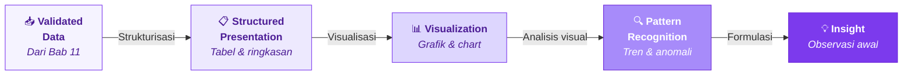
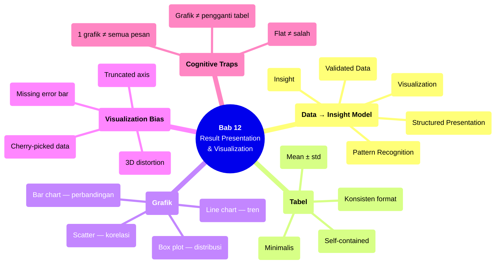

# Bab 12 — Result Presentation & Visualization

> **Sub-CPMK:** 4.1 — Menyajikan hasil eksperimen secara terstruktur dan visual
> **CPMK:** CPMK04 — Analysis & Interpretation
> **CPL Utama:** CPL03 (Penalaran logis)
> **Fase:** Scientific Thinking (M13–M16)
> **Signature Model:** Data → Insight Model (Validated Data → Structured Presentation → Visualization → Pattern Recognition → Insight)

---

## Ringkasan Bab

Bab ini membahas bagaimana menyajikan data hasil eksperimen dalam bentuk yang bisa dipahami, dianalisis, dan dikomunikasikan. Penyajian bukan sekadar membuat tabel dan grafik — ia proses menerjemahkan angka mentah menjadi representasi visual yang membantu mengenali pola, mendukung argumen, dan memfasilitasi interpretasi. Bab ini juga membahas bias visualisasi: cara grafik bisa menyesatkan jika tidak dirancang dengan jujur.

---

## 12.1 Pembuka

Bagian III menghasilkan dataset yang tervalidasi — angka-angka yang sudah melewati format check, range validation, consistency check, dan logic validation. Angka-angka tersebut siap dianalisis. Tapi sebelum analisis statistik, ada langkah penting yang sering dilewati: **menyajikan data secara terstruktur**.

Mengapa penyajian mendahului analisis? Karena penyajian yang baik membantu peneliti sendiri "melihat" data sebelum menghitung. Tabel yang terstruktur memperlihatkan pola kasar. Grafik yang tepat mengungkap distribusi, outlier, dan tren. Observasi visual ini membentuk intuisi awal yang kemudian diuji secara formal melalui statistik.

Sebaliknya, langsung melompat ke uji statistik tanpa melihat data secara visual berisiko menghasilkan kesimpulan yang secara teknis benar tapi secara kontekstual salah. Contoh klasik: Anscombe's Quartet (1973) — empat dataset dengan statistik identik (mean, variance, korelasi) tapi distribusi visual yang sangat berbeda. Tanpa visualisasi, keempatnya terlihat "sama." Dengan visualisasi, perbedaannya jelas.

Pertanyaan sentral bab ini: **Bagaimana menyajikan hasil eksperimen dalam format yang membantu mengenali pola, mendukung interpretasi, dan mengkomunikasikan temuan secara jujur?**

---

## 12.2 Data → Insight Model

Model ini menggambarkan alur dari data tervalidasi menuju insight yang bisa dikomunikasikan.

**Gambar 12.1** — Data → Insight Model



Setiap transisi:

1. **Validated Data → Structured Presentation.** Data tervalidasi diorganisasi dalam tabel: per-skenario, per-metrik, dengan statistik deskriptif (mean, std, CI). Tabel adalah fondasi — semua angka harus ada di tabel sebelum divisualisasikan.

2. **Structured Presentation → Visualization.** Data dari tabel diterjemahkan ke grafik yang sesuai tujuannya: bar chart untuk perbandingan, line chart untuk tren, box plot untuk distribusi, scatter plot untuk korelasi.

3. **Visualization → Pattern Recognition.** Grafik dibaca untuk mengenali pola: skenario mana yang lebih baik? Apakah ada outlier? Apakah distribusi simetris atau skewed? Apakah ada tren temporal?

4. **Pattern Recognition → Insight.** Pola yang teramati dirumuskan sebagai observasi awal — belum menjadi kesimpulan (itu tugas analisis statistik), tapi sudah membentuk hipotesis tentang apa yang mungkin terjadi.

---

## 12.3 Definisi Kunci

**Structured Presentation**
: Penyajian data dalam format terorganisasi (tabel, ringkasan statistik) yang memungkinkan pembaca melihat semua angka penting dalam satu pandangan. Tabel harus self-contained: bisa dipahami tanpa membaca teks pendamping.

**Visualization**
: Representasi grafis dari data yang memanfaatkan kemampuan visual manusia untuk mengenali pola, tren, dan anomali yang sulit dilihat dari angka mentah. Visualisasi yang baik memperjelas — bukan memperindah.

**Visualization Bias**
: Distorsi persepsi yang disebabkan oleh keputusan desain grafik: skala sumbu yang tidak dimulai dari nol, aspect ratio yang melebih-lebihkan perbedaan, pemilihan warna yang menyesatkan, atau data yang dipotong selektif. Bias bisa disengaja atau tidak disadari.

**Observasi Awal**
: Deskripsi pola yang terlihat dari data sebelum dikonfirmasi secara statistik. "Terlihat bahwa skenario A menghasilkan nilai lebih tinggi dari B" adalah observasi. "Skenario A secara signifikan lebih baik dari B (p < 0.05)" adalah kesimpulan statistik.

---

## 12.4 Konsep Inti

### 12.4.1 Tabel: Presisi dan Transparansi

Tabel adalah fondasi penyajian hasil. Setiap eksperimen harus memiliki tabel utama yang menampilkan:
- Semua skenario (baris)
- Semua metrik (kolom)
- Statistik deskriptif per sel: mean ± std, atau median (IQR), tergantung distribusi
- Jumlah run (N) per skenario

Prinsip desain tabel:

**Self-contained.** Pembaca harus bisa memahami tabel hanya dari judul, header, dan catatan kaki — tanpa membaca teks paragraf. Sertakan satuan, singkatan yang dijelaskan, dan N.

**Konsisten.** Format angka konsisten: jumlah desimal sama di seluruh tabel. Jangan campur 87.2% dan 0.872 dalam satu tabel.

**Minimalis.** Hanya tampilkan informasi yang relevan. Tabel dengan 20 kolom sulit dibaca. Jika perlu banyak metrik, pertimbangkan tabel terpisah atau lampiran.

**Sortable.** Jika memungkinkan, urutkan baris berdasarkan performa (dari terbaik ke terburuk pada metrik utama) untuk memudahkan pembaca mengidentifikasi pola ranking.

### 12.4.2 Grafik: Tujuan Menentukan Jenis

Pemilihan jenis grafik bukan soal estetika — ia tentang mencocokkan tujuan komunikasi dengan representasi visual yang tepat:

| Tujuan | Jenis Grafik | Kapan Digunakan |
|--------|-------------|-----------------|
| Perbandingan antar-skenario | Bar chart (grouped/stacked) | Membandingkan mean metrik antar-kondisi |
| Distribusi per-skenario | Box plot / violin plot | Menampilkan median, IQR, outlier per kondisi |
| Tren temporal | Line chart | Metrik yang berubah sepanjang waktu/epoch |
| Korelasi dua variabel | Scatter plot | Hubungan antara dua metrik kontinu |
| Proporsi | Pie chart (hati-hati) | Hanya jika bagian-bagiannya berjumlah 100% |

Prinsip: **satu grafik, satu pesan**. Grafik yang mencoba menyampaikan terlalu banyak informasi sekaligus biasanya tidak menyampaikan apa-apa dengan jelas.

### 12.4.3 Multi-Metric Presentation

Eksperimen riset TI sering mengukur lebih dari satu metrik. Misalnya: akurasi, F1-score, waktu training, dan memory usage. Bagaimana menyajikan multi-metric?

**Tabel terpisah per kategori metrik.** Metrik kualitas (accuracy, F1) dalam satu tabel. Metrik efisiensi (waktu, memory) dalam tabel lain. Ini menghindari tabel "monster" yang sulit dibaca.

**Grafik multi-panel.** Beberapa grafik kecil yang disusun berdampingan (small multiples), masing-masing menampilkan satu metrik. Pembaca bisa membandingkan pola lintas metrik secara visual.

**Radar/spider chart.** Berguna untuk profiling: skenario mana yang "menang" di metrik apa. Tapi hati-hati — radar chart bisa menyesatkan jika skala metrik berbeda secara substansial.

**Trade-off plot.** Scatter plot dengan satu metrik di sumbu X dan metrik lain di sumbu Y. Berguna untuk menunjukkan trade-off (misal: accuracy vs training time). Skenario di "sudut kiri atas" (high accuracy, low time) lebih disukai.

### 12.4.4 Visualization Bias: Grafik yang Menyesatkan

Grafik bisa menipu — baik disengaja maupun tidak. Beberapa jenis bias yang harus dihindari:

**Truncated axis.** Sumbu Y yang tidak dimulai dari nol memperbesar perbedaan visual. Perbedaan 1% terlihat seperti perbedaan 50% jika skala dipotong. Solusi: mulai dari nol, atau jika range terlalu besar, gunakan broken axis dengan indikator jelas.

**Inconsistent scale.** Dua grafik yang dibandingkan menggunakan skala Y berbeda. Pembaca yang tidak memperhatikan sumbu menyimpulkan pola yang salah. Solusi: gunakan skala yang sama untuk grafik yang dibandingkan.

**Cherry-picked data.** Hanya menampilkan subset data yang mendukung naratif. Menampilkan 3 metrik di mana metode A menang, menyembunyikan 2 metrik di mana metode A kalah. Solusi: tampilkan semua metrik, atau jelaskan secara eksplisit mengapa metrik tertentu dipilih.

**3D effects.** Grafik 3D hampir selalu memperburuk readability tanpa menambah informasi. Perspektif 3D mendistorsi perbandingan visual. Solusi: gunakan 2D.

---

## 12.5 Research vs Engineering

**Tabel 12.1** — Perspektif Penyajian: Engineering vs Research

| Aspek | Engineering | Research |
|-------|------------|----------|
| **Tujuan grafik** | Dashboard monitoring | Mendukung argumen ilmiah |
| **Audiens** | Tim teknis, stakeholder | Reviewer, komunitas riset |
| **Informasi wajib** | KPI, threshold, status | Mean, std, CI, N, p-value |
| **Estetika** | Penting (dashboard UX) | Sekunder (kejelasan utama) |
| **Interaktivitas** | Sering (drill-down, filter) | Jarang (grafik statis di paper) |
| **Bias handling** | Less critical | Wajib dihindari (peer-review) |

Perbedaan kunci: grafik engineering dirancang untuk monitoring real-time. Grafik riset dirancang untuk menyajikan argumen — ia harus jujur, presisi, dan self-explanatory karena akan dievaluasi oleh reviewer yang skeptis.

---

## 12.6 Research Reality

### Fenomena 1 — "Tabel 20 Kolom, Font Size 6pt"

Peneliti yang mengukur banyak metrik sering memasukkan semuanya ke satu tabel raksasa. Hasilnya: font kecil, kolom sempit, angka berdempetan. Pembaca tidak bisa menangkap pola apa pun. Solusi: pecah menjadi beberapa tabel tematik. Lebih baik 3 tabel kecil yang jelas daripada 1 tabel besar yang tidak bisa dibaca.

### Fenomena 2 — "Grafik Tanpa Error Bar"

Bar chart yang menampilkan mean tanpa error bar (standar deviasi atau confidence interval) menyembunyikan informasi kritis: seberapa pasti angka tersebut? Jika dua bar berbeda 2% tapi error bar saling overlap, perbedaan tersebut kemungkinan tidak signifikan. Tanpa error bar, perbedaan visual menipu.

### Fenomena 3 — "Grafik Indah, Data Tidak Jelas"

Terkadang grafik dibuat dengan fokus estetika — warna gradient, efek bayangan, font dekoratif — tapi informasinya tidak jelas. Label sumbu terlalu kecil. Legenda tumpang tindih dengan data. Warna untuk dua kategori terlalu mirip. Dalam riset, kejelasan mengalahkan keindahan.

---

## 12.7 Cognitive Traps

### Trap 1: "Grafik lebih meyakinkan dari tabel"

Grafik bagus untuk pola — tabel bagus untuk presisi. Keduanya saling melengkapi, bukan menggantikan. Paper yang hanya memiliki grafik tanpa tabel menyulitkan pembaca yang ingin melihat angka eksak. Paper yang hanya memiliki tabel tanpa grafik membuat pembaca sulit menangkap pola. Gunakan keduanya.

### Trap 2: "Sumbu Y dimulai dari nol? Grafiknya terlihat flat"

Grafik yang "flat" mungkin memang menunjukkan realitas: perbedaan antar-skenario memang kecil. Memotong sumbu Y untuk memperbesar perbedaan secara visual bisa menyesatkan pembaca. Jika perbedaan kecil tapi signifikan, sampaikan lewat angka dan uji statistik — bukan lewat manipulasi skala.

### Trap 3: "Satu grafik untuk semua metrik — efisien"

Grafik yang mencoba menampilkan terlalu banyak informasi (5 metrik, 8 skenario, error bar, annotations) menjadi tidak terbaca. Prinsip: satu grafik, satu pesan utama. Jika ada 5 metrik, pertimbangkan 5 grafik kecil (small multiples) yang masing-masing fokus pada satu pesan.

### Trap 4: "Pie chart untuk semuanya"

Pie chart hanya efektif untuk menunjukkan proporsi dari keseluruhan (100%). Untuk perbandingan antar-kategori, bar chart hampir selalu lebih efektif — mata manusia lebih baik membandingkan panjang (bar) daripada sudut (pie slice).

---

## 12.8 Studi Kasus

### Kasus 1 (Basic): "Tabel vs Grafik — Penyajian yang Saling Melengkapi"

**Konteks:**

Eksperimen membandingkan 3 model (BERT, LSTM, SVM) pada 3 metrik (Accuracy, F1, Training Time). 10 run per model.

**❌ Pendekatan Salah:**

Hanya menampilkan satu tabel besar:

| Model | Acc | Acc Std | F1 | F1 Std | Time | Time Std | Acc CI | F1 CI | Time CI |
|---|---|---|---|---|---|---|---|---|---|
| BERT | 88.4 | 1.2 | 87.1 | 1.4 | 45.2m | 3.1 | [87.5,89.3] | [86.1,88.1] | [43.0,47.4] |
| ... | ... | ... | ... | ... | ... | ... | ... | ... | ... |

Pembaca tenggelam dalam angka. Pola tidak terlihat.

**✅ Pendekatan Benar:**

Tabel ringkas untuk presisi:

| Model | Accuracy (%) | F1-Score (%) | Training Time (min) |
|-------|-------------|-------------|---------------------|
| BERT | 88.4 ± 1.2 | 87.1 ± 1.4 | 45.2 ± 3.1 |
| LSTM | 86.1 ± 1.8 | 84.5 ± 2.0 | 12.8 ± 1.2 |
| SVM | 82.3 ± 0.9 | 80.7 ± 1.1 | 0.3 ± 0.1 |

*N=10 per model. Mean ± std. Diurutkan berdasarkan Accuracy.*

Dilengkapi: (a) bar chart + error bar untuk perbandingan metrik kualitas, (b) box plot untuk distribusi per model, (c) scatter plot accuracy vs training time untuk trade-off. Tiga grafik, tiga pesan berbeda — saling melengkapi, bukan redundan.

**Pelajaran:** Tabel menyajikan angka yang bisa direferensikan. Grafik menyajikan pola yang bisa dilihat. Keduanya diperlukan.

---

### Kasus 2 (Advanced): "Visualization Bias — Grafik yang Menipu"

**Konteks:**

Paper membandingkan accuracy dua metode pada benchmark. Metode A: 91.2%. Metode B: 90.8%. Paper menyajikan bar chart berikut:

Bar chart dengan sumbu Y dimulai dari 90.0%. Secara visual, bar A terlihat dua kali lebih tinggi dari bar B. Perbedaan 0.4% terlihat seperti perbedaan substansial.

**Analisis bias:**

| Aspek | Presentasi Bias | Presentasi Jujur |
|-------|----------------|-----------------|
| **Sumbu Y** | Mulai dari 90% | Mulai dari 0% (atau 80% dengan break indicator) |
| **Persepsi visual** | A >> B | A ≈ B |
| **Error bar** | Tidak ada | Ada (overlap → tidak signifikan?) |
| **Informasi tambahan** | Tidak ada | N, std, CI, p-value |

Ketika sumbu Y dimulai dari nol, kedua bar terlihat hampir identik — yang memang merefleksikan realitas bahwa 0.4% adalah perbedaan yang sangat kecil. Apakah perbedaan ini bermakna? Hanya uji statistik yang bisa menjawab, dan jawaban itu harus dicantumkan bersama grafik.

**Pelajaran:** Grafik yang jujur mungkin terlihat kurang "impressive," tapi ia merefleksikan realitas. Tugas visualisasi adalah membantu pembaca memahami data — bukan meyakinkan pembaca terhadap kesimpulan tertentu.

---

## 12.9 Template Praktis

### Template: Result Presentation Plan

```
═══════════════════════════════════════════════════════════════
  RESULT PRESENTATION PLAN — [Judul Penelitian]
═══════════════════════════════════════════════════════════════

TABEL UTAMA:
  Tabel 1: [Deskripsi] — Metrik kualitas per skenario
    □ Kolom: Skenario | Metrik-1 (mean±std) | Metrik-2 | N
    □ Baris diurutkan berdasarkan: [primary metric]
    □ Format desimal: [n] digit
    □ Satuan tertera di header

  Tabel 2: [Deskripsi] — Metrik efisiensi per skenario
    □ Kolom: Skenario | Time | Memory | ...
    □ Satuan: [menit/detik/MB]

GRAFIK:
  Grafik 1: [Jenis] — [Pesan utama]
    □ Tipe: Bar chart + error bar
    □ Variabel: X = skenario, Y = [metrik]
    □ Sumbu Y mulai dari: [0 / custom dengan justifikasi]
    □ Error bar: std / 95% CI

  Grafik 2: [Jenis] — [Pesan utama]
    □ Tipe: Box plot
    □ Variabel: X = skenario, Y = [metrik]
    □ Menampilkan: median, IQR, outlier

CHECKLIST BIAS:
  □ Sumbu Y konsisten di semua grafik perbandingan
  □ Error bar ditampilkan
  □ Semua metrik disajikan (tidak cherry-pick)
  □ Tidak ada efek 3D
  □ Warna accessible (colorblind-friendly)

OBSERVASI AWAL:
  1. ___________________________________________________
  2. ___________________________________________________
  3. ___________________________________________________

═══════════════════════════════════════════════════════════════
```

---

## 12.10 Mindmap Ringkasan

**Gambar 12.2** — Mindmap Bab 12: Result Presentation & Visualization



---

## 12.11 Rangkuman

**Poin-poin utama bab ini:**

1. Penyajian hasil adalah langkah antara validasi data dan analisis statistik. Tabel memberikan presisi, grafik memberikan pola — keduanya saling melengkapi.

2. Pemilihan jenis grafik ditentukan oleh tujuan komunikasi: perbandingan (bar chart), distribusi (box plot), tren (line chart), korelasi (scatter plot).

3. Multi-metric disajikan melalui tabel terpisah per kategori, small multiples, atau trade-off plot — bukan satu grafik yang terlalu padat.

4. Visualization bias (truncated axis, cherry-picked data, missing error bar, 3D effects) harus dihindari. Grafik yang jujur mungkin kurang dramatic, tapi merefleksikan realitas.

5. Observasi awal dari visualisasi bukan kesimpulan — ia hipotesis yang perlu dikonfirmasi melalui analisis statistik di bab-bab berikutnya.

Dengan data yang tersaji secara terstruktur, langkah berikutnya adalah mempersiapkan data untuk analisis. Bab 13 membahas data preprocessing — bagaimana membersihkan, mentransformasi, dan menormalisasi data sebelum dianalisis secara statistik.

> *"Grafik yang baik tidak memanipulasi pembaca — ia membantu pembaca melihat apa yang sebenarnya terjadi di dalam data."*

---

## 12.12 Latihan & Refleksi

### Latihan 1 — Tabel Hasil

Dari data eksperimen sebelumnya (atau data simulasi), buat tabel hasil yang memenuhi semua prinsip: self-contained, konsisten format, terurut, dan menyertakan mean ± std serta N.

### Latihan 2 — Visualisasi Multi-Metrik

Sajikan data dari Latihan 1 menggunakan minimal 2 jenis grafik berbeda. Untuk setiap grafik, nyatakan: apa pesan utamanya, mengapa jenis grafik tersebut dipilih, dan observasi awal apa yang terlihat.

### Latihan 3 — Bias Detection

Cari satu grafik dari paper atau laporan riset yang menurut Anda memiliki potensi visualization bias. Identifikasi jenis biasnya dan jelaskan bagaimana grafik tersebut bisa diperbaiki.

### Refleksi

> "Apakah grafik yang saya buat membantu pembaca memahami data, atau membantu saya meyakinkan pembaca terhadap kesimpulan tertentu?"

---

## Daftar Pustaka

- Tufte, E. R. (2001). *The Visual Display of Quantitative Information* (2nd ed.). Graphics Press.
- Few, S. (2012). *Show Me the Numbers: Designing Tables and Graphs to Enlighten* (2nd ed.). Analytics Press.
- Anscombe, F. J. (1973). Graphs in Statistical Analysis. *The American Statistician*, 27(1), 17–21.

<!-- STATUS: 🟢 Draft Complete -->

<!-- STATUS: ⬜ Not Started -->
