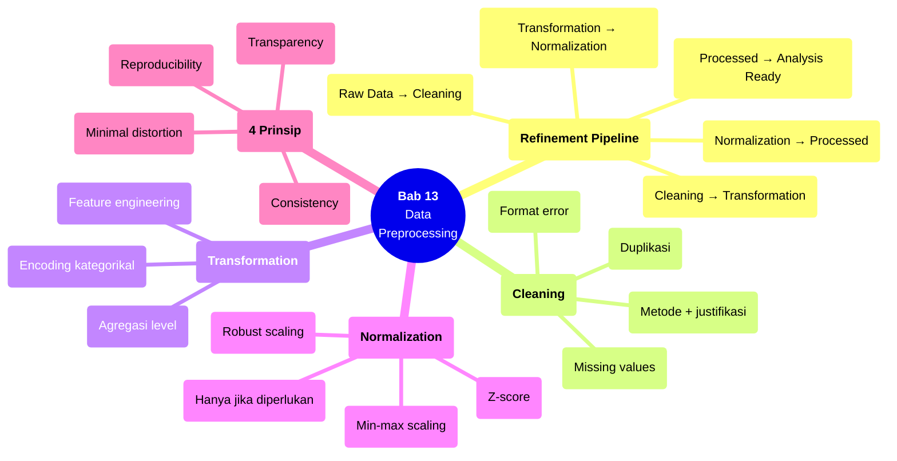

# Bab 13 — Data Preprocessing

> **Sub-CPMK:** 4.2 — Melakukan preprocessing data eksperimen secara reproducible
> **CPMK:** CPMK04 — Analysis & Interpretation
> **CPL Utama:** CPL03 (Penalaran logis)
> **Fase:** Scientific Thinking (M13–M16)
> **Signature Model:** Data Refinement Pipeline (Raw Data → Cleaning → Transformation → Normalization → Processed Data → Analysis Ready)

---

## Ringkasan Bab

Bab ini membahas bagaimana mempersiapkan data eksperimen untuk analisis: membersihkan (cleaning), mentransformasi (transformation), dan menormalisasi (normalization). Preprocessing bukan proses teknis yang "otomatis" — setiap keputusan preprocessing mengubah data dan berpotensi mengubah kesimpulan. Bab ini menekankan empat prinsip: consistency, transparency, reproducibility, dan minimal distortion.

---

## 13.1 Pembuka

Bab 12 menyajikan data secara visual dan menghasilkan observasi awal. Sebelum data masuk ke analisis statistik formal, ada langkah yang sering terjadi tapi jarang didokumentasikan dengan baik: **preprocessing**.

Preprocessing mencakup semua transformasi yang dilakukan terhadap data sebelum analisis utama. Ini bisa sederhana (menghapus baris duplikat) atau kompleks (normalisasi fitur, encoding variabel kategorikal, agregasi cross-validation folds). Masalahnya: setiap keputusan preprocessing mengubah data — dan perubahan ini bisa mengubah hasil analisis.

Contoh: dataset memiliki 3 missing values dari 100 data point. Opsi: (a) hapus 3 baris (listwise deletion) — jumlah data berkurang. (b) Imputasi dengan mean — distribusi data berubah. (c) Imputasi dengan model — dependensi baru diperkenalkan. Ketiga opsi menghasilkan dataset yang sedikit berbeda, yang mungkin menghasilkan kesimpulan statistik yang berbeda. Mana yang "benar"? Tidak ada jawaban universal — tapi apapun yang dipilih harus dijustifikasi dan didokumentasikan.

Pertanyaan sentral bab ini: **Bagaimana melakukan preprocessing yang memperbaiki kualitas data tanpa mendistorsi informasi yang dikandungnya?**

---

## 13.2 Data Refinement Pipeline

Model ini menggambarkan alur pemrosesan data dari bentuk mentah menuju data yang siap dianalisis.

**Gambar 13.1** — Data Refinement Pipeline

```mermaid
graph LR
    A["📥 <b>Raw Data</b><br/><i>Dari eksperimen</i>"]
    B["🧹 <b>Cleaning</b><br/><i>Missing, duplikat, error</i>"]
    C["🔄 <b>Transformation</b><br/><i>Encoding, agregasi</i>"]
    D["📐 <b>Normalization</b><br/><i>Scaling, standardisasi</i>"]
    E["📦 <b>Processed<br/>Data</b><br/><i>Siap analisis</i>"]
    F["✅ <b>Analysis<br/>Ready</b><br/><i>Terdokumentasi</i>"]

    A -->|"Pembersihan"| B
    B -->|"Transformasi"| C
    C -->|"Normalisasi"| D
    D -->|"Verifikasi"| E
    E -->|"Dokumentasi"| F

    style A fill:#F5F3FF,stroke:#7C3AED,color:#4C1D95
    style B fill:#EDE9FE,stroke:#7C3AED,color:#4C1D95
    style C fill:#DDD6FE,stroke:#7C3AED,color:#4C1D95
    style D fill:#C4B5FD,stroke:#6D28D9,color:#4C1D95
    style E fill:#A78BFA,stroke:#6D28D9,color:#FFFFFF
    style F fill:#7C3AED,stroke:#6D28D9,color:#FFFFFF
```



Setiap transisi:

1. **Raw Data → Cleaning.** Data mentah dibersihkan: missing values ditangani, duplikat dihapus, error format diperbaiki. Cleaning menghilangkan "noise" teknis tanpa mengubah substansi data.

2. **Cleaning → Transformation.** Data bersih ditransformasi jika diperlukan: variabel kategorikal di-encode, fitur di-aggregate, format disatukan. Transformasi mengubah representasi data, bukan isinya.

3. **Transformation → Normalization.** Jika analisis memerlukan skala yang seragam (misalnya untuk clustering atau neural network), data dinormalisasi. Normalisasi mengubah skala, bukan distribusi relatif.

4. **Normalization → Processed Data.** Data yang sudah diproses diverifikasi: apakah preprocessing memperkenalkan artefak? Apakah distribusi masih masuk akal? Apakah jumlah data point konsisten?

5. **Processed Data → Analysis Ready.** Setiap langkah preprocessing didokumentasikan secara lengkap — metode, justifikasi, dan dampaknya — agar reproducible dan auditable.

---

## 13.3 Definisi Kunci

**Data Cleaning**
: Proses mengidentifikasi dan menangani masalah kualitas data — missing values, duplikasi, format error, dan outlier teknis. Tujuannya meningkatkan kualitas tanpa mengubah informasi substantif yang dikandung data.

**Data Transformation**
: Proses mengubah representasi data — encoding kategorikal ke numerik, agregasi dari level granular ke level ringkasan, atau pembuatan fitur turunan (feature engineering). Transformasi mengubah bentuk, bukan substansi.

**Normalization**
: Proses menyeragamkan skala variabel agar comparable — misalnya min-max scaling ke [0,1] atau z-score standardization ke mean=0, std=1. Diperlukan ketika analisis sensitif terhadap perbedaan skala.

**Minimal Distortion**
: Prinsip bahwa setiap langkah preprocessing harus mengubah data sesedikit mungkin untuk mencapai tujuannya. Jika cleaning bisa dilakukan tanpa menghapus data, jangan hapus. Jika normalisasi tidak diperlukan, jangan lakukan.

---

## 13.4 Konsep Inti

### 13.4.1 Cleaning: Missing Values, Duplikat, dan Error

**Missing values.** Data point yang tidak ada (NaN, null, kosong). Penyebab: logging gagal, run timeout, kolom tidak tercatat. Penanganan:

| Metode | Cara Kerja | Kapan Tepat | Risiko |
|--------|-----------|-------------|--------|
| Listwise deletion | Hapus seluruh baris | Missing sedikit (< 5%), random | Kehilangan data |
| Mean/median imputation | Ganti dengan mean/median | Missing sedikit, distribusi normal | Mengurangi variabilitas |
| Model-based imputation | Prediksi dari variabel lain | Missing banyak, pola sistematis | Memperkenalkan dependensi |
| Flag and separate | Tandai, analisis terpisah | Missing karena alasan substantif | Kompleksitas analisis |

Prinsip: pilihan metode harus dijustifikasi berdasarkan pola missing (random vs systematic) dan dampak terhadap analisis.

**Duplikasi.** Baris identik yang muncul lebih dari sekali. Penyebab: script logging menulis dua kali, merge error, re-run tanpa clearing. Deteksi: periksa run ID + timestamp — duplikasi memiliki ID/timestamp identik. Penanganan: hapus duplikat, dokumentasikan jumlah dan penyebab.

**Format error.** Tipe data yang salah (string di kolom numerik), value yang tidak valid (akurasi > 100%), atau encoding yang rusak. Penanganan: fix jika jelas (parsing error), flag jika ambiguous, hapus jika irreparable.

### 13.4.2 Transformation: Encoding dan Agregasi

**Encoding variabel kategorikal.** Jika analisis memerlukan input numerik (regresi, clustering), variabel kategorikal perlu di-encode. One-hot encoding untuk nominal (tanpa urutan). Ordinal encoding untuk ordinal (ada urutan). Label encoding untuk binary.

**Agregasi.** Menggabungkan data dari level granular ke level yang dianalisis. Contoh: jika eksperimen menghasilkan accuracy per-fold (5-fold CV), dan analisis membandingkan antar-skenario, maka aggregate ke mean per skenario. Dokumentasikan level agregasi.

**Feature engineering.** Membuat variabel turunan dari variabel yang ada. Contoh: dari training time dan epochs, hitung time-per-epoch. Dari precision dan recall, hitung F1-score. Feature engineering yang relevan membantu analisis — yang berlebihan memperkeruh.

### 13.4.3 Normalization dan Scaling

**Kapan diperlukan:** machine learning yang sensitif terhadap skala (SVM, k-NN, neural network), analisis yang membandingkan variabel dengan satuan berbeda (clustering), PCA.

**Kapan tidak diperlukan:** analisis statistik yang scale-invariant (korelasi rank, uji non-parametrik), tree-based models (random forest, decision tree), perbandingan metrik yang sudah dalam skala yang sama.

| Metode | Formula | Range Output | Sensitif terhadap Outlier |
|--------|---------|-------------|--------------------------|
| Min-max scaling | (x - min) / (max - min) | [0, 1] | Ya |
| Z-score standardization | (x - mean) / std | Tidak terbatas | Lebih robust |
| Robust scaling | (x - median) / IQR | Tidak terbatas | Paling robust |

Prinsip: normalisasi harus dihitung dari training data saja (jika ada split train/test) untuk menghindari data leakage.

### 13.4.4 Empat Prinsip Preprocessing

Setiap keputusan preprocessing harus memenuhi empat prinsip:

**Consistency.** Preprocessing yang sama harus diterapkan ke semua data — tidak boleh ada skenario yang mendapat treatment berbeda tanpa justifikasi.

**Transparency.** Setiap langkah didokumentasikan: apa yang dilakukan, mengapa, bagaimana, dan apa dampaknya terhadap data.

**Reproducibility.** Preprocessing harus bisa direproduksi oleh orang lain — idealnya dalam bentuk script, bukan langkah manual.

**Minimal distortion.** Jangan lakukan preprocessing yang tidak diperlukan. Setiap transformasi berpotensi memperkenalkan artefak. Lakukan hanya apa yang diperlukan untuk analisis.

---

## 13.5 Research vs Engineering

**Tabel 13.1** — Perspektif Preprocessing: Engineering vs Research

| Aspek | Engineering | Research |
|-------|------------|----------|
| **Tujuan** | Data siap untuk model production | Data siap untuk analisis statistik |
| **Missing values** | Impute (harus handle semua case) | Dokumentasi + justifikasi metode |
| **Feature engineering** | Ekstensif (maximize performa) | Minimal (jangan bias hasil) |
| **Normalization** | Selalu (pipeline production) | Hanya jika diperlukan analisis |
| **Dokumentasi** | Pipeline config file | Penjelasan lengkap di metode |
| **Validation** | A/B test pada production | Perbandingan distribusi sebelum/sesudah |

Perbedaan kritis: dalam engineering, preprocessing bertujuan **memaksimalkan performa model**. Dalam riset, preprocessing bertujuan **mempersiapkan data tanpa mendistorsi informasi**. Over-preprocessing dalam riset bisa mengaburkan temuan yang sebenarnya.

---

## 13.6 Research Reality

### Fenomena 1 — "Preprocessing Tidak Didokumentasikan"

Seorang peneliti melakukan 5 langkah preprocessing (hapus duplikat, impute mean, encode label, normalize, hapus outlier) tapi hanya menulis "data were preprocessed" di paper. Reviewer — atau peneliti lain yang ingin mereproduksi — tidak tahu apa yang dilakukan. Preprocessing yang tidak didokumentasikan adalah preprocessing yang tidak reproducible.

### Fenomena 2 — "Over-Preprocessing Mengubah Kesimpulan"

Dataset asli: metode A lebih baik dari B (p=0.04). Setelah outlier removal + normalisasi + imputation: metode A dan B tidak berbeda signifikan (p=0.12). Apakah berarti preprocessing "merusak" hasil? Belum tentu — mungkin hasil awal didorong oleh outlier. Tapi tanpa dokumentasi dan sensitivitas analysis (menjalankan analisis dengan dan tanpa preprocessing), tidak bisa dibedakan apakah preprocessing mengungkap kebenaran atau menyembunyikannya.

### Fenomena 3 — "Normalisasi pada Seluruh Dataset (Data Leakage)"

Peneliti menghitung min-max scaling menggunakan seluruh dataset (train + test), kemudian split. Hasilnya: normalisasi parameter "mengandung" informasi dari test set — analogi dengan melihat ujian sebelum dijawab. Ini data leakage. Normalisasi harus dihitung dari training set saja, lalu diterapkan ke test set menggunakan parameter yang sama.

---

## 13.7 Cognitive Traps

### Trap 1: "Preprocessing adalah tahap teknis — tidak perlu dilaporkan detail"

Preprocessing bisa mengubah distribusi data, jumlah data point, dan bahkan kesimpulan statistik. Setiap keputusan preprocessing adalah keputusan riset — bukan keputusan teknis. Dokumentasikan secara lengkap di bagian metode.

### Trap 2: "Lebih banyak preprocessing = data lebih bersih = hasil lebih baik"

Over-preprocessing bisa memperkenalkan artefak atau menghilangkan variasi natural yang informatif. Menghapus semua outlier, menormalisasi semua variabel, dan melakukan feature engineering berlebihan bisa mengubah data menjadi "terlalu bersih" — tidak lagi merefleksikan realitas eksperimen.

### Trap 3: "Normalisasi selalu diperlukan"

Banyak analisis statistik tidak memerlukan normalisasi. Korelasi Spearman, uji Wilcoxon, uji Mann-Whitney — semuanya rank-based dan scale-invariant. Random forest dan decision tree tidak sensitif terhadap skala. Normalisasi yang tidak diperlukan menambah kompleksitas tanpa manfaat.

### Trap 4: "Imputation yang sama untuk semua situasi"

Mean imputation cocok jika missing sedikit dan random. Tapi jika missing bersifat sistematis (misalnya: semua run yang timeout memiliki missing training time), maka mean imputation menyembunyikan informasi bahwa data tersebut hilang karena alasan substantif — bukan random.

---

## 13.8 Studi Kasus

### Kasus 1 (Basic): "Missing Values — Tiga Pendekatan, Tiga Hasil"

**Konteks:**

Dataset eksperimen: 50 run, 3 metrik (accuracy, F1, time). Dua run memiliki missing training time karena crash (GPU out of memory). Dataset ingin dibandingkan: rata-rata metrik antar-skenario.

**Pendekatan 1 — Listwise Deletion:**

Hapus 2 run. N turun dari 50 ke 48. Rata-rata accuracy dan F1 berubah sedikit. Training time rata-rata menjadi lebih rendah (yang crash mungkin lebih lambat). Analisis valid dengan N=48.

**Pendekatan 2 — Mean Imputation:**

Ganti missing time dengan rata-rata dari 48 run lainnya. N tetap 50. Tapi imputasi menyembunyikan fakta bahwa 2 run crash karena terlalu memakan waktu — time mereka bukan "rata-rata," tapi "lebih dari batas."

**Pendekatan 3 — Flag and Report:**

Tandai 2 run sebagai DNF (Did Not Finish). Laporkan: "50 run dilakukan, 48 selesai, 2 crash karena GPU OOM pada training menit ke-XX. Statistik dihitung dari 48 run yang selesai. Run yang crash menunjukkan bahwa konfigurasi tertentu memerlukan GPU memory > 16GB."

**Pendekatan 3 paling informatif** — missing data menjadi temuan, bukan hanya masalah teknis.

---

### Kasus 2 (Advanced): "Data Leakage via Preprocessing"

**Konteks:**

Eksperimen klasifikasi: 1000 sampel, split 80/20 (800 train, 200 test). Feature normalization menggunakan min-max scaling. Model: SVM.

**❌ Pendekatan Salah (Leakage):**

```
1. Load seluruh 1000 sampel
2. Normalisasi min-max pada 1000 sampel  ← LEAKAGE
3. Split 800/200
4. Train SVM on 800, test on 200
5. Report accuracy: 94.5%
```

Min-max parameter (min, max) dihitung menggunakan data yang akan menjadi test set. Model "secara implisit" mengetahui karakteristik test data melalui normalisasi.

**✅ Pendekatan Benar:**

```
1. Load seluruh 1000 sampel
2. Split 800/200
3. Hitung min-max dari 800 sampel training SAJA
4. Terapkan normalisasi ke 800 (training) dan 200 (test)
   menggunakan parameter dari langkah 3
5. Train SVM on 800, test on 200
6. Report accuracy: 92.1%
```

Perbedaan 2.4% (94.5% vs 92.1%) sepenuhnya berasal dari leakage. Dalam riset, 2.4% bisa mengubah kesimpulan tentang model mana yang lebih baik.

**Pelajaran:** Data leakage bisa subtle dan tersembunyi dalam preprocessing. Prinsip: semua parameter preprocessing harus dihitung dari training data saja.

---

## 13.9 Template Praktis

### Template: Preprocessing Documentation Log

```
═══════════════════════════════════════════════════════════════
  PREPROCESSING LOG — [Judul Penelitian]
═══════════════════════════════════════════════════════════════

DATA AWAL:
  Jumlah data point : ___
  Jumlah variabel   : ___
  Sumber             : [Output dari Bab 10/11]

LANGKAH PREPROCESSING:
  ┌─────┬──────────────┬──────────────┬──────────────────────┐
  │ No. │ Langkah      │ Metode       │ Justifikasi          │
  ├─────┼──────────────┼──────────────┼──────────────────────┤
  │ 1   │ Duplikasi    │ [hapus/flag] │ [alasan]             │
  ├─────┼──────────────┼──────────────┼──────────────────────┤
  │ 2   │ Missing val  │ [metode]     │ [alasan + pola]      │
  ├─────┼──────────────┼──────────────┼──────────────────────┤
  │ 3   │ Encoding     │ [metode]     │ [alasan]             │
  ├─────┼──────────────┼──────────────┼──────────────────────┤
  │ 4   │ Normalisasi  │ [metode]     │ [alasan]             │
  └─────┴──────────────┴──────────────┴──────────────────────┘

DAMPAK PREPROCESSING:
  Data point sebelum: ___ → sesudah: ___
  Variabel sebelum  : ___ → sesudah: ___
  Distribusi berubah: [ya/tidak — detail]

LEAKAGE CHECK:
  □ Normalisasi parameter dari training set saja
  □ Tidak ada fitur derivatif dari test set
  □ Split dilakukan SEBELUM preprocessing

SCRIPT:
  File: [path ke preprocessing script]
  Reproducible: [ya/tidak]

═══════════════════════════════════════════════════════════════
```

---

## 13.10 Mindmap Ringkasan

**Gambar 13.2** — Mindmap Bab 13: Data Preprocessing



---

## 13.11 Rangkuman

**Poin-poin utama bab ini:**

1. Preprocessing mengubah data — setiap keputusan berpotensi mengubah kesimpulan analisis. Dokumentasi lengkap bukan opsional.

2. Tiga tahap utama: cleaning (missing, duplikat, error), transformation (encoding, agregasi), dan normalization (scaling). Masing-masing hanya dilakukan jika diperlukan.

3. Empat prinsip: consistency (sama untuk semua data), transparency (didokumentasikan), reproducibility (via script), dan minimal distortion (jangan over-preprocess).

4. Data leakage melalui preprocessing (normalisasi menggunakan parameter dari test set) bisa menghasilkan performa artifisial yang overestimated. Parameter preprocessing harus dihitung dari training set saja.

5. Missing data yang bersifat sistematis (bukan random) harus ditangani berbeda dari missing random — dan bisa menjadi temuan riset tersendiri.

Dengan data yang sudah dibersihkan, ditransformasi, dan dinormalisasi secara terdokumentasi, langkah berikutnya adalah analisis dan interpretasi. Bab 14 membahas bagaimana menganalisis data secara statistik, menginterpretasi hasilnya, dan menganalisis kegagalan.

> *"Preprocessing yang baik tidak membuat data 'terlihat bagus' — ia membuat data siap dianalisis tanpa kehilangan cerita yang dikandungnya."*

---

## 13.12 Latihan & Refleksi

### Latihan 1 — Missing Value Strategy

Diberikan dataset simulasi dengan 5% missing values pada kolom training time. Terapkan tiga strategi (listwise deletion, mean imputation, flag & report). Bandingkan: apakah rata-rata training time berubah? Apakah kesimpulan perbandingan antar-skenario berubah?

### Latihan 2 — Preprocessing Pipeline

Buat script preprocessing lengkap (bahasa bebas) untuk dataset eksperimen dari latihan sebelumnya. Script harus mencakup: cleaning, encoding (jika perlu), normalisasi (jika perlu). Dokumentasikan setiap langkah di dalam script sebagai komentar.

### Latihan 3 — Leakage Detection

Review preprocessing pipeline dari Latihan 2. Identifikasi apakah ada potensi data leakage. Jika ada, perbaiki. Jika tidak ada, jelaskan mengapa tidak.

### Refleksi

> "Jika saya menghapus satu baris data dari dataset saya, bisakah saya menjelaskan mengapa — dan apakah orang lain akan setuju dengan alasan tersebut?"

---

## Daftar Pustaka

- Han, J., Kamber, M., & Pei, J. (2012). *Data Mining: Concepts and Techniques* (3rd ed.). Morgan Kaufmann.
- Wohlin, C., Runeson, P., Höst, M., Ohlsson, M. C., Regnell, B., & Wesslén, A. (2012). *Experimentation in Software Engineering*. Springer.
- Kuhn, M., & Johnson, K. (2013). *Applied Predictive Modeling*. Springer.

<!-- STATUS: 🟢 Draft Complete -->

<!-- STATUS: ⬜ Not Started -->
