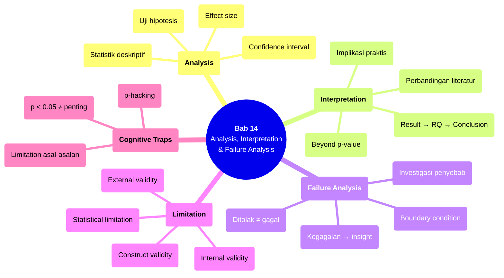

# Bab 14 — Data Analysis, Interpretation & Failure Analysis

> **Sub-CPMK:** 4.3 — Menganalisis data, menginterpretasi hasil, dan menganalisis kegagalan
> **CPMK:** CPMK04 — Analysis & Interpretation
> **CPL Utama:** CPL03 (Penalaran logis)
> **Fase:** Scientific Thinking (M13–M16)
> **Signature Model:** Data → Knowledge Model (Data → Analysis → Interpretation → Explanation → Knowledge)

---

## Ringkasan Bab

Bab ini membahas inti dari riset eksperimental: menganalisis data secara statistik, menginterpretasi hasilnya dalam konteks research question, dan menganalisis kegagalan sebagai sumber insight. Analisis menjawab "apa yang terjadi." Interpretasi menjawab "mengapa terjadi" dan "apa artinya." Failure analysis menjawab "mengapa tidak bekerja" — yang sering kali lebih informatif dari keberhasilan.

---

## 14.1 Pembuka

Bab 12 menyajikan data secara visual. Bab 13 mempersiapkan data melalui preprocessing. Sekarang data siap dianalisis — dan di sinilah riset membuahkan hasil.

Analisis data dalam riset berbeda dari sekadar "menjalankan uji statistik." Ia proses tiga tahap: (1) menganalisis secara kuantitatif — apakah hipotesis didukung data? (2) menginterpretasi hasilnya — apa artinya dalam konteks masalah riset? (3) menganalisis kegagalan — mengapa beberapa aspek tidak bekerja sesuai harapan?

Banyak peneliti berhenti di tahap 1: melaporkan p-value dan berhenti. Tapi p-value tanpa interpretasi adalah angka tanpa makna. Dan keberhasilan tanpa analisis kegagalan adalah kesempatan belajar yang terlewat.

Shadish et al. (2002) menekankan bahwa kesimpulan harus dihubungkan kembali ke research question — bukan sekadar laporan angka. Wohlin et al. (2012) mengingatkan bahwa limitation harus diakui secara eksplisit, bukan disembunyikan. Bab ini menggabungkan ketiganya: analysis, interpretation, dan failure analysis menjadi satu alur utuh.

Pertanyaan sentral bab ini: **Apa yang data katakan tentang hipotesis, dan apa yang bisa dipelajari dari apa yang tidak berjalan sesuai rencana?**

---

## 14.2 Data → Knowledge Model

Model ini menggambarkan alur dari data menuju pengetahuan yang bisa dikontribusikan.

**Gambar 14.1** — Data → Knowledge Model

```mermaid
graph LR
    A["📊 <b>Data</b><br/><i>Preprocessed</i>"]
    B["🔬 <b>Analysis</b><br/><i>Statistik & uji</i>"]
    C["🧠 <b>Interpretation</b><br/><i>Makna & konteks</i>"]
    D["💬 <b>Explanation</b><br/><i>Mengapa & limitation</i>"]
    E["💡 <b>Knowledge</b><br/><i>Kontribusi</i>"]

    A -->|"Uji hipotesis"| B
    B -->|"Kontekstualisasi"| C
    C -->|"Refleksi"| D
    D -->|"Generalisasi"| E

    style A fill:#F5F3FF,stroke:#7C3AED,color:#4C1D95
    style B fill:#EDE9FE,stroke:#7C3AED,color:#4C1D95
    style C fill:#DDD6FE,stroke:#7C3AED,color:#4C1D95
    style D fill:#A78BFA,stroke:#6D28D9,color:#FFFFFF
    style E fill:#7C3AED,stroke:#6D28D9,color:#FFFFFF
```



Setiap transisi:

1. **Data → Analysis.** Data yang sudah dipreprocess dianalisis: statistik deskriptif, uji hipotesis, effect size, confidence interval. Analisis menjawab: apakah ada perbedaan? Apakah perbedaan tersebut signifikan?

2. **Analysis → Interpretation.** Hasil analisis dikontekstualisasikan ke research question. "p < 0.05" diterjemahkan menjadi "hipotesis H1 didukung: metode A secara signifikan lebih cepat dari B." Angka menjadi narasi.

3. **Interpretation → Explanation.** Mengapa hasilnya seperti itu? Apa yang menjelaskan keberhasilan? Apa yang menjelaskan kegagalan? Apa limitasinya? Explanation menambahkan reasoning di balik angka.

4. **Explanation → Knowledge.** Penjelasan yang solid menjadi kontribusi pengetahuan — temuan yang bisa digeneralisasi (dengan batasan yang jelas) ke konteks serupa.

---

## 14.3 Definisi Kunci

**Statistical Analysis**
: Proses menerapkan metode statistik pada data untuk menguji hipotesis — deskriptif (mean, std, median) untuk meringkas, inferensial (t-test, ANOVA, Wilcoxon) untuk menguji perbedaan, dan effect size (Cohen's d, eta-squared) untuk mengukur besarnya perbedaan.

**Interpretation**
: Proses menghubungkan hasil analisis dengan research question, hipotesis, dan konteks masalah. Interpretation menjawab "apa artinya ini?" — bukan sekadar "berapa angkanya?"

**Failure Analysis**
: Proses menganalisis secara mendalam mengapa aspek-aspek tertentu dari eksperimen tidak menghasilkan hasil sesuai harapan. Failure analysis bukan pengakuan kelemahan — ia sumber insight yang sering kali lebih berharga dari keberhasilan.

**Limitation**
: Batasan-batasan yang mempengaruhi generalizability dan validitas kesimpulan. Setiap riset memiliki limitation — mengakuinya secara eksplisit menunjukkan pemahaman mendalam, bukan kelemahan.

---

## 14.4 Konsep Inti

### 14.4.1 Analysis: "Apa yang Terjadi?"

Analisis menjawab pertanyaan faktual tentang data:

**Statistik deskriptif.** Mean, median, standar deviasi, range, percentile. Ini memberikan gambaran umum: skenario mana yang secara numerik lebih baik? Seberapa besar variasi?

**Uji hipotesis.** Menguji apakah perbedaan yang teramati (antara skenario) secara statistik signifikan — bukan kebetulan. Pemilihan uji:

| Kondisi | Uji yang Tepat |
|---------|---------------|
| 2 kelompok, data normal, berpasangan | Paired t-test |
| 2 kelompok, data tidak normal | Wilcoxon signed-rank |
| > 2 kelompok, data normal | One-way ANOVA + post-hoc |
| > 2 kelompok, data tidak normal | Kruskal-Wallis + post-hoc |
| Hubungan 2 variabel kontinu | Pearson (normal) / Spearman (rank) |

Pentingnya: p-value saja tidak cukup. p < 0.05 mengatakan "perbedaan ini kemungkinan bukan kebetulan." Ia tidak mengatakan "perbedaan ini besar" atau "perbedaan ini bermakna secara praktis."

**Effect size.** Mengukur besarnya perbedaan — bukan hanya apakah ada perbedaan. Cohen's d untuk perbandingan dua mean: d < 0.2 (small), 0.2-0.8 (medium), > 0.8 (large). Eta-squared (η²) untuk ANOVA. Effect size memberikan konteks yang p-value tidak bisa.

**Confidence interval.** Rentang di mana nilai sebenarnya kemungkinan berada. CI 95% = [86.5, 89.3] berarti "dengan 95% keyakinan, true mean berada di rentang ini." CI lebih informatif dari p-value — ia memberikan range, bukan binary yes/no.

### 14.4.2 Interpretation: "Apa Artinya?"

Interpretasi menghubungkan angka statistik ke research question:

**Link wajib: Result → RQ → Hypothesis → Conclusion.** Setiap temuan harus diatribusikan kembali ke pertanyaan spesifik yang diajukan. "Berdasarkan uji t berpasangan (p=0.003, d=1.2), metode A secara signifikan lebih cepat dari B, mendukung H1 dan menjawab RQ1."

**Beyond p-value.** Signifikansi statistik bukan signifikansi praktis. Perbedaan 0.3% accuracy mungkin signifikan secara statistik (p=0.02 dengan N=1000) tapi tidak bermakna secara praktis (perbedaannya terlalu kecil untuk berdampak). Interpretasi harus mempertimbangkan keduanya.

**Perbandingan dengan literatur.** Bagaimana hasil ini dibandingkan dengan studi sebelumnya? Apakah konsisten? Jika berbeda, mengapa? Apakah perbedaan kondisi eksperimen (data, environment, implementasi) bisa menjelaskan?

**Implikasi.** Apa konsekuensi dari temuan ini? Untuk peneliti lain (arah riset berikutnya), untuk praktisi (rekomendasi teknis), untuk domain (pemahaman baru).

### 14.4.3 Failure Analysis: "Mengapa Tidak Bekerja?"

Failure analysis sering dilewati — padahal ini bagian yang paling informatif:

**Hipotesis yang ditolak bukan kegagalan riset.** Hipotesis yang ditolak mengatakan sesuatu yang bermakna: "metode yang diusulkan TIDAK lebih baik dari baseline dalam kondisi ini." Ini informasi berharga — ia mencegah peneliti lain mengulangi pendekatan yang sama.

**Mengapa gagal?** Analisis mendalam:
- **Apakah metode yang salah,** atau implementasi yang kurang tepat?
- **Apakah masalahnya di data** — dataset terlalu kecil, noise terlalu tinggi, distribusi tidak sesuai asumsi?
- **Apakah desain eksperimen yang kurang** — metrik tidak sensitif, skenario tidak cukup kontras?
- **Apakah kondisi boundary** — metode bekerja di dataset tertentu tapi tidak di dataset lain?

**Dari kegagalan ke insight.** "Metode A tidak lebih baik dari B dalam skenario X — analisis lebih lanjut menunjukkan bahwa penyebabnya adalah distribusi data yang highly imbalanced, di mana metode A tidak memiliki mekanisme balancing." Ini insight yang lebih berharga dari sekadar "A = 87%, B = 88%."

### 14.4.4 Limitation: Mengakui Batas

Setiap riset memiliki limitation. Mengakuinya bukan kelemahan — ia bukti pemahaman mendalam. Jenis limitation umum:

**Internal validity.** Apakah ada confounding variable yang tidak terkontrol? Apakah ada bias dalam pengumpulan data?

**External validity.** Apakah hasil bisa digeneralisasi ke dataset lain? Ke domain lain? Ke skala yang berbeda?

**Construct validity.** Apakah metrik yang digunakan benar-benar mengukur apa yang ingin diukur?

**Statistical limitation.** Sample size yang terbatas, asumsi distribusi yang mungkin tidak terpenuhi, multiple comparison yang bisa inflate false positive.

Format pelaporan: jelaskan limitasinya, jelaskan dampak potensialnya terhadap kesimpulan, dan sarankan cara mengatasinya di riset berikutnya.

---

## 14.5 Research vs Engineering

**Tabel 14.1** — Perspektif Analisis: Engineering vs Research

| Aspek | Engineering | Research |
|-------|------------|----------|
| **Analisis** | A/B test → deploy yang lebih baik | Uji hipotesis → klaim yang terjustifikasi |
| **Kegagalan** | Bug → fix → ship | Insight → explain → contribute |
| **Limitation** | Edge case yang akan ditangani nanti | Boundary kondisi yang diakui dan didokumentasikan |
| **Metric** | KPI bisnis (revenue, latency) | Metrik riset (accuracy, F1, effect size) |
| **Kesimpulan** | "Ship metode A" | "Metode A lebih baik dalam kondisi X, dengan limitation Y" |

Perbedaan paling fundamental: engineering bertujuan **memilih** yang terbaik. Research bertujuan **memahami** mengapa yang terbaik lebih baik — dan kapan ia tidak lebih baik.

---

## 14.6 Research Reality

### Fenomena 1 — "p < 0.05. Selesai."

Banyak paper berhenti di p-value. Tabel berisi kolom "p" dengan tanda bintang (**), tanpa effect size, tanpa confidence interval, tanpa interpretasi kontekstual. Reviewer tidak tahu apakah perbedaan yang "signifikan" itu besar atau kecil, bermakna secara praktis atau hanya artefak dari sample size besar.

### Fenomena 2 — "Hipotesis Ditolak = Riset Gagal"

Peneliti yang hipotesisnya ditolak sering menganggap risetnya gagal — dan kadang memanipulasi analisis sampai menemukan "signifikansi." Ini p-hacking: menjalankan berbagai uji statistik sampai salah satunya p < 0.05. Hipotesis yang ditolak secara jujur jauh lebih berharga dari hipotesis yang "diterima" melalui manipulasi.

### Fenomena 3 — "Limitation Satu Kalimat"

Bagian limitation di banyak paper: "Penelitian ini memiliki beberapa keterbatasan yang bisa diatasi dalam penelitian selanjutnya." Kalimat ini tidak mengatakan apa-apa. Limitation yang bermakna: "Eksperimen hanya menggunakan 3 dataset dari domain e-commerce. Generalisasi ke domain lain (healthcare, finance) memerlukan validasi tambahan, karena karakteristik data (class distribution, feature density) mungkin berbeda secara substansial."

---

## 14.7 Cognitive Traps

### Trap 1: "Signifikan secara statistik = penting secara praktis"

Dengan sample size yang cukup besar, perbedaan sekecil apa pun bisa signifikan secara statistik. Perbedaan 0.1% accuracy dengan N=10.000 bisa menghasilkan p < 0.01. Tapi 0.1% hampir tidak ada artinya di dunia nyata. Selalu laporkan effect size bersama p-value.

### Trap 2: "Hipotesis tidak terdukung = harus cari angle baru"

Mengulangi analisis dengan variasi (uji statistik berbeda, subset data berbeda, metrik berbeda) sampai menemukan p < 0.05 adalah p-hacking. Pre-registrasi analisis (menentukan uji yang akan digunakan sebelum melihat data) adalah solusi, tapi setidaknya — laporkan semua analisis yang dilakukan, bukan hanya yang "berhasil."

### Trap 3: "Kegagalan tidak perlu dilaporkan secara detail"

Kegagalan sering disembunyikan atau diringkas dalam satu kalimat. Padahal, analisis mendalam tentang mengapa sesuatu tidak bekerja bisa menjadi kontribusi utama paper — terutama jika menunjukkan batas kondisi (boundary condition) dari metode tertentu.

### Trap 4: "Limitation cukup disebutkan, tidak perlu dianalisis"

Menyebutkan "data terbatas" tanpa membahas dampaknya sama dengan tidak menyebutkan. Limitation harus dianalisis: apa dampaknya terhadap validitas kesimpulan? Seberapa serius? Bagaimana bisa dimitigasi?

---

## 14.8 Studi Kasus

### Kasus 1 (Basic): "Dari p-value ke Interpretasi Utuh"

**Konteks:**

Eksperimen membandingkan metode caching A vs B pada web server. Metrik: response time (ms). 30 run per metode.

**❌ Pendekatan Salah (p-value only):**

"Paired t-test menunjukkan p = 0.021 (*). Metode A secara signifikan lebih baik dari B."

Masalah: signifikan seberapa? Lebih cepat berapa? Dalam kondisi apa? Apa limitasinya?

**✅ Pendekatan Benar (Full interpretation):**

"Metode A menghasilkan rata-rata response time 142 ± 12 ms, dibandingkan metode B dengan 158 ± 18 ms (paired t-test: p = 0.021, Cohen's d = 1.05, 95% CI untuk perbedaan: [3.2, 28.8] ms). Perbedaan 16 ms (10.1%) secara statistik signifikan dan memiliki effect size besar (d > 0.8). Dalam konteks web application di mana threshold user-perceived delay adalah 200 ms, perbedaan ini bermakna secara praktis — metode A tetap di bawah threshold sementara B mendekatinya.

Namun, hasil ini memiliki limitation: eksperimen menggunakan single-server setup dengan beban sintetis. Pada deployment multi-server dengan traffic nyata, faktor jaringan dan load balancing bisa mengubah relative advantage. Selain itu, metode A memiliki memory footprint 40% lebih besar — trade-off yang perlu dipertimbangkan di environment dengan memory constraint."

**Pelajaran:** Interpretasi utuh menghubungkan angka → signifikansi → konteks praktis → limitation. Angka tanpa konteks adalah noise.

---

### Kasus 2 (Advanced): "Failure Analysis Menjadi Kontribusi Utama"

**Konteks:**

Seorang peneliti mengusulkan metode deteksi anomali baru untuk log server. Hipotesis: metode baru lebih akurat dari baseline (Isolation Forest). Eksperimen: 5 dataset, 10 run per dataset.

**Hasil:**

| Dataset | Metode Baru (F1) | Baseline (F1) | p-value | Cohen's d |
|---------|------------------|---------------|---------|-----------|
| DS-1 (small, clean) | 94.2 ± 1.1 | 89.3 ± 1.5 | < 0.001 | 3.7 |
| DS-2 (medium, clean) | 91.7 ± 1.3 | 88.1 ± 1.8 | < 0.001 | 2.3 |
| DS-3 (large, clean) | 90.5 ± 1.6 | 87.9 ± 2.0 | 0.003 | 1.4 |
| DS-4 (medium, noisy) | 78.3 ± 3.2 | 82.1 ± 2.8 | 0.008 | -1.3 |
| DS-5 (large, noisy) | 71.6 ± 4.1 | 80.5 ± 3.0 | < 0.001 | -2.5 |

**Failure analysis:**

Metode baru lebih baik pada dataset bersih (DS-1 sampai DS-3) tapi lebih buruk pada dataset noisy (DS-4, DS-5). Mengapa?

Investigasi: metode baru menggunakan distribusi Gaussian untuk modeling normal behavior. Dataset noisy memiliki heavy-tailed distribution yang melanggar asumsi Gaussian. Baseline (Isolation Forest) non-parametrik — tidak membuat asumsi distribusi — sehingga lebih robust terhadap noise.

**Kontribusi dari kegagalan:** "Metode yang diusulkan mengungguli baseline pada data bersih, tapi bergantung pada asumsi distribusi Gaussian yang dilanggar oleh data noisy. Temuan ini menyarankan bahwa hybrid approach (metode baru untuk data bersih, non-parametrik untuk data noisy) mungkin optimal."

**Pelajaran:** Kegagalan parsial + failure analysis = kontribusi yang lebih kaya daripada keberhasilan penuh tanpa analisis mendalam.

---

## 14.9 Template Praktis

### Template: Analysis & Interpretation Report

```
═══════════════════════════════════════════════════════════════
  ANALYSIS & INTERPRETATION — [Judul Penelitian]
═══════════════════════════════════════════════════════════════

1. DESCRIPTIVE STATISTICS
   ┌──────────┬──────────┬─────────┬──────────┬──────────────┐
   │ Skenario │ Mean     │ Std     │ Median   │ 95% CI       │
   ├──────────┼──────────┼─────────┼──────────┼──────────────┤
   │          │          │         │          │              │
   └──────────┴──────────┴─────────┴──────────┴──────────────┘

2. HYPOTHESIS TESTING
   RQ: _______________________________________________
   H0: _______________________________________________
   H1: _______________________________________________
   Uji: [nama uji] | Justifikasi: [mengapa uji ini]
   Hasil: p = ___ | Effect size = ___ | CI = ___
   Keputusan: [tolak/gagal menolak H0]

3. INTERPRETATION
   Apa artinya dalam konteks RQ: ____________________
   Perbandingan dengan literatur: ____________________
   Signifikansi praktis: ____________________________

4. FAILURE ANALYSIS
   Aspek yang tidak sesuai harapan: _________________
   Investigasi penyebab: ____________________________
   Insight dari kegagalan: __________________________

5. LIMITATION
   ┌─────┬──────────────────┬──────────────┬──────────────┐
   │ No. │ Limitation       │ Dampak       │ Mitigasi     │
   ├─────┼──────────────────┼──────────────┼──────────────┤
   │     │                  │              │              │
   └─────┴──────────────────┴──────────────┴──────────────┘

═══════════════════════════════════════════════════════════════
```

---

## 14.10 Mindmap Ringkasan

**Gambar 14.2** — Mindmap Bab 14: Data Analysis, Interpretation & Failure Analysis



---

## 14.11 Rangkuman

**Poin-poin utama bab ini:**

1. Analisis menjawab "apa yang terjadi" (statistik deskriptif + uji hipotesis + effect size + CI). P-value saja tidak cukup — selalu sertakan effect size dan confidence interval.

2. Interpretasi menjawab "apa artinya" — menghubungkan hasil ke research question, membandingkan dengan literatur, dan menilai signifikansi praktis (bukan hanya statistik).

3. Failure analysis menjawab "mengapa tidak bekerja" — hipotesis yang ditolak bukan kegagalan, melainkan temuan. Analisis penyebab kegagalan sering menghasilkan insight lebih berharga dari keberhasilan.

4. Limitation bukan formalitas — ia analisis jujur tentang batas validitas dan generalizability. Limitation yang spesifik dan dianalisis menunjukkan keahlian, bukan kelemahan.

5. Alur utuh: Data → Analysis → Interpretation → Explanation → Knowledge. Setiap tahap menambahkan layer pemahaman yang tidak bisa di-skip.

Dengan analisis dan interpretasi yang utuh, langkah berikutnya adalah mengkomunikasikan temuan secara tertulis. Bab 15 membahas scientific writing — bagaimana menyusun laporan ilmiah yang menyampaikan argumen riset secara terstruktur dan meyakinkan.

> *"Data yang dianalisis tanpa diinterpretasi adalah angka. Kegagalan yang tidak dianalisis adalah kesempatan yang terbuang."*

---

## 14.12 Latihan & Refleksi

### Latihan 1 — Full Statistical Analysis

Dari data eksperimen (atau data simulasi), lakukan analisis utuh: statistik deskriptif, uji hipotesis (pilih uji yang tepat dan justifikasi), effect size, dan confidence interval. Laporkan hasilnya menggunakan format template.

### Latihan 2 — Interpretasi vs Deskripsi

Tulis dua versi "hasil" dari analisis Latihan 1: (a) versi deskriptif (hanya angka), (b) versi interpretasi (angka + konteks + implikasi). Bandingkan: versi mana yang lebih bermakna bagi pembaca?

### Latihan 3 — Failure Analysis

Identifikasi satu aspek dari eksperimen Anda yang tidak sesuai harapan. Tulis failure analysis: apa yang terjadi, mengapa terjadi (minimal 2 kemungkinan penyebab), dan insight apa yang bisa dipetik.

### Refleksi

> "Jika seseorang bertanya 'apa kontribusi riset Anda?' — bisakah saya menjawab tanpa menyebut angka tunggal, tapi dengan menjelaskan apa yang dipelajari?"

---

## Daftar Pustaka

- Wohlin, C., Runeson, P., Höst, M., Ohlsson, M. C., Regnell, B., & Wesslén, A. (2012). *Experimentation in Software Engineering*. Springer.
- Shadish, W. R., Cook, T. D., & Campbell, D. T. (2002). *Experimental and Quasi-Experimental Designs for Generalized Causal Inference*. Houghton Mifflin.
- Field, A. (2018). *Discovering Statistics Using IBM SPSS Statistics* (5th ed.). SAGE Publications.
- Cohen, J. (1988). *Statistical Power Analysis for the Behavioral Sciences* (2nd ed.). Lawrence Erlbaum.

<!-- STATUS: 🟢 Draft Complete -->

<!-- STATUS: ⬜ Not Started -->
