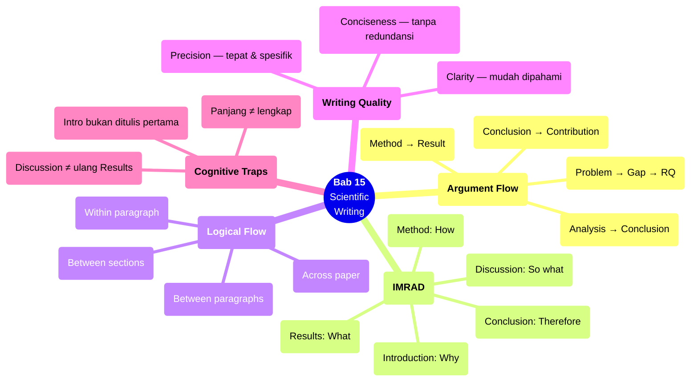

# Bab 15 — Scientific Writing

> **Sub-CPMK:** 5.1 — Menulis karya ilmiah yang terstruktur dan argumentatif
> **CPMK:** CPMK05 — Scientific Communication
> **CPL Utama:** CPL02 (Karya ilmiah/komunikasi)
> **Fase:** Scientific Thinking (M13–M16)
> **Signature Model:** Scientific Argument Flow (Problem → Gap → RQ → Method → Result → Analysis → Conclusion → Contribution)

---

## Ringkasan Bab

Bab ini membahas penulisan ilmiah sebagai proses menyusun argumen riset — bukan sekadar mendokumentasikan apa yang dilakukan. Penulisan ilmiah menerjemahkan seluruh proses riset (Bab 1–14) menjadi satu dokumen koheren yang menyampaikan: apa masalahnya, mengapa penting, apa yang sudah diketahui, apa yang belum, bagaimana diuji, apa hasilnya, dan apa artinya. Bab ini membahas struktur IMRAD, logical flow, konsistensi antar-bagian, dan kualitas penulisan.

---

## 15.1 Pembuka

Semua yang dilakukan sejak Bab 1 — merumuskan masalah, meninjau literatur, menemukan gap, membentuk research question, merancang eksperimen, mengeksekusi, menganalisis — tidak berarti apa-apa jika tidak bisa dikomunikasikan secara tertulis. Riset yang tidak ditulis adalah riset yang tidak ada.

Tapi penulisan ilmiah bukan dokumentasi kronologis ("pertama saya melakukan X, lalu Y, lalu Z"). Ia penyusunan argumen: setiap bagian paper memiliki peran dalam menjelaskan **mengapa** research question penting, **bagaimana** dijawab, dan **apa** yang ditemukan.

Kelemahan paling umum yang ditemukan reviewer bukan di analisis statistik — melainkan di penulisan. Paper dengan analisis yang solid tapi penulisan yang buruk (tidak terstruktur, inkonsisten, tidak jelas) sering ditolak. Sebaliknya, paper yang ditulis dengan jelas — di mana setiap paragraf mengalir secara logis ke paragraf berikutnya — memudahkan reviewer mengevaluasi dan menghargai kontribusi riset.

Pertanyaan sentral bab ini: **Bagaimana menyusun laporan ilmiah yang terstruktur, konsisten, dan menyampaikan argumen riset secara meyakinkan?**

---

## 15.2 Scientific Argument Flow

Model ini menggambarkan alur argumen utama dalam tulisan ilmiah.

**Gambar 15.1** — Scientific Argument Flow


Flow ini adalah "benang merah" yang menghubungkan seluruh paper. Setiap bagian menjawab satu pertanyaan dalam rantai: Why → What's missing → What's asked → How → What happened → What it means → So what → What's new.

---

## 15.3 Definisi Kunci

**IMRAD**
: Struktur standar paper ilmiah — Introduction, Method, Results, And Discussion. IMRAD bukan format arbitrary — ia merefleksikan logical flow riset: mengapa dilakukan (I), bagaimana dilakukan (M), apa yang ditemukan (R), apa artinya (D).

**Logical Flow**
: Keterkaitan logis antar-paragraf dan antar-bagian. Setiap paragraf menjawab satu pertanyaan, dan akhirnya memicu pertanyaan berikutnya yang dijawab oleh paragraf selanjutnya. Paper tanpa logical flow terasa "melompat-lompat."

**Konsistensi Internal**
: Keselarasan antar-bagian paper: masalah yang dinyatakan di Introduction harus dijawab di Discussion. Metrik yang disebutkan di Method harus muncul di Results. Hipotesis yang diformulasikan harus diuji dan dibahas. Inkonsistensi menunjukkan paper yang "tambal sulam."

**Precision**
: Menggunakan istilah yang tepat, menghindari ambiguitas, dan menghilangkan kata yang tidak menambah informasi. "Performa model meningkat secara signifikan" tidak presisi. "Akurasi model meningkat dari 85.3% ke 89.7% (p=0.003, d=1.2)" presisi.

---

## 15.4 Konsep Inti

### 15.4.1 Struktur IMRAD dan Role Setiap Bagian

**Introduction** — menyampaikan motivasi, konteks, gap, dan research question. Introduction harus menjawab: mengapa riset ini perlu dilakukan? Apa yang sudah diketahui? Apa yang belum? Apa pertanyaannya? Diakhiri dengan pernyataan kontribusi yang jelas.

**Method** — mendeskripsikan bagaimana riset dilakukan: desain eksperimen, data, environment, implementasi, metrik. Method harus cukup detail untuk reproduksi — orang lain harus bisa mengulang eksperimen menggunakan deskripsi ini saja.

**Results** — melaporkan temuan secara objektif: statistik deskriptif, uji hipotesis, tabel, grafik. Results menyajikan fakta, bukan interpretasi. "Metode A menghasilkan akurasi 88.4 ± 1.2%" adalah result. "Metode A lebih baik karena..." adalah discussion.

**Discussion** — menginterpretasi hasil dalam konteks research question, membandingkan dengan literatur, menganalisis kegagalan, dan menyatakan limitation. Discussion menambahkan **meaning** pada angka yang disajikan di Results.

**Conclusion** — meringkas temuan utama, menjawab research question secara eksplisit, menyatakan kontribusi, dan menyarankan arah riset berikutnya.

### 15.4.2 Logical Flow: Benang Merah Paper

Paper yang baik memiliki "benang merah" — setiap paragraf mengalir secara natural ke paragraf berikutnya. Cara mencapainya:

**Within paragraph.** Setiap paragraf memiliki satu ide utama (topic sentence), didukung oleh bukti/penjelasan, dan diakhiri dengan transisi ke ide berikutnya.

**Between paragraphs.** Kalimat pertama paragraf baru mengacu pada ide dari paragraf sebelumnya, kemudian memperkenalkan ide baru. Ini menciptakan "rantai logis" yang mem-pull pembaca dari satu paragraf ke berikutnya.

**Between sections.** Akhir satu section menyiapkan pembaca untuk section berikutnya. "Setelah mendefinisikan metrik, langkah berikutnya adalah mendesain eksperimen" — transisi natural dari Method bagian metrik ke Method bagian eksperimen.

**Across the paper.** Problem yang dinyatakan di Introduction harus di-address di Discussion dan di-conclude di Conclusion. RQ yang dirumuskan harus dijawab secara eksplisit. Setiap elemen "berjanji" di awal harus "ditepati" di akhir.

### 15.4.3 Konsistensi Antar-Bagian

Inkonsistensi adalah masalah penulisan yang paling merusak credibility. Checklist konsistensi:

| Elemen | Harus Konsisten Di |
|--------|-------------------|
| Problem statement | Intro ↔ Discussion ↔ Conclusion |
| Research question | Intro ↔ Method ↔ Discussion ↔ Conclusion |
| Hipotesis | Intro ↔ Method ↔ Result ↔ Discussion |
| Metrik | Method ↔ Result |
| Klaim | Result ↔ Discussion (didukung data) |
| Terminologi | Seluruh paper (jangan berganti istilah) |

Inkonsistensi umum: Introduction menyebut 3 research question, tapi Discussion hanya membahas 2. Method mendefinisikan 5 metrik, tapi Results hanya melaporkan 3. Terminologi berubah: "accuracy" di satu tempat menjadi "correctness" di tempat lain.

### 15.4.4 Writing Quality: Clarity, Precision, Conciseness

Tiga dimensi kualitas penulisan:

**Clarity** — apakah kalimat bisa dipahami pada pembacaan pertama? Kalimat yang harus dibaca ulang 2-3 kali untuk dipahami adalah kalimat yang gagal. Cara meningkatkan clarity: kalimat pendek, subject-verb dekat, hindari nested subordinate clause.

**Precision** — apakah setiap istilah digunakan secara tepat? "Model performs well" tidak presisi — well menurut siapa? "Model achieves 91.2% F1-score on benchmark X" presisi.

**Conciseness** — apakah setiap kata menambah informasi? "In this paper, we propose a novel and innovative approach to solve the challenging problem of..." bisa menjadi "We propose an approach to [problem]." Conciseness menghormati waktu pembaca.

---

## 15.5 Research vs Engineering

**Tabel 15.1** — Perspektif Penulisan: Engineering vs Research

| Aspek | Engineering | Research |
|-------|------------|----------|
| **Format** | README, design doc, API doc | IMRAD paper, laporan ilmiah |
| **Tujuan** | Dokumentasi → orang lain bisa pakai | Argumen → community bisa evaluasi |
| **Audiens** | Developer, user, stakeholder | Reviewer, peneliti, akademisi |
| **Tone** | Praktis, step-by-step | Formal, argumentatif, evidence-based |
| **Klaim** | "This tool does X" | "We show that X, supported by evidence Y" |
| **Evaluasi** | "Does it work?" | "Is it valid? Is it novel? Is it significant?" |

Perbedaan fundamental: dokumentasi engineering menjelaskan *how to use*. Paper ilmiah menjelaskan *why to believe*.

---

## 15.6 Research Reality

### Fenomena 1 — "Paper Ditulis dari Awal ke Akhir secara Kronologis"

Banyak penulis pemula menulis paper dari halaman 1 ke halaman terakhir secara berurutan. Masalahnya: Introduction ditulis sebelum analisis selesai, sehingga "janji" di awal mungkin tidak sesuai "temuan" di akhir. Pendekatan yang lebih efektif: tulis Method dan Results terlebih dahulu (karena sudah pasti), kemudian Discussion (interpretasi), baru Introduction (framing yang sesuai dengan temuan aktual), terakhir Abstract dan Conclusion.

### Fenomena 2 — "Bahasa Berbunga tapi Isi Kosong"

"This groundbreaking research makes seminal contributions to the advancement of knowledge in the field of computer science through a rigorous and comprehensive investigation." — Kalimat sepanjang 23 kata yang tidak mengatakan apa-apa tentang apa yang sebenarnya dilakukan. Reviewer langsung skeptis ketika melihat bahasa berlebihan tanpa substansi.

### Fenomena 3 — "Copy-Paste antar Paper Sendiri"

Peneliti yang menulis beberapa paper sering copy-paste bagian Method dari paper sebelumnya tanpa memastikan konsistensi dengan paper baru. Hasilnya: method section yang menyebut dataset berbeda, metrik berbeda, atau bahkan judul paper berbeda. Inkonsistensi ini langsung terlihat oleh reviewer.

---

## 15.7 Cognitive Traps

### Trap 1: "Semakin panjang, semakin lengkap"

Paper yang panjang bukan paper yang lengkap — ia bisa paper yang tidak diedit. Setiap kalimat harus membawa informasi baru. Pengulangan ide yang sama di paragraf berbeda, kalimat pembuka yang tidak menambah informasi ("It is well known that..."), dan contoh yang redundan — semua ini bisa dipotong tanpa kehilangan substansi.

### Trap 2: "Introduction harus ditulis pertama"

Introduction yang ditulis sebelum analisis selesai sering perlu ditulis ulang. Tulis section yang paling stabil terlebih dahulu (Method, Results), kemudian section yang tergantung temuan (Discussion, Introduction). Urutan penulisan tidak harus sama dengan urutan pembacaan.

### Trap 3: "Istilah teknis membuat paper terlihat lebih ilmiah"

Menggunakan jargon yang tidak perlu membuat paper sulit diakses tanpa menambah presisi. "We utilized a convolutional neural network architecture" ≈ "We used a CNN." Jika istilah sederhana mengatakan hal yang sama, gunakan istilah sederhana. Kompleksitas bahasa tidak sama dengan kompleksitas riset.

### Trap 4: "Discussion = ringkasan Results"

Discussion yang hanya mengulang angka dari Results tanpa menambah interpretasi, perbandingan, atau refleksi bukan Discussion — ia duplikasi. Discussion menjawab "apa artinya" dan "mengapa terjadi" — bukan "berapa angkanya" (itu sudah di Results).

---

## 15.8 Studi Kasus

### Kasus 1 (Basic): "Dari Temuan ke Paper — Struktur IMRAD"

**Konteks:**

Peneliti sudah punya: (1) RQ tentang komparasi metode caching, (2) desain eksperimen (2 skenario × 10 run), (3) hasil analisis (metode A lebih cepat, p=0.02, d=1.05), (4) failure analysis (metode A butuh lebih banyak memory). Perlu disusun menjadi paper.

**Struktur yang Disarankan:**

| Bagian | Isi | Kata Target |
|--------|-----|-------------|
| Introduction | Domain (web performance) → Gap (caching comparison kurang) → RQ → Kontribusi | 500-700 |
| Related Work | Studi caching sebelumnya → Posisi riset ini → Gap | 700-1000 |
| Method | Desain eksperimen, dataset, environment, metrik, analisis | 800-1200 |
| Results | Statistik deskriptif, uji hipotesis, tabel, grafik | 500-800 |
| Discussion | Interpretasi, perbandingan, failure analysis, limitation | 600-900 |
| Conclusion | Jawaban RQ, kontribusi utama, future work | 200-400 |

**Benang merah:** Introduction berjanji menjawab RQ → Method menjelaskan bagaimana → Results menunjukkan apa yang ditemukan → Discussion menjawab RQ secara eksplisit → Conclusion meringkas jawaban.

**Pelajaran:** Struktur bukan batasan — ia kerangka yang memastikan setiap elemen penting tersampaikan.

---

### Kasus 2 (Advanced): "Inkonsistensi yang Terlewat — dan Dampaknya"

**Konteks:**

Draft paper di-submit ke conference. Reviewer menolak dengan komentar: "Serious inconsistencies between sections."

**Inkonsistensi yang ditemukan:**

| Lokasi | Masalah |
|--------|---------|
| Introduction | Menyebut 3 RQ (RQ1, RQ2, RQ3) |
| Method | Menjelaskan metrik untuk RQ1 dan RQ2 saja — RQ3 tidak ada metrik |
| Results | Menampilkan 4 tabel — satu menggunakan metrik yang tidak disebutkan di Method |
| Discussion | Membahas RQ1 dan RQ3 — RQ2 tidak dibahas |
| Conclusion | Menyebut "novel contribution" yang tidak disebutkan di Introduction |

**Akar masalah:** Paper ditulis oleh 2 orang. Orang A menulis Introduction dan Discussion. Orang B menulis Method dan Results. Mereka tidak melakukan cross-check konsistensi.

**Solusi — Consistency Matrix:**

```
         Intro  Method  Result  Discuss  Conclude
RQ1        ✓      ✓       ✓       ✓        ✓
RQ2        ✓      ✓       ✓       ✗ ←      ✓
RQ3        ✓      ✗ ←     ✗       ✓        ✓
Metrik-X   ✗      ✗       ✓ ←     ✗        ✗
```

Setiap tanda (✗ ←) adalah inkonsistensi yang harus diperbaiki sebelum submit.

**Pelajaran:** Konsistensi antar-bagian bukan detail minor — ia fundamental. Gunakan consistency matrix sebelum submit.

---

## 15.9 Template Praktis

### Template: Paper Structure Checklist

```
═══════════════════════════════════════════════════════════════
  PAPER STRUCTURE CHECKLIST — [Judul Paper]
═══════════════════════════════════════════════════════════════

INTRODUCTION:
  □ Problem statement jelas
  □ Gap teridentifikasi dengan referensi
  □ Research question dinyatakan eksplisit
  □ Kontribusi disebutkan
  □ Diakhiri dengan overview struktur paper

METHOD:
  □ Desain eksperimen lengkap
  □ Dataset/data dideskripsikan
  □ Environment terdokumentasi
  □ Metrik didefinisikan (sesuai RQ)
  □ Prosedur analisis disebutkan
  □ Cukup detail untuk reproduksi

RESULTS:
  □ Statistik deskriptif per skenario
  □ Uji hipotesis + p-value + effect size
  □ Tabel dan grafik memenuhi standar
  □ Semua metrik dari Method dilaporkan

DISCUSSION:
  □ Interpretasi per RQ
  □ Perbandingan dengan literatur
  □ Failure analysis (jika ada)
  □ Limitation (spesifik, dianalisis)

CONCLUSION:
  □ Jawaban RQ eksplisit
  □ Kontribusi utama dirangkum
  □ Future work spesifik

CONSISTENCY CHECK:
  □ Setiap RQ: Intro ↔ Method ↔ Result ↔ Discussion ↔ Conclusion
  □ Setiap metrik: Method ↔ Result
  □ Setiap klaim: didukung data di Result
  □ Terminologi konsisten di seluruh paper
  □ Referensi dalam teks cocok dengan daftar pustaka

═══════════════════════════════════════════════════════════════
```

---

## 15.10 Mindmap Ringkasan

**Gambar 15.2** — Mindmap Bab 15: Scientific Writing



---

## 15.11 Rangkuman

**Poin-poin utama bab ini:**

1. Penulisan ilmiah adalah penyusunan argumen, bukan kronologi. Setiap bagian paper memiliki peran dalam rantai: Why → What's missing → How → What → So what → Therefore.

2. IMRAD (Introduction, Method, Results, Discussion) adalah struktur standar yang merefleksikan logical flow riset. Method dan Results ditulis terlebih dahulu karena paling stabil.

3. Konsistensi internal — antara RQ, metrik, hasil, dan interpretasi — adalah aspek yang paling sering menjadi alasan penolakan. Gunakan consistency matrix sebelum submit.

4. Writing quality terdiri dari clarity (bisa dipahami pada pembacaan pertama), precision (istilah tepat, angka spesifik), dan conciseness (setiap kata menambah informasi).

5. Logical flow menghubungkan seluruh paper menjadi satu narasi koheren — dari paragraf ke paragraf, dari section ke section, dari masalah ke kontribusi.

Dengan paper yang tertulis, langkah terakhir adalah mempertahankannya secara lisan. Bab 16 membahas presentation dan defense — bagaimana menyampaikan argumen riset di depan audiens dan menjawab pertanyaan secara meyakinkan.

> *"Paper yang baik bukan yang menggunakan kata-kata besar — melainkan yang menyampaikan ide besar dengan kata-kata yang tepat."*

---

## 15.12 Latihan & Refleksi

### Latihan 1 — IMRAD Outline

Buat outline paper IMRAD dari riset Anda. Untuk setiap bagian (I, M, R, D), tuliskan 3-5 poin utama yang akan disampaikan. Pastikan ada benang merah: setiap RQ muncul di setiap bagian.

### Latihan 2 — Consistency Matrix

Buat consistency matrix untuk draft Anda: dapatkan setiap RQ di setiap bagian (Intro, Method, Result, Discussion, Conclusion)?Identifikasi inkonsistensi dan perbaiki.

### Latihan 3 — Revisi untuk Clarity

Ambil satu paragraf terpanjang dari draft Anda. Revisi dengan tujuan: (a) setiap kalimat memiliki satu ide, (b) tidak ada kata yang bisa dihapus, (c) semua istilah teknis presisi.

### Refleksi

> "Jika reviewer hanya membaca Introduction dan Conclusion saya — apakah mereka bisa memahami apa masalahnya, apa yang ditemukan, dan apa kontribusinya?"

---

## Daftar Pustaka

- Glasman-Deal, H. (2020). *Science Research Writing: For Non-Native Speakers of English* (2nd ed.). World Scientific.
- Zobel, J. (2014). *Writing for Computer Science* (3rd ed.). Springer.
- Wohlin, C., Runeson, P., Höst, M., Ohlsson, M. C., Regnell, B., & Wesslén, A. (2012). *Experimentation in Software Engineering*. Springer.

<!-- STATUS: 🟢 Draft Complete -->

<!-- STATUS: ⬜ Not Started -->
