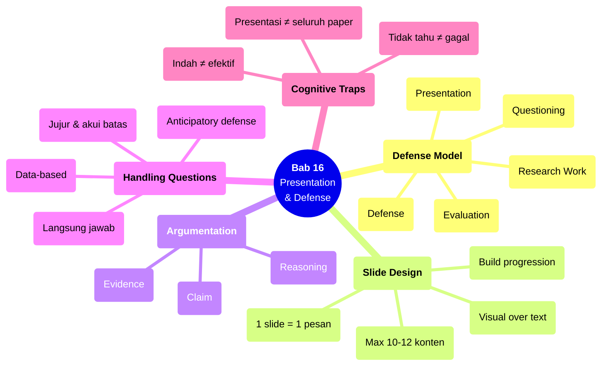

# Bab 16 — Presentation & Defense

> **Sub-CPMK:** 6.1 — Mempresentasikan dan mempertahankan argumen riset secara lisan
> **CPMK:** CPMK06 — Research Defense
> **CPL Utama:** CPL02 (Karya ilmiah/komunikasi)
> **Fase:** Scientific Thinking (M13–M16)
> **Signature Model:** Scientific Defense Model (Research Work → Presentation → Questioning → Defense → Evaluation → Acceptance)

---

## Ringkasan Bab

Bab ini membahas tahap akhir proses riset: mempresentasikan temuan di depan audiens dan mempertahankan argumen melalui tanya-jawab. Presentasi bukan ringkasan paper — ia simulasi peer-review langsung di mana peneliti harus menyampaikan argumen secara jelas dan menjawab pertanyaan secara meyakinkan. Defense bukan pertarungan — ia dialog ilmiah yang menguji validitas, kejelasan, dan kedalaman pemahaman peneliti terhadap risetnya sendiri.

---

## 16.1 Pembuka

Paper sudah ditulis (Bab 15). Seluruh proses riset dari Bab 1 sampai 14 sudah terdokumentasi secara tertulis. Langkah terakhir: menyampaikannya secara lisan — di seminar, conference, atau sidang.

Banyak yang menganggap presentasi adalah "versi ringkas paper." Tapi presentasi dan paper berbeda secara fundamental dalam medium, waktu, dan interaksi. Paper dibaca — pembaca bisa kembali ke halaman sebelumnya. Presentasi didengar — audiens hanya punya satu kesempatan untuk memahami setiap slide. Paper tidak terinterupsi — presentasi bisa ditanya kapan saja. Perbedaan ini memerlukan strategi komunikasi yang berbeda.

Dan kemudian ada defense — bagian di mana peneliti yang mempresentasikan menjadi peneliti yang menjawab. Pertanyaan bisa tentang motivasi ("mengapa masalah ini penting?"), metode ("mengapa memilih uji ini?"), hasil ("bagaimana menjelaskan anomali di tabel 3?"), atau generalisasi ("apakah ini berlaku di domain lain?"). Kemampuan menjawab pertanyaan secara langsung, berbasis data, dan jujur (termasuk mengakui keterbatasan) membedakan peneliti yang memahami risetnya dari yang hanya menjalankannya.

Pertanyaan sentral bab ini: **Bagaimana menyampaikan dan mempertahankan argumen riset secara lisan dengan jelas, meyakinkan, dan jujur?**

---

## 16.2 Scientific Defense Model

Model ini menggambarkan alur dari kerja riset menuju penerimaan melalui presentasi dan defense.

**Gambar 16.1** — Scientific Defense Model

```mermaid
graph LR
    A["📄 <b>Research<br/>Work</b><br/><i>Paper/laporan</i>"]
    B["🎤 <b>Presentation</b><br/><i>Penyampaian</i>"]
    C["❓ <b>Questioning</b><br/><i>Tanya audiens</i>"]
    D["🛡️ <b>Defense</b><br/><i>Argumentasi</i>"]
    E["📋 <b>Evaluation</b><br/><i>Penilaian</i>"]
    F["✅ <b>Acceptance</b><br/><i>Pengakuan</i>"]

    A -->|"Penyajian"| B
    B -->|"Interaksi"| C
    C -->|"Respons"| D
    D -->|"Justifikasi"| E
    E -->|"Keputusan"| F

    style A fill:#F5F3FF,stroke:#7C3AED,color:#4C1D95
    style B fill:#EDE9FE,stroke:#7C3AED,color:#4C1D95
    style C fill:#DDD6FE,stroke:#7C3AED,color:#4C1D95
    style D fill:#C4B5FD,stroke:#6D28D9,color:#4C1D95
    style E fill:#A78BFA,stroke:#6D28D9,color:#FFFFFF
    style F fill:#7C3AED,stroke:#6D28D9,color:#FFFFFF
```



Setiap transisi:

1. **Research Work → Presentation.** Riset yang sudah terdokumentasi (paper/laporan) diterjemahkan ke format presentasi: slide, narasi, dan demonstrasi. Bukan ringkasan — melainkan reformulasi untuk medium lisan.

2. **Presentation → Questioning.** Audiens mengajukan pertanyaan berdasarkan apa yang dipresentasikan. Pertanyaan bisa mengklarifikasi ("apa maksudnya...?"), menantang ("mengapa tidak menggunakan...?"), atau memperdalam ("bagaimana jika...?").

3. **Questioning → Defense.** Peneliti merespons pertanyaan menggunakan argumentasi ilmiah: klaim + evidence + reasoning. Defense yang baik mengakui batas pengetahuan — menjawab "belum tahu, tapi akan diinvestigasi" lebih baik dari menjawab asal.

4. **Defense → Evaluation.** Evaluator (penguji, reviewer, audiens) menilai kualitas riset berdasarkan presentasi dan defense: kejelasan pemikiran, kedalaman pemahaman, kualitas respons.

5. **Evaluation → Acceptance.** Riset yang berhasil mempertahankan argumentasinya diterima — sebagai paper, tesis, atau kontribusi ilmiah.

---

## 16.3 Definisi Kunci

**Scientific Presentation**
: Penyampaian lisan riset menggunakan media visual (slide) yang dirancang untuk audiens yang mendengarkan, bukan membaca. Presentasi harus bisa dipahami oleh audiens dalam satu kali dengar tanpa kesempatan "scroll back."

**Defense (Argumentasi)**
: Proses mempertahankan keputusan riset — dari pemilihan masalah hingga interpretasi hasil — melalui tanya-jawab dengan audiens atau penguji. Defense bukan debat untuk "menang" — ia dialog untuk mendemonstrasikan pemahaman.

**Claim-Evidence-Reasoning (CER)**
: Framework argumentasi ilmiah. Claim: pernyataan yang ingin dipertahankan. Evidence: data atau fakta yang mendukung claim. Reasoning: penjelasan logis mengapa evidence mendukung claim.

**Anticipatory Defense**
: Proses mengidentifikasi pertanyaan potensial sebelum presentasi dan menyiapkan jawaban. Setiap keputusan riset (masalah, metode, metrik, interpretasi) bisa ditanyakan — dan harus bisa dijawab.

---

## 16.4 Konsep Inti

### 16.4.1 Presentasi: Bukan Ringkasan Paper

Slide presentasi bukan halaman paper yang di-paste ke slide. Perbedaan fundamental:

| Paper | Presentasi |
|-------|-----------|
| Dibaca (self-paced) | Didengar (presenter-paced) |
| Detail lengkap | Ide utama + highlight |
| Tabel numerik detail | Grafik visual + key numbers |
| Pembaca bisa re-read | Audiens hanya dengar sekali |
| Referensi lengkap | Referensi minimal |

**Prinsip desain slide:**

**Satu slide, satu pesan.** Setiap slide menyampaikan satu ide utama. Jika slide memerlukan penjelasan lebih dari 2 menit, pecah menjadi 2 slide.

**Visual over text.** Gunakan grafik, diagram, dan key numbers — bukan paragraf. Audiens tidak bisa membaca paragraph panjang sambil mendengarkan narasi. Teks di slide berfungsi sebagai anchor — bukan pengganti narasi.

**Build progression.** Slide harus mengalir: masalah → gap → pertanyaan → metode → temuan → kesimpulan. Setiap slide menjawab pertanyaan yang muncul dari slide sebelumnya.

**Timing.** Aturan umum: 1-2 menit per slide. Presentasi 15 menit = 8-12 slide konten + slide judul + slide penutup. Lebih sedikit slide yang powerful lebih baik dari banyak slide yang rushed.

### 16.4.2 Argumentation: Claim + Evidence + Reasoning

Setiap jawaban dalam defense harus mengikuti struktur CER:

**Claim.** Pernyataan yang dipertahankan. "Metode A lebih efektif dari baseline."

**Evidence.** Data yang mendukung. "Akurasi A = 88.4 ± 1.2%, baseline = 82.3 ± 0.9%, p < 0.001, d = 5.7."

**Reasoning.** Mengapa evidence mendukung claim. "Perbedaan 6.1% secara statistik signifikan dengan effect size sangat besar, menunjukkan bahwa peningkatan bukan artefak variabilitas. Perbedaan ini juga bermakna secara praktis karena melampaui threshold 5% yang umum dianggap meaningful di domain ini."

Jawaban tanpa evidence: opini. Jawaban tanpa reasoning: laporan angka. Argumen yang lengkap memerlukan ketiganya.

### 16.4.3 Anticipating Questions

Pertanyaan dalam defense bisa diprediksi — karena mengikuti pola:

**Pertanyaan tentang masalah:**
- Mengapa masalah ini penting? Untuk siapa?
- Apakah sudah ada solusi yang cukup baik?

**Pertanyaan tentang gap:**
- Apakah gap ini benar-benar belum di-address?
- Studi X sudah melakukan hal serupa — apa bedanya?

**Pertanyaan tentang metode:**
- Mengapa memilih metode/metrik/dataset ini?
- Bagaimana jika menggunakan metode lain?
- Apakah desain eksperimen valid?

**Pertanyaan tentang hasil:**
- Bagaimana menjelaskan anomali di hasil?
- Apakah perbedaan ini bermakna secara praktis?
- Apa yang terjadi jika kondisinya berbeda?

**Pertanyaan tentang generalisasi:**
- Apakah hasil ini berlaku di dataset/domain lain?
- Apa batasan generalisasi?

Untuk setiap pertanyaan yang bisa diprediksi — siapkan jawaban berbasis CER. Pertanyaan yang tidak diprediksi? Jawab dengan jujur: "Pertanyaan yang bagus. Berdasarkan data yang ada, [jawaban terbaik]. Tapi untuk konfirmasi, perlu investigasi lebih lanjut."

### 16.4.4 Handling Questions: Langsung, Data-Based, Jujur

Tiga prinsip menjawab pertanyaan:

**Langsung.** Jawab pertanyaan terlebih dahulu, baru elaborasi. Jangan memulai jawaban dengan backstory 2 menit yang tidak menjawab pertanyaan. "Ya, kami menggunakan dataset X karena [alasan]" — bukan "Jadi, dalam proses riset, kami mempertimbangkan berbagai dataset, dan dalam konteks yang lebih luas, dataset memiliki berbagai karakteristik..."

**Data-based.** Jika ada data yang relevan, gunakan. Arahkan ke slide, tabel, atau grafik spesifik. "Jika kita lihat Tabel 3, skenario tersebut menunjukkan..." Jawaban yang mengacu pada data lebih meyakinkan dari jawaban yang hanya beropini.

**Jujur.** Jika tidak tahu, katakan. "Saya belum menguji skenario tersebut, tapi berdasarkan temuan di DS-1 sampai DS-3, saya memperkirakan [hipotesis]. Ini bisa menjadi investigasi lanjutan." Mengakui batas pengetahuan menunjukkan integritas — dan evaluator menghargai kejujuran lebih dari jawaban yang dibuat-buat.

---

## 16.5 Research vs Engineering

**Tabel 16.1** — Perspektif Presentasi: Engineering vs Research

| Aspek | Engineering | Research |
|-------|------------|----------|
| **Format** | Demo, pitch, sprint review | Seminar, conference talk, sidang |
| **Tujuan** | Convince → adopt/buy/use | Demonstrate → evaluate/accept |
| **Audiens** | Stakeholder, client | Penguji, reviewer, komunitas |
| **Pertanyaan** | "Berapa biayanya?" "Kapan ready?" | "Mengapa valid?" "Apa limitasinya?" |
| **Jawaban ideal** | Pasti, optimistis | Evidence-based, nuanced, jujur |

Perbedaan kritis: engineering pitch menjual solusi. Research defense mendemonstrasikan pemahaman. Audiens engineering ingin tahu apakah ini **berguna**. Audiens riset ingin tahu apakah ini **valid**.

---

## 16.6 Research Reality

### Fenomena 1 — "Slide Penuh Teks, Presenter Membaca"

Slide dengan 10 poin bullet point dan presenter yang membacanya kata per kata. Audiens bisa membaca lebih cepat dari presenter berbicara — jadi mereka membaca sendiri dan berhenti mendengarkan. Slide seharusnya mendukung narasi, bukan menggantikannya. Key points, grafik, dan angka kunci — bukan paragraf.

### Fenomena 2 — "Tidak Bisa Menjawab 'Mengapa'"

Pertanyaan: "Mengapa memilih F1-score dan bukan precision?" Jawaban: "Karena... umm... biasanya penelitian lain juga pakai F1-score." Ini bukan justifikasi — ini konformitas. Jawaban yang benar: "Karena dataset memiliki class imbalance 1:10, dan F1-score menangkap balance antara precision dan recall lebih baik dari accuracy yang bisa misleading pada imbalanced data."

### Fenomena 3 — "Defense sebagai Pertarungan"

Beberapa presenter menganggap pertanyaan sebagai serangan dan merespons secara defensif. "Anda tidak memahami metode saya" atau "Sudah saya jelaskan di slide sebelumnya." Pertanyaan evaluator bukan serangan — ia kesempatan untuk mendemonstrasikan kedalaman pemahaman. Respons terbaik: berterima kasih, jawab dengan data, akui jika ada yang bisa ditingkatkan.

---

## 16.7 Cognitive Traps

### Trap 1: "Presentasi = semua yang ada di paper"

Paper 20 halaman tidak bisa dipresentasikan dalam 15 menit. Presentasi memerlukan seleksi brutal: hanya ide utama, temuan kunci, dan visualisasi terpenting. Detail yang tidak disajikan bisa dijawab saat tanya-jawab — dan justru itu momen defense yang baik.

### Trap 2: "Slide yang indah = presentasi yang baik"

Animasi, gradient, dan font dekoratif tidak membuat argumen lebih kuat. Slide yang paling efektif sering yang paling sederhana: judul yang jelas, satu grafik, satu key number, satu pesan. Estetika membantu, tapi substansi yang menentukan.

### Trap 3: "Pertanyaan yang tidak bisa dijawab = kegagalan"

Tidak semua pertanyaan harus bisa dijawab saat itu juga. Pertanyaan yang menantang batas riset ("bagaimana jika dataset berbeda?" "apakah berlaku di skala industrial?") sering tidak bisa dijawab karena memang di luar scope. Jawab: "Pertanyaan ini di luar scope riset saat ini, tapi merupakan arah yang menarik untuk investigasi selanjutnya." Ini jawaban yang jujur dan profesional.

### Trap 4: "Latihan tidak perlu — saya sudah tahu riset saya"

Mengetahui riset bukan berarti bisa mempresentasikannya dengan baik. Presentasi memerlukan latihan: timing, transisi antar-slide, pacing narasi, dan antisipasi pertanyaan. Latihan 2-3 kali di depan rekan sering mengungkap kelemahan yang tidak terlihat saat berlatih sendiri.

---

## 16.8 Studi Kasus

### Kasus 1 (Basic): "Dari Paper ke Slide — Seleksi Konten"

**Konteks:**

Paper 15 halaman tentang perbandingan metode caching. Ada 5 tabel, 3 grafik, 8 halaman method detail. Presentasi: 15 menit + 5 menit Q&A.

**❌ Pendekatan Salah:**

24 slide yang berusaha memuat semua konten paper. Setiap slide padat. Presenter berbicara cepat dan masih melebihi waktu. Audiens kebingungan di slide ke-10.

**✅ Pendekatan Benar:**

| No. | Slide | Waktu | Pesan |
|-----|-------|-------|-------|
| 1 | Judul + konteks | 1 min | Apa riset ini tentang |
| 2 | Masalah + motivasi | 2 min | Mengapa penting |
| 3 | Gap + RQ | 1.5 min | Apa yang belum terjawab |
| 4 | Method overview | 2 min | Bagaimana dijawab (diagram) |
| 5 | Key result — tabel ringkas | 2 min | Temuan utama |
| 6 | Key result — grafik | 2 min | Pola visual |
| 7 | Interpretasi + failure | 2 min | Apa artinya |
| 8 | Limitation + future | 1.5 min | Batasan & arah |
| 9 | Conclusion + kontribusi | 1 min | Pesan penutup |

Total: 9 slide, ~15 menit. Detail method, tabel tambahan, dan analisis sekunder tersedia sebagai "backup slide" jika ditanya.

**Pelajaran:** 9 slide yang jelas lebih efektif dari 24 slide yang rushed. Slide yang tidak ditampilkan bisa menjadi amunisi di Q&A.

---

### Kasus 2 (Advanced): "Defense — Pertanyaan Sulit dan Cara Menjawab"

**Konteks:**

Sidang tesis. Penguji mengajukan 4 pertanyaan. Berikut pertanyaan dan dua versi jawaban:

**Q1: "Mengapa hanya menggunakan 3 dataset? Apakah hasilnya bisa digeneralisasi?"**

❌ "Tiga dataset sudah cukup untuk menunjukkan bahwa metode kami bekerja."

✅ "Kami menggunakan 3 dataset yang mewakili variasi karakteristik: dataset kecil-bersih (DS-1), medium-bersih (DS-2), dan medium-noisy (DS-3). Generalisasi ke dataset besar atau domain berbeda memerlukan validasi tambahan — ini kami cantumkan sebagai limitation dan future work di halaman 14."

**Q2: "Hasil di DS-3 menurun. Apakah ini masalah metode Anda?"**

❌ "Itu outlier. Dataset DS-3 memang sulit."

✅ "Ya, penurunan di DS-3 signifikan. Kami analisis di Section 5.3: penyebabnya adalah distribusi heavy-tail yang melanggar asumsi Gaussian dari metode kami. Baseline non-parametrik tidak terdampak. Ini menunjukkan boundary condition: metode kami optimal untuk data berdistribusi normal, tapi memerlukan adaptasi untuk distribusi heavy-tail."

**Q3: "Bagaimana jika menggunakan deep learning approach?"**

❌ "Kami tidak mempertimbangkan deep learning."

✅ "Deep learning approach seperti autoencoder bisa menjadi alternatif yang menarik. Kami tidak menggunakannya karena scope riset ini fokus pada metode statistik yang interpretable. Perbandingan dengan deep learning approach adalah arah future work yang valid."

**Q4: "Anda menyebut 'significant improvement.' Effect size-nya berapa?"**

❌ "P-value-nya 0.003, jadi signifikan."

✅ "Cohen's d = 1.2, yang termasuk large effect. Jadi bukan hanya signifikan secara statistik, tapi besarnya perbedaan juga substansial."

**Pola jawaban yang baik:** Acknowledge → answer with evidence → contextualize → acknowledge limitations if applicable.

---

## 16.9 Template Praktis

### Template: Defense Preparation Sheet

```
═══════════════════════════════════════════════════════════════
  DEFENSE PREPARATION — [Judul Penelitian]
═══════════════════════════════════════════════════════════════

SLIDE PLAN (max 10-12 slide konten):
  Slide 1: _____________ (1 min)
  Slide 2: _____________ (2 min)
  ...
  Total: ___ slide, ___ menit

ANTICIPATED QUESTIONS & ANSWERS:
  ┌─────┬──────────────────┬──────────────────────────────────┐
  │ No. │ Pertanyaan       │ Jawaban (CER format)             │
  ├─────┼──────────────────┼──────────────────────────────────┤
  │ 1   │ Mengapa masalah  │ Claim: ___                       │
  │     │ ini penting?     │ Evidence: ___                    │
  │     │                  │ Reasoning: ___                   │
  ├─────┼──────────────────┼──────────────────────────────────┤
  │ 2   │ Mengapa metode   │ C: ___ E: ___ R: ___            │
  │     │ ini dipilih?     │                                  │
  ├─────┼──────────────────┼──────────────────────────────────┤
  │ 3   │ Bagaimana jika   │ C: ___ E: ___ R: ___            │
  │     │ [alternatif]?    │                                  │
  ├─────┼──────────────────┼──────────────────────────────────┤
  │ 4   │ Apa limitasi     │ C: ___ E: ___ R: ___            │
  │     │ utama?           │                                  │
  ├─────┼──────────────────┼──────────────────────────────────┤
  │ 5   │ Apakah bisa      │ C: ___ E: ___ R: ___            │
  │     │ digeneralisasi?  │                                  │
  └─────┴──────────────────┴──────────────────────────────────┘

BACKUP SLIDES:
  □ Detail method (jika ditanya)
  □ Tabel lengkap (jika ditanya angka spesifik)
  □ Analisis tambahan (jika ditanya "bagaimana jika")

PRACTICE LOG:
  Latihan 1: [tanggal] — [catatan timing & feedback]
  Latihan 2: [tanggal] — [catatan timing & feedback]
  Latihan 3: [tanggal] — [catatan timing & feedback]

═══════════════════════════════════════════════════════════════
```

---

## 16.10 Mindmap Ringkasan

**Gambar 16.2** — Mindmap Bab 16: Presentation & Defense



---

## 16.11 Rangkuman

**Poin-poin utama bab ini:**

1. Presentasi ilmiah bukan ringkasan paper — ia reformulasi riset untuk medium lisan. Prinsip: satu slide satu pesan, visual over text, dan build progression dari masalah ke kontribusi.

2. Defense menggunakan framework Claim-Evidence-Reasoning (CER). Setiap jawaban harus memiliki klaim yang jelas, bukti yang konkret, dan penalaran yang menghubungkan keduanya.

3. Pertanyaan bisa diantisipasi: tentang masalah (mengapa penting), metode (mengapa dipilih), hasil (apa artinya), dan generalisasi (di mana batas berlakunya). Siapkan jawaban CER untuk setiap kategori.

4. Tiga prinsip menjawab: langsung (jawab dulu, elaborasi kemudian), data-based (arahkan ke evidence konkret), dan jujur (akui batas pengetahuan jika memang tidak tahu).

5. Latihan presentasi bukan opsional — ia cara menemukan kelemahan yang tidak terlihat saat berlatih sendiri.

Dengan bab ini, seluruh siklus riset eksperimental selesai — dari merumuskan masalah (Bab 1) hingga mempertahankan temuan (Bab 16). Setiap bab membangun di atas bab sebelumnya, membentuk satu alur utuh yang menghubungkan curiosity dengan kontribusi ilmiah.

> *"Riset yang baik layak dipresentasikan dengan baik. Dan presentasi yang baik dimulai dari pemahaman mendalam tentang apa yang ingin disampaikan — dan mengapa."*

---

## 16.12 Latihan & Refleksi

### Latihan 1 — Slide Deck

Buat slide deck presentasi (max 10 slide konten) dari riset Anda. Untuk setiap slide, tuliskan: pesan utama, elemen visual, dan narasi target (dalam catatan).

### Latihan 2 — Anticipatory Defense

Identifikasi 5 pertanyaan paling mungkin tentang riset Anda. Untuk setiap pertanyaan, siapkan jawaban dalam format CER (Claim + Evidence + Reasoning).

### Latihan 3 — Presentasi & Feedback

Presentasikan slide deck dari Latihan 1 di depan rekan (atau rekam diri sendiri). Minta feedback pada: timing, kejelasan narasi, dan slide yang membingungkan. Perbaiki berdasarkan feedback.

### Refleksi

> "Jika saya hanya punya satu menit untuk menjelaskan riset saya kepada seseorang yang bukan dari bidang saya — apa yang akan saya katakan?"

---

## Daftar Pustaka

- Alley, M. (2013). *The Craft of Scientific Presentations* (2nd ed.). Springer.
- Glasman-Deal, H. (2020). *Science Research Writing: For Non-Native Speakers of English* (2nd ed.). World Scientific.
- Toulmin, S. E. (2003). *The Uses of Argument* (Updated ed.). Cambridge University Press.

<!-- STATUS: 🟢 Draft Complete -->

<!-- STATUS: ⬜ Not Started -->
